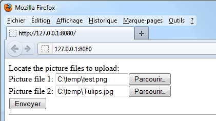

<!--REF #_command_.WEB GET BODY PART.Syntax-->**WEB GET BODY PART** ( *partie* ; *contenuPartie* ; *nomPartie* ; *typeMime* ; *nomFichier* )<!-- END REF-->
<!--REF #_command_.WEB GET BODY PART.Params-->
| Paramètre | Type |  | Description |
| --- | --- | --- | --- |
| partie | Integer | &#8594;  | Numéro de partie |
| contenuPartie | Blob, Text | &#8592; | Contenu de la partie |
| nomPartie | Text | &#8592; | Nom de la variable "input" |
| typeMime | Text | &#8592; | Type mime du fichier |
| nomFichier | Text | &#8592; | Nom du fichier posté |

<!-- END REF-->

#### Description 

<!--REF #_command_.WEB GET BODY PART.Summary-->La commande **WEB GET BODY PART**, appelée dans le contexte d’un process Web, permet d’analyser la partie "corps" d’une requête multi-part.<!-- END REF--> 

Passez dans le paramètre *partie* le numéro de la partie à analyser. Vous pouvez obtenir le nombre total de parties à l’aide de la commande [WEB Get body part count](web-get-body-part-count.md).

Le paramètre *contenuParti*e récupère le contenu de la partie. Lorsque les parties à récupérer sont des fichiers, vous devez passer un paramètre de type BLOB. Dans le cas de variables TEXT postées dans un formulaire Web, vous pouvez passer un paramètre de type texte. 

Le paramètre *nomPartie* récupère le nom de la variable du champ input HTTP.

Les paramètres *typeMime* et *nomFichier* permettent de récupérer le type Mime et le nom du fichier d’origine, le cas échéant. *nomFichier* n’est renseigné que dans le cas où le fichier a été posté dans **<input type="file">**.  
*typeMime* et *nomFichier* sont optionnels mais ne peuvent pas être passés séparément. 

**Note :** Dans le cadre d’une requête multi-part, le premier tableau de la commande [WEB GET VARIABLES](web-get-variables.md) retourne toutes les parties du formulaire, dans le même ordre que la commande **WEB GET BODY PART**. Vous pouvez l’utiliser par exemple afin d’obtenir directement la position d'une partie du formulaire. 

#### Exemple 

Dans cet exemple, un formulaire Web permet de télécharger sur le serveur HTTP plusieurs images depuis un navigateur et de les afficher dans la page. Voici le formulaire Web :



Voici le code la partie <body> de la page :

```HTML
<body>
        <form enctype="multipart/form-data" action="/4DACTION/GetFile/" method="post">
            Locate the picture files to upload: <br>
            Picture file 1: <input name="file1" type="file"><br>
            Picture file 2: <input name="file2" type="file"><br>
            <input type="submit">                    
        </form>     
        <hr/>
    <!--4DSCRIPT/galleryInit-->
    <!--4Dloop aFileNames-->
        "/>
    <!--4Dendloop-->
</body>
```

Deux méthodes 4D sont appelées par la page :

* galleryInit au chargement (balise 4DSCRIPT), permettant d’afficher les images présentes dans le dossier de destination.
* GetFile au moment de l’envoi des données (url 4DACTION du formulaire multi-part), permettant de traiter l’envoi.

Voici le code de la méthode galleryInit :

```4d
 var $vDestinationFolder : Text
 ARRAY TEXT(aFileNames;0)
 var $i : Integer
 $vDestinationFolder:=Get 4D folder(HTML Root folder)+"photos"+Folder separator //"DossierWeb/photos" par exemple
 DOCUMENT LIST($vDestinationFolder;aFileNames)
```

Voici le code de la méthode GetFile :

```4d
 var $vPartName;$vPartMimeType;$vPartFileName;$vDestinationFolder : Text
 var $vPartContentBlob : Blob
 var $i : Integer
 $vDestinationFolder:=Get 4D folder(HTML Root folder)+"photos"+Folder separator
 For($i;1;WEB Get body part count) //pour chaque partie
    WEB GET BODY PART($i;$vPartContentBlob;$vPartName;$vPartMimeType;$vPartFileName)
    If($vPartFileName#"")
       BLOB TO DOCUMENT($vDestinationFolder+$vPartFileName;$vPartContentBlob)
    End if
 End for
 WEB SEND HTTP REDIRECT("/") // retour à la page
```

#### Voir aussi 

[WEB Get body part count](web-get-body-part-count.md)  
[WEB GET HTTP BODY](web-get-http-body.md)  
[WEB GET VARIABLES](web-get-variables.md)  

#### Propriétés

|  |  |
| --- | --- |
| Numéro de commande | 1212 |
| Thread safe | &check; |


