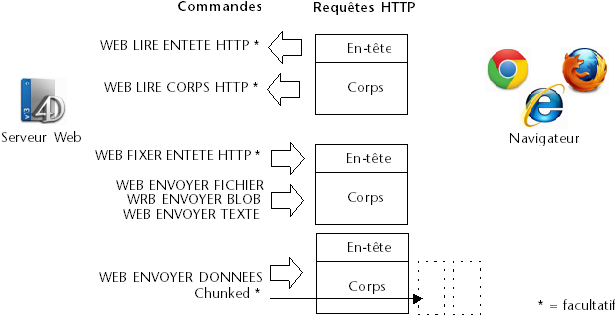

<!--REF #_command_.WEB SEND RAW DATA.Syntax-->**WEB SEND RAW DATA** ( *données* {; *} )<!-- END REF-->
<!--REF #_command_.WEB SEND RAW DATA.Params-->
| Paramètre | Type |  | Description |
| --- | --- | --- | --- |
| données | Blob | &#8594;  | Données HTTP à envoyer |
| * | Opérateur | &#8594;  | Envoi morcelé (chunked) |

<!-- END REF-->

#### Description 

<!--REF #_command_.WEB SEND RAW DATA.Summary-->La commande **WEB SEND RAW DATA** permet au serveur Web 4D d’envoyer des données HTTP “brutes”, pouvant être morcelées.<!-- END REF-->

Le paramètre *données* contient les deux parties standard d’une réponse HTTP, c’est-à-dire l’en-tête et le corps (header et body). Les données sont envoyées sans formatage préalable par le serveur. Toutefois, 4D effectue un contrôle élémentaire sur l’en-tête et le corps de la réponse afin qu’elle soit valide : 

* Si l’en-tête est incomplet ou non conforme aux spécifications du protocole HTTP, 4D le modifie en conséquence.
* Si la réponse HTTP est incomplète, 4D ajoute les informations manquantes. Si, par exemple, vous souhaitez effectuer une redirection, vous devez écrire :

```HTML
HTTP/1.1 302 
Location : http://...
```

Si vous passez uniquement :

```HTML
Location : http://...
```

4D complétera la réponse en ajoutant HTTP/1.1 302. 

Le paramètre optionnel *\** permet de déclarer que la réponse sera envoyée sous forme “morcelée” (chunked). Le découpage des réponses peut être utile lorsque le serveur envoie une réponse sans connaître sa longueur totale (par exemple si la réponse n’a pas encore été générée). Tous les navigateurs compatibles HTTP/1.1 acceptent les réponses “morcelées”.  
Si vous passez le paramètre *\**, le serveur Web inclura automatiquement le champ *transfer-encoding: chunked* dans l’en-tête de la réponse, si nécessaire (vous pouvez gérer manuellement l’en-tête de la réponse si vous le souhaitez). Le reste de la réponse sera également formaté en respectant la syntaxe de l’option chunked. Les réponses morcelées comportent un seul en-tête et un nombre indéfini de corps.   
Toutes les instructions **WEB SEND RAW DATA** suivant l’exécution de **WEB SEND RAW DATA**(données;\*) au sein de la même méthode seront considérées comme partie de la réponse (qu’elles contiennent ou non le paramètre *\**). Le serveur met un terme à l’envoi morcelé à la fin de l’exécution de la méthode.

**Note :** Si le client Web ne prend pas en charge le protocole HTTP/1.1, 4D convertira automatiquement la réponse au format compatible HTTP/1.0 (l’envoi ne sera pas morcelé). Dans ce cas toutefois, il est possible que le résultat ne corresponde pas à vos attentes. Il est donc recommandé de tester si le navigateur est compatible HTTP/1.1 et d’envoyer une réponse adaptée. Pour cela, vous pouvez utiliser une méthode de ce type : 

```4d
 var $0 : Boolean
 ARRAY TEXT(tabChamps;0)
 ARRAY TEXT(tabValeurs;0)
 WEB GET HTTP HEADER(tabChamps;tabValeurs)
 $0:=False
 If(Size of array(tabValeurs)>=3)
    If(Position("HTTP/1.1";tabValeurs{3})>0)
       $0:=True //Le navigateur est compatible HTTP/1.1, on retourne Vrai dans $0
    End if
 End if
```

Combinée à la commande [WEB GET HTTP BODY](web-get-http-body.md) et aux autres commandes du thème “Serveur Web”, cette commande complète la gamme d’outils mis à la disposition des développeurs 4D pour traiter de manière entièrement personnalisée les connexions HTTP entrantes et sortantes. Ces différents outils sont présentés dans le schéma suivant : 



#### Exemple 

Cet exemple illustre l’emploi de l’option chunked avec la commande **WEB SEND RAW DATA**. Les données (une suite de chiffres) sont envoyées en 100 morceaux générés à la volée dans une boucle. A noter que l’en-tête de la réponse n’est pas explicitement défini : la commande **WEB SEND RAW DATA** l’enverra automatiquement et y insérera le champ *transfer-encoding: chunked* car le paramètre *\** est utilisé.

```4d
 var $cpt : Integer
 var $mon_blob : Blob
 var $output : Text
 
 For($cpt;1;100)
    $output:="["+String($cpt)+"]"
    TEXT TO BLOB($output;$mon_blob;UTF8 text without length)
    WEB SEND RAW DATA($mon_blob;*)
 End for
```

#### Voir aussi 

[WEB GET HTTP BODY](web-get-http-body.md)  
[WEB GET HTTP HEADER](web-get-http-header.md)  