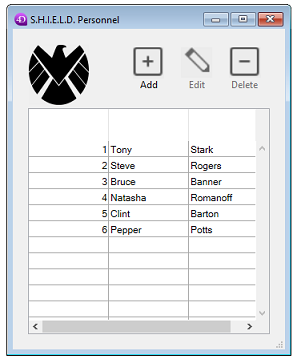

<!--REF #_command_.DIALOG.Syntax-->**DIALOG** ( {*aTable* ;} *form* {; *formData*}{; *} )<!-- END REF-->

<!--REF #_command_.DIALOG.Params-->

| Paramètres | Type         |   | Description                                                                                                                                                                            |
| ---------- | ------------ | - | -------------------------------------------------------------------------------------------------------------------------------------------------------------------------------------- |
| aTable     | Table        | → | Table à laquelle appartient le formulaire; Si omis : Table par défaut ou utilisation d'un formulaire projet                                                            |
| form       | Text, Object | → | Nom du formulaire table ou projet à afficher, ou Chemin POSIX (chaîne) d'un fichier .json décrivant le formulaire, ou Objet décrivant le formulaire |
| formData   | Object       | → | Données à associer au formulaire                                                                                                                                                       |
| \*         | Opérateur    | → | Utiliser le même process                                                                                                                                                               |

<!-- END REF-->

#### Description

<!--REF #_command_.DIALOG.Summary-->The **DIALOG** command presents the *form* to the user, along with *formData* parameter(s) (optional).<!-- END REF--> 

Cette commande permet de concevoir des interfaces utilisateur personnalisées et sophistiquées, basées sur des formulaires. Vous pouvez l'utiliser pour afficher des informations provenant de la base ou d'autres sources, ou proposer des fonctions de saisie des données. Contrairement à [ADD RECORD](../commands-legacy/add-record.md) ou [MODIFY RECORD](../commands-legacy/modify-record.md), **DIALOG** vous donne un contrôle total sur le formulaire, son contenu et les boutons de navigation et de validation.

Cette commande est généralement appelée avec la commande [Open form window](../commands-legacy/open-form-window.md) pour afficher des formulaires complexes, comme le montre l'exemple suivant :


La commande **DIALOG** peut également être utilisée à la place de [ALERT](../commands-legacy/alert.md), [CONFIRM](../commands-legacy/confirm.md) ou [Request](../commands-legacy/request.md) lorsque les informations à afficher ou à recueillir sont plus complexes que celles que peuvent gérer ces trois commandes.

Dans le paramètre *form*, vous pouvez passer soit:

- le nom du formulaire (formulaire projet ou formulaire table) à utiliser.
- le chemin (en syntaxe POSIX) d'un fichier .json valide contenant la description du formulaire à utiliser,
- un objet contenant la description du formulaire à utiliser.

Optionnellement, vous pouvez passer un ou plusieurs paramètre(s) au *form* à l'aide d'un objet "form data" (données du formulaire). Toutes les propriétés de l'objet de données du formulaire seront alors disponibles dans le contexte du formulaire par le biais de la commande [Form](form.md). Par exemple, si vous utilisez un objet de données de formulaire contenant {"version" ; "12"}, vous pourrez obtenir ou définir la valeur de la propriété "version" dans le formulaire en appelant :

```4d
 $v:=Form.version //"12"
 Form.version:=13
```

Pour remplir l'objet "form data", vous avez deux possibilités :

- utiliser le paramètre *formData*. L'utilisation d'une variable locale pour *formData* vous permet de passer en toute sécurité des paramètres à vos formulaires, quel que soit le contexte d'appel. En particulier, si le même formulaire est appelé à différents endroits dans le même process, vous pourrez toujours accéder à ses valeurs spécifiques en appelant simplement [Form](form.md).myProperty. De plus, les objets étant transmis par référence, si l'utilisateur modifie la valeur d'une propriété dans le formulaire, celle-ci sera automatiquement sauvegardée dans l'objet lui-même.

- [associer une classe utilisateur au formulaire](../FormEditor/properties_FormProperties.md#form-class), auquel cas 4D instanciera automatiquement un objet de cette classe lorsque le formulaire sera chargé. Les propriétés et les fonctions de l'objet seront automatiquement disponibles via l'objet renvoyé par [Form](form.md). Vous pouvez écrire par exemple `Form.myFunction()`.

:::note

- Le paramètre *formData* est prioritaire sur une classe de formulaire (l'objet classe n'est pas instancié si un paramètre *formData* est passé).
- Si vous ne passez pas le paramètre *formData* (ou si vous passez un objet non défini) et qu'aucune classe d'utilisateur n'est associée au formulaire, **DIALOG** crée un nouvel objet vide lié au *form*.

:::

Le dialogue est refermé par l'utilisateur soit par une action "accepter" (déclenchée par l'action standard ak accept, la touche Entrée, ou la commande [ACCEPT](../commands-legacy/accept.md)), soit par une action "annuler" (déclenchée par l'action standard ak cancel, la touche Escape, ou la commande [CANCEL](../commands-legacy/cancel.md)). Une action d'acceptation mettra la variable système OK à 1, tandis qu'une action d'annulation mettra OK à 0.

A noter que la validation n'équivaut pas à la sauvegarde : si le dialogue comprend des champs, vous devez appeler explicitement la commande [SAVE RECORD](../commands-legacy/save-record.md) pour sauvegarder toutes les données qui ont été modifiées.

Si vous passez le paramètre facultatif *\**, le formulaire est chargé et affiché dans la dernière fenêtre ouverte du process courant et la commande termine son exécution en laissant le formulaire actif à l'écran.\
Si vous passez le paramètre facultatif *\**, le formulaire est chargé et affiché dans la dernière fenêtre ouverte du process courant et la commande termine son exécution en laissant le formulaire actif à l'écran.\
Ce formulaire réagit alors "normalement" aux actions de l'utilisateur et est fermé par une action standard ou lorsque le code 4D lié au formulaire (méthode objet ou méthode formulaire) appelle la commande [CANCEL](../commands-legacy/cancel.md) ou [ACCEPT](../commands-legacy/accept.md). Si le process courant se termine, les formulaires créés de cette manière sont automatiquement fermés de la même manière que si une commande [CANCEL](../commands-legacy/cancel.md) avait été appelée. Ce mode d'ouverture est particulièrement utile pour afficher une palette flottante avec un document, sans avoir nécessairement besoin d'un autre process.

**Notes :**

- Vous pouvez combiner l'utilisation de la syntaxe **DIALOG**(form;\*) avec la commande [CALL FORM](../commands-legacy/call-form.md) pour établir une communication entre les formulaires.
- Vous devez créer une fenêtre avant d'appeler l'instruction **DIALOG**(form;\*). Il n'est pas possible d'utiliser la fenêtre de dialogue courante dans le process ni la fenêtre créée par défaut pour chaque process. Sinon, l'erreur -9909 est générée.
- Lorsque le paramètre *\** est utilisé, la fenêtre est fermée automatiquement suite à une action standard ou un appel à la commande [CANCEL](../commands-legacy/cancel.md) ou [ACCEPT](../commands-legacy/accept.md). Vous n'avez pas à gérer la fermeture de la fenêtre elle-même.

#### Exemple 1

L'exemple suivant permet de créer une palette d'outils :

```4d
  /Afficher la palette d'outils
 $palette_window:=Open form window("tools";Palette form window)
 DIALOG("tools";*) //Rendre le contrôle immédiatement
  /Afficher la fenêtre du document principal
 $document_window:=Open form window("doc";Plain form window)
 DIALOG("doc")
```

#### Exemple 2

Dans un formulaire affichant l'enregistrement d'une personne, un bouton ouvre un dialogue permettant de vérifier ou de modifier les noms et âges de ses enfants :


**Note :** Le champ objet "enfants" est représenté uniquement dans cet exemple afin de faire apparaître sa structure.

Dans le formulaire de vérification, vous avez assigné des propriétés d'objet [Form](form.md) aux variables :


Voici le code du bouton "Check Children" :

```4d
 var $win;$n;$i : Integer
 var $save : Boolean
 ARRAY OBJECT($children;0)
 OB GET ARRAY([Person]Children ; "children" ;$children) //obtient la collection d'enfants
 $save:=False //initialise la variable de sauvegarde
 
 $n:=Size of array($children)
 If($n>0)
    $win:=Open form window("Edit_Children";Movable form dialog box)
    SET WINDOW TITLE("Vérifier les enfants pour "+[Person]Name")
    For($i;1 ;$n) //pour chaque enfant
       DIALOG("Edit_Children" ;$children{$i}) //affiche la boîte de dialogue remplie de valeurs
       If(OK=1) //l'utilisateur a cliqué sur OK
          $save:=True
       End if
    End for
    If($save=True)
       [Person]Children:=[Person]Children //forces object field update
    End if
    CLOSE WINDOW($win)
 Else
    ALERT("No child to check.")
 End if
```

Le formulaire affiche des informations pour chaque enfant :


Si des valeurs sont modifiées et que l'utilisateur clique sur le bouton OK, le champ est mis à jour (bien entendu, l'enregistrement parent devra être sauvegardé par la suite).

#### Exemple 3

L'exemple suivant utilise le chemin d'un fichier .json décrivant un formulaire permettant d'afficher les enregistrements d'une liste d'employés :

```4d
 Open form window("/RESOURCES/OutputPersonnel.json";Plain form window)
 ALL RECORDS([Personnel])
 DIALOG("/RESOURCES/OutputPersonnel.json";*)
```

Résultat :



#### Exemple 4

L'exemple suivant crée un objet à partir d'un fichier .json décrivant un formulaire et en modifie certaines propriétés :

```4d
 var $form : Object
 $form:=JSON Parse(Document to text(Get 4D folder(Current resources folder)+"OutputPersonnel.json"))
 $form.windowTitle:="The Avengers"
 $form.pages[1].objects.logo.picture:="/RESOURCES/Images/Avengers.png"
 $form.pages[1].objects.myListBox.borderStyle:="double"
 Open form window($form;Plain form window)
 DIALOG($form;*)
```

Le formulaire est affiché avec la bordure, le logo et le titre modifiés :


#### Variables et ensembles système

Après un appel à **DIALOG**, si le dialogue est accepté, OK est mis à 1 ; s'il est annulé, OK est mis à 0.

#### Voir également

[ACCEPT](../commands-legacy/accept.md)\
[ADD RECORD](../commands-legacy/add-record.md)\
[CALL FORM](../commands-legacy/call-form.md)\
[CANCEL](../commands-legacy/cancel.md)\
[Form](form.md)\
[Open window](../commands-legacy/open-window.md)

#### Propriétés

|                       |                                 |
| --------------------- | ------------------------------- |
| Numéro de commande    | 40                              |
| Thread safe           | &amp;cross; |
| Modifie les variables | OK, error                       |
