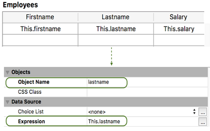

<!--REF #_command_.FORM Event.Syntax-->**FORM Event** : Object<!-- END REF-->

<!--REF #_command_.FORM Event.Params-->

| Paramètres | Type   |                             | Description     |
| ---------- | ------ | --------------------------- | --------------- |
| Résultat   | Object | &#8592; | Objet événement |

<!-- END REF-->

## Description

<!--REF #_command_.FORM Event.Summary-->**FORM Event** returns an object containing information about the form event that has just occurred.<!-- END REF-->**FORM Event** retourne un objet contenant des informations sur l'événement formulaire qui vient de se produire. Habituellement, vous utiliserez **FORM Event** à partir d'une méthode formulaire ou objet.

**Objet retourné**

Chaque objet retourné contient les principales propriétés suivantes :

| **Propriété** | **Type** | **Description**                                                                                                                                                                        |
| ------------- | -------- | -------------------------------------------------------------------------------------------------------------------------------------------------------------------------------------- |
| objectName    | text     | Nom de l'objet générant l'événement - Non inclus si l'événement est déclenché par le formulaire                                                                                        |
| code          | integer  | Valeur numérique de l'événement formulaire.                                                                                                                            |
| Description   | text     | Nom de l'événement de formulaire (par exemple "On After Edit"). Voir la section [**Evénements formulaire**](../Events/overview.md). |

Par exemple, dans le cas d'un clic sur un bouton, l'objet contient les propriétés suivantes :

```json
{"code":4,"description":"On Clicked","objectName":"Button2"}
```

L'objet événement peut contenir des propriétés supplémentaires, en fonction de l'objet pour lequel l'événement se produit. Pour les objets *eventObj* générés sur:

- des objets de type list box ou colonne de list box, voir [cette section](../FormObjects/listbox_overview.md#additional-properties).
- des zones 4D View Pro, voir événement formumaire [on VP Ready](../Events/onVpReady.md).

**Note:** S'il n'y a pas d'événement courant, **FORM Event** renvoie un objet null.

## Exemple 1

Vous souhaitez gérer l'événement On Clicked sur un bouton :

```4d
 If(FORM Event.code=On Clicked)
    ...
 End if
```

## Exemple 2

Si vous définissez le nom de l'objet colonne avec un véritable nom d'attribut d'une dataclass comme ceci :



Vous pouvez trier la colonne à l'aide de l'événement On Header Click :

```4d
 Form.event:=FORM Event
 Case of
    :(Form event code=On Header Click)
       if(Form.event.columnName="lastname")
          Form.employees:=Form.employees.orderBy(Form.event.columnName+", firstname")
       End if
 End case
```

## Exemple 3

Vous voulez gérer On Display Details sur un objet list box avec une méthode définie dans la propriété *Meta info expression* :


La méthode *setColor* :

```4d
 var $event;$0;$meta : Object
 $event:=FORM Event
 $meta:=New object
 
 Case of
    :($event.code=On Display Detail)
       If($event.isRowSelected)
          $meta.fill:="lightblue"
       End if
 End case
 $0:=$meta
```

La zone de liste résultante lorsque des lignes sont sélectionnées :


## Voir également

[Form Events](../Events/overview.md)
[Form event code](form-event-code.md)

## Propriétés

|                    |                             |
| ------------------ | --------------------------- |
| Numéro de commande | 1606                        |
| Thread safe        | &check; |


