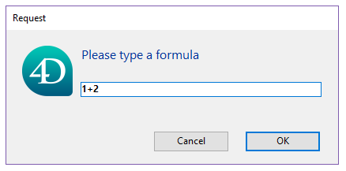

<details><summary>Historique</summary>

| Release | Modifications                                                             |
| ------- | ------------------------------------------------------------------------- |
| 20 R3   | Prise en charge du paramètre *context*                                    |
| 17 R6   | Renommée : New formula from string -> Formula from string |
| 17 R3   | Ajout                                                                     |

</details>

<!-- REF #_command_.Formula from string.Syntax -->**Formula from string**( *formulaString* : Text ) : 4D.Function<br/>**Formula from string**( *formulaString* : Text ; *context* : Longint ) : 4D.Function<!-- END REF -->

<!-- REF #_command_.Formula from string.Params -->

| Paramètres    | Type                        |     | Description                                                                                       |
| ------------- | --------------------------- | :-: | ------------------------------------------------------------------------------------------------- |
| formulaString | Text                        |  →  | Formule texte à retourner comme objet                                                             |
| context       | Number                      |  →  | `sk execute in current database` (par défaut) ou `sk execute in host database` |
| Résultat      | 4D.Function |  ←  | Objet natif encapsulant la formule                                                                |

<!-- END REF -->

#### Description

La commande `Formula from string` <!-- REF #_command_.Formula from string.Summary -->crée un objet `4D.Function` basé sur *formulaString* et, éventuellement, *context*<!-- END REF -->.  *formulaString* peut être aussi simple qu'une valeur unique ou complexe, comme une méthode projet avec des paramètres.

This command is similar to [`Formula`](formula.md), except that it handles a text-based formula and allows to define an execution context. Il est généralement recommandé d'utiliser la commande `Formula`, sauf si la formule originale a été exprimée sous forme de texte (par exemple, stockée en externe dans un fichier JSON), ou si vous souhaitez créer une formule dans une base de données hôte tout en appelant `Formula from string` à partir d'un composant. L'utilisation de la syntaxe avec tokens est fortement conseillée avec cette commande.

> Le contenu des variables locales n'étant pas accessible par nom en mode compilé, il ne peut pas être utilisé dans la *formulaString*. Si vous tentez d'accéder à une variable locale avec `Formula from string`, cela génèrera une erreur (-10737).

Si la formule est créée dans un composant, vous pouvez envisager d'utiliser le paramètre *context* . Par défaut, les formules étant exécutées dans le contexte dans lequel elles ont été créées, elles ne pourront pas appeler une variable, une fonction ou une méthode non partagée de la base de données hôte. Dans ce cas, vous pouvez passer la constante `sk execute in host database` au paramètre *context* pour exécuter l'objet `4D.Function` dans le contexte de la base de données hôte. Les constantes suivantes sont disponibles :

| Constante                        | Type    | Description                                                                                   |
| -------------------------------- | ------- | --------------------------------------------------------------------------------------------- |
| `sk execute in current database` | Integer | (par défaut) La formule sera exécutée dans le contexte où elle a été créée |
| `sk execute in host database`    | Integer | La formule sera exécutée dans le contexte de la base de données de hôte                       |

#### Exemple

Le code suivant permettra de créer un dialogue acceptant une formule dans un format texte :

```4d
 var $textFormula : Text
 var $f : 4D.Function
 $textFormula:=Request("Please type a formula")
 If(ok=1)
    $f:=Formula from string($textFormula)
    ALERT("Result = "+String($f.call()))
 End if
```



... et exécute la formule :


#### Voir également

[Formula](formula.md)\
[Parse formula](../commands-legacy/parse-formula.md)
