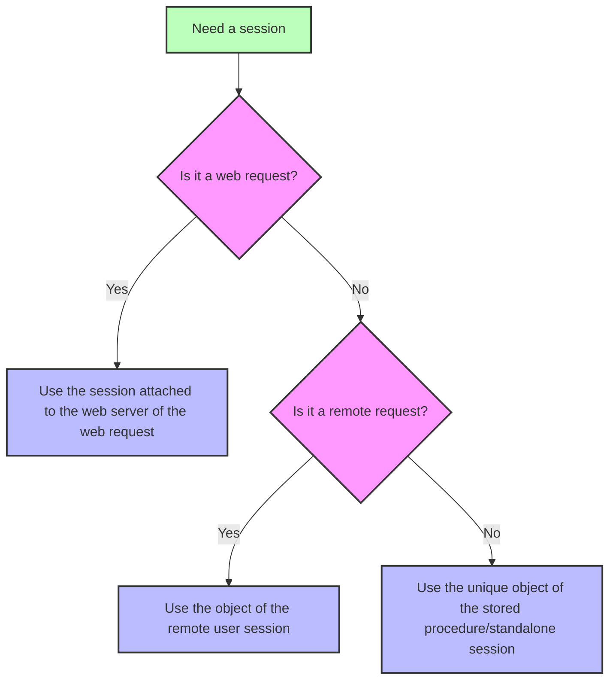

<!-- REF #_command_.Session.Syntax -->**Session** : 4D.Session<!-- END REF -->

<!--REF #_command_.Session.Params-->

| Paramètres | Type                       |                             | Description   |
| ---------- | -------------------------- | --------------------------- | ------------- |
| Résultat   | 4D.Session | &#8592; | Objet session |

<!-- END REF-->

<details><summary>Historique</summary>

| Release | Modifications                                                             |
| ------- | ------------------------------------------------------------------------- |
| 20 R8   | Prise en charge des sessions autonomes                                    |
| 20 R5   | Prise en charge des sessions utilisateurs distants et procédures stockées |
| 18 R6   | Ajout                                                                     |

</details>

## Description

The `Session` command <!-- REF #_command_.Session.Summary -->returns the `Session` object corresponding to the current session<!-- END REF -->.

Depending on the process from which the command is called, the current session can be:

- une session web (lorsque les [sessions évolutives sont activées](WebServer/sessions.md#enabling-web-sessions)),
- a remote client session (on the server),
- a stored procedures session,
- a standalone session.

Pour plus d'informations, voir le paragraphe [Types de session](../API/SessionClass.md#session-types).

The command returns *Null* if:

- it is called in a web process and scalable sessions are disabled on the web server,
- it is called on a remote 4D.

### Sessions Web

L'objet `Session` des sessions web est disponible depuis n'importe quel process web :

- Méthodes base `On Web Authentication`, `On Web Connection`, et `On REST Authentication`,
- code traité par les balises 4D dans les pages semi-dynamiques (4DTEXT, 4DHTML, 4DEVAL, 4DSCRIPT/, 4DCODE)
- méthodes projet avec l'attribut "Disponible via balises HTML et URLs 4D (4DACTION...)" et appelées via les urls 4DACTION/
- méthodes base [`On Mobile App Authentication`](https://developer.4d.com/go-mobile/docs/4d/on-mobile-app-authentication) et [`On Mobile App Action`](https://developer.4d.com/go-mobile/docs/4d/on-mobile-app-action) pour les requêtes mobiles,
- Fonctions ORDA [appelées via des requêtes REST](../REST/ClassFunctions.md).

Pour plus d'informations sur les sessions utilisateur web, veuillez consulter la section [Sessions web](../WebServer/sessions.md).

### Sessions clients distants

L'objet `Session` des sessions client distants est disponible depuis :

- Les méthodes projet qui ont l'attribut [Exécuter sur serveur](../Project/code-overview.md#execute-on-server) (elles sont exécutées dans le process jumeau du process client),
- Les Triggers,
- Les [fonctions du modèle de données](../ORDA/ordaClasses.md) ORDA (sauf celles déclarées avec le mot-clé [`local`](../ORDA/ordaClasses.md#local-functions),
- Les méthodes base `On Server Open Connection` et `On Server Shutdown Connection`.

For more information on remote user sessions, please refer to the [**Remote user sessions**](../Desktop/sessions.md#remote-user-sessions) paragraph.

### Session des procédures stockées

Tous les process des procédures stockées partagent la même session d'utilisateur virtuel. L'objet `Session` des procédures stockées est disponible depuis :

- les méthodes appelées avec la commande [`Execute on server`](../commands-legacy/execute-on-server.md),
- Les méthodes base `On Server Startup`, `On Server Shutdown`, `On Backup Startup`, `On Backup Shutdown`, et `On System event`.

For more information on stored procedures virtual user session, please refer to the [**Stored procedure sessions**](../Desktop/sessions.md#stored-procedure-sessions) paragraph.

### Session autonome

L'objet `Session` est disponible à partir de n'importe quel process dans les applications autonomes (mono-utilisateur) afin que vous puissiez écrire et tester votre code client/serveur en utilisant l'objet `Session` dans votre environnement de développement 4D.

For more information on standalone sessions, please refer to the [**Standalone sessions**](../Desktop/sessions.md#standalone-sessions) paragraph.

### `Session` and components

When `Session` is called from the code of different [components loaded in the project](../Concepts/components.md), the command returns an object depending on the calling request and the context:

- in case of a web request, `Session` always returns the session attached to the target web server of the request (and not a session of the component's web server),
- in case of a remote request executed on the server, `Session` always returns the session attached to the remote user,
- in case of a stored procedure session or a standalone session, `Session` always returns the single current session (the same object is used during all the work session).



## Exemple

Vous avez défini la méthode `action_Session` ayant l'attribut "Disponible via Balises HTML et URLs 4D". Vous appelez la méthode en saisissant l'URL suivant dans votre navigateur :

```
IP:port/4DACTION/action_Session
```

```4d
  //action_Session method
 Case of
    :(Session#Null)
       If(Session.hasPrivilege("CreateInvoices")) //calling the hasPrivilege function
          WEB SEND TEXT("4DACTION --> Session is CreateInvoices")
       Else
          WEB SEND TEXT("4DACTION --> Session is not CreateInvoices")
       End if
    Else
       WEB SEND TEXT("4DACTION --> Session is null")
 End case
```

## Voir également

[Session storage](session-storage.md)  
[Session API](../API/SessionClass.md)
[Desktop sessions](../Desktop/sessions.md)
[Web server user sessions](../WebServer/sessions.md)  
[*Scalable sessions for advanced web applications* (blog post)](https://blog.4d.com/scalable-sessions-for-advanced-web-applications/)

## Propriétés

|                    |      |
| ------------------ | ---- |
| Numéro de commande | 1714 |
| Thread safe        | oui  |


