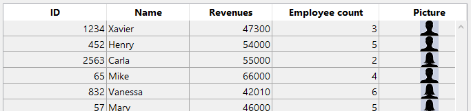

<!--REF #_command_.This.Syntax-->**This** -> Object<!-- END REF-->

<!--REF #_command_.This.Params-->

| Paramètres | Type   |                                | Description               |
| ---------- | ------ | ------------------------------ | ------------------------- |
| Résultat   | Object | &amp;larr; | Current element or object |

<!-- END REF-->

#### Description

The `This` command <!--REF #_command_.This.Summary-->returns a reference to the currently processed object.<!-- END REF-->

Dans la plupart des cas, la valeur de `This` est déterminée par la manière dont une fonction est appelée. Il ne peut pas être défini par affectation lors de l'exécution, et il peut être différent à chaque fois que la fonction est appelée.

This command can be used in different contexts, described below. Within these contexts, you will access object/collection element properties or entity attributes through **This.<*propertyPath*\>**. For example, *This.name* or *This.employer.lastName* are valid pathes to object, element or entity properties.

In any other context, the command returns **Null**.

#### Fonction de classe

Quand un [constructeur de classe](#class-constructor) est utilisé (avec la fonction [`new()`](API/ClassClass.md#new)), son `This` est lié au nouvel objet en cours de construction.

```4d
//Class: ob

Class Constructor  

 // Create properties on This as
 // desired by assigning to them

 This.a:=42
```

```4d
// dans une méthode 4D  
$o:=cs.ob.new()
$val:=$o.a //42
```

> En cas d'appel de la superclasse du constructeur depuis le constructeur en utilisant le mot-clé [Super](#super), n'oubliez pas que `This` ne doit pas être appelé avant le constructeur de la superclasse, sinon une erreur est générée. See [this example](super.md#example-1).

Dans tous les cas, `This` se réfère à l'objet sur lequel la fonction a été appelée, comme s'il s'agissait d'une fonction de l'objet.

```4d
//Class: ob

Function f() : Integer
 return This.a+This.b
```

Vous pouvez donc écrire dans une méthode projet :

```4d
$o:=cs.ob.new()
$o.a:=5
$o.b:=3
$val:=$o.f() //8

```

Dans cet exemple, l'objet affecté à la variable $o n'a pas de propriété *f*, il hérite de celle de sa classe. Comme *f* est appelée comme une méthode de $o, son `This` se réfère à $o.

#### Objet formule

In the context of the execution of a formula object created by the [Formula](formula.md) or [Formula from string](formula-from-string.md) commands, `This` returns a reference to the object currently processed by the formula.

For example, tou want to use a project method as a formula encapsulated in an object:

```4d
 var $person : Object := New object
 $person.firstName:="John"
 $person.lastName:="Smith"
 $person.greeting:=Formula(Greeting)
 $g:=$person.greeting("hello") // returns "hello John Smith"
 $g:=$person.greeting("hi") // returns "hi John Smith"
```

With the *Greeting* project method:

```4d
 #DECLARE($greeting : Text) : Text
 return $greeting+" "+This.firstName+" "+This.lastName
```

#### List box

In the context of a list box associated to a collection or an entity selection, during the [`On Display Detail`](../Events/onDisplayDetail.md) or the [`On Data Change`](../Events/onDataChange.md) events, `This` returns a reference to the collection element or entity accessed by the list box to display the current row.

:::note

If you use a collection of scalar values in a list box, 4D creates an object for each element with a single **value** property. Thus, the element value is returned by the **This.value** non-assignable expression.

:::

#### Exemple 1

A collection of objects, each with this structure:

```undefined
{  
"ID": 1234
"name": "Xavier",  
"revenues": 47300,  
"employees": [  
             "Allan",  
             "Bob", 
             "Charlie"  
            ] 
},{  
"ID": 2563
"name": "Carla",  
"revenues": 55000,  
"isFemale": true
"employees": [  
             "Igor",  
             "Jane"  
            ] 
},...
 
```

In the list box, each column refers to one of the properties of the object, either directly (This.name), indirectly (This.employees.length), or through an expression (*getPicture*) in which can be used directly. The list box looks like:


The *GetPicture* project method is automatically executed during the **On display detail** event:

```4d
  //GetPicture Method
 var $0 : Picture
 If(This.isFemale)
    $0:=Form.genericFemaleImage
 Else
    $0:=Form.genericMaleImage
 End if
```

Once the form is executed, you can see the result:



#### Exemple 2

You want to display entities from the following structure in a list box:


You build a list box of the "Collection or entity selection" type with the following definition:


A noter que :

- *This.ID*, *This.Title* and *This.Date* directly refers to the corresponding attributes in the ds.Event dataclass.
- *This.meetings* is a related attribute (based upon the One To Many relation name) that returns an entity selection of the ds.Meeting dataclass.
- **Form.eventList** is the entity selection that is attached to the list box. The initialization code can be put in the on load form event:

```4d
 Case of  
    :(Form event code=On Load)  
       Form.eventList:=ds.Event.all() //returns an entity selection with all entities  
 End case  
```

Once the form is executed, the list box is automatically filled with the entity selection:


#### Voir également

[Self](../commands-legacy/self.md)\
[Super](super.md)
