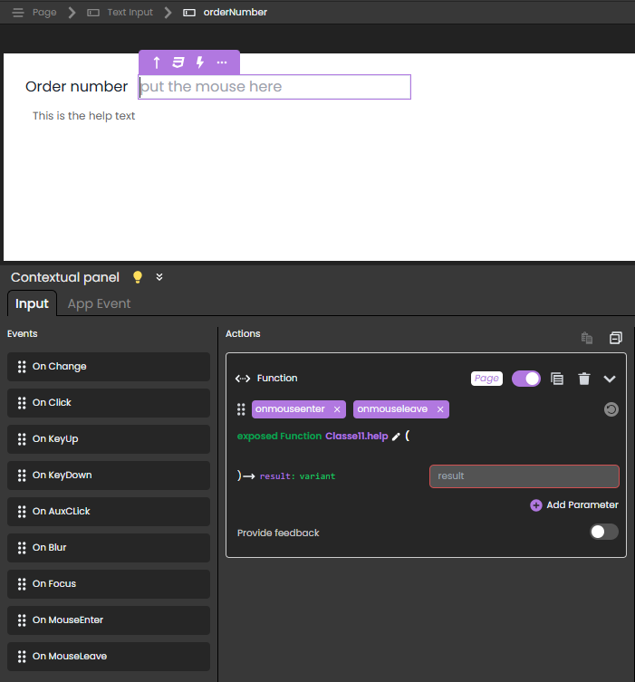

<!-- REF #_command_.Web Event.Syntax -->**Web Event** : object<!-- END REF -->

<!-- REF #_command_.Web Event.Params -->

| Paramètres | Type   |                             | Description                        |
| ---------- | ------ | :-------------------------: | ---------------------------------- |
| Résultat   | Object | &#8592; | Information on the triggered event |

<!-- END REF -->

## Description

`Web Event` <!-- REF #_command_.Web Event.Summary -->returns an object with information on a triggered event linked to a web page component<!-- END REF -->.

The command must be called in the context of a web page handled by the 4D web server.

**Résultat**

L'objet retourné contient les propriétés suivantes :

| Propriété |       | Type   | Description                                                                                                                                                                                                                                                   |
| --------- | ----- | ------ | ------------------------------------------------------------------------------------------------------------------------------------------------------------------------------------------------------------------------------------------------------------- |
| caller    |       | string | [Server-side reference](https://developer.4d.com/qodly/4DQodlyPro/pageLoaders/pageLoaderOverview#data-access-category) of the component triggering the event                                                                                                  |
| eventType |       | string | Type of event:<li>onblur</li><li>onfocus</li><li>onclick</li><li>onauxclick</li><li>onmouseenter</li><li>onmouseleave</li><li>onkeyup</li><li>onkeydown</li><li>onchange</li><li>unload</li><li>onload - triggered when the `Page` loads</li> |
| data      |       | object | Additional information depending on the involved component                                                                                                                                                                                                    |
|           | index | number | <li>Tabs component: index of the tab (indexing starts at 0)</li><li>Data Table component: column number</li>                                                                                                                                                  |
|           | row   | number | Data Table component: row number                                                                                                                                                                                                              |
|           | name  | string | Data Table component: qodlysource name of the column (e.g. "firstname", "address.city")                                                                                    |

#### Exemple

The objective is to display/hide a help text when the user hovers over the component:


This is done by attaching `onmouseenter` and `onmouseleave` events to a **Text input** component that displays the information stored in a **Text** component (displaying "This is the help text").



In this scenario:

- The Text input component has `orderNumber` as Server side reference.
  
- The Text component has `helpOn_orderNumber` as Server side reference.
  
- The [exposed](../ORDA/ordaClasses.md#exposed-vs-non-exposed-functions) function `help()` is attached to both the `onmouseenter` and `onmouseleave` events and contains the following code:

```4d
shared singleton Class constructor()
exposed Function help()
	
	var event : Object
	var myForm : 4D.WebForm
	var componentRef : Text
	
	myForm:=web Form
	event:=web Event
	componentRef:=event.caller

	Case of 
		: (event.eventType="onmouseenter")  // event is onmouseenter 
			myForm["helpOn_"+componentRef].show()  // show the help on "orderNumber" by showing  
			// the text component with reference "helpOn_orderNumber" 
		: (event.eventType="onmouseleave")  // event is onmouseleave 
			myForm["helpOn_"+componentRef].hide()  // hide the help on orderNumber
			
	End case 

```

To open the web page with the help on `orderNumber` hidden, you can associate this function to the `onload` event of the web page:

```4d
exposed function hideOnLoad()
	webForm.helpOn_orderNumber.hide()

```

## Voir également

[Web Form](web-form.md)</br>
[WebForm class](../API/WebFormClass.md)</br>
[WebFormItem class](../API/WebFormItemClass.md)

## Propriétés

|                    |                             |
| ------------------ | --------------------------- |
| Numéro de commande | 1734                        |
| Thread safe        | &cross; |

