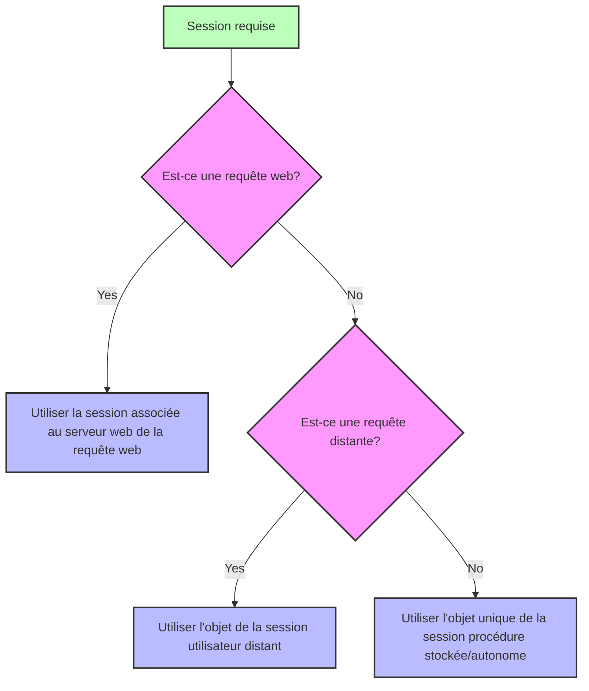

---
id: session
slug: /commands/session
title: Session
displayed_sidebar: docs
---

<!-- REF #_command_.Session.Syntax -->**Session** : 4D.Session<!-- END REF -->

<!--REF #_command_.Session.Params-->

<div class="no-index">

| Paramètres | Type                       |                             | Description   |
| ---------- | -------------------------- | --------------------------- | ------------- |
| Résultat   | [4D.Session](../API/SessionClass.md)  | &#8592; | Objet session |

</div>
<!-- END REF-->

<div class="no-index">
<details><summary>Historique</summary>

| Release | Modifications                                                             |
| ------- | ------------------------------------------------------------------------- |
| 20 R8   | Prise en charge des sessions autonomes                                    |
| 20 R5   | Prise en charge des sessions utilisateurs distants et procédures stockées |
| 18 R6   | Ajout                                                                     |

</details>
</div>

## Description

La commande `Session` <!-- REF #_command_.Session.Summary -->retourne l'objet `Session` correspondant à la session courante<!-- END REF -->.

Selon le process à partir duquel la commande est appelée, la session courante peut être :

- une session web (lorsque les [sessions évolutives sont activées](WebServer/sessions.md#enabling-web-sessions)),
- une session utilisateur distant (sur le serveur),
- une session de procédures stockées,
- une session autonome.

Pour plus d'informations, voir le paragraphe [Types de session](../../API/SessionClass.md#session-types).

La commande retourne *Null* si :

- elle est appelée dans un process web et les sessions évolutives sont désactivées sur le serveur web,
- elle est appelée sur un client 4D distant.

### Sessions Web

L'objet `Session` des sessions web est disponible depuis n'importe quel process web :

- Méthodes base `On Web Authentication`, `On Web Connection`, et `On REST Authentication`,
- code traité par les balises 4D dans les pages semi-dynamiques (4DTEXT, 4DHTML, 4DEVAL, 4DSCRIPT/, 4DCODE)
- méthodes projet avec l'attribut "Disponible via balises HTML et URLs 4D (4DACTION...)" et appelées via les urls 4DACTION/
- méthodes base [`On Mobile App Authentication`](https://developer.4d.com/go-mobile/docs/4d/on-mobile-app-authentication) et [`On Mobile App Action`](https://developer.4d.com/go-mobile/docs/4d/on-mobile-app-action) pour les requêtes mobiles,
- Fonctions ORDA [appelées via des requêtes REST](../../REST/ClassFunctions.md).

Pour plus d'informations sur les sessions utilisateur web, veuillez consulter la section [Sessions web](../../WebServer/sessions.md).

### Sessions utilisateur distant

L'objet `Session` des sessions utilisateur distantes est disponible depuis :

- Les méthodes projet qui ont l'attribut [Exécuter sur serveur](../../Project/project-method-properties.md#execute-on-server) (elles sont exécutées dans le process jumeau du process client),
- Les Triggers,
- Les [fonctions du modèle de données](../../ORDA/ordaClasses.md) ORDA (sauf celles déclarées avec le mot-clé [`local`](../../ORDA/ordaClasses.md#local-functions),
- Les méthodes base `On Server Open Connection` et `On Server Shutdown Connection`.

Pour plus d'informations sur les sessions utilisateur distant, veuillez consulter le paragraphe [**Sessions utilisateur distant**](../../Desktop/sessions.md#remote-user-sessions).

### Session des procédures stockées

Tous les process des procédures stockées partagent la même session d'utilisateur virtuel. L'objet `Session` des procédures stockées est disponible depuis :

- les méthodes appelées avec la commande [`Execute on server`](../../commands-legacy/execute-on-server),
- Les méthodes base `On Server Startup`, `On Server Shutdown`, `On Backup Startup`, `On Backup Shutdown`, et `On System event`.

Pour plus d'informations sur la session utilisateur virtuel des procédures stockées, veuillez vous reporter au paragraphe [**Sessions de procédures stockées**](../../Desktop/sessions.md#stored-procedure-sessions).

### Session autonome

L'objet `Session` est disponible à partir de n'importe quel process dans les applications autonomes (mono-utilisateur) afin que vous puissiez écrire et tester votre code client/serveur en utilisant l'objet `Session` dans votre environnement de développement 4D.

Pour plus d'informations sur les sessions autonomes, veuillez consulter le paragraphe [**Sessions autonomes**](../../Desktop/sessions.md#standalone-sessions).

### `Session` et composants

Lorsque `Session` est appelée à partir du code de différents [composants chargés dans le projet](../../Concepts/components.md), la commande renvoie un objet qui dépend de la requête d'appel et du contexte :

- dans le cas d'une requête web, `Session` renvoie toujours la session attachée au serveur web cible de la requête (et non une session du serveur web du composant),
- dans le cas d'une requête distante exécutée sur le serveur, `Session` renvoie toujours la session attachée à l'utilisateur distant,
- dans le cas d'une session de procédure stockée ou d'une session autonome, `Session` renvoie toujours l'unique session courante (le même objet est utilisé pendant toute la session de travail).



## Exemple

Vous avez défini la méthode `action_Session` ayant l'attribut "Disponible via Balises HTML et URLs 4D". Vous appelez la méthode en saisissant l'URL suivant dans votre navigateur :

```
IP:port/4DACTION/action_Session
```

```4d
  //action_Session method
 Case of
    :(Session#Null)
       If(Session.hasPrivilege("CreateInvoices")) //appel de la fonction hasPrivilege
          WEB SEND TEXT("4DACTION --> Session is CreateInvoices")
       Else
          WEB SEND TEXT("4DACTION --> Session is not CreateInvoices")
       End if
    Else
       WEB SEND TEXT("4DACTION --> Session is null")
 End case
```

## Voir également

[Session storage](../commands/session-storage)  
[Session API](../../API/SessionClass.md)
[Desktop sessions](../../Desktop/sessions.md)
[Web server user sessions](../../WebServer/sessions.md)  
[*Sessions évolutives pour les applications web avancées* (blog post)](https://blog.4d.com/scalable-sessions-for-advanced-web-applications/)

## Propriétés

|                    |      |
| ------------------ | ---- |
| Numéro de commande | 1714 |
| Thread safe        | oui  |


