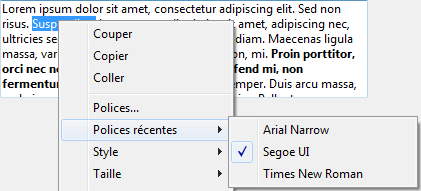
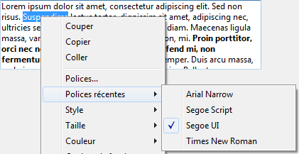

---
id: set-recent-fonts
title: SET RECENT FONTS
slug: /commands/set-recent-fonts
displayed_sidebar: docs
---

<!--REF #_command_.SET RECENT FONTS.Syntax-->**SET RECENT FONTS** ( *tabPolices* : Text array )<!-- END REF-->
<!--REF #_command_.SET RECENT FONTS.Params-->
<div class="no-index">

| Paramètre | Type |  | Description |
| --- | --- | --- | --- |
| tabPolices | Text array | &#8594;  | Tableau de noms de polices |
</div>
<!-- END REF-->

<div class="no-index">
<details><summary>Historique</summary>

|Version|Changements|
|---|---|
|14|Créé|

</details>
</div>

## Description 

<!--REF #_command_.SET RECENT FONTS.Summary-->La commande **SET RECENT FONTS** permet de modifier la liste des polices récentes affichées dans le menu contextuel des "polices récentes".<!-- END REF--> 

Ce menu contient les noms des dernières polices sélectionnées durant la session. Il est notamment utilisé par les zones de *Notes de programmation*. 

## Exemple 

Vous souhaitez ajouter une police au menu des polices récentes :



Vous exécutez le code suivant :

```4d
 ARRAY TEXT($tTRecentes;0)
 FONT LIST($tTRecentes;2)
 APPEND TO ARRAY($tTRecentes;"Segoe Script")
 SET RECENT FONTS($tTRecentes)
```

Le menu contient alors :



## Voir aussi 

[FONT LIST](../commands/font-list)  

## Propriétés

|  |  |
| --- | --- |
| Numéro de commande | 1305 |
| Thread safe | no |


