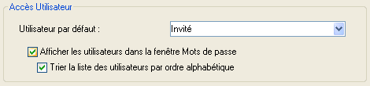

<!--REF #_command_.Get default user.Syntax-->**Get default user**  : Integer<!-- END REF-->
<!--REF #_command_.Get default user.Params-->

| Paramètre | Type |  | Description |
| --- | --- | --- | --- |
| Résultat | Integer | &#8592; | Numéro de référence unique de l’utilisateur |

<!-- END REF-->

Historique

|Version|Changements|
|---|---|
|2004|Créé|

## Description 

<!--REF #_command_.Get default user.Summary-->La commande **Get default user** retourne le numéro de référence unique de l’utilisateur désigné comme “Utilisateur par défaut” dans la boîte de dialogue des Propriétés de la base<!-- END REF--> :

Si aucun utilisateur par défaut n’est défini, la commande retourne 0.

## Propriétés

|  |  |
| --- | --- |
| Numéro de commande | 826 |
| Thread safe | no |

