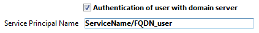
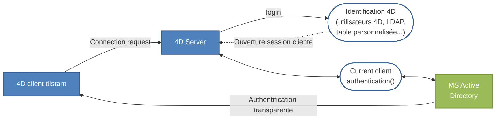

4D Server vous permet d'implémenter des solutions d'authentification unique (*Single Sign On* ou *SSO*) dans vos applications client-serveur sous Windows.

Grâce au SSO, vous pouvez mettre en place des solutions permettant aux utilisateurs sous Windows d'accéder directement aux applications 4D Server, sans avoir à saisir leurs identifiants, lorsqu'ils sont déjà connectés au domaine Windows de leur entreprise (via Active Directory).  En coulisses, l'application 4D Server délègue l'authentification à Active Directory et récupère l'identifiant de session Windows, que vous pouvez utiliser pour identifier l'utilisateur 4D dans votre application à l'aide de votre méthode standard de connexion.

## Conditions requises

La fonctionnalité SSO est disponible :

- avec les applications 4D Server sous Windows (les applications 4D mono-utilisateur ne prennent pas en charge l'authentification unique),
- avec la [couche réseau QUIC ou ServerNet](../settings/client-server.md#network-layer) activée.

## Activer la fonctionnalité SSO

Par défaut, les fonctions SSO ne sont pas activées dans 4D Server. Pour pouvoir en bénéficier, vous devez cocher l'option **Authentification de l'utilisateur auprès du serveur de domaine** dans la [page Client-Serveur/Options réseau](../settings/client-server.md#authentication-of-user-with-domain-server) de la boîte de dialogue des Propriétés de 4D Server :


Lorsque vous cochez cette option, 4D se connecte de manière transparente à l'Active directory du serveur de domaine Windows et obtient les tokens d'authentification disponibles.

Cette option permet d'effectuer une authentification standard via le protocole NTLM. 4D prend en charge les protocoles NTLM et Kerberos. Le protocole utilisé est sélectionné automatiquement par 4D en fonction de la [configuration actuelle](#requirements-for-sso). Si vous souhaitez utiliser le protocole Kerberos, vous devez également renseigner le champ Nom Principal de Service (SPN) supplémentaire (voir ci-dessous).

### Utiliser Kerberos

Si vous souhaitez utiliser Kerberos comme protocole d'authentification, vous devez également renseigner le champ [**Nom Principal de service** sur la page Client-serveur/Options réseau](../settings/client-server.md#service-principal-name) de la boîte de dialogue Propriétés :



Cette option déclare le SPN tel que défini dans la configuration de l'Active Directory. Un nom principal de service est un identifiant unique d'une instance de service. Des SPN sont utilisés par l'authentification Kerberos pour associer une instance de service à un compte d'ouverture de session. Cela permet à une application cliente de demander que le service authentifie un compte même si le client n'a pas accès au nom du compte. Pour plus d'informations, veuillez consulter la [page SPN sur le site Web MSDN](https://msdn.microsoft.com/en-us/library/windows/desktop/ms677949%28v=vs.85%29.aspx).

L'identifiant SPN doit respecter le format suivant :

- "ServiceName/FQDN_user" si le SPN est un attribut de machine
- "ServiceName/FQDN_computer" si le SPN est un attribut d'utilisateur

Où :

- *ServiceName* est le nom du service auprès duquel le client souhaite s'authentifier.
- Le *Fully Qualified Domain Name* (FQDN) est le nom du domaine qui définit son emplacement exact dans l'arbre hiérarchique de l'Active Directory pour les machines et les utilisateurs.

Dans les applications 4D, il est possible de configurer le SPN :

- dans les [propriétés de structure](../Project/architecture.md#sources), pour une utilisation avec 4D Server.
- ou dans les [propriétés utilisateur](../Project/architecture.md#settings-user) pour les besoins liés au déploiement.

## Implémenter le SSO

Une fois que la fonctionnalité SSO est activée, vous pouvez vous appuyer sur l'authentification de l'utilisateur de la session Windows pour ouvrir une session utilisateur sur 4D Server.

Il est important de comprendre que la fonctionnalité SSO vous fournit uniquement un nom d'utilisateur authentifié (login), que vous devez ensuite passer à votre méthode de connexion 4D standard.  Lorsqu'une application distante 4D tente de se connecter au serveur, vous devez appeler la commande [`Current client authentication`](../commands/current-client-authentication), qui renvoie l'identifiant de connexion de l'utilisateur, tel qu'il est défini dans Active Directory. Vous pouvez ensuite transmettre ces identifiants à votre propre système d'authentification (en utilisant les utilisateurs et groupes intégrés, les commandes LDAP ou tout autre mécanisme personnalisé) afin d'ouvrir la session appropriée pour l'utilisateur distant dans votre application 4D.

Ces principes sont décrits dans le schéma suivant :



La commande [`Current client authentication`](../commands/current-client-authentication) doit être appelée dans la méthode base [`On Server Open Connection`](../commands-legacy/on-server-open-connection-database-method.md), qui est appelée chaque fois qu'un 4D distant ouvre une nouvelle connexion à l'application 4D Server. Si l'authentification échoue, vous devez renvoyer une valeur non nulle dans le paramètre *$status* pour refuser la connexion.

### Utilisation de la commande Current client authentication

La commande [`Current client authentication`](../commands/current-client-authentication) s'utilise avec la syntaxe suivante :

```4d
$login:=Current client authentication($domain;$protocol)
```

Où :

- *$login* correspond à l'identifiant utilisé par le client pour se connecter à Active Directory (valeur de type texte). Cette valeur vous sera nécessaire pour identifier l'utilisateur dans votre projet. Si l'utilisateur n'a pas pu être identifié, aucune erreur n'est générée, seule une chaîne vide est retournée.
- *$domain* et *$protocol* sont des paramètres texte facultatifs. Ils sont remplis par la commande et peuvent vous permettre d'accepter ou de rejeter les connexions en fonction de certains critères :
  - *$domain* retourne le nom de domaine de l'Active Directory
  - *$protocol* retourne le nom du protocole utilisé par Windows pour authentifier l'utilisateur.

### Configuration requise pour le SSO

4D Server prend en charge diverses configurations d'authentification unique (SSO), en fonction de l'architecture et des paramètres courants. Le protocole utilisé pour l'authentification (NTLM ou Kerberos) ainsi que les informations renvoyées par la commande [`Current client authentication`](../commands/current-client-authentication) dépendent de la configuration réelle, à condition que toutes les conditions soient respectées (voir ci-dessous). Le protocole utilisé pour l'authentification est retourné dans le paramètre *protocol* de la commande [`Current client authentication`](../commands/current-client-authentication).

Le tableau suivant liste les conditions nécessaires pour l'authentification NTLM ou Kerberos :

|                                                                                          | NTLM                                                                     | Kerberos                                                                     |
| ---------------------------------------------------------------------------------------- | ------------------------------------------------------------------------ | ---------------------------------------------------------------------------- |
| 4D Server et 4D distant installés sur des machines différentes                           | oui                                                                      | oui                                                                          |
| L'utilisateur 4D Server est sur le domaine                                               | oui                                                                      | oui                                                                          |
| Le 4D distant est sur le même AD que l'utilisateur de 4D Server                          | oui ou non(\*)                                        | oui                                                                          |
| Le SPN est indiqué dans 4D Server                                                        | non                                                                      | oui(\*\*)                                                 |
| Informations renvoyées par Current client authentication si les conditions sont remplies | *login*=identifiant attendu, *domain*=domaine attendu, *protocol*="NTLM" | *login*=identifiant attendu, *domain*=domaine attendu, *protocol*="Kerberos" |

(\*) La configuration spécifique suivante est prise en charge : l'utilisateur 4D distant est un compte local sur une machine qui appartient au même AD que 4D Server. Dans ce cas, le paramètre domain contient le nom de la machine de 4D Server. A noter que cette prise en charge dépend des paramètres utilisateur : si elle n'est pas possible, des chaînes vides sont retournées.

(\*\*) Si toutes les conditions requises par Kerberos sont respectées mais que la commande [`Current client authentication`](../commands/current-client-authentication) renvoie "NTLM" comme protocole, cela signifie que vous êtes confronté à l'une des situations suivantes :

- La syntaxe SPN n'est pas valide ; c'est-à-dire qu'elle ne respecte pas toutes les [contraintes imposées par Microsoft](https://msdn.microsoft.com/en-us/library/windows/desktop/ms677949%28v=vs.85%29.aspx).
- Ou bien, le SPN a des doublons dans l'AD. Ce cas requiert l'intervention de l'administrateur de l'AD.

:::note

Une syntaxe valide ne signifie pas que la déclaration SPN elle-même est correcte ; en particulier, si le SPN n'existe pas dans l'AD,[`Current client authentication`](../commands/current-client-authentication) retourne des chaînes vides.

:::

