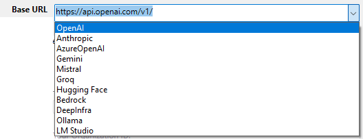

La page IA vous permet d'ajouter, de supprimer ou de consulter la liste de tous vos fournisseurs d'IA et des alias de modèles associés, qu'ils proviennent de sources locales ou de services en ligne. Les fournisseurs et les alias de modèle peuvent ensuite être utilisés dans votre code tout au long de votre application 4D, en particulier avec le [**composant 4D-AIKit**](../aikit/overview.md) en utilisant la fonctionnalité [**alias de modèle**](../aikit/provider-model-aliases.md).

:::tip Article(s) de blog sur le sujet

[Centraliser les fournisseurs d'IA et les alias de modèles dans 4D](https://blog.4d.com/centralizing-ai-providers-and-model-aliases-in-4d)

:::

## Gestion des fournisseurs

4D prend en charge de nombreux [fournisseurs d'IA](../aikit/compatible-openai.md) via une API similaire à celle d'OpenAI, chacun proposant des modèles et des fonctionnalités uniques adaptés aux besoins des bases de données.

Par défaut, la liste des fournisseurs est vide.

### Ajouter un fournisseur

Pour ajouter un fournisseur d'IA :

1. Cliquez sur le bouton **+** en bas de la liste des fournisseurs.
2. Saisissez les [champs de configuration du fournisseur](#provider-properties) requis, y compris les identifiants.
3. (facultatif) Cliquez sur le bouton **Tester la connexion** pour vérifier que l'URL et les identifiants fournis sont valides.

Si la connexion est établie, le nombre de modèles disponibles s'affiche à droite du bouton :


Si le test de connexion échoue, un message d'erreur s'affiche (par exemple : « Échec de la requête : introuvable » ou « Échec de la requête : accès refusé »).

4. Cliquez sur **OK** pour enregistrer le nouveau fournisseur, ou sur **Annuler** pour annuler toutes les modifications.

### Modifier un fournisseur

Pour modifier ou supprimer un fournisseur :

1. Sélectionnez un fournisseur enregistré dans la liste.
2. Modifiez les informations du fournisseur OU pour supprimer un fournisseur, cliquez sur le bouton **-** en bas de la liste.
3. Cliquez sur **OK** pour enregistrer les modifications, ou sur **Annuler** pour annuler toutes les modifications.

## Propriétés du fournisseur

Lorsque vous sélectionnez un fournisseur dans la liste des fournisseurs, plusieurs propriétés sont disponibles. Les noms de propriétés en **gras** sont obligatoires pour créer un fournisseur.

### Nom

Nom local utilisé pour identifier le fournisseur dans votre code, par exemple "claude". Le nom doit [respecter les règles relatives aux noms de propriétés](../Concepts/identifiers.md), car il sera utilisé dans le code de l'application pour faire référence au fournisseur.

### URL de base

Point de terminaison de l'API du fournisseur, par exemple `https://api.openai.com/v1` ou `http://localhost:11434/v1`.

La liste déroulante répertorie les principaux fournisseurs ; vous pouvez sélectionner une valeur pour accéder au point de terminaison du fournisseur :



### Clé API

(facultatif) Clé API du fournisseur. Pour savoir comment générer une clé API, veuillez consulter la documentation officielle de votre fournisseur d'IA. Certains fournisseurs de solutions d'IA peuvent également exiger des identifiants spécifiques supplémentaires.

### Organization

(facultatif, spécifique à OpenAI) Identifiant d'organisation utilisé par l'API OpenAI.

### Project

(facultatif, spécifique à OpenAI) Identifiant du projet. Chaque clé API d'OpenAI est associée à un projet.

### AIProviders.json

La configuration du fournisseur est stockée dans un fichier JSON nommé *AIProviders.json*, situé à côté du fichier *settings.4DSettings* actif dans le [dossier du projet](../Project/architecture.md), [en fonction de votre configuration de déploiement](./overview.md#enabling-user-settings).

:::warning

Le fichier *AIProviders.json* contient vos clés API de fournisseurs. Si votre projet est [stocké sur une plate-forme de gestion de version](../Project/overview.md#source-control) telle que GitHub ou GitLab, assurez-vous que le fichier *AIProviders.json* soit [enregistré dans le fichier .gitignore](../Project/architecture.md#gitignore-file-optional), sinon **vos clés pourraient être exposées publiquement**.

:::

### Déploiement avec une clé API

Lors de la configuration d'un fournisseur d'IA, vous devez fournir votre propre clé API. Pour obtenir des clés API et des identifiants auprès des fournisseurs d'IA, il est nécessaire de s'inscrire auprès d'eux.

À l'aide de la boîte de dialogue des Propriétés, les développeurs 4D peuvent définir un **nom de fournisseur** personnalisé (par exemple "open-ai-v1") et utiliser ce nom personnalisé dans leur code. Ils peuvent également le tester à l'aide de leur clé API.

Lorsque l'application 4D est déployée avec l'option [Propriétés utilisateur activées](../settings/overview.md#enabling-user-settings), l'administrateur peut configurer les propriétés utilisateur en utilisant le **même nom de fournisseur d'IA** ("open-ai-v1") et **personnaliser la clé API** afin d'utiliser celle du client. Grâce aux [règles de priorité des propriétés utilisateur](../settings/overview.md#priority-of-settings), les paramètres définis par le client prévaudront automatiquement sur ceux définis par le développeur.

:::warning

Lors de l'utilisation de 4D en mode client/serveur, il est **fortement recommandé** d'exécuter le code lié à l'IA côté serveur afin de protéger les tokens et les informations d'identification de l'API de l'exposition aux machines clientes.

:::

## Alias de modèles

La page Alias de modèles vous permet de lister les modèles des fournisseurs enregistrés que vous voulez utiliser dans votre code et de les nommer avec des *alias*. Grâce aux alias de modèles, vous évitez de coder en dur les noms de modèles, vous pouvez changer de modèle sans modifier votre code et vous garantissez la cohérence entre les différents environnements.

Lorsque vous utilisez un alias de modèle :

- Le fournisseur est résolu automatiquement (voir [Résolution des modèles](../aikit/Classes/OpenAIProviders.md#model-resolution) dans la documentation de 4D-AIKit).
- L'ID du modèle est appliqué.
- Tous les identifiants et points de terminaison sont utilisés.

### Ajouter un alias de modèle

:::note

Pour pouvoir ajouter un alias de modèle, vous devez avoir saisi au moins un fournisseur valide dans l'onglet **Fournisseurs**.

:::

Pour ajouter un alias de modèle :

1. Cliquez sur le bouton **+** en bas de la liste des alias de modèles.
2. Dans la colonne **Nom**, saisissez le nom de l'alias.
3. Cliquez sur la ligne correspondante dans la colonne **Fournisseur** pour afficher la liste des fournisseurs disponibles (les [noms des fournisseurs](#name) que vous avez saisis dans la page Fournisseurs), puis sélectionnez le nom du fournisseur.
4. Cliquez sur la ligne correspondante dans la colonne **Modèle** pour afficher la liste des modèles disponibles proposés par le fournisseur sélectionné, puis sélectionnez le modèle souhaité.
5. Cliquez sur **OK** pour enregistrer les modifications, ou sur **Annuler** pour annuler toutes les modifications.


### Modifier un alias de modèle

Pour modifier ou supprimer un alias :

1. Sélectionnez un alias de modèle dans la liste.
2. Modifiez les informations d'alias OU pour supprimer un alias, cliquez sur le bouton **-** en bas de la liste.
3. Cliquez sur **OK** pour enregistrer les modifications, ou sur **Annuler** pour annuler toutes les modifications.

### Utiliser un alias de modèle

Vous pouvez utiliser directement le nom d'alias du modèle partout où un nom de modèle est requis (à condition que les alias de modèles soient pris en charge).

Par exemple, dans 4D-AIKit, vous pouvez faire référence à un modèle à l'aide de la syntaxe suivante : *{model:"ModelName"}*, où *ModelName* correspond à un modèle valide défini dans l'onglet Alias de modèles :

```4d
var $client:=cs.AIKit.OpenAI.new()
var $result := $client.chat.completions.create($messages; \
    {model: "Chat Model"})
```

### Voir également

["Alias de fournisseurs et de modèles"](../aikit/provider-model-aliases.md) dans la documentation de 4D AIKit.