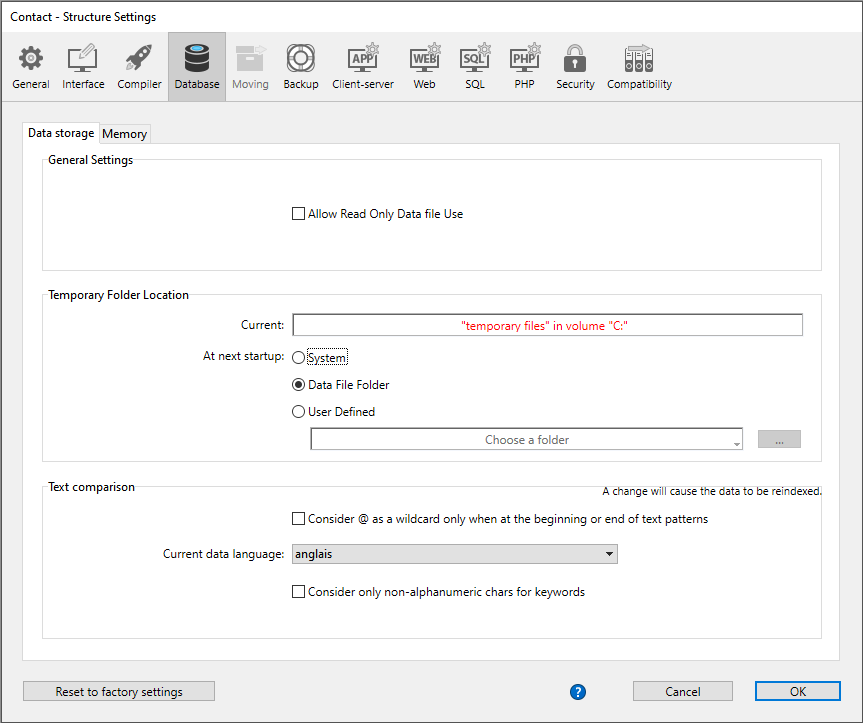
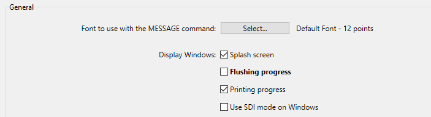

Les Propriétés configurent le fonctionnement du projet en cours. Ces paramètres peuvent être différents pour chaque projet. Ils comprennent les ports d'écoute, les configurations de sauvegarde, les options de sécurité, les paramètres Web, etc.

:::info

4D fournit un autre ensemble de paramètres, appelés **Préférences**, qui s'appliquent à l'application 4D IDE. Pour plus d'informations, reportez-vous à la section [Préférences](../Preferences/general.md).

:::

## Accès aux propriétés

Vous pouvez accéder à la boîte de dialogue Propriétés :

- en utilisant l'option de menu **Développement > Propriétés...**
- en cliquant sur **Propriétés** dans la barre d'outils 4D
- sur 4D Server, via l'option de menu **Edition > Propriétés...**

Lorsque le [**mode Propriétés utilisateur** est activé](#user-settings), **Propriétés...** est renommé **Propriétés de la structure...** et deux commandes de menu supplémentaires sont disponibles à chaque emplacement :

- **Propriétés utilisateur...** vous donne accès aux paramètres qui peuvent être stockés en externe dans un fichier utilisateur. Si ceux-ci sont modifiés, ils sont utilisés à la place des paramètres de structure.
- **Proppriétés utilisateur pour le fichier de données...** vous donne accès aux paramètres qui peuvent être stockés en externe dans un fichier utilisateur rattaché au fichier de données courant. S'ils sont modifiés, ils sont utilisés à la place des paramètres utilisateur ou des paramètres de structure.

### Informations sur le verrouillage

Le verrouillage peut se produire dans les modes Projet et Client/serveur lorsque :

- Le fichier *settings.4DSettings* est en 'Lecture seule' (Projets uniquement). La modification d'un paramètre affiche une alerte pour le déverrouiller, le cas échéant.
- Deux utilisateurs ou plus tentent de modifier les mêmes paramètres en même temps. Les paramètres ne peuvent pas être utilisés jusqu'à ce que le premier utilisateur les libère en fermant la fenêtre. (Client/serveur uniquement)

Dans les deux cas, les paramètres peuvent être ouverts en 'Lecture seule', mais ne peuvent pas être utilisés tant qu'ils sont verrouillés.

## Personnalisation des paramètres

Dans les boîtes de dialogue des Propriétés, les paramètres dont les valeurs ont été modifiées apparaissent **en gras** :

Les paramètres indiqués comme personnalisés peuvent avoir été modifiés directement dans la boîte de dialogue, ou avoir été modifiés précédemment dans le cas d'un projet converti.

Un paramètre apparaît toujours en gras même lorsque sa valeur est remplacée manuellement par ses valeurs par défaut. Ainsi, il est toujours possible d'identifier visuellement les paramètres qui ont été personnalisés.

La plupart des paramètres sont appliqués immédiatement. Toutefois, certains d'entre eux (tels que le paramètre de démarrage) ne prennent effet que lorsque la base de données est redémarrée. Dans ce cas, une boîte de dialogue apparaît pour vous informer que la modification prendra effet au prochain démarrage.

### Réinitialisation des paramètres

Pour rétablir les paramètres à leurs valeurs par défaut et supprimer le style gras indiquant qu'ils ont été personnalisés, cliquez sur **Rétablir les paramètres d'usine**.

Ce bouton réinitialise tous les paramètres de la page courante. Il devient actif lorsqu'au moins un paramètre a été modifié sur la page courante.

## Propriétés utilisateur

4D propose deux modes de fonctionnement pour les Propriétés des projets :

- **Mode Standard** : tous les paramètres sont stockés dans le fichier [*settings.4DSettings* au niveau du projet](../Project/architecture.md#sources) et sont appliqués dans tous les cas. C'est le mode par défaut, adapté à la phase de développement (toutes les applications).

- **Mode propriétés utilisateur** : une partie des paramètres personnalisés sont stockés dans un fichier *settings.4DSettings* [dans le dossier Settings](../Project/architecture.md#settings-user) (pour tous les fichiers de données) ou [dans le dossier Data](../Project/architecture.md#settings-user-data) (pour ce fichier de données) et sont utilisés à la place des paramètres de structure. Ce mode convient à la phase de déploiement pour les applications Desktop. Vous activez ce mode à l'aide d'une option située sur la [page Sécurité](./security.md) des Propriétés.

En définissant des propriétés utilisateur, vous pouvez conserver des paramètres personnalisés entre les mises à jour de vos applications 4D, ou gérer des paramètres différents pour une même application 4D déployée sur plusieurs sites différents. Cela permet également d'utiliser la programmation pour gérer les fichiers de paramètres à l'aide de XML.

4D peut générer et utiliser deux types de propriétés utilisateur :

- **Propriétés utilisateur** : elles sont utilisées à la place des propriétés de structure pour tout fichier de données ouvert avec l'application.
- **Propriétés utilisateur pour le fichier de données** : elles peuvent être définies spécifiquement pour chaque fichier de données utilisé avec votre application, en configurant par exemple l'ID du port ou le cache du serveur.

Avec cette option, vous pouvez facilement déployer et mettre à jour plusieurs copies de la même application Desktop avec plusieurs fichiers de données, chacun contenant des propriétés différentes.

Prenons par exemple la configuration suivante, où une application est dupliquée et où chaque copie utilise un paramètre d'ID de port différent. Si ce paramètre utilisateur est lié au fichier de données, vous pourrez mettre à jour l'application sans avoir à modifier manuellement l'ID du port :

### Activer les propriétés utilisateur

Pour activer les paramètres utilisateur, vous devez cocher l'option **Paramètres** > **Sécurité** > **Autoriser les propriétés utilisateur** :

Lorsque vous cochez cette option, les paramètres sont séparés en trois boîtes de dialogue :

- **Propriétés structure**
- **Propriétés utilisateur**
- **Propriétés utilisateur pour le fichier de données**

Vous pouvez accéder à ces boîtes de dialogue en utilisant le menu **Développement > Propriétés...** ou le bouton **Propriétés** dans la barre d'outils :

Vous pouvez également accéder à ces boîtes de dialogue à l'aide de la commande [OPEN SETTINGS WINDOW](../commands-legacy/open-settings-window.md) avec le sélecteur *settingsType* approprié.

La boîte de dialogue Propriétés de structure est identique à la boîte de dialogue Propriétés standard et permet d'accéder à toutes ses propriétés (qui peuvent être écrasées par des propriétés utilisateur).

### Propriétés utilisateur et propriétés utilisateur pour le fichier de données

Les boîtes de dialogue **Propriétés utilisateur** et **Propriétés utilisateur pour le fichier de données** contiennent une sélection de propriétés pertinentes qui peuvent être définies pour tous les fichiers de données ou pour un seul fichier de données :

Le tableau suivant répertorie les pages de paramètres des boîtes de dialogue **Propriétés utilisateur** et **Propriétés utilisateur pour le fichier de données** et décrit leurs principales différences par rapport aux paramètres standard :

| **Page des Propriétés structure**                                                                       | **Page des Propriétés utilisateur**             | **Page des Propriétés utilisateur pour fichier de données** |
| ------------------------------------------------------------------------------------------------------- | ----------------------------------------------- | ----------------------------------------------------------- |
| [Page Général](./general.md)                                                                            | N/a                                             | N/a                                                         |
| [Page Interface](./interface.md)                                                                        | Identique aux Propriétés structure              | Identique aux Propriétés structure                          |
| [Page Compilateur](./compiler.md)                                                                       | N/a                                             | N/a                                                         |
| [Page Base de données/Stockage des données](./database.md#data-storage-page)                            | N/a                                             | N/a                                                         |
| [Page Base de données/Mémoire](./database.md#memory-page)                                               | Identique aux Propriétés structure              | Identique aux Propriétés structure                          |
| [Page Sauvegarde/Périodicité](./../Backup/settings.md#scheduler)                                        | N/a                                             | Identique aux Propriétés structure                          |
| [Page Sauvegarde/Configuration](./../Backup/settings.md#configuration)                                  | N/a                                             | Identique aux Propriétés structure                          |
| [Page Sauvegarde/Sauvegarde & Restitution](./../Backup/settings.md#backup--restore) | N/a                                             | Identique aux Propriétés structure                          |
| [Page Client-serveur/Réseau](./client-server.md#network-options-page)                                   | Identique aux Propriétés structure              | Identique aux Propriétés structure                          |
| [Page Client-serveur/Configuration IP](./client-server.md#ip-configuration-page)                        | Identique aux Propriétés structure              | Identique aux Propriétés structure                          |
| [Page Web/Configuration](./web.md#configuration)                                                        | Identique aux Propriétés structure              | Identique aux Propriétés structure                          |
| [Page Web/Options (I)](./web.md#options-i)                                           | Identique aux Propriétés structure              | Identique aux Propriétés structure                          |
| [Page Web/Options (II)](./web.md#options-ii)                                         | Identique aux Propriétés structure              | Identique aux Propriétés structure                          |
| [Page Web/Journal (format)](./web.md#log-type)                                       | Identique aux Propriétés structure              | Identique aux Propriétés structure                          |
| [Page Web/Journal (sauvegarde)](./web.md#log-backup)                                 | Identique aux Propriétés structure              | Identique aux Propriétés structure                          |
| [Page Web/Services Web](./web.md#web-services)                                                          | Option de préfixage des méthodes non disponible | Option de préfixage des méthodes non disponible             |
| [Page SQL](./sql.md)                                                                                    | Identique aux Propriétés structure              | Identique aux Propriétés structure                          |
| [Page PHP](./php.md)                                                                                    | Identique aux Propriétés structure              | Identique aux Propriétés structure                          |
| [Page Sécurité](./security.md)                                                                          | N/a                                             | N/a                                                         |
| [Page Compatibilité](./compatibility.md)                                                                | N/a                                             | N/a                                                         |

Lorsque vous modifiez les paramètres dans cette boîte de dialogue, ils sont automatiquement enregistrés dans le fichier correspondant *settings.4DSettings* (voir ci-dessous) ou le fichier *Backup.4DSettings* (consultez la page [Paramètres de sauvegarde](../Backup/settings.md) pour plus d'informations).

### `SET DATABASE PARAMETER` et propriétés utilisateur

Certaines propriétés utilisateur sont aussi disponibles via la commande [SET DATABASE PARAMETER](../commands-legacy/set-database-parameter.md). Pour les propriétés utilisateur, la propriété **Conservé entre deux sessions** est fixée à **Oui**.

Lorsque la fonctionnalité **Propriétés utilisateur** est activée, les propriétés utilisateur modifiées par la commande [SET DATABASE PARAMETER](../commands-legacy/set-database-parameter.md) sont automatiquement stockées dans les Propriétés utilisateurs pour le fichier de données.

> `Table sequence number` est une exception ; cette valeur de paramètre est toujours stockée dans le fichier de données lui-même.

### Fichiers settings.4DSettings

Lorsque vous [cochez l'option **Autoriser les propriétés utilisateur**](#enabling-user-settings), des fichiers de propriétés utilisateur sont automatiquement créés. Leur emplacement dépend du type de propriété utilisateur définie.

#### Propriétés utilisateur

Le fichier de propriété utilisateur standard est automatiquement créé et placé dans un dossier de propriétés à l'emplacement suivant :

[`ProjectFolder/Settings/settings.4DSettings`](../Project/architecture.md#settings-user)

... où *ProjectFolder* est le nom du dossier contenant le fichier de structure du projet.

Dans les applications fusionnées, le fichier de propriétés utilisateur est placé à l'emplacement suivant :

- Dans les versions mono-utilisateur : ProjectFolder/Database/Settings/settings.4DSettings
- Dans les versions client/serveur : ProjectFolder/Database/Settings/settings.4DSettings

#### Propriétés utilisateur pour fichier de données

Le fichier de propriétés utilisateur lié au fichier de données est automatiquement créé et placé dans un dossier de propriétés à l'emplacement suivant :

[`Data/Settings/settings.4DSettings`](../Project/architecture.md#settings-user-data)

... où *Data* est le nom du dossier contenant le fichier de données courant de l'application.

> Lorsque le fichier de données est situé au même niveau que le fichier de structure du projet, les fichiers de propriétés utilisateur basés sur la structure et sur les données partagent le même emplacement et le même fichier. La commande de menu **Propriétés utilisateur pour le fichier de données...** n'est pas proposée.

:::note

Les fichiers de propriétés sont des fichiers XML ; ils peuvent être lus et modifiés à l'aide des commandes XML intégrées de 4D ou d'un éditeur XML. Cela signifie que vous pouvez gérer les paramètres par programmation, notamment dans le cadre d'applications compilées et fusionnées avec 4D Volume Desktop. Lorsque vous modifiez ce fichier par programmation, les changements ne sont pris en compte que lors de la prochaine ouverture de la base de données.

:::

### Priorité des paramètres

Les propriétés peuvent être stockées à trois niveaux. Chaque paramètre défini à un niveau a priorité sur le même paramètre défini à un niveau précédent, le cas échéant :

| **Niveau de priorité**                | **Nom**                                                                                                                   | **Emplacement**                                                                                                                                                                                                        | **Commentaires**                                                                                                                                                                                |
| ------------------------------------- | ------------------------------------------------------------------------------------------------------------------------- | ---------------------------------------------------------------------------------------------------------------------------------------------------------------------------------------------------------------------- | ----------------------------------------------------------------------------------------------------------------------------------------------------------------------------------------------- |
| 3 (le plus faible) | Paramètres de structure (ou Paramètres lorsque la fonction "Paramètres utilisateur" n'est pas activée) | Fichier ***settings.4DSettings*** dans le dossier Sources (bases projet) ou dans le dossier Settings au même niveau que le fichier de structure (bases binaires) | Emplacement unique lorsque les paramètres utilisateur ne sont pas activés. Appliqué à toutes les copies de l'application.                                       |
| 2                                     | Propriétés utilisateur (tous les fichiers de données)                                                  | Fichier ***settings.4DSettings*** dans le dossier Settings au même niveau que le dossier Project                                                                                                       | Remplace les propriétés de structure. Stocké dans le package de l'application.                                                                                  |
| 1 (le plus élevé)  | Propriétés utilisateur (fichier de données courant)                                                    | Fichier ***settings.4DSettings*** dans le dossier Settings au même niveau que le fichier de données                                                                                                    | Remplace les propriétés de structure et les propriétés utilisateur. S'applique uniquement lorsque le fichier de données associé est utilisé avec l'application. |

A noter que les fichiers de propriétés utilisateur ne contiennent qu'un sous-ensemble de paramètres pertinents, tandis que le fichier de structure contient tous les paramètres personnalisés, y compris les paramètres de bas niveau.
