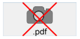

## Formats natifs pris en charge

4D intègre une gestion native des images. Cela signifie que les images sont affichées et stockées dans leur format d’origine, sans interprétation dans 4D. Les spécificités des différents formats (ombrages, zones transparentes...) sont conservées en cas de copier-coller et affichées sans altération. Ce support natif est valable pour toutes les images stockées dans les formulaires 4D : [images statiques](FormObjects/staticPicture.md) collées en mode Développement, images collées dans des [objets de saisie](FormObjects/input_overview.md) à l'exécution, etc.

Les formats d'image les plus courants sont pris en charge par les deux plates-formes : jpeg, gif, png, tiff, bmp, etc. Sous macOS, le format pdf est également disponible pour l'encodage et le décodage.

> La liste complète des formats pris en charge varie en fonction du système d’exploitation et des codecs personnalisés installés sur les postes. Pour savoir quels sont codecs disponibles, vous devez utiliser la commande `PICTURE CODEC LIST` (voir aussi la description du [type de données image](Concepts/dt_picture.md)).

### Format d'image non disponible

Une icône spécifique est affichée pour les images stockées dans un format non disponible sur le poste. L'extension du format manquant est inscrite en bas de l'icône :

L'icône est automatiquement utilisée partout où l'image doit être affichée :

Cette icône indique que l'image ne peut être ni affichée ni manipulée localement -- mais elle peut être stockée sans altération pour être affichée sur une autre machine. C'est le cas, par exemple, pour les images PDF sous Windows ou les images au format PICT.

## Coordonnées de la souris dans une image

4D vous permet de récupérer les coordonnées locales de la souris dans un [objet de saisie](FormObjects/input_overview.md) associé à une [expression d'image](FormObjects/properties_Object.md#expression-type), en cas de clic ou de survol, même si un défilement ou un zoom a été appliqué à l'image. Ce mécanisme, proche de celui d'une image map, peut être utilisé par exemple pour gérer les barres de bouton défilables ou bien l'interface de logiciels de cartographie.

Les coordonnées sont retournées dans les [Variables système](https://doc.4d.com/4Dv18/4D/18/System-Variables.300-4505547.en.html) *MouseX* et *MouseY*. Les coordonnées sont exprimées en pixels par rapport à l'angle supérieur gauche de l'image (0,0). Lorsque la souris se trouve en dehors du système de coordonnées de l'image, la valeur -1 est retournée dans *MouseX* et *MouseY*.

Vous pouvez lire la valeur des variables MouseX et MouseY dans le contexte des événements formulaire `Sur clic`, `Sur double clic`, `Sur relâchement bouton`, `Sur début survol` et `Sur survol`.
