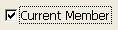
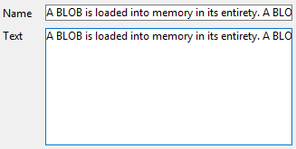

## Correction orthographique

4D inclut des fonctionnalités de correction orthographique intégrées et personnalisables. Text type [inputs](input_overview.md) can be checked, as well as [4D Write Pro](writeProArea_overview.md) documents.

The Auto Spellcheck property activates the spell-check for each object. When used, a spell-check is automatically performed during data entry. You can also execute the `SPELL CHECKING` 4D language command for each object to be checked.

#### Grammaire JSON

| Nom        | Type de données | Valeurs possibles |
| ---------- | --------------- | ----------------- |
| spellcheck | boolean         | true, false       |

#### Objets pris en charge

[Zone 4D Write Pro](writeProArea_overview.md) - [Zone de saisie](input_overview.md)

---

## Context Menu

Allows the user access to a standard context menu in the object when the form is executed.

For a picture type [input](input_overview.md), in addition to standard editing commands (Cut, Copy, Paste and Clear), the menu contains the **Import...** command, which can be used to import a picture stored in a file, as well as the **Save as...** command, which can be used to save the picture to disk. The menu can also be used to modify the display format of the picture: the **Truncated non-centered**, **Scaled to fit** and **Scaled to fit centered prop.** options are provided. The modification of the [display format](properties_Display#picture-format) using this menu is temporary; it is not saved with the record.

For a [multi-style](properties_Text.md#multi-style) text type [input](input_overview.md), in addition to standard editing commands, the context menu provides the following commands:

- **Fonts...**: displays the font system dialog box
- **Recent fonts**: displays the names of recent fonts selected during the session. The list can store up to 10 fonts (beyond that, the last font used replaces the oldest). By default, this list is empty and the option is not displayed. You can manage this list using the `SET RECENT FONTS` and `FONT LIST` commands.
- commands for supported style modifications: font, size, style, color and background color. When the user modifies a style attribute via this pop-up menu, 4D generates the `On After Edit` form event.

For a [Web Area](webArea_overview.md), the contents of the menu depend of the rendering engine of the platform. It is possible to control access to the context menu via the [`WA SET PREFERENCE`](https://doc.4d.com/4Dv17R6/4D/17-R6/WA-SET-PREFERENCE.301-4310780.en.html) command.

#### Grammaire JSON

| Nom         | Type de données | Valeurs possibles                     |
| ----------- | --------------- | ------------------------------------- |
| contextMenu | string          | "automatic" (used if missing), "none" |

#### Objets pris en charge

[Input](input_overview.md) - [Web Area](webArea_overview.md) - [4D Write Pro areas](writeProArea_overview.md)

---

## Saisissable

The Enterable attribute indicates whether users can enter values into the object.

Objects are enterable by default. If you want to make a field or an object non-enterable for that form, you can disable the Enterable property for the object. A non-enterable object only displays data. You control the data by methods that use the field or variable name. You can still use the `On Clicked`, `On Double Clicked`, `On Drag Over`, `On Drop`, `On Getting Focus` and `On Losing Focus` form events with non-enterable objects. This makes it easier to manage custom context menus and lets you design interfaces where you can drag-and-drop and select non-enterable variables.

When this property is disabled, any pop-up menus associated with a list box column via a list are disabled.

#### Grammaire JSON

| Nom         | Type de données | Valeurs possibles |
| ----------- | --------------- | ----------------- |
| saisissable | boolean         | true, false       |

#### Objets pris en charge

[4D Write Pro areas](writeProArea_overview.md) - [Hierarchical List](list_overview.md) - [Input](input_overview.md) - [List Box Column](listbox_overview.md#list-box-columns) - [Progress Bar](progressIndicator.md) - [Ruler](ruler.md) - [Stepper](stepper.md)

---

## Filtres de saisie

Un filtre de saisie contrôle exactement ce que l’utilisateur peut taper au clavier pendant la saisie. Unlike [required lists](properties_RangeOfValues.md#required-list) for example, entry filters operate on a character-by-character basis. Par exemple, si un numéro de composant est toujours constitué de trois lettres suivies de trois chiffres, vous pouvez contraindre la saisie à respecter cette forme. You can even control the particular letters and numbers.

Un filtre de saisie n’est effectif que pendant la saisie. Il n’a aucun effet sur l’affichage des données une fois que l'objet est désélectionné. En général, les filtres de saisie sont utilisés conjointement avec les [formats d'affichage](properties_Display.md). Le filtre agit pendant la saisie et le format d’affichage assure un affichage approprié de la valeur après sa saisie.

Pendant la saisie de données, un filtre de saisie évalue chaque caractère au moment où il est saisi. Si l’utilisateur tente de taper un caractère invalide (un chiffre à la place d’une lettre, par exemple), 4D refuse la saisie du caractère. The null character remains unchanged until the user types a valid character.

Les filtres de saisie peuvent aussi être utilisés pour afficher des caractères de formatage afin d’éviter à l’utilisateur de les taper. Par exemple, un numéro de téléphone français est constitué d’un chiffre de code opérateur suivi d’un chiffre de zone et d’un nombre à huit chiffres groupés par paires. Un format d’affichage peut être utilisé pour afficher le code opérateur entre parenthèses et pour afficher un tiret entre les paires de chiffres. Lorsqu’un tel format est utilisé, l’utilisateur n’a pas besoin de saisir les parenthèses ou le tiret.

### Définition d'un filtre de saisie

La plupart du temps, les [filtres intégrés](#default-entry-filters) de 4D répondront à vos besoins. Toutefois, vous pouvez créer des filtres personnalisés:

- you can directly enter a filter definition string
- or you can enter the name of an entry filter created in the Filters editor in the Toolbox. The names of custom filters you create begin with a vertical bar (|).

For information about creating entry filters, see [Filter and format codes](https://doc.4d.com/4Dv18/4D/18/Filter-and-format-codes.300-4575706.en.html).

### Filtres par défaut

Ce tableau décrit les filtres de saisie du menu de sélection :

| Filtres de saisie               | Description                                                                                                                                                 |
| ------------------------------- | ----------------------------------------------------------------------------------------------------------------------------------------------------------- |
| ~A                              | Permet la saisie de toute lettre, mais les transforme en caractères majuscules.                                                                             |
| &9                              | Permet tout chiffre.                                                                                                                                        |
| &A                              | Ne permet que la saisie de lettres majuscules.                                                                                                              |
| &a                              | Ne permet que la saisie de lettres (minuscules et majuscules).                                                                                              |
| &@                              | Ne permet que la saisie de caractères alphanumériques. Pas de caractères spéciaux.                                                                          |
| ~a##                            | State name abbreviation (e.g., CA). Permet la saisie de deux lettres, mais les transforme en caractères majuscules.                                         |
| !0&9##/##/##                    | Filtre standard de saisie des dates. Affiche des zéros aux emplacements de saisie. Permet la saisie de tout chiffre.                                        |
| !0&9 Day: ## Month: ## Year: ## | Time entry format. Affiche des zéros aux emplacements de saisie. Permet la saisie de tout chiffre. Limited to hours and minutes.                            |
| !0&9##:##                       | Filtre de saisie d’heure. Limited to hours and minutes. Affiche des zéros aux emplacements de saisie. Affiche des zéros aux emplacements de saisie.         |
| !0&9## Hrs ## Mins ## Secs      | Filtre de saisie d’heure. Affiche des zéros aux emplacements de saisie. Allow any two numbers before each word.                                             |
| !0&9Hrs: ## Mins: ## Secs: ##   | Filtre de saisie d’heure. Affiche des zéros aux emplacements de saisie. Allow any two numbers after each word.                                              |
| !0&9##-##-##-##                 | Local telephone number format. Affiche des zéros aux emplacements de saisie. Allow any number. Three entries, hyphen, four entries.                         |
| !_&9(###)!0###-####             | Long distance telephone number. Display underscores in first three entry spaces, zeros in remainder.                                                        |
| !0&9###-###-###                 | Long distance telephone number. Affiche des zéros aux emplacements de saisie. Allow any number. Three entries, hyphen, three entries, hyphen, four entries. |
| !0&9###-##-###                  | Social Security number. Affiche des zéros aux emplacements de saisie. Permet la saisie de tout chiffre.                                                     |
| ~"A-Z;0-9; ;,;.;-"              | Uppercase letters and punctuation. Allow only capital letters, numbers, spaces, commas, periods, and hyphens.                                               |
| &"a-z;0-9; ;,;.;-"              | Upper and lowercase letters and punctuation. Allow lowercase letters, numbers, spaces, commas, periods, and hyphens.                                        |
| &"0-9;.;-"                      | Numbers. Allow only numbers, decimal points, and hyphens (minus sign).                                                                                      |

#### Grammaire JSON

| Nom         | Type de données | Valeurs possibles                                                        |
| ----------- | --------------- | ------------------------------------------------------------------------ |
| entryFilter | string          | Entry filter code or Entry filter name (filter names start with &#124; ) |

#### Objets pris en charge

[Combo Box](comboBox_overview.md) - [Hierarchical List](list_overview.md) - [Input](input_overview.md) - [List Box Column](listbox_overview.md#list-box-columns)

---

## Focusable

When the **Focusable** property is enabled for an object, the object can have the focus (and can thus be activated by the keyboard for instance). It is outlined by a gray dotted line when it is selected — except when the [Hide focus rectangle](properties_Appearance.md#hide-focus-rectangle) option has also been selected.

> An [input object](input_overview.md) is always focusable if it has the [Enterable](#enterable) property.

-  Check box shows focus when selected

-  Check box is selected but cannot show focus|

When the **Focusable** property is selected for a non-enterable object, the user can select, copy or even drag-and-drop the contents of the area.

#### Grammaire JSON

| Nom       | Type de données | Valeurs possibles |
| --------- | --------------- | ----------------- |
| focusable | boolean         | true, false       |

#### Objets pris en charge

[4D Write Pro areas](writeProArea_overview.md) - [Button](button_overview.md) - [Check Box](checkbox_overview.md) - [Drop-down List](dropdownList_Overview.md) - [Hierarchical List](list_overview.md) - [Input](input_overview.md) - [List Box](listbox_overview.md) - [Plug-in Area](pluginArea_overview.md) - [Radio Button](radio_overview.md) - [Subform](subform_overview.md)

---

## Keyboard Layout

This property associates a specific keyboard layout to an [input object](input_overview.md). For example, in an international application, if a form contains a field whose contents must be entered in Greek characters, you can associate the "Greek" keyboard layout with this field. This way, during data entry, the keyboard configuration is automatically changed when this field has the focus.

By default, the object uses the current keyboard layout.

> You can also set and get the keyboard dynamically using the `OBJECT SET KEYBOARD LAYOUT` and `OBJECT Get keyboard layout` commands.

#### Grammaire JSON

| Nom             | Type de données | Valeurs possibles                                                           |
| --------------- | --------------- | --------------------------------------------------------------------------- |
| keyboardDialect | text            | Language code, for example "ar-ma" or "cs". See RFC3066, ISO639 and ISO3166 |

#### Objets pris en charge

[4D Write Pro areas](writeProArea_overview.md) - [Input](input_overview.md)

---

## Multilignes

Cette propriété est disponible pour les [objets de zone de saisie](input_overview.md) contenant les expressions de type texte et les champs de type alpha et texte. Elle peut prendre trois valeurs : Oui, Non, Automatique (par défaut).

#### Automatique

- Dans les zones mono-lignes, les mots situés en fin de ligne sont tronqués et il n’y a pas de retours à la ligne.
- Dans les zones multi-lignes, 4D effectue des retours à la ligne automatiques :  
  

#### Non

- Dans les zones mono-lignes, les mots situés en fin de ligne sont tronqués et il n’y a pas de retours à la ligne.
- Il n’y a aucun retour à la ligne : le texte est toujours affiché sur une seule ligne. Si le champ ou la variable alpha ou texte contient des retour chariots, le texte situé après le premier retour chariot est effacé dès que la zone est modifiée :  
  

#### Oui

Lorsque cette valeur est sélectionnée, la propriété est gérée par l'option [Retour à la ligne](properties_Display.md#wordwrap).

#### Grammaire JSON

| Nom       | Type de données | Valeurs possibles                                   |
| --------- | --------------- | --------------------------------------------------- |
| multiline | text            | "yes", "no", "automatic" (par défaut si non défini) |

#### Objets pris en charge

[Zone de saisie](input_overview.md)

---

## Placeholder

4D can display placeholder text in the fields of your forms.

Placeholder text appears as watermark text in a field, supplying a help tip, indication or example for the data to be entered. This text disappears as soon as the user enters a character in the area:

The placeholder text is displayed again if the contents of the field is erased.

A placeholder can be displayed for the following types of data:

- string (text or alpha)
- date and time when the **Blank if null** property is enabled.

You can use an XLIFF reference in the ":xliff:resname" form as a placeholder, for example:

 :xliff:PH_Lastname

You only pass the reference in the "Placeholder" field; it is not possible to combine a reference with static text.
> You can also set and get the placeholder text by programming using the [OBJECT SET PLACEHOLDER](https://doc.4d.com/4Dv17R5/4D/17-R5/OBJECT-SET-PLACEHOLDER.301-4128243.en.html) and [OBJECT Get placeholder](https://doc.4d.com/4Dv17R5/4D/17-R5/OBJECT-Get-placeholder.301-4128249.en.html) commands.

#### Grammaire JSON

| Nom         | Type de données | Valeurs possibles                                                  |
| ----------- | --------------- | ------------------------------------------------------------------ |
| placeholder | string          | Texte à afficher (grisé) lorsque l'objet ne contient aucune valeur |

#### Objets pris en charge

[Combo Box](comboBox_overview.md) - [Zone de saisie](input_overview.md)

#### Voir également

[Message d'aide](properties_Help.md)

---

## Selection always visible

This property keeps the selection visible within the object after it has lost the focus. This makes it easier to implement interfaces that allow the text style to be modified (see [Multi-style](properties_Text.md#multi-style)).

#### Grammaire JSON

| Nom           | Type de données | Valeurs possibles |
| ------------- | --------------- | ----------------- |
| showSelection | boolean         | true, false       |

#### Objets pris en charge

[4D Write Pro areas](writeProArea_overview.md) - [Input](input_overview.md)

---

## Raccourci

This property allows setting special meaning keys (keyboard shortcuts) for [buttons](button_overview.md), [radio buttons](radio_overview.md), and [checkboxes](checkbox_overview.md). They allow the user to use the control using the keyboard instead of having to use the mouse.

You can configure this option by clicking the [...] button in the Shortcuts property in the Property List.

> You can also assign a shortcut to a custom menu command. If there is a conflict between two shortcuts, the active object has priority. For more information about associating shortcuts with menus, refer to [Setting menu properties](https://doc.4d.com/4Dv17R5/4D/17-R5/Setting-menu-properties.300-4163525.en.html).

To view a list of all the shortcuts used in the 4D Design environment, see the [Shortcuts Page](https://doc.4d.com/4Dv17R5/4D/17-R5/Shortcuts-Page.300-4163701.en.html) in the Preferences dialog box.

#### Grammaire JSON

| Nom             | Type de données | Valeurs possibles                        |
| --------------- | --------------- | ---------------------------------------- |
| shortcutAccel   | boolean         | true, false (Ctrl Windows/Command macOS) |
| shortcutAlt     | boolean         | true, false                              |
| shortcutCommand | boolean         | true, false                              |
| shortcutControl | boolean         | true, false (macOS Control)              |
| shortcutShift   | boolean         | true, false                              |
|                 |                 |                                          |
| shortcutKey     | string          | <ul><li>any character key: "a", "b"...</li><li>[F1]" -> "[F15]", "[Return]", "[Enter]", "[Backspace]", "[Tab]", "[Esc]", "[Del]", "[Home]", "[End]", "[Help]", "[Page up]", "[Page down]", "[left arrow]", "[right arrow]", "[up arrow]", "[down arrow]"</li></ul>                |

#### Objets pris en charge

[Button](button_overview.md) - [Check Box](checkbox_overview.md) - [Picture Button](pictureButton_overview.md) - [Radio Button](radio_overview.md)

---

## Saisie sur clic unique

Enables direct passage to edit mode in list boxes.

When this option is enabled, list box cells switch to edit mode after a single user click, regardless of whether or not this area of the list box was selected beforehand. Note that this option allows cells to be edited even when the list box [selection mode](properties_ListBox.md#selection-mode) is set to "None".

When this option is not enabled, users must first select the cell row and then click on a cell in order to edit its contents.

#### Grammaire JSON

| Nom             | Type de données | Valeurs possibles |
| --------------- | --------------- | ----------------- |
| singleClickEdit | boolean         | true, false       |

#### Objets pris en charge

[List Box](listbox_overview.md)
