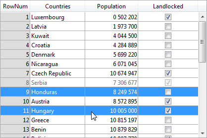

---

## Colonnes

Collection de colonnes de la list box.

#### Grammaire JSON

| Nom      | Type de données             | Valeurs possibles                                |
| -------- | --------------------------- | ------------------------------------------------ |
| colonnes | collection d'objets colonne | Contient les propriétés des colonnes de list box |

For a list of properties supported by column objects, please refer to the [Column Specific Properties](listbox_overview.md#column-specific-properties) section.

#### Objets pris en charge

[List Box](listbox_overview.md)

---

## Nom formulaire détaillé

`Liste box sélection`

Indique le formulaire à utiliser pour modifier ou afficher les enregistrements individuels de la list box.

The specified form is displayed:

* when using `Add Subrecord` and `Edit Subrecord` standard actions applied to the list box (see [Using standard actions](https://doc.4d.com/4Dv17R6/4D/17-R6/Using-standard-actions.300-4354811.en.html)),
* when a row is double-clicked and the [Double-click on Row](#double-click-on-row) property is set to "Edit Record" or "Display Record".

#### Grammaire JSON

| Nom        | Type de données | Valeurs possibles         |
| ---------- | --------------- | ------------------------- |
| detailForm | string          | <ul><li>Name (string) of table or project form</li><li>POSIX path (string) to a .json file describing the form</li><li>Object describing the form</li></ul> |

#### Objets pris en charge

[List Box](listbox_overview.md)

---

## Double-clic sur ligne

`Liste box sélection`

Sets the action to be performed when a user double-clicks on a row in the list box. The available options are:

* **Do nothing** (default): Double-clicking a row does not trigger any automatic action.
* **Edit Record**: Double-clicking a row displays the corresponding record in the detail form defined [for the list box](#detail-form-name). The record is opened in read-write mode so it can be modified.
* **Display Record**: Identical to the previous action, except that the record is opened in read-only mode so it cannot be modified.
> Le double-clic sur une ligne vide est ignoré dans les listbox.

Regardless of the action selected/chosen, the `On Double clicked` form event is generated.

For the last two actions, the On `Open Detail` form event is also generated. The `On Close Detail` is then generated when a record displayed in the detail form associated with the list box is about to be closed (regardless of whether or not the record was modified).

#### Grammaire JSON

| Nom                    | Type de données | Valeurs possibles                   |
| ---------------------- | --------------- | ----------------------------------- |
| doubleClickInRowAction | string          | "editSubrecord", "displaySubrecord" |

#### Objets pris en charge

[List Box](listbox_overview.md)

---

## Ensemble surlignage

`Liste box sélection`

This property is used to specify the set to be used to manage highlighted records in the list box (when the **Arrays** data source is selected, a Boolean array with the same name as the list box is used).

4D creates a default set named *ListBoxSetN* where *N* starts at 0 and is incremented according to the number of list boxes in the form. If necessary, you can modify the default set. It can be a local, process or interprocess set (we recommend using a local set, for example *$LBSet*, in order to limit network traffic). It is then maintained automatically by 4D. If the user selects one or more rows in the list box, the set is updated immediately. If you want to select one or more rows by programming, you can apply the commands of the “Sets” theme to this set.
> * The highlighted status of the list box rows and the highlighted status of the table records are completely independent.
> * If the “Highlight Set” property does not contain a name, it will not be possible to make selections in the list box.

#### Grammaire JSON

| Nom          | Type de données | Valeurs possibles |
| ------------ | --------------- | ----------------- |
| highlightSet | string          | Name of the set   |

#### Objets pris en charge

[List Box](listbox_overview.md)

---

## Locked columns and static columns

Locked columns and static columns are two separate and independent functionalities in list boxes:

* Locked columns always stay displayed to the left of the list box; they do not scroll horizontally.
* Static columns cannot be moved by drag and drop within the list box.
> > > You can set static and locked columns by programming, refer to [List Box](https://doc.4d.com/4Dv17R6/4D/17-R6/List-Box.201-4310263.en.html) in the [4D Language Reference](https://doc.4d.com/4Dv17R6/4D/17-R6/4D-Language-Reference.100-4310216.en.html) manual.

These properties interact as follows:

* If you set columns that are only static, they cannot be moved.

* If you set columns that are locked but not static, you can still change their position freely within the locked area. However, a locked column cannot be moved outside of this locked area.


* If you set all of the columns in the locked area as static, you cannot move these columns within the locked area.


* You can set a combination of locked and static columns according to your needs. For example, if you set three locked columns and one static column, the user can swap the two right-most columns within the locked area (since only the first column is static).

### Nombre de colonnes verrouillées

Number of columns that must stay permanently displayed in the left part of the list box, even when the user scrolls through the columns horizontally.

#### Grammaire JSON

| Nom               | Type de données | Valeurs possibles |
| ----------------- | --------------- | ----------------- |
| lockedColumnCount | integer         | minimum : 0       |

#### Objets pris en charge

[List Box](listbox_overview.md)

### Nombre de colonnes statiques

Number of columns that cannot be moved during execution.

#### Grammaire JSON

| Nom               | Type de données | Valeurs possibles |
| ----------------- | --------------- | ----------------- |
| staticColumnCount | integer         | minimum : 0       |

#### Objets pris en charge

[List Box](listbox_overview.md)

---

## Nombre de colonnes

Sets the number of columns of the list box.
> You can add or remove columns dynamically by programming, using commands such as [LISTBOX INSERT COLUMN](https://doc.4d.com/4Dv18/4D/18/LISTBOX-INSERT-COLUMN.301-4505224.en.html) or [LISTBOX DELETE COLUMN](https://doc.4d.com/4Dv18/4D/18/LISTBOX-DELETE-COLUMN.301-4505185.en.html).

#### Grammaire JSON

| Nom         | Type de données | Valeurs possibles |
| ----------- | --------------- | ----------------- |
| columnCount | integer         | minimum: 1        |

#### Objets pris en charge

[List Box](listbox_overview.md)

---

## Tableau de contrôle des lignes

`Array type list box`

A 4D array controlling the display of list box rows.

You can set the "hidden", "disabled" and "selectable" interface properties for each row in an array-based list box using this array. It can also be designated using the `LISTBOX SET ARRAY` command.

The row control array must be of the Longint type and include the same number of rows as the list box. Each element of the *Row Control Array* defines the interface status of its corresponding row in the list box. Three interface properties are available using constants in the "List Box" constant theme:

| Constante                | Valeur | Commentaire                                                                                                                                                                                                                                                                                                                                                                                                                                                                                                                                                                                                                                                                 |
| ------------------------ | ------ | --------------------------------------------------------------------------------------------------------------------------------------------------------------------------------------------------------------------------------------------------------------------------------------------------------------------------------------------------------------------------------------------------------------------------------------------------------------------------------------------------------------------------------------------------------------------------------------------------------------------------------------------------------------------------- |
| lk row is disabled       | 2      | The corresponding row is disabled. The text and controls such as check boxes are dimmed or grayed out. Enterable text input areas are no longer enterable. Default value: Enabled                                                                                                                                                                                                                                                                                                                                                                                                                                                                                           |
| lk row is hidden         | 1      | The corresponding row is hidden. Hiding rows only affects the display of the list box. The hidden rows are still present in the arrays and can be managed by programming. The language commands, more particularly `LISTBOX Get number of rows` or `LISTBOX GET CELL POSITION`, do not take the displayed/hidden status of rows into account. For example, in a list box with 10 rows where the first 9 rows are hidden, `LISTBOX Get number of rows` returns 10. From the user’s point of view, the presence of hidden rows in a list box is not visibly discernible. Only visible rows can be selected (for example using the Select All command). Default value: Visible |
| lk row is not selectable | 4      | The corresponding row is not selectable (highlighting is not possible). Enterable text input areas are no longer enterable unless the [Single-Click Edit](properties_Entry.md#single-click-edit) option is enabled. Controls such as check boxes and lists are still functional however. Ce paramètre est ignoré si le mode de sélection de la listbox est "None". Default value: Selectable                                                                                                                                                                                                                                                                                |

To change the status for a row, you just need to set the appropriate constant(s) to the corresponding array element. For example, if you do not want row #10 to be selectable, you can write:

```4d
 aLControlArr{10}:=lk row is not selectable
```


You can define several interface properties at once:

```4d
 aLControlArr{8}:=lk row is not selectable + lk row is disabled
```



Note that setting properties for an element overrides any other values for this element (if not reset). Par exemple :

```4d
 aLControlArr{6}:=lk row is disabled + lk row is not selectable
 //définit la ligne 6 comme étant désactivée AND non sélectionnable
 aLControlArr{6}:=lk row is disabled
 //définit la ligne 6 comme étant désactivée mais sélectionnable à nouveau
```

#### Grammaire JSON

| Nom              | Type de données | Valeurs possibles      |
| ---------------- | --------------- | ---------------------- |
| rowControlSource | string          | Row control array name |

#### Objets pris en charge

[List Box](listbox_overview.md)

---

## Mode de sélection

Designates the option for allowing users to select rows:

* **None**: Rows cannot be selected if this mode is chosen. Clicking on the list will have no effect unless the [Single-Click Edit](properties_Entry.md#single-click-edit) option is enabled. The navigation keys only cause the list to scroll; the `On Selection Change` form event is not generated.
* **Single**: One row at a time can be selected in this mode. Clicking on a row will select it. A **Ctrl+click** (Windows) or **Command+click** (macOS) on a row toggles its state (between selected or not).  
  The Up and Down arrow keys select the previous/next row in the list. Les autres touches de navigation font défiler la liste. The `On Selection Change` form event is generated every time the current row is changed.
* **Multiple**: Several rows can be selected simultaneously in this mode.

#### Grammaire JSON

| Nom           | Type de données | Valeurs possibles            |
| ------------- | --------------- | ---------------------------- |
| selectionMode | string          | "multiple", "single", "none" |

#### Objets pris en charge

[List Box](listbox_overview.md)
