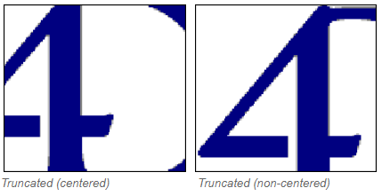

## Chemin d'accès

Chemin d'une image source statique pour un [bouton image](pictureButton_overview.md), [un menu pop-up ](picturePopupMenu_overview.md) ou une [image ou une image statique](staticPicture.md). Vous devez utiliser la syntaxe POSIX.

Deux emplacements principaux peuvent être utilisés pour le chemin d'image statique :

- dans le dossier **Resources** de la base projet. Convient lorsque vous souhaitez partager des images statiques entre plusieurs formulaires de la base de données. In this case, the Pathname is "/RESOURCES/\<picture path\>".
- dans un dossier d'images (nommé **Images** par exemple) dans le dossier du formulaire. Convient lorsque les images statiques sont utilisées uniquement dans le formulaire et/ou lorsque vous souhaitez pouvoir déplacer ou dupliquer le formulaire entier dans un ou plusieurs projets. In this case, the Pathname is "\<picture path\>" and is resolved from the root of the form folder.

#### Grammaire JSON

|   Nom   | Type de données | Valeurs possibles                             |
|:-------:|:---------------:| --------------------------------------------- |
| picture |      text       | Chemin relatif ou filesystem en syntaxe POSIX |

#### Objets pris en charge

[Bouton image](pictureButton_overview.md) - [Pop-up Menu image](picturePopupMenu_overview.md) - [Image statique](staticPicture.md)

---

## Affichage

### Scaled to fit

`JSON grammar: "scaled"`

The **Scaled to fit** format causes 4D to resize the picture to fit the dimensions of the area.

### Replicated

`JSON grammar: "tiled"`

When the area that contains a picture with the **Replicated** format is enlarged, the picture is not deformed but is replicated as many times as necessary in order to fill the area entirely.

If the field is reduced to a size smaller than that of the original picture, the picture is truncated (non-centered).

### Centre / Tronquée (non centrée)

`Grammaire JSON : "truncatedCenter" / "truncatedTopLeft"`

Le format **Centre** permet à 4D de centrer l'image dans la zone et de rogner toute partie qui ne rentre pas dans la zone. 4D crops equally from each edge and from the top and bottom.

The **Truncated (non-centered)** format causes 4D to place the upper-left corner of the picture in the upper-left corner of the area and crop any portion that does not fit within the area. 4D crops from the right and bottom.
> When the picture format is **Truncated (non-centered)**, it is possible to add scroll bars to the input area.

#### Grammaire JSON

| Nom           | Type de données | Valeurs possibles                                        |
| ------------- | --------------- | -------------------------------------------------------- |
| pictureFormat | string          | "scaled", "tiled", "truncatedCenter", "truncatedTopLeft" |

#### Objets pris en charge

[Image statique](staticPicture.md)
