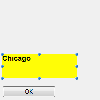

## Autoriser sélecteur police/couleur

Lorsque cette propriété est activée, les commandes [OPEN FONT PICKER](https://doc.4d.com/4Dv18/4D/18/OPEN-FONT-PICKER.301-4505612.en.html) et [OPEN COLOR PICKER](https://doc.4d.com/4Dv18/4D/18/OPEN-COLOR-PICKER.301-4505611.en.html) peuvent être appelées pour afficher les fenêtres de sélecteur de la police système et de couleurs. A l'aide de ces fenêtres, les utilisateurs peuvent modifier la police ou la couleur d'un objet formulaire dont le focus est accessible directement au clic. Lorsque cette propriété est désactivée (par défaut), les commandes d'ouverture du sélecteur ne produisent aucun effet.

#### Grammaire JSON

| Propriété            | Type de données | Valeurs possibles        |
| -------------------- | --------------- | ------------------------ |
| allowFontColorPicker | boolean         | false (par défaut), true |

#### Objets pris en charge

[Zone de saisie](input_overview.md)

---

## Souligné

Le texte sélectionné est plus foncé et plus épais.

Vous pouvez également définir cette propriété à l'aide de la commande [**OBJECT SET FONT STYLE**](https://doc.4d.com/4Dv17R5/4D/17-R5/OBJECT-SET-FONT-STYLE.301-4128244.en.html).
> This is normal text.<br/> **This is bold text.**

#### Grammaire JSON

| Propriété  | Type de données | Valeurs possibles |
| ---------- | --------------- | ----------------- |
| fontWeight | text            | "normal", "bold"  |

#### Objets pris en charge

[Bouton](button_overview.md) - [Case à cocher](checkbox_overview.md) - [Combo Box](comboBox_overview.md) - [Liste déroulante](dropdownList_Overview.md) - [Group Box](groupBox.md) - [Liste hiérarchique](list_overview.md#overview) - [Zone de saisie](input_overview.md) - [List Box](listbox_overview.md#overview) - [Colonne List Box](listbox_overview.md#list-box-columns) - [Pied List Box](listbox_overview.md#list-box-footers) - [En-tête List Box](listbox_overview.md#list-box-headers) - [Bouton Radio](radio_overview.md) - [Zone de texte](text.md)

---

## Italique

Le texte sélectionné est légèrement penché vers la droite.

Vous pouvez également définir cette propriété à l'aide de la commande [**OBJECT SET FONT STYLE**](https://doc.4d.com/4Dv17R5/4D/17-R5/OBJECT-SET-FONT-STYLE.301-4128244.en.html).
> This is normal text.<br/> *This is text in italics.*

#### Grammaire JSON

| Nom       | Type de données | Valeurs possibles  |
| --------- | --------------- | ------------------ |
| fontStyle | string          | "normal", "italic" |

#### Objets pris en charge

[Bouton](button_overview.md) - [Case à cocher](checkbox_overview.md) - [Combo Box](comboBox_overview.md) - [Liste déroulante](dropdownList_Overview.md) - [Group Box](groupBox.md) - [Liste hiérarchique](list_overview.md#overview) - [Zone de saisie](input_overview.md) - [List Box](listbox_overview.md#overview) - [Colonne List Box](listbox_overview.md#list-box-columns) - [Pied List Box](listbox_overview.md#list-box-footers) - [En-tête List Box](listbox_overview.md#list-box-headers) - [Bouton Radio](radio_overview.md) - [Zone de texte](text.md)

---

## Souligné

Une ligne est placée sous le texte.

#### Grammaire JSON

| Nom            | Type de données | Valeurs possibles     |
| -------------- | --------------- | --------------------- |
| textDecoration | string          | "normal", "underline" |

#### Objets pris en charge

[Bouton](button_overview.md) - [Case à cocher](checkbox_overview.md) - [Combo Box](comboBox_overview.md) - [Liste déroulante](dropdownList_Overview.md) - [Group Box](groupBox.md) - [Liste hiérarchique](list_overview.md#overview) - [Zone de saisie](input_overview.md) - [List Box](listbox_overview.md#overview) - [Colonne List Box](listbox_overview.md#list-box-columns) - [Pied List Box](listbox_overview.md#list-box-footers) - [En-tête List Box](listbox_overview.md#list-box-headers) - [Bouton Radio](radio_overview.md) - [Zone de texte](text.md)

---

## Police

Cette propriété vous permet d'indiquer le **thème de la police** ou la **famille de police** utilisé(e) dans l'objet.
> Les propriétés du **thème** et de la **famille** de police sont mutuellement exclusives. Un thème de police prend en charge les attributs de police, y compris la taille. Une famille de polices vous permet de définir le nom de la police, sa taille et sa couleur.

### Thème de police

La propriété de thème de police désigne un nom de style automatique. Les styles automatiques déterminent de manière dynamique la famille de police, la taille et la couleur de police à utiliser pour l'objet, en fonction des paramètres système. Ces paramètres dépendent de :

- la plateforme,
- la langue du système,
- et le type d'objet de formulaire.

Avec le thème de police, vous avez la garantie que les titres s'affichent toujours conformément aux normes de l'interface du système. Cependant, leur taille peut varier d'une machine à l'autre.

Trois thèmes de polices sont disponibles :

- **normal** : style automatique, appliqué par défaut à tout nouvel objet créé dans l'éditeur de formulaires.
- Les thèmes de polices **principaux** et **supplémentaires** ne sont pris en charge uniquement par les [zones de texte](text.md) et les [zones de saisie](input_overview.md). Ces thèmes sont principalement destinés à la conception de boîtes de dialogue. Ils font référence aux styles de police utilisés respectivement pour le texte principal et les informations supplémentaires dans vos fenêtres d'interface. Voici les boîtes de dialogue typiques (macOS et Windows) utilisant ces thèmes de polices :


> Les thèmes de polices gèrent la police ainsi que sa taille et sa couleur. Si vous modifiez l'une des propriétés gérées par un thème de police, cela ne fonctionne plus de manière dynamique. Cependant, vous pouvez appliquer des propriétés de style personnalisé (Gras, Italique ou Souligné) sans modifier son fonctionnement.

#### Grammaire JSON

| Nom       | Type de données | Valeurs possibles              |
| --------- | --------------- | ------------------------------ |
| fontTheme | string          | "normal", "main", "additional" |

#### Objets pris en charge

[Bouton](button_overview.md) - [Case à cocher](checkbox_overview.md) - [Combo Box](comboBox_overview.md) - [Liste déroulante](dropdownList_Overview.md) - [Group Box](groupBox.md) - [Liste hiérarchique](list_overview.md#overview) - [Zone de saisie](input_overview.md) - [List Box](listbox_overview.md#overview) - [Colonne List Box](listbox_overview.md#list-box-columns) - [Pied List Box](listbox_overview.md#list-box-footers) - [En-tête List Box](listbox_overview.md#list-box-headers) - [Bouton Radio](radio_overview.md) - [Zone de texte](text.md)

### Famille de police

Il existe deux types de noms de familles de polices :

- *family-name :* Le nom d'une famille de polices, comme "times", "courier", "arial", etc.
- *generic-family *: Le nom d'une famille générique, comme "serif", "sans-serif", "cursive", "fantasy", "monospace".

Vous pouvez la définir à l'aide de la commande [**OBJECT SET FONT**](https://doc.4d.com/4Dv17R5/4D/17-R5/OBJECT-SET-FONT.301-4054834.en.html) .

#### Grammaire JSON

| Nom        | Type de données | Valeurs possibles               |
| ---------- | --------------- | ------------------------------- |
| fontFamily | string          | Nom d'une famille de police CSS |
> 4D recommande d'utiliser uniquement les polices de [sécurité Web](https://www.w3schools.com/cssref/css_websafe_fonts.asp).

#### Objets pris en charge

[Bouton](button_overview.md) - [Case à cocher](checkbox_overview.md) - [Combo Box](comboBox_overview.md) - [Liste déroulante](dropdownList_Overview.md) - [Group Box](groupBox.md) - [Liste hiérarchique](list_overview.md#overview) - [Zone de saisie](input_overview.md) - [List Box](listbox_overview.md#overview) - [Colonne List Box](listbox_overview.md#list-box-columns) - [Pied List Box](listbox_overview.md#list-box-footers) - [En-tête List Box](listbox_overview.md#list-box-headers) - [Bouton Radio](radio_overview.md) - [Zone de texte](text.md)

---

## Taille

> Cette propriété est disponible uniquement lorsqu'aucun [thème de police](#font-theme) n'est sélectionné.

Permet de définir en points la taille de police de l'objet.

#### Grammaire JSON

| Nom      | Type de données | Valeurs possibles                                  |
| -------- | --------------- | -------------------------------------------------- |
| fontSize | integer         | Taille de la police en points. Valeur minimale : 0 |

#### Objets pris en charge

[Bouton](button_overview.md) - [Case à cocher](checkbox_overview.md) - [Combo Box](comboBox_overview.md) - [Liste déroulante](dropdownList_Overview.md) - [Group Box](groupBox.md) - [Liste hiérarchique](list_overview.md#overview) - [Zone de saisie](input_overview.md) - [List Box](listbox_overview.md#overview) - [Colonne List Box](listbox_overview.md#list-box-columns) - [Pied List Box](listbox_overview.md#list-box-footers) - [En-tête List Box](listbox_overview.md#list-box-headers) - [Bouton Radio](radio_overview.md) - [Zone de texte](text.md)

---

## Couleur de la police

Désigne la couleur de la police.

> Cette propriété définit également la couleur de [bordure](#border-line-style-dotted-line-type) (le cas échéant) de l'objet lorsque le style "plein" ou "pointillé" est utilisé.

La couleur peut être spécifiée par :

- un nom de couleur - comme "red"
- une valeur HEX - comme "# ff0000"
- une valeur RVB - comme "rgb (255,0,0)"

Vous pouvez également définir cette propriété à l'aide de la commande [**OBJECT SET RGB COLORS**](https://doc.4d.com/4Dv18/4D/18/OBJECT-SET-RGB-COLORS.301-4505456.en.html).

#### Grammaire JSON

| Nom    | Type de données | Valeurs possibles                          |
| ------ | --------------- | ------------------------------------------ |
| stroke | string          | une valeur css; "transparent"; "automatic" |

#### Objets pris en charge

[Bouton](button_overview.md) - [Case à cocher](checkbox_overview.md) - [Combo Box](comboBox_overview.md) - [Liste déroulante](dropdownList_Overview.md) - [Group Box](groupBox.md) - [Liste hiérarchique](list_overview.md#overview) - [Zone de saisie](input_overview.md) - [List Box](listbox_overview.md#overview) - [Colonne List Box](listbox_overview.md#list-box-columns) - [Pied List Box](listbox_overview.md#list-box-footers) - [En-tête List Box](listbox_overview.md#list-box-headers) - [Indicateurs de progression](progressIndicator.md) - [Règle](ruler.md) - [Bouton Radio](radio_overview.md) - [Zone de texte](text.md)

---

## Expression couleur police

`List box de type collection/sélection d'entité`

Utilisée pour appliquer une couleur de police personnalisée à chaque ligne de la list box. Vous devez utiliser des valeurs de couleur RVB. Pour plus d'informations à ce sujet, reportez-vous à la description de la commande [OBJECT SET RGB COLORS](https://doc.4d.com/4Dv17R6/4D/17-R6/OBJECT-SET-RGB-COLORS.301-4311385.en.html) dans le manuel Langage 4D.

Vous devez saisir une expression ou une variable (les variables de type tableau ne peuvent pas être utilisées). L'expression ou la variable sera évaluée pour chaque ligne affichée. Vous pouvez utiliser les constantes du thème [SET RGB COLORS](https://doc.4d.com/4Dv17R6/4D/17-R6/SET-RGB-COLORS.302-4310385.en.html).

Vous pouvez également définir cette propriété à l'aide de la commande `LISTBOX SET PROPERTY` avec la constante `lk font color expression`.
> Cette propriété peut également être définie à l'aide d'une [expression Meta Info](properties_Text.md#meta-info-expression).

L'exemple suivant utilise un nom de variable : entrez *CompanyColor* pour l'**expression couleur police** et, dans la méthode formulaire, entrez le code suivant :

```4d
CompanyColor:=Choose([Companies]ID;Background color;Light shadow color;   
Foreground color;Dark shadow color)
```

#### Grammaire JSON

| Nom             | Type de données | Valeurs possibles         |
| --------------- | --------------- | ------------------------- |
| rowStrokeSource | string          | Expression couleur police |

#### Objets pris en charge

[List Box](listbox_overview.md#overview)

---

## Expression style

`List box de type collection/sélection d'entité`

Utilisé pour appliquer un style de police personnalisé à chaque ligne de list box ou de chaque cellule de la colonne.

Vous devez saisir une expression ou une variable (les variables de type tableau ne peuvent pas être utilisées). L'expression ou variable sera évaluée pour chaque ligne affichée (si elle s'applique à la list box) ou chaque cellule affichée (si elle s'applique à la list box). Vous pouvez utiliser les constantes du thème [Styles de caractères](https://doc.4d.com/4Dv17R6/4D/17-R6/Font-Styles.302-4310343.en.html).

Voici un exemple :

```4d
Choose([Companies]ID;Bold;Plain;Italic;Underline)
```

Vous pouvez également définir cette propriété à l'aide de la commande `LISTBOX SET PROPERTY` avec la constante `lk font style expression`.
> Cette propriété peut également être définie à l'aide d'une [expression Meta Info](properties_Text.md#meta-info-expression).

#### Grammaire JSON

| Nom            | Type de données | Valeurs possibles                                        |
| -------------- | --------------- | -------------------------------------------------------- |
| rowStyleSource | string          | Expression de style à évaluer pour chaque ligne/cellule. |

#### Objets pris en charge

[List Box](listbox_overview.md) - [Colonne List Box](listbox_overview.md#list-box-columns)

---

## Alignement horizontal

Emplacement horizontal du texte dans la zone où il apparait.

#### Grammaire JSON

| Nom       | Type de données | Valeurs possibles                                 |
| --------- | --------------- | ------------------------------------------------- |
| textAlign | string          | "automatic", "right", "center", "justify", "left" |

#### Objets pris en charge

[Group Box](groupBox.md) - [List Box](listbox_overview.md#overview) - [Colonne List Box](listbox_overview.md#list-box-columns) - [En-tête List Box](listbox_overview.md#list-box-headers) - [Pied List Box](listbox_overview.md#list-box-footers) - [Zone de texte](text.md)

---

## Alignement vertical

Emplacement vertical du texte dans la zone où il apparait.

L'option **Default** (valeur JSON `automatique`) définit l'alignement en fonction du type de données identifiées dans chaque colonne :

- `bas` pour toutes les données (sauf les images) et
- `haut` pour les données de type image.

Cette propriété peut également être gérée par les commandes [OBJECT Get vertical alignment](https://doc.4d.com/4Dv18/4D/18/OBJECT-Get-vertical-alignment.301-4505442.en.html) et [OBJECT SET VERTICAL ALIGNMENT](https://doc.4d.com/4Dv18/4D/18/OBJECT-SET-VERTICAL-ALIGNMENT.301-4505430.en.html).

#### Grammaire JSON

| Nom           | Type de données | Valeurs possibles                      |
| ------------- | --------------- | -------------------------------------- |
| verticalAlign | string          | "automatic", "top", "middle", "bottom" |

#### Objets pris en charge

[List Box](listbox_overview.md) - [Colonne List Box](listbox_overview.md#list-box-columns) - [Pied List Box](listbox_overview.md#list-box-footers) - [En-tête List Box](listbox_overview.md#list-box-headers)

---

## Meta Info expression

`List box de type collection ou entity selection (sélection d'entité)`

Indique une expression ou une variable qui sera évaluée pour chaque ligne affichée. Elle permet de définir un ensemble d'attributs texte des lignes. Vous devez passer une **variable objet** ou une **expression qui retourne un objet**. Les propriétés suivantes sont prises en charge :

| Nom de propriété            | Type    | Description                                                                                                                                                                                                                                                                                                                                                                                                                                                 |
| --------------------------- | ------- | ----------------------------------------------------------------------------------------------------------------------------------------------------------------------------------------------------------------------------------------------------------------------------------------------------------------------------------------------------------------------------------------------------------------------------------------------------------- |
| stroke                      | string  | Couleur de la police. Toute couleur CSS (ex : "#FF00FF"), "automatic", "transparent"                                                                                                                                                                                                                                                                                                                                                                        |
| border-style                | string  | Couleur de fond. Toute couleur CSS (ex : "#FF00FF"), "automatic", "transparent"                                                                                                                                                                                                                                                                                                                                                                             |
| fontStyle                   | string  | "normal","italic"                                                                                                                                                                                                                                                                                                                                                                                                                                           |
| fontWeight                  | string  | "normal","bold"                                                                                                                                                                                                                                                                                                                                                                                                                                             |
| textDecoration              | string  | "normal","underline"                                                                                                                                                                                                                                                                                                                                                                                                                                        |
| unselectable                | boolean | Désigne la ligne correspondante comme n'étant pas sélectionnable (c'est-à-dire que le surlignage n'est pas possible). Les zones saisissables ne sont plus saisissables si cette option est activée, à moins que l'option «Single-click Edit » ne soit également activée. Les contrôles tels que les cases à cocher et les listes restent fonctionnels. Ce paramètre est ignoré si le mode de sélection de la listbox est "None". Valeur par défaut : False. |
| disabled                    | boolean | Désactive la ligne correspondante. Les zones saisissables ne sont plus saisissables si cette option est activée. Le texte et les contrôles (cases à cocher, listes, etc.) sont grisés. Valeur par défaut : False.                                                                                                                                                                                                                                           |
| cell.`\<columnName>` | object  | Permet d'appliquer la propriété à une seule colonne. Pass in `\<columnName>` the object name of the list box column. **Note** : les propriétés "unselectable" et "disabled" ne peuvent être définies qu'au niveau de la ligne. Elles sont ignorées si elles sont passées dans l'objet "cell"                                                                                                                                                         |

> Les paramètres de style définis avec cette propriété sont ignorés si d'autres paramètres de style sont déjà définis via des expressions (par exemple, [Style Expression](#style-expression), [Font Color Expression](#font-color-expression), [Background Color Expression](#background-color-expression)).

**Exemple**

Dans la méthode projet *Color*, entrez le code suivant :

```4d
//Méthode Color
//Définit la couleur de police pour certaines lignes et la couleur de fond pour une colonne spécifique :
C_OBJECT($0)
Form.meta:=New object
If(This.ID>5) //ID est un attribut d'objets/entités d'une collection
  Form.meta.stroke:="purple"
  Form.meta.cell:=New object("Column2";New object("fill";"black"))
Else
  Form.meta.stroke:="orange"
End if
$0:=Form.meta
```

**Bonnes pratiques :** Pour des raisons d'optimisation, il serait recommandé dans ce cas de créer l'objet `meta.cell` une fois contenu dans la méthode formulaire :

```4d
  //méthode formulaire
 Case of
    :(Form event code=On Load)
       Form.colStyle:=New object("Column2";New object("fill";"black"))
 End case
```

La méthode *Color* contiendrait alors :

```4d
  //méthode Color
 ...
 If(This.ID>5)
    Form.meta.stroke:="purple"
    Form.meta.cell:=Form.colStyle //réutiliser le même objet pour de meilleures performances
 ...
```
> Voir également la commande [This](https://doc.4d.com/4Dv18/4D/18/This.301-4504875.en.html).

#### Grammaire JSON

| Nom        | Type de données | Valeurs possibles                                          |
| ---------- | --------------- | ---------------------------------------------------------- |
| metaSource | string          | Expression de l'objet à évaluer pour chaque ligne/cellule. |

#### Objets pris en charge

[List Box](listbox_overview.md)

---

## Multistyle

Cette propriété permet d'utiliser des styles spécifiques dans la zone sélectionnée. Lorsque cette option est cochée, 4D interprète toutes les balises `<SPAN> HTML` trouvées dans la zone.

Par défaut, cette option n'est pas activée.

#### Grammaire JSON

| Nom        | Type de données | Valeurs possibles |
| ---------- | --------------- | ----------------- |
| styledText | boolean         | true, false       |

#### Objets pris en charge

\[Colonne de list box\](listbox_overview.md#list-box-columns)

---

## Orientation

Modifie l'orientation (rotation) d'une zone de texte. Les zones de texte peuvent être pivotées par incréments de 90°. Chaque valeur d'orientation est appliquée tout en conservant le même point de départ inférieur gauche pour l'objet :

| Valeur d'orientation | Résultat                                       |
| -------------------- | ---------------------------------------------- |
| 0 (par défaut)       |  |
| 90                   |  |
| 180                  |  |
| 270                  |  |

En plus des [zones de texte statiques](text.md), les objets de texte des [zones de saisie](input_overview.md) peuvent être pivotés lorsqu'ils ne sont pas [saisissables](properties_Entry.md#enterable). Lorsqu'une propriété de rotation est appliquée à un objet de saisie, la propriété saisissable est supprimée (le cas échéant). Cet objet est alors exclu de l'ordre de saisie.

#### Grammaire JSON

| Nom       | Type de données | Valeurs possibles |
| --------- | --------------- | ----------------- |
| textAngle | number          | 0, 90, 180, 270   |

#### Objets pris en charge

[Zone de saisie](input_overview.md) (non saisissable) - [Zone de texte](text.md)

---

## Tableau couleurs de police

`List box de type tableau`

Permet de définir un style de police personnalisé à chaque ligne de list box ou de chaque cellule de la colonne.

Le nom d'un tableau Entier Long doit être utilisé. Chaque élément de ce tableau correspond à une ligne de la zone de list box (si elle est appliquée à la liste box) ou à une cellule de la colonne (si elle est appliquée à une colonne), le tableau doit donc avoir la même taille que le tableau associé à la colonne. Vous pouvez utiliser les constantes du thème [SET RGB COLORS](https://doc.4d.com/4Dv17R6/4D/17-R6/SET-RGB-COLORS.302-4310385.en.html). Si vous souhaitez que la cellule hérite de la couleur d'arrière-plan définie au niveau supérieur, passez la valeur -255 à l'élément de tableau correspondant.

#### Grammaire JSON

| Nom             | Type de données | Valeurs possibles            |
| --------------- | --------------- | ---------------------------- |
| rowStrokeSource | string          | Nom d'un tableau entier long |

#### Objets pris en charge

[List Box](listbox_overview.md) - [Colonne List Box](listbox_overview.md#list-box-columns)

---

## Tableau de styles

`List box de type tableau`

[List Box](listbox_overview.md) - [Colonne List Box](listbox_overview.md#list-box-columns)

Le nom d'un tableau Entier Long doit être utilisé. Chaque élément de ce tableau correspond à une ligne de la zone de list box (si elle est appliquée à la liste box) ou à une cellule de la colonne (si elle est appliquée à une colonne), le tableau doit donc avoir la même taille que le tableau associé à la colonne. Pour remplir le tableau (à l'aide d'une méthode), utilisez les constantes du thème [Styles de caractères](https://doc.4d.com/4Dv17R6/4D/17-R6/Font-Styles.302-4310343.en.html). Vous pouvez ajouter des constantes ensemble pour combiner plusieurs styles. Si vous souhaitez que la cellule hérite du style défini au niveau supérieur, passez la valeur -255 à l'élément de tableau correspondant.

#### Grammaire JSON

| Nom            | Type de données | Valeurs possibles             |
| -------------- | --------------- | ----------------------------- |
| rowStyleSource | string          | Nom d'un tableau entier long. |

#### Objets pris en charge

[List Box](listbox_overview.md#overview) - [Colonne List Box](listbox_overview.md#list-box-columns)

---

## Stocker les balises par défaut

Cette propriété n'est disponible que pour une zone de saisie [multi-styles](#multi-style). Lorsque cette propriété est activée, la zone stockera les balises de style avec le texte, même si aucune modification n'a été apportée. Dans ce cas, les balises correspondent au style par défaut. Lorsque cette propriété est désactivée, seules les balises de style modifiées sont stockées.

Par exemple, voici un texte qui inclut une modification de style :


Lorsque la propriété est désactivée, la zone ne stocke que la modification qui a été apportée. Les contenus stockés sont donc :

```
Quelle <SPAN STYLE="font-size:13.5pt">belle</SPAN> journée !
```

Lorsque la propriété est activée, la zone stocke toutes les informations de mise en forme. La première balise générique décrit le style par défaut puis chaque variation fait l'objet d'une paire de balises imbriquées. Les contenus stockés dans la zone sont donc :

```
<SPAN STYLE="font-family:'Arial';font-size:9pt;text-align:left;font-weight:normal;font-style:normal;text-decoration:none;color:#000000;background-color:#FFFFFF">What a <SPAN STYLE="font-size:13.5pt">beautiful</SPAN> day!</SPAN>
```

#### Grammaire JSON

| Nom               | Type de données | Valeurs possibles         |
| ----------------- | --------------- | ------------------------- |
| storeDefaultStyle | boolean         | true, false (par défaut). |

#### Objets pris en charge

[Zone de saisie](input_overview.md)
