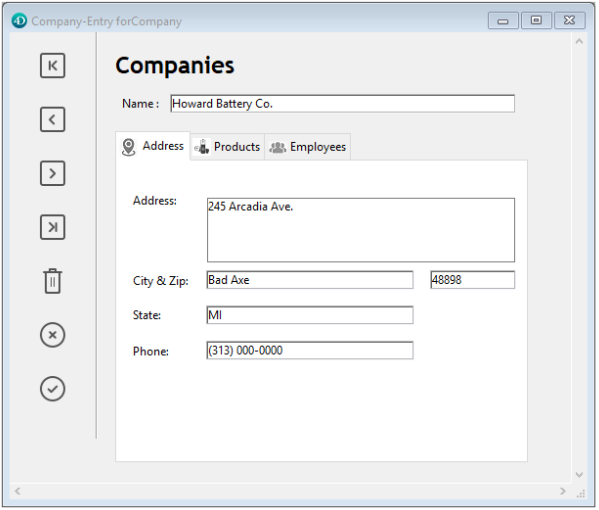

Un onglet crée un objet qui permet à l’utilisateur de choisir entre plusieurs écrans virtuels affichés dans les limites de l’onglet. L’utilisateur accède à chaque écran en cliquant sur l’onglet correspondant.

Le formulaire multi-pages suivant utilise un onglet :


Pour passer d’un écran à l’autre, l’utilisateur clique simplement sur l’onglet correspondant.

Un onglet peut être utilisé, entre autres, pour gérer la navigation entre les pages d’un formulaire multi-pages. Dans ce cas, la commande [FORM GOTO PAGE](https://doc.4d.com/4Dv17R5/4D/17-R5/FORM-GOTO-PAGE.301-4128536.en.html) ou l’action standard `gotoPage` devra être appelée lorsque l’utilisateur cliquera sur l’onglet.

Un onglet peut aussi être utilisé pour contrôler les données qui sont affichées dans un sous-formulaire. On peut, par exemple, implémenter un rolodex à l’aide d’un onglet. Chaque onglet afficherait alors une des lettres de l’alphabet et l’action de l’onglet serait de charger les informations correspondantes à la lettre sur lequel l’utilisateur a cliqué.

Chaque onglet peut afficher des intitulés ou des intitulés et des petites icônes. Si vous placez des icônes, elles apparaissent à gauche de chaque intitulé. Voici un exemple d’onglet qui utilise des icônes :



Lorsque vous créez un onglet, 4D gère l’espacement et le placement des onglets. Vous n’avez à fournir à 4D que les intitulés sous la forme d’un tableau ou les icônes et intitulés sous la forme d’une énumération hiérarchique.

Si l’onglet est assez large, il affiche les intitulés et les icônes. S’il ne peut pas afficher toutes les icônes à la fois, il place des flèches de défilement à droite du dernier onglet visible.   Les flèches de défilement permettent à l’utilisateur de faire défiler des onglets vers la droite ou vers la gauche.

Sous macOS, les onglets peuvent être orientés, en plus de la position standard (en haut), à droite, à gauche ou en bas.

### Exemple JSON

```4d
 "myTab": {
  "type": "tab",
   "left": 60, 
  "top": 160,  
  "width": 100, 
  "height": 20, 
  "labelsPlacement": "bottom" //define the direction
 }
```

## Ajouter les intitulés dans un onglet

Pour placer des intitulés dans un onglet, plusieurs possibilités se présentent à vous :

* Vous pouvez associer à l’onglet [une liste de valeurs](properties_DataSource.md#choice-list-static-list), accessible via une collection (liste statique) ou un pointeur JSON ("$ref") vers une liste json. Les icônes associées à des éléments de liste dans l'éditeur de listes seront affichées dans l'onglet.
* Vous pouvez créer un tableau Texte qui contient les noms de chaque page du formulaire. Le code doit être exécuté avant que le formulaire soit présenté à l’utilisateur. Par exemple, vous pouvez placer ce code dans l’événement formulaire `Sur chargement`.

```4d
 ARRAY TEXT(arrPages;3)
 arrPages{1}:="Name"
 arrPages{2}:="Address"
 arrPages{3}:="Notes"  
```
> Vous pouvez aussi stocker les noms des pages dans une liste hiérarchique et utiliser la commande `Load list` pour charger les valeurs dans le tableau.

## Gérer les onglets par programmation

### Commande FORM GOTO PAGE

Vous pouvez utiliser la commande [FORM GOTO PAGE](https://doc.4d.com/4Dv17R5/4D/17-R5/FORM-GOTO-PAGE.301-4128536.en.html) dans la méthode objet de l’onglet pour naviguer parmi les pages du formulaire :

```4d
FORM GOTO PAGE(arrPages)
```

Cette commande devra être exécutée dans l’événement formulaire `Sur clic`. Il est préférable d’effacer le tableau dans l’événement formulaire `Sur libération`.

Vous pouvez, par exemple, écrire le code suivant :

```4d
 Case of
    :(Form event=On Load)
       LIST TO ARRAY("Tab Labels";arrPages)
    :(Form event=On Clicked)
       FORM GOTO PAGE(arrPages)
    :(Form event=On Unload)
       CLEAR VARIABLE(arrPages)
 End case
```

### Action Goto Page

Lorsque vous associez l’[action standard](properties_Action.md#standard-action) `gotoPage` à un objet de type Onglet, 4D affiche automatiquement la page du formulaire correspondant au numéro de l’onglet sélectionné.

Par exemple, si l’utilisateur clique sur le 3e onglet, 4D affichera la page 3 du formulaire courant (si elle existe).

## Propriétés prises en charge

[Gras](properties_Text.md#bold) - [Bas](properties_CoordinatesAndSizing.md#bottom) - [Combo box](properties_DataSource.md#choice-list-static-list) - [Classe](properties_Object.md#css-class) - [Type d'expression](properties_Object.md#expression-type) - [Police](properties_Text.md#font) - [Taille](properties_Text.md#font-size)  - [Hauteur](properties_CoordinatesAndSizing.md#height) - [Message d'aide](properties_Help.md#help-tip) - [Dim. horizontal](properties_ResizingOptions.md#horizontal-sizing) - [Italique](properties_Text.md#italic) - [Gauche](properties_CoordinatesAndSizing.md#left) - [Nom](properties_Object.md#object-name) - [Droite](properties_CoordinatesAndSizing.md#right) - [Action standard ](properties_Action.md#standard-action) - [Orientation onglets](properties_Appearance.md#tab-control-direction) - [Haut](properties_CoordinatesAndSizing.md#top) - [Type](properties_Object.md#type) - [Souligné](properties_Text.md#underline) - [Dim. vertical](properties_ResizingOptions.md#vertical-sizing) - [Variable ou Expression](properties_Object.md#variable-or-expression) - [Visibilité](properties_Display.md#visibility) - [Largeur](properties_CoordinatesAndSizing.md#width)
