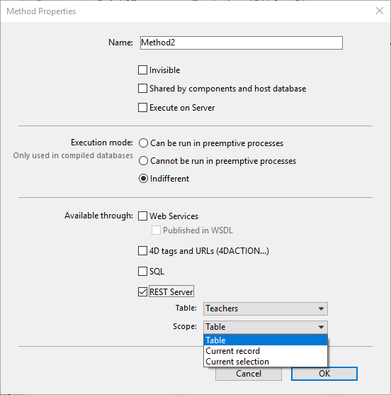

Les noms de dataclass peuvent être utilisés directement dans les requêtes REST pour opérer avec des entités, des sélections d'entités (entity selections) ou des méthodes de la dataclass.

## Syntaxe

| Syntaxe                                                                            | Exemple                     | Description                                                                                             |
| ---------------------------------------------------------------------------------- | --------------------------- | ------------------------------------------------------------------------------------------------------- |
| [**\{dataClass\}**](#dataclass)                                                  | `/Employee`                 | Renvoie toutes les données (par défaut les 100 premières entités) de la dataclass                       |
| [**\{dataClass\}({key})**](#dataclasskey)                                        | `/Employee(22)`             | Renvoie les données de l'entité spécifique définie par la clé primaire de la dataclass                  |
| [**\{dataClass\}:\{attribute\}(value)**](#dataclassattributevalue)             | `/Employee:firstName(John)` | Renvoie les données d'une entité dans laquelle la valeur de l'attribut est définie                      |
| [**\{dataClass\}/\{method\}**](#dataclassmethod-and-dataclasskeymethod)        | `/Employee/getHighSalaries` | Exécute une méthode projet et retourne un objet ou une collection (la méthode projet doit être exposée) |
| [**\{dataClass\}({key})/\{method\}**](#dataclassmethod-and-dataclasskeymethod) | `/Employee(22)/getAge`      | Renvoie une valeur basée sur une méthode d'entité                                                       |

## \{dataClass\}

Renvoie toutes les données (par défaut, les 100 premières entités) pour une dataclass spécifique (par exemple, `Société`)

### Description

Lorsque vous appelez ce paramètre dans votre requête REST, les 100 premières entités sont renvoyées, sauf si vous avez spécifié une valeur à l'aide de [`$top/$limit`]($top_$limit.md).

Voici une description des données retournées :

| Propriété     | Type       | Description                                                                                                                                                                                                             |
| ------------- | ---------- | ----------------------------------------------------------------------------------------------------------------------------------------------------------------------------------------------------------------------- |
| __entityModel | Text       | Nom de la dataclass.                                                                                                                                                                                                    |
| __COUNT       | Number     | Nombre d'entités dans la dataclass.                                                                                                                                                                                     |
| __SENT        | Number     | Nombre d'entités envoyées par la requête REST. Ce nombre peut être le nombre total d'entités s'il est inférieur à la valeur définie par `$top/$limit`.                                                                  |
| __FIRST       | Number     | Numéro d'entité à partir duquel la sélection commence. Soit 0 par défaut soit la valeur définie par `$skip`.                                                                                                            |
| __ENTITIES    | Collection | Cette collection d'objets contient un objet pour chaque entité avec tous ses attributs. Tous les attributs relationnels sont renvoyés en tant qu'objets avec un URI pour obtenir des informations concernant le parent. |

Chaque entité contient les propriétés suivantes :

| Propriété   | Type   | Description                                                                                                                  |
| ----------- | ------ | ---------------------------------------------------------------------------------------------------------------------------- |
| __KEY       | Text   | Valeur de la clé primaire définie pour la dataclass.                                                                         |
| __TIMESTAMP | Date   | Horodatage de la dernière modification de l'entité                                                                           |
| __STAMP     | Number | Tampon interne qui est nécessaire lors de la modification des valeurs de l'entité lors de l'utilisation de `$method=update`. |

If you want to specify which attributes you want to return, define them using the following syntax [{attribute1, attribute2, ...}](manData.md#selecting-attributes-to-get). Par exemple :

 `GET  /rest/Company/name,address`

### Exemple

Retourne toutes les données d'une dataclass spécifique.

 `GET  /rest/Company`

**Résultat** :

````
{
    "__entityModel": "Company",
    "__GlobalStamp": 51,
    "__COUNT": 250,
    "__SENT": 100,
    "__FIRST": 0,
    "__ENTITIES": [
        {
            "__KEY": "1",
            "__TIMESTAMP": "2020-04-10T10:44:49.927Z",
            "__STAMP": 1,
            "ID": 1,
            "name": "Adobe",
            "address": null,
            "city": "San Jose",
            "country": "USA",
            "revenues": 500000,
            "staff": {
                "__deferred": {
                    "uri": "http://127.0.0.1:8081/rest/Company(1)/staff?$expand=staff"
                }
            }
        },
        {
            "__KEY": "2",
            "__TIMESTAMP": "2018-04-25T14:42:18.351Z",
            "__STAMP": 1,
            "ID": 2,
            "name": "Apple",
            "address": null,
            "city": "Cupertino",
            "country": "USA",
            "revenues": 890000,
            "staff": {
                "__deferred": {
                    "uri": "http://127.0.0.1:8081/rest/Company(2)/staff?$expand=staff"
                }
            }
        },
        {
            "__KEY": "3",
            "__TIMESTAMP": "2018-04-23T09:03:49.021Z",
            "__STAMP": 2,
            "ID": 3,
            "name": "4D",
            "address": null,
            "city": "Clichy",
            "country": "France",
            "revenues": 700000,
            "staff": {
                "__deferred": {
                    "uri": "http://127.0.0.1:8081/rest/Company(3)/staff?$expand=staff"
                }
            }
        },
        {
            "__KEY": "4",
            "__TIMESTAMP": "2018-03-28T14:38:07.430Z",
            "__STAMP": 1,
            "ID": 4,
            "name": "Microsoft",
            "address": null,
            "city": "Seattle",
            "country": "USA",
            "revenues": 650000,
            "staff": {
                "__deferred": {
                    "uri": "http://127.0.0.1:8081/rest/Company(4)/staff?$expand=staff"
                }
            }
        }
.....//plus d'entités ici 
    ]
}
````

## \{dataClass\}({key})

Renvoie les données de l'entité spécifique définie par la clé primaire de la dataclass, par exemple, `Company (22) ou Company ("IT0911AB2200")`

### Description

En passant la dataclass et une clé, vous pouvez récupérer toutes les informations publiques de cette entité. En passant la dataclass et une clé, vous pouvez récupérer toutes les informations publiques de cette entité. Pour plus d'informations sur la définition d'une clé primaire, reportez-vous à la section **Modification de la clé primaire** dans **l'éditeur de modèle de données**.


Si vous souhaitez indiquer les attributs à retourner, définissez-les à l'aide de la syntaxe suivante [{attribut1, attribut2, ...}](manData.md##selecting-attributes-to-get). Par exemple :

 `GET  /rest/Company(1)/name,address`

Si vous souhaitez développer un attribut relationnel à l'aide de `$expand`, vous devez l'indiquer comme suit :

 `GET  /rest/Company(1)/name,address,staff?$expand=staff`

### Exemple

La requête suivante retourne toutes les données publiques de la dataclass Company dont la clé est 1.

 `GET  /rest/Company(1)`

**Résultat** :

````
{
    "__entityModel": "Company",
    "__KEY": "1",
    "__TIMESTAMP": "2020-04-10T10:44:49.927Z",
    "__STAMP": 2,
    "ID": 1,
    "name": "Apple",
    "address": Infinite Loop,
    "city": "Cupertino",
    "country": "USA",
    "url": http://www.apple.com,
    "revenues": 500000,
    "staff": {
        "__deferred": {
            "uri": "http://127.0.0.1:8081/rest/Company(1)/staff?$expand=staff"
        }
    }
}
````

## \{dataClass\}:\{attribute\}(value)

Renvoie les données d'une entité dans laquelle la valeur de l'attribut est définie

### Description

En passant la *dataClass* et un *attribut* avec une valeur, vous pouvez récupérer toutes les informations publiques de cette entité. La valeur est une valeur unique pour l'attribut, mais ce n'est pas la clé primaire.

 `GET  /rest/Company:companyCode(Acme001)`

Si vous souhaitez indiquer les attributs à retourner, définissez-les à l'aide de la syntaxe suivante [{attribut1, attribut2, ...}](manData.md##selecting-attributes-to-get). Par exemple :

 `GET  /rest/Company:companyCode(Acme001)/name,address`

Si vous souhaitez utiliser un attribut relationnel à l'aide de [$attributes]($attributes.md), vous devez l'indiquer comme suit :

 `GET  /rest/Company:companyCode(Acme001)?$attributes=name,address,staff.name`

### Exemple

La requête suivante retourne toutes les données publiques de l'employé nommé "Jones".

 `GET  /rest/Employee:lastname(Jones)`

## \{dataClass\}/\{method\} and \{dataClass\}({key})/\{method\}

Retourne un objet ou une collection basée sur une méthode projet.

### Description

Les méthodes projet sont appelées via une dataclass (table) ou une entité (enregistrement) et doivent retourner un objet ou une collection.

`POST  /rest/Employee/getHighSalaries`

`POST  /rest/Employee(52)/getFullName`

### Configuration 4D

Pour être appelée dans une requête REST, une méthode doit :

- avoir été déclarée "Disponible via le serveur REST" dans 4D,
- avoir sa table principale et sa portée définies en conséquence :
  - **Table** : la table 4D (c'est-à-dire dataclass) sur laquelle la méthode est appelée. La table doit être [exposée à REST](configuration.md#exposing-tables-and-fields).
  - **Portée** : Ce paramètre est utile lorsque la méthode utilise le langage classique de 4D et doit donc avoir un contexte de base de données côté serveur.
    - **Table ** - pour les méthodes appliquées à la table entière (dataclass)
    - **Current record** -for methods applied to the current record (entity) using the `\{dataClass\}(key)/{method}` syntax.
    - **Sélection courante** - pour les méthodes appliquées à la sélection courante



### Passer des paramètres à une méthode

Vous pouvez également passer des paramètres à une méthode dans un POST.

`POST  /rest/Employee/addEmployee`

Vous pouvez POSTER des données dans le corps de la requête, par exemple :

["John","Smith"]

### Exemples

#### Portée de la table

Appel d'une méthode `getAverage` :

- sur la table [Employee]
- avec la portée **Table**

```4d
 //getAverage  
ALL RECORDS([Employee])
$0:=New object("ageAverage";Average([Employee]age))
```

`POST  /rest/Employee/getAverage`

Résultat:

```
{
    "result": {
        "ageAverage": 44.125
    }
}
```

#### Portée enregistrement courant

Appel d'une méthode `getFullName` :

- sur la table [Employee]
- avec la portée de **Enregistrement courant**

```4d
 //getFullName  
$0:=New object("fullName";[Employee]firstname+" "+[Employee]lastname)
```

`POST  /rest/Employee(3)/getFullName`

Résultat:

```
{
    "result": {
        "fullName": "John Smith"
    }
}
```

#### Portée de la sélection courante

Appel d'une méthode `updateSalary` :

- sur la table [Employee]
- avec la portée de **Sélection courante**

```4d
 //updateSalary  
C_REAL($1;$vCount)
READ WRITE([Employee])
$vCount:=0
FIRST RECORD([Employee])
While (Not(End selection([Employee]))  
 [Employee]salary:=[Employee]salary * $1
    SAVE RECORD([Employee])
    $vCount:=$vCount+1
    NEXT RECORD([Employee])
End while 
UNLOAD RECORD([Employee])
$0:=New object("updates";$vCount)
```

`POST  /rest/Employee/updateSalary/?$filter="salary<1500"`

POST data (in the request body): [1.5]

Résultat:

```
{
    "result": {
        "updated": 42
    }
}
```
