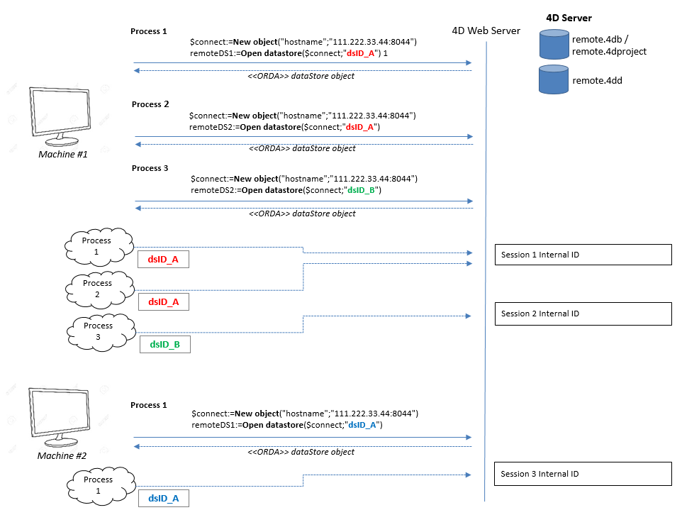

Un [datastore](dsMapping.md#datastore) exposé sur une application 4D Server est accessible simultanément via différents clients :

- Les applications 4D distantes utilisant ORDA pour accéder au datastore principal à l’aide de la commande `ds`. A noter que l'application 4D distante peut toujours accéder à la base de données en mode classique. Ces accès sont gérés par le **serveur d'applications 4D**.
- D'autres applications 4D (4D Remote, 4D Server) ouvrant une session sur le datastore distant via la commande [`Open datastore`](../API/DataStoreClass.md#open-datastore). Ces accès sont transmis par le **serveur HTTP REST**.
- Les requêtes [4D for iOS ou 4D for Android](https://developer.4d.com/go-mobile/) pour la mise à jour des applications mobiles. Ces accès sont remis par le **serveur HTTP**.


## Ouverture des sessions

Lorsque vous travaillez avec un datastore distant référencé par des appels à la commande `Open datastore`, la connexion entre les process qui effectuent la requête et le datastore distant est gérée par des sessions.

Une session est créée sur le datastore distant pour gérer la connexion. Cette session est identifiée à l'aide d'un ID de session interne, associé au `localID` de l'application 4D. Cette session gère automatiquement l'accès aux données, aux sélections d'entités ou aux entités.

Le `localID` est local à la machine qui se connecte au datastore distant, ce qui signifie :

*   Que si d'autres process de la même application doivent accéder au même datastore distant, ils peuvent utiliser le même `localID` et partager alors la même session.
*   Que si un autre process de la même application ouvre le même datastore distant, mais avec un autre `localID`, il créera une nouvelle session sur le datastore distant.
*   Que si un autre poste se connecte au même datastore distant avec le même `localID`, il créera une autre session avec un autre cookie.

Ces principes sont illustrés dans les graphiques suivants :



> Pour les sessions ouvertes par des requêtes REST, veuillez consulter la page [Utilisateurs et sessions](REST/authUsers.md).

### Visionnage des sessions

Les process qui gèrent les sessions d'accès aux datastore apparaissent dans la fenêtre d'administration de 4D Server :

*   name: "REST Handler: \<process name\>"
*   type : type Worker Server HTTP
*   session : le nom de session est le nom d'utilisateur passé à la commande `Open datastore`.

Dans l'exemple suivant, deux process sont en cours d'exécution pour la même session :


### Verrouillage et transactions

Les fonctionnalités ORDA relatives au verrouillage d'entité et aux transactions sont gérées au niveau du process dans les datastore distants, tout comme en mode client/serveur ORDA :

*   Si un process verrouille une entité à partir d'un datastore distant, l'entité est verrouillée pour tous les autres process, même lorsque ces process partagent la même session (voir [Verrouillage d'entités](entities.md#entity-locking)). Si plusieurs entités pointant vers le même enregistrement ont été verrouillées dans un process, elles doivent toutes être déverrouillées dans le process pour supprimer le verrou. Si un verrou a été mis sur une entité, il est supprimé lorsqu'il n'existe plus de référence à cette entité en mémoire.
*   Les transactions peuvent être lancées, validées ou annulées séparément sur chaque datastore distant à l'aide des méthodes `dataStore.startTransaction( )`, `dataStore.cancelTransaction( )`, et `dataStore.validateTransaction( )`. Elles n’ont pas d’incidences sur les autres datastore.
*   Les commandes classiques du langage 4D (`START TRANSACTION`, `VALIDATE TRANSACTION`, `CANCEL TRANSACTION`) s'appliquent uniquement au datastore principal (renvoyé par `ds`). Si une entité d'un datastore distant est verrouillée par une transaction dans un process, les autres process ne peuvent pas la mettre à jour, même si ces process partagent la même session.
*   Les verrous sur les entités sont supprimés et les transactions sont annulées :
    *   quand le processus est tué.
    *   quand la session est fermée sur le serveur
    *   lorsque la session est arrêtée à partir de la fenêtre d’administration du serveur.

### Fermeture des sessions

Une session est automatiquement fermée par 4D lorsqu'il n'y a pas eu d'activité durant son timeout. Le timeout par défaut est de 60 mn mais cette valeur peut être paramétrée à l'aide du paramètre *connectionInfo* de la commande `Open datastore`.

Si une demande est envoyée au datastore distant après la fermeture de la session, elle est automatiquement recréée si possible (licence disponible, serveur non arrêté, etc.). A noter cependant que le contexte de la session des verrous et des transactions est perdu (voir ci-dessus).

## Optimisation client/serveur

4D optimise automatiquement les requêtes ORDA qui utilisent des entity selections ou qui chargent des entités dans des configurations client/serveur (datastore accessible à distance à l'aide de `ds` ou de `Open datastore`). Ces optimisations accélèrent l'exécution de votre application 4D en réduisant drastiquement le volume d'informations transmises sur le réseau. Elles incluent :
* le **contexte d'optimisation**
* le **cache ORDA**

### Contexte

Le contexte d'optimisation est fondé sur ce qui suit :

* Lorsqu'un client demande une sélection d'entité au serveur, 4D "apprend" automatiquement attributs de la sélection d'entité sont réellement utilisés côté client lors de l'exécution du code, et génère un "contexte d'optimisation" correspondant. Ce contexte est relié à la sélection d'entité et stocke les attributs utilisés. Il sera mis à jour dynamiquement si d'autres attributs sont utilisés par la suite. Les méthodes et fonctions suivantes déclenchent la phase d'apprentissage :
  * [`Create entity selection`](../API/EntitySelectionClass.md#create-entity-selection)
  * [`dataClass.fromCollection()`](../API/DataClassClass.md#fromcollection)
  * [`dataClass.all()`](../API/DataClassClass.md#all)
  * [`dataClass.get()`](../API/DataClassClass.md#get)
  * [`dataClass.query()`](../API/DataClassClass.md#query)
  * [`entitySelection.query()`](../API/EntitySelectionClass.md#query)

* Les requêtes ultérieures envoyées au serveur sur la même sélection d'entité réutilisent automatiquement le contexte d'optimisation et lisent uniquement les attributs nécessaires depuis le serveur, ce qui accélère le traitement. Par exemple, dans une [list box de type entity selection](#entity-selection-based-list-box), la phase d'apprentissage a lieu pendant l'affichage de la première ligne. L'affichage des lignes suivantes est optimisé. Les fonctions suivantes associent automatiquement le contexte d'optimisation de l'entity selection d'origine à l'entity selection retournée :
    *   [`entitySelection.and()`](../API/EntitySelectionClass.md#and)
    *   [`entitySelection.minus()`](../API/EntitySelectionClass.md#minus)
    *   [`entitySelection.or()`](../API/EntitySelectionClass.md#or)
    *   [`entitySelection.orderBy()`](../API/EntitySelectionClass.md#orderBy)
    *   [`entitySelection.slice()`](../API/EntitySelectionClass.md#slice)
    *   [`entitySelection.drop()`](../API/EntitySelectionClass.md#drop)

* Un contexte d'optimisation existant peut être passé en tant que propriété à une autre sélection d'entité de la même dataclass, ce qui permet d'éviter la phase d'apprentissage et d'accélérer l'application (voir [Utilisation de la propriété context](#reusing-the-context-property) ci-dessous).

* Vous pouvez créer des contextes d'optimisation manuellement à l'aide de la fonction [`dataStore.setRemoteContextInfo()`](../API/DataStoreClass.md#setremotecontextinfo) (voir [Préconfiguration des contextes](#preconfiguring-contexts)).


#### Exemple

Considérons le code suivant :

```4d
 $sel:=$ds.Employee.query("firstname = ab@")
 For each($e;$sel)
    $s:=$e.firstname+" "+$e.lastname+" works for "+$e.employer.name // $e.employer renvoie à la table Company 
 End for each
```

Grâce à l'optimisation, cette requête récupérera uniquement les données des attributs utilisés (prénom, nom, employeur, employeur.name) dans *$sel* à partir de la deuxième itération de la boucle.

#### Réutiliser la propriété context

Vous pouvez tirer un meilleur parti de l'optimisation en utilisant la propriété **context**. Cette propriété référence un contexte d'optimisation "appris" pour une sélection d'entités. Elle peut être passée comme paramètre aux fonctions ORDA qui retournent de nouvelles sélections d'entités, afin que les sélections d'entités demandent directement au serveur les attributs utilisés, sans passer par la phase d'apprentissage.
> Vous pouvez également créer des contextes à l'aide de la fonction [`.setRemoteContextInfo()`](../API/DataStoreClass.md#setremotecontextinfo).

All ORDA functions that handle entity selections support the **context** property (for example [`dataClass.query()`](../API/DataClassClass.md#query) or [`dataClass.all()`](../API/DataClassClass.md#all)). The same optimization context property can be passed to unlimited number of entity selections on the same dataclass. Il est toutefois important de garder à l'esprit qu'un contexte est automatiquement mis à jour lorsque de nouveaux attributs sont utilisés dans d'autres parties du code. Si le même contexte est réutilisé dans différents codes, il risque d'être surchargé et de perdre en efficacité.
> A similar mechanism is implemented for entities that are loaded, so that only used attributes are requested (see the [`dataClass.get()`](../API/DataClassClass.md#get) function).

**Exemple avec `dataClass.query()`:**

```4d
 var $sel1; $sel2; $sel3; $sel4; $querysettings; $querysettings2 : Object
 var $data : Collection
 $querysettings:=New object("context";"shortList")
 $querysettings2:=New object("context";"longList")

 $sel1:=ds.Employee.query("lastname = S@";$querysettings)
 $data:=extractData($sel1) // In extractData method an optimization is triggered   
 // and associated to context "shortList"

 $sel2:=ds.Employee.query("lastname = Sm@";$querysettings)
 $data:=extractData($sel2) // In extractData method the optimization associated   
 // to context "shortList" is applied

 $sel3:=ds.Employee.query("lastname = Smith";$querysettings2)
 $data:=extractDetailedData($sel3) // In extractDetailedData method an optimization  
 // is triggered and associated to context "longList"

 $sel4:=ds.Employee.query("lastname = Brown";$querysettings2)
 $data:=extractDetailedData($sel4) // In extractDetailedData method the optimization  
 // associated to context "longList" is applied
```

#### Listbox basée sur une sélection d'entités

L'optimisation d'une sélection d'entités s'applique automatiquement aux listbox basées sur une sélection d'entités dans les configurations client/serveur, au moment d'afficher et de dérouler le contenu d'une listbox : seuls les attributs affichés dans la listbox sont demandés depuis le serveur.

Un contexte spécifique nommé "mode page" est également proposé lorsque l'entité courante de la sélection est chargée à l'aide de l'expression **élément courant** de la listbox (voir [List box de type collection ou entity selection](FormObjects/listbox_overview.md#list-box-types)). Cette fonctionnalité vous permet de ne pas surcharger le contexte initial de la listbox dans ce cas précis, notamment si la "page" requiert des attributs supplémentaires. A noter que seule l'utilisation de l'expression **Élément courant** permettra de créer/utiliser le contexte de la page (l'accès via `entitySelection[index]` modifiera le contexte de la sélection d'entité).

Subsequent requests to server sent by entity browsing functions will also support this optimization. The following functions automatically associate the optimization context of the source entity to the returned entity:

*   [`entity.next()`](../API/EntityClass.md#next)
*   [`entity.first()`](../API/EntityClass.md#first)
*   [`entity.last()`](../API/EntityClass.md#last)
*   [`entity.previous()`](../API/EntityClass.md#previous)

Par exemple, le code suivant charge l'entité sélectionnée et permet de naviguer dans la sélection d'entités. Les entités sont chargées dans un contexte séparé et le contexte initial de la listbox demeure inchangé :

```4d
 $myEntity:=Form.currentElement //expression de l'élément courant 
  //... faire quelque chose
 $myEntity:=$myEntity.next() //charge la prochaine entité à l'aide du même contexte
```

#### Preconfiguring contexts

An optimization context should be defined for every feature or algorithm of your application, in order to have the best performances. For example, a context can be used for queries on customers, another context for queries on products, etc.

If you want to deliver final applications with the highest level of optimization, you can preconfigure your contexts and thus save learning phases by following these steps:

1. Design your algorithms.
2. Run your application and let the automatic learning mechanism fill the optimization contexts.
3. Call the [`dataStore.getRemoteContextInfo()`](../API/DataStoreClass.md#getremotecontextinfo) or [`dataStore.getAllRemoteContexts()`](../API/DataStoreClass.md#getallremotecontexts) function to collect  contexts. You can use the [`entitySelection.getRemoteContextAttributes()`](../API/EntitySelectionClass.md#getremotecontextattributes) and [`entity.getRemoteContextAttributes()`](../API/EntityClass.md#getremotecontextattributes) functions to analyse how your algorithms use attributes.
4. In the final step, call the [`dataStore.setRemoteContextInfo()`](../API/DataStoreClass.md#setremotecontextinfo) function to build contexts at application startup and [use them](#reusing-the-context-property) in your algorithms.


### ORDA cache

For optimization reasons, data requested from the server via ORDA is loaded in the ORDA remote cache (which is different from the 4D cache). The ORDA cache is organized by dataclass, and expires after 30 seconds.

The data contained in the cache is considered as expired when the timeout is reached. Any access to expired data will send a request to the server. Expired data remains in the cache until space is needed.

By default, the ORDA cache is transparently handled by 4D. However, you can control its contents using the following ORDA class functions:

* [dataClass.setRemoteCacheSettings()](../API/DataClassClass.md#setremotecachesettings)
* [dataClass.getRemoteCache()](../API/DataClassClass.md#getremotecache)
* [dataClass.clearRemoteCache()](../API/DataClassClass.md#clearremotecache)