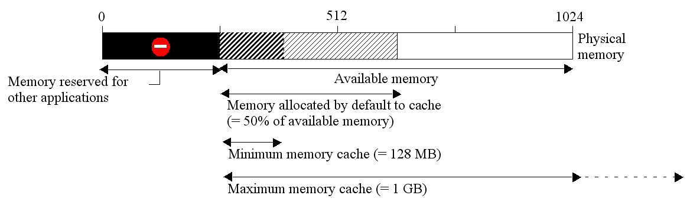

## Page Stockage de données

Cette page vous permet de paramétrer le stockage des données de la base 4D sur le disque.

### Paramètres généraux

#### Autoriser l'ouverture du fichier de données en lecture seule

Cette option permet de paramétrer le fonctionnement de l’application en cas d’ouverture d’un fichier de données verrouillé au niveau du système d’exploitation. 4D intègre un dispositif permettant d’empêcher automatiquement l’ouverture d’une base lorsque son fichier de données ou l’un de ses segments est verrouillé. Dans ce cas, lorsque la détection est activée, 4D affiche un message d’alerte et la base quitte :

Lorsque l’option n’est pas cochée, il n’est pas possible d’ouvrir la base avec un fichier de données verrouillé (fonctionnement par défaut pour les bases 4D).

#### A propos du verrouillage des fichiers

Les fichiers verrouillés peuvent être lus mais leur contenu ne peut pas être modifié. Par exemple, les fichiers sont verrouillés lorsqu’ils sont stockés sur un support non réinscriptible (type DVD) ou lorsqu’ils sont recopiés depuis un tel support. 4D peut travailler de manière transparente avec des fichiers de données verrouillés, ce qui permet notamment d’exploiter des bases en lecture sur DVD. Toutefois, ce fonctionnement induit le risque d’utilisation involontaire d’un fichier de données verrouillé dans lequel les modifications ne seront pas sauvegardées. C’est la raison pour laquelle par défaut 4D n’autorise pas l’ouverture des bases avec un fichier de données verrouillé.

### Emplacement du dossier temporaire

Cette zone vous permet de modifier l’emplacement des fichiers temporaires créés lors de l’exécution de 4D. Le dossier des fichiers temporaires est utilisé par l’application, en cas de nécessité, pour écrire provisoirement sur disque des données se trouvant en mémoire.

L’emplacement courant de ce dossier est affiché dans la zone “Actuel :”. Vous pouvez cliquer dans cette zone pour faire apparaître le chemin d’accès sous forme de pop up menu :

Trois options d’emplacement sont proposées :

-   **Système **: Lorsque cette option est sélectionnée, les fichiers temporaires 4D sont créés dans un dossier situé à l’emplacement spécifié par Windows ou macOS. Vous pouvez lire l’emplacement courant défini par votre système à l’aide de la commande [`Temporary folder`](https://doc.4d.com/4dv19/help/command/en/page486.html). Les fichiers sont placés dans un sous-dossier dont le nom est construit à partir du nom de la base et d’un identifiant unique.
-   **Dossier du fichier de données** (option par défaut) : Lorsque cette option est sélectionnée, les fichiers temporaires 4D sont créés dans un dossier nommé “temporary files” situé au même niveau que le fichier de données de la base.
-   **Défini par l’utilisateur** : Cette option permet de définir un emplacement personnalisé. En cas de modification de cette option, sa prise en compte nécessitera le redémarrage de la base. 4D vérifie que le dossier sélectionné est accessible en écriture. Si ce n’est pas le cas, l’application essaiera les autres options jusqu’à ce qu’un dossier valide soit trouvé.

> Cette option est stockée dans les propriétés additionnelles (“extra properties”) de la structure, accessibles lors de l’exportation xml de la définition de structure (voir [Exporter et importer des définitions de structure](https://doc.4d.com/4Dv19/4D/19/Exporter-et-importer-des-definitions-de-structure.300-5416829.fe.html)).

### Comparaison de texte

> Si vous modifiez ces options, vous devez quitter et rouvrir la base afin que la modification soit prise en compte. A la réouverture, une réindexation automatique est effectuée sur tous les index de la base.

-   **Considérer @ comme joker uniquement au début et à la fin des chaînes de caractères** : cette option vous permet de définir la manière dont 4D doit évaluer le caractère @ (arobase) lors des recherches ou des comparaisons de chaînes de caractères, lorsqu’il se trouve au sein d’un mot. Lorsque l’option n’est pas cochée (valeur par défaut), le caractère @ est considéré comme un “joker”, c’est-à-dire un remplaçant de tout caractère (voir [Joker de recherche (@)](https://doc.4d.com/4Dv19/4D/19/Editeur-de-recherches.300-5416813.fe.html#463876)).

    Lorsque l’option est cochée, le caractère @ est considéré comme un simple caractère s’il se trouve au milieu d’un mot. Cette possibilité est particulièrement utile pour les bases de données stockant des adresses e-mail (qui se présentent sous la forme “nom@fournisseur.xx”). Cette option influe sur les recherches, les tris et les comparaisons de chaînes de caractères, pour les données stockées dans les tables ou en mémoire (tableaux). Sont concernés les champs alpha (indexés ou non) et texte ainsi que les variables alpha et texte.

     **Notes :**
    -   En ce qui concerne les recherches, il est important de noter que si le critère de recherche commence ou se termine par @, le caractère @ est toujours considéré comme un joker. Seul le fait que ce caractère soit placé à l’intérieur d’un mot (exemple : bill@cgi.com) entraîne un traitement différent de la part de 4D.
    -   Cette option influe également sur le comportement des commandes du langage du thème [Objets (Formulaires)](https://doc.4d.com/4Dv19/4D/19.1/Objets-Formulaires.201-5652667.fe.html), qui acceptent le caractère @ dans leur paramètre objet.
    -   Pour des raisons de sécurité, seuls l’Administrateur et le Super_Utilisateur de la base peuvent modifier ce paramètre.

-   **Langue du fichier de données courant :** cette option permet de paramétrer la langue utilisée pour le traitement et la comparaison des chaînes de caractères pour la base de données ouverte. Le choix d’une langue de comparaison influe sur le tri et la recherche des textes ainsi que le passage en minuscules/majuscules mais n’a pas d’incidence sur la traduction des libellés ou sur les formats de dates, d’heure ou monétaires qui restent, eux, dans la langue du système. Par défaut, 4D utilise la langue du système.

    Un projet 4D peut ainsi fonctionner dans une langue différente de celle du système. A l’ouverture d’un projet, le moteur de 4D détecte la langue utilisée par le fichier de données et la fournit au langage (interpréteur ou mode compilé). Les comparaisons de texte, qu’elles soient effectuées par le moteur de base de données ou par le langage, sont donc toujours effectuées dans la même langue.

    > Il est possible de modifier ce paramètre dans les Préférences de l'application (voir [Page General](../Preferences/general.md)). Dans ce cas, il s'applique à toutes les nouvelles bases créées par 4D.

-   **N'utiliser que les caractères non alphanumériques pour les mots-clés ** : cette option modifie l'algorithme utilisé par 4D pour identifier les séparateurs de mots-clés et donc construire les index de mots-clés. Par défaut, lorsque cette option n'est pas cochée, 4D utilise un algorithme sophistiqué tenant compte des spécificités linguistiques.

    Cet algorithme est semblable à celui utilisé de façon standard par les logiciels de traitement de texte pour déterminer les limites d'une sélection en cas de double-clic dans un mot. Pour plus d’informations sur cet algorithme, reportez-vous à l'adresse `http://userguide.icu-project.org/boundaryanalysis`.

    Lorsque cette option est cochée, 4D utilise un algorithme simplifié. Dans cette configuration, tout caractère non alphanumérique (c'est-à-dire qui n'est ni une lettre ni un chiffre) est considéré comme séparateur de mot-clé. Ce paramétrage répond à des besoins spécifiques associés à certaines langues telles que le japonais.

-   **Ordre de tri approprié pour la recherche** : Cette option s'affiche uniquement lorsque la langue japonaise est sélectionnée. Elle modifie l'interprétation de caractères tels que "Marques Katakana-Hiragana de son prolongé" ou "長音記号" ou les "Marques d'itération japonaises" telles que "ゝ" ou "ゞ". Un locuteur japonais préférera les résultats issus d'une recherche effectuée lorsque le paramètre est activé.

#### Prise en charge de Mecab (version japonaise)

En système japonais, 4D prend en charge la librairie *MeCab*, comportant un algorithme d’indexation des mots-clés particulièrement adapté à la langue japonaise.

Cet algorithme est utilisé par défaut dans les versions japonaises de 4D. Si vous le souhaitez, vous pouvez désactiver l’utilisation de l’algorithme *MeCab*et utiliser la librairie classique *ICU*.

Pour désactiver *MeCab*, il vous suffit de cocher l’option **N’utiliser que les caractères non alphanumériques pour les mots-clés** :

## Page Mémoire

Utilisez les paramètres de cet onglet pour configurer la mémoire cache de la base.

### Paramètres du cache pour la base

-   **Calcul du cache adaptatif** : Lorsque cette option est cochée, la gestion de la mémoire cache est assurée dynamiquement par le système — dans des limites que vous définissez. Ce principe permet de configurer une mémoire cache performante, adaptée à la plupart des configurations. La taille du cache est alors calculée dynamiquement en fonction des paramétrages définis. Les valeurs proposées par défaut correspondent à une utilisation standard de 4D.

    -   **Mémoire à réserver pour le système et les autres applications**: partie de la mémoire RAM à réserver au Système et aux autres applications. Cette valeur peut être augmentée à des fins d’optimisation lorsque d’autres applications consommatrices de mémoire tournent sur le même poste que 4D.
    -   **Percentage of available memory used for cache**: Percentage of the remaining memory allocated to the cache by default.\
      To obtain the size allocated by default to the cache, simply perform the following calculation: (Physical memory -- Physical memory to be reserved) X Percentage of the memory used for the cache. Dans le mode adaptatif, la taille de mémoire cache varie dynamiquement en fonction des besoins de l’application et du système. Vous pouvez fixer les bornes de ces variations à l’aide des deux options suivantes :
    -   **Taille minimale** : Quantité minimale de mémoire devant être réservée pour le cache. Cette valeur ne peut être inférieure à 100 Mo.
    -   **Taille maximale** : Quantité maximale de mémoire pouvant être utilisée par le cache. Cette valeur est virtuellement illimitée.\  
      La définition de bornes est utile dans le cadre des bases diffusées sur des machines dont vous ne connaissez pas a priori la configuration mémoire. Dans ce cas, les bornes vous permettent de garantir des performances minimales dans tous les cas. Le schéma suivant illustre ce fonctionnement :

    Example for calculating cache memory: *Physical memory to reserve = 256 MB Percentage of the available memory used for the cache = 50% Maximum size = 1 GB Minimum size = 128 MB*

    

-   **Calcul du cache adaptatif non cochée** :  dans ce mode, vous définissez vous-même la taille de la mémoire cache pour la base. 4D affiche alors une zone de saisie permettant de définir la mémoire cache à utiliser ainsi que les informations relatives à la mémoire physique (mémoire RAM disponible sur la machine), le cache actuel et le cache après redémarrage (tenant compte de vos modifications).

    La taille de mémoire cache que vous saisissez sera réservée pour la base 4D, quel que soit l’état des ressources de la machine. Ce paramétrage peut être utilisé dans certaines configurations spécifiques, ou lorsque la base est destinée à fonctionner sur des systèmes disparates en termes de mémoire. Dans la plupart des cas, le cache adaptatif est plus performant.

-   **Ecriture cache toutes les… Minutes/secondes** : spécifie la fréquence de sauvegarde automatique du cache de données, c’est-à-dire son écriture sur le disque. 4D écrit les données placées dans le cache à intervalles fixes. Vous pouvez définir tout intervalle compris entre 1 seconde et 500 minutes. Par défaut, 4D stocke vos données toutes les 20 secondes. L’application écrit aussi vos données sur disque lorsque vous changez de mode ou quittez l’application. Vous pouve aussi appeler la commande [FLUSH CACHE](https://doc.4d.com/4dv19/help/command/en/page297.html) pour déclencher l'écriture du cache à tout moment.

    Quand vous prévoyez de saisir beaucoup de données, il est souhaitable de fixer un intervalle court. En effet, en cas de coupure de courant, vous ne perdriez que les données saisies depuis la dernière écriture (si la base fonctionne sans fichier d’historique).

    Si chaque opération d’écriture du cache est accompagnée d’un fort ralentissement de la base de données, il faut ajuster la fréquence. Ce symptôme signifie une sauvegarde massive d’enregistrements. Dans ce cas, une fréquence d’écriture plus élevée, donc plus rapide, est plus efficace.

    Par défaut, 4D affiche une petite fenêtre lors de l'écriture du cache. Si vous ne voulez pas ce rappel visuel, vous pouvez désélectionner l'option **Ecriture du cache** dans la [Page Interface](./interface.md).