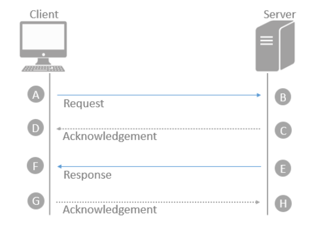

Les applications 4D peuvent générer divers fichiers journaux (ou "logs") qui sont utiles pour le débogage ou l'optimisation de leur exécution. Les fichiers d'historique sont généralement démarrés ou arrêtés via des sélecteurs des commandes [SET DATABASE PARAMETER](https://doc.4d.com/4dv19/help/command/en/page642.html) ou [WEB SET OPTION](https://doc.4d.com/4dv19/help/command/en/page1210.html) et sont stockés dans le dossier [Logs](Project/architecture.md#logs) du projet.

Les informations stockées dans les journaux doivent être analysées pour détecter et corriger les problèmes. Cette section fournit une description complète des fichiers journaux suivants :

* [4DRequestsLog.txt](#4drequestslogtxt)
* [4DRequestsLog_ProcessInfo.txt](l#4drequestslog_processinfotxt)
* [HTTPDebugLog.txt](#httpdebuglogtxt)
* 4DDebugLog.txt ([standard](#4ddebuglogtxt-standard) & [tabular](#4ddebuglogtxt-tabular))
* [4DDiagnosticLog.txt](#4ddiagnosticlogtxt)
* [4DIMAPLog.txt](#4dsmtplogtxt-4dpop3logtxt-and-4dimaplogtxt)
* [4DPOP3Log.txt](#4dsmtplogtxt-4dpop3logtxt-and-4dimaplogtxt)
* [4DSMTPLog.txt](#4dsmtplogtxt-4dpop3logtxt-and-4dimaplogtxt)
* [Fichier d'historique des requêtes ORDA clientes](#orda-client-requests)

Lorsqu'un fichier d'historique peut être généré soit sur 4D Server, soit sur le client distant, le mot "Server" est ajouté au nom du fichier d'historique côté serveur, par exemple " 4DRequestsLogServer.txt"

Les fichiers journaux partagent certains champs, ce qui vous permet d'établir une chronologie et de faire des connexions entre les entrées lors du débogage :

* `sequence_number` : ce numéro est unique parmi tous les fichiers journaux de débogage et est incrémenté à chaque nouvelle entrée, quel que soit le fichier journal, de manière à ce que vous puissiez connaître la séquence exacte des opérations.
* `connection_uuid` : pour chaque process 4D créé sur un client 4D qui se connecte au serveur, cet UUID de connexion est stocké à la fois côté serveur et client. Il vous permet d'identifier facilement le client distant qui a lancé le process.

## 4DRequestsLog.txt

Ce fichier de log enregistre les requêtes standard envoyées par la machine du 4D Server, ou la machine à distance qui a exécuté la commande (hors requêtes web).

Pour lancer ce journal :

* sur le serveur :

```4d
SET DATABASE PARAMETER(4D Server log recording;1)
//côté serveur
```

* sur le client :

```4d
SET DATABASE PARAMETER(Client Log Recording;1)
//côté distant
```
> Cette instruction démarre également le fichier [4DRequestsLog_ProcessInfo.txt](#4drequestslog_processinfotxt).

#### En-têtes

Ce fichier commence avec les en-têtes suivants :

* Log Session Identifier (Identifiant de session d'historique)
* Nom du serveur qui héberge l'application
* User Login Name : Nom de l'utilisateur (défini dans l'OS) qui a exécuté l'application 4D sur le serveur.

#### Contenu

Pour chaque requête, les champs suivants sont enregistrés :

| Noms des champs                            | Description                                                                                                                                                                                                                                        |
| ------------------------------------------ | -------------------------------------------------------------------------------------------------------------------------------------------------------------------------------------------------------------------------------------------------- |
| sequence_number                            | Numéro d'opération séquentiel et unique dans la session de log                                                                                                                                                                                     |
| time                                       | Date et heure au format ISO 8601 : 'YYYY-MM-DDTHH:MM:SS.mmm'                                                                                                                                                                                       |
| systemid                                   | ID système                                                                                                                                                                                                                                         |
| component                                  | Signature du composant (par exemple '4SQLS' ou 'dbmg')                                                                                                                                                                                             |
| process\_info_                           | index Correspond au champ "index" dans le journal 4DRequestsLog_ProcessInfo.txt et permet de relier une requête à un process.                                                                                                                      |
| request                                    | ID de requête en mode distant chaîne de message pour les requêtes SQL ou messages `LOG EVENT`                                                                                                                                                      |
| bytes_in                                   | Nombre d'octets reçus                                                                                                                                                                                                                              |
| bytes_out                                  | Nombre d'octets envoyés                                                                                                                                                                                                                            |
| server\_duration &#124; exec\_duration | Dépend de l'endroit où l'historique est généré :<li>*server\_duration* lorsqu'il est généré sur le client --Temps en microsecondes pris par le serveur pour traiter la requête et retourner une réponse. Correspond au chemin B vers F dans l'image ci-dessous, OU</li><li>*exec\_duration* lorsqu'il est généré sur le serveur --Temps en microsecondes pris par le serveur pour traiter la requête. Correspond au chemin B vers F dans l'image ci-dessous.</li>                                                                                                                                                 |
| write\_duration                          | Temps en microsecondes pour envoyer :<li>La requête (lorsqu'elle est exécutée sur le client). Correspond au chemin A vers B dans l'image ci-dessous.</li><li>La réponse (lorsqu'elle est exécutée sur le serveur). Correspond au chemin E vers F dans l'image ci-dessous.</li>                                                                                                                                                            |
| task_kind                                  | Préemptif ou coopératif (respectivement 'p' ou 'c')                                                                                                                                                                                                |
| rtt                                        | Temps en microsecondes pris par le client pour envoyer la requête et pour qu'elle soit reçue par le serveur. Correspond respectivement aux chemins A vers D et E vers H dans l'image ci-dessous.<li>Mesuré uniquement lorsque la couche réseau ServerNet est utilisée, retourne 0 lorsque l'ancienne couche réseau est utilisée.</li><li>Dans les versions antérieures à Windows 10 ou à Windows Server 2016, l'appel retournera la valeur 0.</li> |

Acheminement de la requête :



## 4DRequestsLog_ProcessInfo.txt

Ce fichier de log enregistre des informations sur chaque process créé sur la machine du 4D Server, ou la machine à distance qui a exécuté la commande (requêtes web exclues).

Pour lancer ce journal :

* sur le serveur :

```4d
SET DATABASE PARAMETER(4D Server log recording;1) //côté serveur
```

* sur le client :

```4d
SET DATABASE PARAMETER(Client Log Recording;1) //côté distant
```
> Cette déclaration démarre également l'historique du fichier [4DRequestsLog.txt](#4drequestslogtxt).

#### En-têtes

Ce fichier commence avec les en-têtes suivants :

* Log Session Identifier (Identifiant de session d'historique)
* Nom du serveur qui héberge l'application
* User Login Name : Nom de l'utilisateur (défini dans l'OS) qui a exécuté l'application 4D sur le serveur.

#### Contenu

Pour chaque process, les champs suivants sont enregistrés :

| Noms des champs                   | Description                                                    |
| --------------------------------- | -------------------------------------------------------------- |
| sequence_number                   | Numéro d'opération séquentiel et unique dans la session de log |
| time                              | Date et heure au format ISO 8601 : "YYYY-MM-DDTHH:MM:SS.mmm"   |
| process\_info_index             | Numéro de process séquentiel et unique                         |
| CDB4DBaseContext                  | UUID du contexte de base du composant DB4D                     |
| systemid                          | ID système                                                     |
| server\_process\_id           | ID du process sur le serveur                                   |
| remote\_process\_id           | ID du process sur le client                                    |
| process\_name                   | Nom du process                                                 |
| cID                               | Identifiant de la connexion 4D                                 |
| uID                               | Identifiant du client 4D                                       |
| IP Client                         | Addresse IPv4/IPv6 du client                                   |
| host_name                         | Nom d'hôte du client                                           |
| user_name                         | Nom de connexion utilisateur sur le client                     |
| connection\_uuid                | Identifiant UUID de process de connexion                       |
| server\_process\_unique\_id | ID unique du process sur le serveur                            |

## HTTPDebugLog.txt

Ce fichier journal enregistre chaque requête HTTP et chaque réponse en mode brut (raw). Les requêtes sont enregistrées dans leur totalité (en-têtes compris). Les parties body peuvent également être enregistrées.

Pour lancer ce journal :

```4d
WEB SET OPTION(Web debug log;wdl enable without body)  
//d'autres valeurs sont disponibles
```

Les champs suivants sont enregistrés pour Requête et Réponse :

| Noms des champs | Description                                                       |
| --------------- | ----------------------------------------------------------------- |
| SocketID        | ID du socket utilisé pour la communication                        |
| PeerIP          | Adresse IPv4 de l'hôte (client)                                   |
| PeerPort        | Port utilisé par l'hôte (client)                                  |
| TimeStamp       | Horodatage en millisecondes (depuis le démarrage du système)      |
| ConnectionID    | Connexion UUID (UUID du VTCPSocket utilisé pour la communication) |
| SequenceNumber  | Numéro d'opération séquentiel et unique dans la session de log    |

## 4DDebugLog.txt (standard)

Ce fichier journal enregistre chaque évènement qui a lieu au niveau de la programmation 4D. Le mode standard offre une vue d'ensemble des évènements.

Pour lancer ce journal :

```4d
SET DATABASE PARAMETER(Debug Log Recording;2)  
//standard, tous les process

SET DATABASE PARAMETER(Current process debug log recording;2)  
//standard, process courant uniquement
```

Les champs suivants sont enregistrés pour chaque évènement :

| Colonne # | Description                                                                                                                      |
| --------- | -------------------------------------------------------------------------------------------------------------------------------- |
| 1         | Numéro d'opération séquentiel et unique dans la session de log                                                                   |
| 2         | Date et heure au format ISO 8601 (YYYY-MM-DDThh:mm:ss.mmm)                                                                       |
| 3         | ID process (p=xx) et ID unique process (puid=xx)                                                                                 |
| 4         | Niveau de stack (pile)                                                                                                           |
| 5         | Peut être Nom de commande / Nom de méthode / Message / Info Start Stop task / Nom, événement ou callback plugin / UUID connexion |
| 6         | Durée de l'opération de connexion en millisecondes (différent 2e colonne)                                                        |

## 4DDebugLog.txt (tabulé)

Ce fichier de logs enregistre chaque évènement au niveau de la programmation 4D sous un format compact avec des tabulations, qui inclut des informations supplémentaires par rapport au format standard.

Pour lancer ce journal :

```4d
SET DATABASE PARAMETER(Debug Log Recording;2+4)  
//format tabulé étendu, tous les process

SET DATABASE PARAMETER(Current process debug log recording;2+4)  
//étendu, process courant uniquement
```

Les champs suivants sont enregistrés pour chaque évènement :

| Colonne # | Noms des champs                 | Description                                                                                                                                                                                                                                                                                                                                                                                                                                                                                                                                                                                                                                                                                              |
| --------- | ------------------------------- | -------------------------------------------------------------------------------------------------------------------------------------------------------------------------------------------------------------------------------------------------------------------------------------------------------------------------------------------------------------------------------------------------------------------------------------------------------------------------------------------------------------------------------------------------------------------------------------------------------------------------------------------------------------------------------------------------------- |
| 1         | sequence_number                 | Numéro d'opération séquentiel et unique dans la session de log                                                                                                                                                                                                                                                                                                                                                                                                                                                                                                                                                                                                                                           |
| 2         | time                            | Date et heure au format ISO 8601 (YYYY-MM-DDThh:mm:ss.mmm)                                                                                                                                                                                                                                                                                                                                                                                                                                                                                                                                                                                                                                               |
| 3         | ProcessID                       | ID du process                                                                                                                                                                                                                                                                                                                                                                                                                                                                                                                                                                                                                                                                                            |
| 4         | unique_processID                | ID unique du process                                                                                                                                                                                                                                                                                                                                                                                                                                                                                                                                                                                                                                                                                     |
| 5         | stack_level                     | Niveau de stack (pile)                                                                                                                                                                                                                                                                                                                                                                                                                                                                                                                                                                                                                                                                                   |
| 6         | operation_type                  | Type d'opération enregistrée. Il peut s'agir d'une valeur absolue :<ol><li>Command</li><li>Méthode (méthode projet, méthode base, etc.)</li><li>Message (uniquement envoyé par la commande [LOG EVENT](https://doc.4d.com/4dv19/help/command/fr/page667.html))</li><li>PluginMessage</li><li>PluginEvent</li><li>PluginCommand</li><li>PluginCallback</li><li>Task (Process)</li><li>Méthode membre (méthode attachée à une collection ou un objet)</li></ol>Lors de la fermeture d'un niveau de stack, les colonnes `operation_type`, `operation` et `operation_parameters` ont la même valeur que le niveau de stack d'ouverture enregistré dans la colonne `stack_opening_sequence_number`. Par exemple :<ol><li>121  15:16:50:777  5  8  1  2 CallMethod Parameters 0</li><li>122  15:16:50:777  5  8  2  1 283  0</li><li>123  15:16:50:777  5  8  2  1 283  0 122 3</li><li>124  15:16:50:777  5  8  1  2 CallMethod Parameters 0 121 61</li></ol>Les 1re et 2e lignes ouvrent un niveau de stack, les 3e et 4e lignes ferment un niveau de stack. Les valeurs des colonnes 6, 7 et 8 sont répétées dans la ligne du niveau de stack de fermeture. La colonne 10 contient les numéros de séquence d'ouverture du niveau de stack, c'est-à-dire 122 pour la 3e ligne et 121 pour la 4e. |
| 7         | operation                       | Peut représenter (en fonction du type d'opération) :<li>un ID de commande du langage (lorsque type=1)</li><li>un nom de méthode (lorsque type=2)</li><li>une combinaison de pluginIndex;pluginCommand (lorsque type=4, 5, 6 ou 7). Peut contenir des éléments tels que '3;2'</li><li>un UUID de connexion de process (lorsque type=8)</li>                                                                                                                                                                                                                                                                                                                                                                                                                                                                                                                                               |
| 8         | operation_parameters            | Paramètres passés aux commandes, méthodes ou aux plugins                                                                                                                                                                                                                                                                                                                                                                                                                                                                                                                                                                                                                                                 |
| 9         | form_event                      | Evénement formulaire, le cas échéant ; vide dans les autres cas (par conséquent cette colonne est utilisée lorsque le code est exécuté dans une méthode formulaire ou méthode objet)                                                                                                                                                                                                                                                                                                                                                                                                                                                                                                                     |
| 10        | stack_opening_sequence_number | Niveaux de fermeture de stacks uniquement : numéro de séquence du niveau d'ouverture de stack correspondant                                                                                                                                                                                                                                                                                                                                                                                                                                                                                                                                                                                              |
| 11        | stack_level_execution_time    | Niveaux de fermeture de stacks uniquement : Durée en micro secondes de l'action enregistrée courante (cf. 10e colonne des lignes 123 et 124 dans l'historique ci-dessus)                                                                                                                                                                                                                                                                                                                                                                                                                                                                                                                                 |

## 4DDiagnosticLog.txt

Ce fichier journal enregistre de nombreux événements liés au fonctionnement interne de l'application et est lisible par un humain. Vous pouvez inclure des informations personnalisées dans ce fichier à l'aide de la commande [LOG EVENT](https://doc.4d.com/4dv19/help/command/fr/page667.html).

Pour lancer ce journal :

```4d
 SET DATABASE PARAMETER(Diagnostic log recording;1) //lancer l'enregistrement
```

Les champs suivants sont enregistrés pour chaque évènement :

| Nom des champs     | Description                                                    |
| ------------------ | -------------------------------------------------------------- |
| sequenceNumber     | Numéro d'opération séquentiel et unique dans la session de log |
| timestamp          | Date et heure au format ISO 8601 (YYYY-MM-DDThh:mm:ss.mmm)     |
| loggerID           | Optionnel                                                      |
| componentSignature | Optionnel - signature de composant interne                     |
| messageLevel       | Info, Attention, Erreur                                        |
| message            | Description de la saisie de journal                            |

En fonction de l'événement, d'autres champs peuvent également être enregistrés, tels que task, socket, etc.

## 4DSMTPLog.txt, 4DPOP3Log.txt, et 4DIMAPLog.txt

Ces fichiers journaux enregistrent chaque échange entre l'application 4D et le serveur de mail (SMTP, POP3, IMAP) initialisé par les commandes suivantes :

* SMTP - [SMTP New transporter](API/SMTPTransporterClass.md#smtp-new-transporter)
* POP3 - [POP3 New transporter](API/POP3TransporterClass.md#pop3-new-transporter)
* IMAP  - [IMAP New transporter](API/IMAPTransporterClass.md#imap-new-transporter)

Les fichiers peuvent être générés en deux versions :

* une version classique :
  * fichiers nommés 4DSMTPLog.txt, 4DPOP3Log.txt, ou 4DIMAPLog.txt
  * sans pièces jointes
  * avec un recyclage automatique tous les 10 MB
  * conçue pour des fonctions de débogage habituelles

 Pour démarrer ce journal :

 ```4d
 SET DATABASE PARAMETER(SMTP Log;1) //démarrer le journal SMTP 
 SET DATABASE PARAMETER(POP3 Log;1) //démarrer le journal POP3 
 SET DATABASE PARAMETER(IMAP Log;1) //démarrer le journal IMAP
 ```

 4D Server : Cliquez sur le bouton **Démarrer les journaux de requêtes et de débogage** dans la [Page Maintenance](https://doc.4d.com/4Dv18R5/4D/18-R5/Maintenance-Page.300-5149308.en.html) de la fenêtre d'administration de 4D Server.

   Ce chemin d'accès au journal est retourné par la commande `Get 4D file`.

* une version étendue :
  * pièce(s) jointe(s) inclue(s) pas de recyclage automatique
  * nom personnalisé
  * réservée à des fins spécifiques

 Pour démarrer ce journal :

 ```4d
 $server:=New object
 ...
 //SMTP
 $server.logFile:="MySMTPAuthLog.txt"
 $transporter:=SMTP New transporter($server)

 // POP3
 $server.logFile:="MyPOP3AuthLog.txt"
 $transporter:=POP3 New transporter($server)

 //IMAP
 $server.logFile:="MyIMAPAuthLog.txt"
 $transporter:=IMAP New transporter($server)
 ```

#### Contenu

Pour chaque requête, les champs suivants sont enregistrés :

| Colonne # | Description                                                    |
| --------- | -------------------------------------------------------------- |
| 1         | Numéro d'opération séquentiel et unique dans la session de log |
| 2         | Date et heure au format RFC3339 (yyyy-mm-ddThh:mm:ss.ms)       |
| 3         | ID du Process 4D                                               |
| 4         | ID unique du process                                           |
| 5         | <ul><li>Informations sur le lancement d'une session SMTP, POP3 ou IMAP, y compris le nom d'hôte du serveur, le numéro de port TCP utilisé pour se connecter au serveur SMTP, POP3 ou IMAP et l'état TLS, ou</li><li>données échangées entre le serveur et le client, en commençant par "S <" (données reçues depuis le serveur SMTP, POP3 ou IMAP) ou "C>" (données envoyées par le client IMAP) : liste des modes d'authentification envoyés par le serveur et mode d'authentification sélectionné, toute erreur signalée par le serveur SMTP, POP3 ou IMAP, les informations sur l'en-tête de l'e-mail envoyé (version standard uniquement) et si l'e-mail est sauvegardé sur le serveur, ou</li><li>Les informations sur la clôture de la session IMAP.</li></ul>                                     |

## Requêtes client ORDA

Ce journal enregistre chaque requête ORDA envoyée depuis une machine distante. Vous pouvez diriger les informations du journal vers la mémoire ou vers un fichier sur le disque. Vous pouvez choisir le nom et l'emplacement de ce fichier journal.

Pour lancer ce journal :

```4d
//à exécuter sur une machine distante
ds.startRequestLog(File("/PACKAGE/Logs/ordaLog.txt"))  
//peut aussi être envoyé à la mémoire
```

Si vous souhaitez utiliser le numéro de séquence unique dans l'historique de requêtes ORDA, vous devez l'activer :

```4d
// à exécuter sur une machine distante

SET DATABASE PARAMETER(Client Log Recording;1)  
//pour activer la numérotation automatique de l'historique

ds.startRequestLog(File("/PACKAGE/Logs/ordaLog.txt"))  
//peut aussi être envoyé à la mémoire

SET DATABASE PARAMETER(Client Log Recording;0)  
//désactive la numérotation automatique
```

Les champs suivants sont enregistrés pour chaque requête :

| Noms des champs | Description                                                    | Exemple                                                 |
| --------------- | -------------------------------------------------------------- | ------------------------------------------------------- |
| sequenceNumber  | Numéro d'opération séquentiel et unique dans la session de log | 104                                                     |
| url             | URL de la requête ORDA effectuée par le poste client           | "rest/Persons(30001)"                                   |
| startTime       | Date et heure de début au format ISO 8601                      | "2019-05-28T08:25:12.346Z"                              |
| endTime         | Date et heure de fin au format ISO 8601                        | "2019-05-28T08:25:12.371Z"                              |
| duration        | Durée de traitement client (ms)                                | 25                                                      |
| response        | Objet réponse du serveur                                       | {"status":200,"body":{"__entityModel":"Persons",\[...] |
