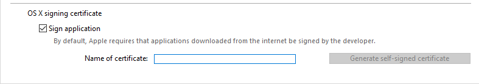

4D inclut un générateur d’application pour créer un package de projet (version finale). Ce générateur simplifie le processus de finalisation et de déploiement des applications compilées 4D. Il gère automatiquement les fonctionnalités spécifiques de différents systèmes d'exploitation et facilite le déploiement d'applications client-serveur.

Le générateur d'applications vous permet de :

* Générer une structure compilée, sans code interprété,
* Générer une application autonome exécutable, c'est-à-dire fusionnée avec 4D Volume Desktop, le moteur de base de données 4D,
* Générer différentes applications à partir de la même structure compilée via un projet XML,
* Générer des applications client-serveur homogènes,
* Générer des applications client-serveur avec mise à jour automatique des composants client et serveur.
* Enregistrer vos paramètres de génération pour une utilisation ultérieure (bouton *Enregistrer les paramètres*).

> Les applications compilées sont basées sur des [fichiers .4dz files](#build-compiled-structure) qui sont en **lecture seule**. A noter que l'utilisation de commandes ou de fonctions qui modifient les fichiers sources (telles que `CREATE INDEX` ou `CREATE TABLE` (SQL)) n'est pas possible par défaut dans les applications compilées. Vous pouvez néanmoins créer des applications spécifiques qui prennent en charge les modifications locales en utilisant la clé XML du `PackProject` (voir [doc.4d.com](https://doc.4d.com)).

## Aperçu du générateur d'application

Générer un package de projet peut être réalisé à l'aide de :

* soit la commande [`BUILD APPLICATION`](https://doc.4d.com/4dv19/help/command/en/page871.html),
* soit la[ fenêtre Générateur d'application](#application-builder).

Pour afficher la boîte de dialogue du générateur d'application, sélectionnez **Développement** > **Générer l'application...** dans la barre de menus.


La boîte de dialogue du générateur d'application comprend plusieurs pages accessibles via des onglets :


La génération ne peut s'effectuer qu'une fois le projet compilé. Si vous sélectionnez cette commande sans avoir préalablement compilé le projet ou si le code compilé ne correspond pas au code interprété, une boîte de dialogue d'avertissement apparaît indiquant que le projet doit être (re)compilé.

### Paramètres du générateur d'application

Dans le fichier *buildApp.4DSettings* de l'application client-serveur, utilisez la ou les clés xml suivantes pour indiquer le chemin du dossier contenant l'application compilée monoposte :

Des paramètres par défaut sont utilisés lors de la première utilisation de la boîte de dialogue du Générateur d'application. Le contenu du fichier est mis à jour, si nécessaire, lorsque vous cliquez sur **Construire** ou **Enregistrer les paramètres**. Vous pouvez définir plusieurs autres fichiers de paramètres XML pour le même projet et les utiliser à l'aide de la commande [BUILD APPLICATION](https://doc.4d.com/4dv19/help/command/en/page871.html).

Les clés XML fournissent des options supplémentaires à celles affichées dans la boîte de dialogue du Générateur d'application. Les clés XML fournissent des options supplémentaires à celles affichées dans la boîte de dialogue du Générateur d'application.

### Fichier journal

Lorsqu'une application est créée, 4D génère un fichier journal nommé *BuildApp.log.xml* dans le dossier **Logs** du projet. Le fichier journal stocke les informations suivantes pour chaque build :

* Le début et la fin de la génération des cibles,
* Le nom et le chemin d'accès complet des fichiers générés,
* La date et l'heure de la génération,
* Toutes les erreurs qui se sont produites,
* Tout problème de signature (par exemple, un plug-in non signé).

La vérification de ce fichier peut vous aider à gagner du temps lors des prochaines étapes de déploiement, si vous avez l'intention, par exemple, de notariser votre application.

> Utilisez la commande `Get 4D file (Build application log file)` pour obtenir l'emplacement du fichier journal.

## Nom de l'application et dossier de destination


Entrez le nom de l'application dans **Nom de l'application**.

Spécifiez le dossier de l'application générée dans le **Dossier de destination**. Si le dossier spécifié n'existe pas déjà, 4D vous créera un dossier *Build*.

## Page de structure compilée

Cet onglet vous permet de générer un fichier de structure compilé standard et/ou un composant compilé :


### Générer une structure compilée

Génère une application contenant uniquement du code compilé.

Cette fonctionnalité crée un fichier *.4dz* dans un dossier `Compiled Database/<project name>`. Par exemple, si vous avez nommé votre application «MyProject», 4D créera :

*<destination\>/Compiled Database/MyProject/MyProject.4dz*

> Un fichier .4dz est essentiellement une version compressée du dossier du projet. Les fichiers .4dz peuvent être utilisés par 4D Server, 4D Volume Desktop (applications fusionnées) et 4D. La taille compacte et optimisée des fichiers .4dz facilite le déploiement des packages de projet.

#### Inclure les dossiers associés

Lorsque vous cochez cette option, tous les dossiers liés au projet sont recopiés dans le dossier Build en tant que dossiers *Components* et *Resources*. Pour plus d'informations sur ces dossiers, veuillez vous reporter à la [description de l'architecture du projet](Project/architecture.md).

### Générer un composant

Génère un composant compilé à partir de la structure.

Un composant est un fichier de structure 4D standard dans lequel des fonctionnalités spécifiques ont été développées. Une fois le composant configuré et installé dans un autre projet 4D (le projet d'application hôte), ses fonctionnalités sont accessibles depuis le projet hôte.

Si vous avez nommé votre application *MyComponent*, 4D créera un dossier *Component* contenant le dossier *MyComponent.4dbase* :

`<destination>/Components/MyComponent.4dbase/MyComponent.4DZ`.

Le dossier *MyComponent.4dbase* contient :

* le fichier *MyComponent.4DZ*
* Un dossier *Resources* - toutes les ressources associées sont automatiquement copiées dans ce dossier. Les autres composants et/ou dossiers de plugins ne sont pas copiés (un composant ne peut pas utiliser de plug-ins ou d'autres composants).

## Page Application

Cet onglet vous permet de créer une version monoposte autonome de votre application :


### Créer une application autonome

Cochez l'option **Créer une application autonome** et cliquez sur **Générer** pour créer une application autonome (double-cliquable) directement à partir de votre projet d'application.

Les éléments suivants sont requis pour la création :

* 4D Volume Desktop (le moteur de base de données 4D),
* une [licence appropriée](#licenses)

Sous Windows, cette fonctionnalité crée un fichier exécutable (.exe). Sous macOS, il gère la création de progiciels.

Le principe consiste à fusionner le fichier 4D Volume Desktop avec votre fichier de structure compilé. Les fonctionnalités offertes par le fichier 4D Volume Desktop sont liées à l’offre commerciale à laquelle vous avez souscrite. Pour plus d’informations sur ce point, reportez-vous à la documentation commerciale et au site Internet de [4D Sas (http://www.4d.com/)](http://www.4d.com/).

Vous pouvez définir un fichier de données par défaut ou permettre à l'utilisateur de créer et d'utiliser son propre fichier de données (cf. section [Gestion du fichier de données dans les applications finales](https://doc.4d.com/4Dv17R6/4D/17-R6/Data-file-management-in-final-applications.300-4354729.en.html)).

Il est possible d'automatiser la mise à jour des applications monopostes fusionnées moyennant l'utilisation d'une séquence de commandes du langage (cf. section [Mise à jour auto des applications serveur ou monopostes](https://doc.4d.com/4Dv17R6/4D/17-R6/Automatic-updating-of-server-or-single-user-applications.300-4354721.en.html)).

#### Emplacement du 4D Volume Desktop

Afin de créer une application autonome, il convient d'abord de désigner le dossier contenant le fichier 4D Volume Desktop :

* *sous Windows*, le dossier contient notamment les fichiers 4D Volume Desktop.4DE, 4D Volume Desktop.RSR ainsi que différents fichiers et dossiers nécessaires à son fonctionnement. Ces éléments doivent être placés au premier niveau du dossier sélectionné.
* *sous macOS*, 4D Volume Desktop est fourni sous la forme d’un progiciel structuré contenant divers fichiers et dossiers génériques.

Pour sélectionner le dossier de 4D Volume Desktop, cliquez sur le bouton **[...]**. Une boîte de dialogue vous permettant de désigner le dossier (Windows) ou le progiciel (macOS) de 4D Volume Desktop apparaît.

Une fois le dossier sélectionné, son chemin d’accès complet est affiché et, s’il contient effectivement 4D Volume Desktop, l’option de génération d’application exécutable est activée.

> Le numéro de version de 4D Volume Desktop doit correspondre à celui du 4D Developer Edition. Par exemple, si vous utilisez 4D Developer v18, vous devez sélectionner un 4D Volume Desktop v18.

#### Mode de liaison des données

Cette option vous permet de sélectionner le mode de liaison entre l'application fusionnée et le fichier de données local. Deux modes de liaison sont disponibles :

* **Nom de l'application** (défaut) - Dans ce mode, l'application 4D ouvre automatiquement le dernier fichier de données ouvert correspondant à la structure. Cela vous permet de déplacer librement le dossier de l'application sur le disque. Il est conseillé en général pour les applications fusionnées, à moins que vous n'ayez spécifiquement besoin de dupliquer l'application.

* **Chemin de l'application** - Dans ce mode, l'application 4D fusionnée va lire le contenu du fichier *lastDataPath.xml* et tenter d'ouvrir le fichier de données dont l'attribut "executablePath" correspond au chemin d'accès de l'application. Si cette clé est trouvée, son fichier de données correspondant (défini via son attribut "dataFilePath") est ouvert. Si cette clé est trouvée, son fichier de données correspondant (défini via son attribut "dataFilePath") est ouvert.

Pour plus d'informations sur le mode de liaison des données, reportez-vous au paragraphe [Dernier fichier de données ouvert](#last-data-file-opened).

#### Fichiers générés

Lorsque vous cliquez sur le bouton **Générer**, 4D crée automatiquement un dossier **Final Application** dans le **Dossier de destination** défini. Dans le dossier Final Application, se trouve un sous-dossier contenant le nom de l'application spécifiée.

Si vous avez nommé votre application "MyProject", vous trouverez les fichiers suivants dans ce sous-dossier (MyProject):

* *Windows*
  * MonAppli.exe qui est votre exécutable et MonAppli.Rsr qui contient les ressources de l’application
  * Les dossiers 4D Extensions et Resources ainsi que les diverses librairies (DLL), le dossier Native Components et SAS Plugins -fichiers nécessaires au fonctionnement de l’application
  * Un dossier Database contenant notamment un dossier Resources et un fichier MyProject.4DZ. Ils constituent la structure compilée du projet et son dossier Resources. **Note** : Ce dossier contient également le dossier *Default Data*, s'il a été défini (cf. [Gestion du fichier de données dans les applications finales](#data-file-management-in-final-applicatons)).
  * (Facultatif) Un dossier Components et/ou un dossier Plugins contenant les fichiers des composants et/ou des plug-ins éventuellement inclus dans le projet. Pour plus d’informations sur ce point, reportez-vous à la section [Plugins et composants](#plugins-and-components).
  * Un dossier Licences contenant, sous forme de fichier XML, la liste des numéros de licence ayant été intégrés dans l’application. Pour plus d’informations sur ce point, reportez-vous à la section [Licences & Certificat](#licenses-and-certificate).
  * Les éléments supplémentaires éventuellement ajoutés dans le dossier 4D Volume Desktop (cf. paragraphe [Personnaliser le dossier 4D Volume Desktop](#customizing-4d-volume-desktop-folder)).

 Tous ces éléments doivent être conservés dans le même dossier afin que l’exécutable fonctionne.

* *macOS*
  * Un progiciel (package) nommé MyProject.app contenant votre application et tous les éléments nécessaires à son fonctionnement, y compris les plug-ins, composants et licences. Pour plus d’informations sur l’intégration des composants et des plug-ins, reportez-vous à la section [Page Plugins et composants](#plugins-and-components). Pour plus d’informations sur l’intégration des licences, reportez-vous à la section [Page Licences & Certificat](#licenses-and-certificate). **Note**: Dans macOS, la commande [Application file](https://doc.4d.com/4Dv18R4/4D/18-R4/Application-file.301-4982855.en.html) du langage 4D renvoie le chemin du fichier ApplicationName (situé dans le dossier Contents:macOS du progiciel) et non celui du fichier .comp (dossier Contents:Resources du progiciel).

#### Personnaliser le dossier 4D Volume Desktop

Lors de la construction de l’application exécutable, 4D duplique le contenu du dossier 4D Volume Desktop dans le dossier *Final Application*. Vous pouvez donc parfaitement personnaliser le contenu du dossier 4D Volume Desktop d’origine en fonction de vos besoins. Vous pouvez, par exemple :

* Installer une version de 4D Volume Desktop correspondant à une langue spécifique ;
* Ajouter un dossier *PlugIns* personnalisé ;
* Personnaliser le contenu du dossier *Resources*.
> Dans macOS, 4D Volume Desktop est fourni sous la forme d'un package. Pour le modifier, vous devez d'abord afficher son contenu (**Contrôle+clic** sur l'icône).

#### Emplacements des fichiers Web

Si votre application exécutable est utilisée en tant que serveur Web, les fichiers et dossiers requis par le serveur doivent être installés à des emplacements spécifiques. Ces éléments sont les suivants :

* fichiers *cert.pem* et *key.pem* (facultatifs) : ces fichiers sont utilisés pour les connexions TLS ainsi que par les commandes de cryptage des données,
* dossier racine Web par défaut.

Des éléments doivent être installés :

* **Sous Windows** : dans le sous-dossier *Final Application\MonAppli\Database*.
* **Sous macOS** : à côté du progiciel *MonProjet.app*.

## Page Client/Serveur

4D vous permet de générer des applications client/serveur personnalisées, homogènes, multi-plateformes et avec option de mise à jour automatique.


### Qu'est-ce qu'une application Client/Serveur ?

Une application client/serveur est issue de la combinaison de trois éléments :

* Un projet 4D compilé,
* L’application 4D Server,
* L’application 4D Volume Desktop (macOS et/ou Windows).

Une fois générée, une application client/serveur se compose de deux parties homogènes : la partie Serveur (unique), et la partie Cliente (à installer sur chaque poste client).

> Si vous voulez déployer une application client/server dans un environnement hétérogène (applications clientes exécutées sur des machines Intel/AMD et Apple Silicon), il est recommandé de [compiler le projet pour tous les processeurs](Project/compiler.md#compilation-target) sur une machine macOS, afin que toutes les applications clientes s'exécutent en code natif.

En outre, l’application client/serveur est personnalisée et son maniement est simplifié :

* Pour lancer la partie serveur, l’utilisateur double-clique simplement sur l’application serveur. Il n’est pas nécessaire de sélectionner le fichier projet.
* Pour lancer la partie cliente, l’utilisateur double-clique simplement sur l’application cliente, qui se connecte directement à l’application serveur. Il n’est pas nécessaire de choisir un serveur dans une boîte de dialogue de connexion. Le client cible le serveur soit via son nom, lorsque client et serveur sont sur le même sous-réseau, soit via son adresse IP, à définir via la clé XML `IPAddress` dans le fichier buildapp.4DSettings. Si la connexion échoue, [des mécanismes alternatifs spécifiques peuvent être mis en place](#management-of-client-connections). Il est également possible de “forcer” l’affichage de la boîte de dialogue de connexion standard en maintenant la touche **Option** (macOS) ou **Alt** (Windows) enfoncée lors du lancement de l’application cliente. Seule la partie cliente peut se connecter à la partie serveur correspondante. Si un utilisateur tente de se connecter à la partie serveur à l’aide d’une application 4D standard, un message d’erreur est retourné et la connexion est impossible.
* Une application client/serveur peut être paramétrée de telle sorte que la partie cliente [puisse être mise à jour automatiquement via le réseau](#copy-of-client-applications-in-the-server-application). Il vous suffit de créer et de distribuer une version initiale de l'application cliente, les mises à jour ultérieures sont gérées à l'aide du mécanisme de mise à jour automatique.
* Il est également possible d'automatiser la mise à jour de la partie serveur moyennant une séquence de commandes du langage ([SET UPDATE FOLDER](https://doc.4d.com/4dv19/help/command/en/page1291.html) et [RESTART 4D](https://doc.4d.com/4dv19/help/command/en/page1292.html)).

### Construire application serveur

Cochez cette option pour générer la partie serveur de votre application pendant la phase de construction. Vous devez désigner sur votre disque l’emplacement de l’application 4D Server à utiliser. Ce 4D Server doit correspondre à la plate-forme courante (qui sera également la plate-forme de l’application du serveur).

#### Emplacement de 4D Server

Cliquez sur le bouton **[...]** et utilisez la boîte de dialogue *Rechercher un dossier* pour localiser l'application 4D Server. Sous macOS, vous devez sélectionner directement le package 4D Server.

#### Version courante

Utilisée pour indiquer le numéro de version courante de l'application générée. Vous pourrez par la suite accepter ou refuser les connexions des applications clientes en fonction de leur numéro de version. L'intervalle de compatibilité pour les applications client/serveur est défini à l'aide de \[clés XML\](#buildapp4dsettings) spécifiques).

#### Mode de liaison des données

Cette option vous permet de sélectionner le mode de liaison entre l'application fusionnée et le fichier de données local. Deux modes de liaison sont disponibles :

* **Nom de l'application** (défaut) - Dans ce mode, l'application 4D ouvre automatiquement le dernier fichier de données ouvert correspondant à la structure. Cela vous permet de déplacer librement le dossier de l'application sur le disque. Il est conseillé en général pour les applications fusionnées, à moins que vous n'ayez spécifiquement besoin de dupliquer l'application.

* **Chemin de l'application** - Dans ce mode, l'application 4D fusionnée va lire le contenu du fichier *lastDataPath.xml* et tenter d'ouvrir le fichier de données dont l'attribut "executablePath" correspond au chemin d'accès de l'application. Si cette clé est trouvée, son fichier de données correspondant (défini via son attribut "dataFilePath") est ouvert. Si cette clé est trouvée, son fichier de données correspondant (défini via son attribut "dataFilePath") est ouvert.

Pour plus d'informations sur le mode de liaison des données, reportez-vous au paragraphe [Dernier fichier de données ouvert](#last-data-file-opened).

### Construire application cliente

Cochez cette option pour générer la partie cliente de votre application lors de la phase de construction.

Vous pouvez cocher cette option :

* avec l'option [**Build server application**](#build-server-application) pour créer des parties serveur et client correspondantes pour la plate-forme courante et (éventuellement) inclure les fichiers d'archive de mise à jour automatique,
* sans sélectionner l'option [**Build server application**](#build-server-application), généralement pour créer le fichier d'archive de mise à jour à sélectionner à partir de la plate-forme "concurrente" lors de la génération de la partie serveur.

#### Emplacement du 4D Volume Desktop

Désigne l'emplacement sur votre disque de l'application 4D Volume Desktop à utiliser pour construire la partie cliente de votre application.

> Le numéro de version de 4D Volume Desktop doit correspondre à celui du 4D Developer Edition. Par exemple, si vous utilisez 4D v19, vous devez sélectionner un 4D Volume Desktop v19.

Ce 4D Volume Desktop doit correspondre à la plate-forme courante (qui sera également la plate-forme de l’application cliente). Si vous souhaitez générer une version de l’application cliente pour la plate-forme “concurrente”, vous devez répéter l'opération en utilisant une application 4D tournant sur cette plate-forme.

Si vous souhaitez que l'application cliente se connecte au serveur via une adresse spécifique (autre que le nom du serveur publié sur le sous-réseau), vous devez utiliser la clé XML `IPAddress` dans le fichier buildapp.4DSettings. Pour plus d'informations sur ce fichier, reportez-vous à la description de la commande [`BUILD APPLICATION`](https://doc.4d.com/4dv19/help/command/en/page871.html). Vous pouvez également mettre en place des mécanismes spécifiques en cas d'échec de la connexion. Les différents scénarios proposés sont décrits dans la section [Gestion de la connexion des applications clientes](#management-of-client-connections).

#### Copie des applications clientes dans l'application serveur

Les options de cette zone permettent de mettre en place le mécanisme de mise à jour des parties clientes de vos applications client/serveur via le réseau à chaque nouvelle version de l’application générée. Ces options sont actives uniquement lorsque l'option **Construire application cliente** est cochée.

* **Permettre la mise à jour automatique de l'application cliente Windows** - Cochez cette option pour construire un fichier `.4darchive` qui sera envoyé à vos applications clientes sur la plate-forme Windows en cas de mise à jour.
* **Permettre la mise à jour automatique de l'application cliente Macintosh** - Cochez cette option pour construire un fichier `.4darchive` qui sera envoyé à vos applications clientes sur la plate-forme Macintosh en cas de mise à jour.

Le fichier `.4darchive` est copié à l'emplacement suivant :

```
<ApplicationName>_Build/Client Server executable/Upgrade4DClient/
```

#### Sélectionner l'archive cliente pour la plate-forme concurrente

Vous pouvez cocher l'option **Permettre la mise à jour automatique...** pour les applications clientes exécutées sur la plate-forme concurrente. Cette option est disponible seulement si :

* l'option **Construire application serveur** est cochée,
* l'option **Permettre la mise à jour automatique...** pour les applications clientes exécutées sur la plate-forme actuelle est cochée.

Pour cela, vous devez cliquer sur le bouton **[...]** et désigner l'emplacement sur votre disque du fichier à utiliser pour la mise à jour. Le fichier à sélectionner dépend de la plate-forme courante du serveur :

| Plateforme du serveur courant | Fichier requis                                               | Détails                                                                                                                                                                                                      |
| ----------------------------- | ------------------------------------------------------------ | ------------------------------------------------------------------------------------------------------------------------------------------------------------------------------------------------------------ |
| macOS                         | Windows 4D Volume Desktop *ou* Windows client update archive | Par défaut, sélectionnez l'application `4D Volume Desktop` pour Windows. Pour sélectionner un fichier `.4darchive` précédemment créé sur Windows, appuyez sur la touche **Shift** tout en cliquant sur [...] |
| Windows                       | macOS client update archive                                  | Sélectionnez un fichier `.4darchive` signé, précédemment créé sur macOS                                                                                                                                      |

Vous pouvez construire un fichier `.4darchive` spécifique pour la plate-forme concurrente en sélectionnant uniquement [**Construire application cliente**](#build-client-application) et l'option [**Permettre la mise à jour automatique...**](#copie-des-applications-clientes-dans-lapplication-serveur) adéquate.

#### Comment proposer une mise à jour ?

Dans la pratique, la proposition de mise à jour des applications clientes découle automatiquement de la mise à jour de l’application serveur.

Le principe est le suivant : lors de la génération d’une nouvelle version de l’application client-serveur depuis le générateur d’applications, la nouvelle partie cliente est copiée sous forme compressée dans le sous-dossier **Upgrade4DClient** du dossier **NomApplication** Server (sous macOS, ces dossiers sont inclus dans le progiciel serveur). Si vous avez suivi le processus de génération d’une application cliente multi-plate-forme, un fichier *. 4darchive* de mise à jour est disponible pour chaque plate-forme :

Pour provoquer la mise à jour des applications clientes, il suffit de remplacer l’ancienne version de l’application serveur par la nouvelle puis de l’exécuter. Le reste du processus est automatique.

Côté client, au moment où l’“ancienne” application cliente tente de se connecter à l’application serveur mise à jour, une boîte de dialogue s’affiche sur le poste client, lui indiquant qu’une nouvelle version est disponible. L’utilisateur peut mettre sa version à jour ou annuler la boîte de dialogue.

* Si l’utilisateur clique sur **OK**, la nouvelle version est téléchargée sur le poste client via le réseau. A l’issue du téléchargement, l’ancienne application client quitte, la nouvelle est lancée et se connecte au serveur. L’ancienne version de l’application est ensuite placée dans la corbeille de la machine.
* Si l’utilisateur clique sur **Annuler**, la mise à jour est annulée ; si l’ancienne version de l’application cliente n’appartient pas à l’intervalle des numéros de version acceptés par le serveur (cf. paragraphe suivant), l’application quitte et la connexion est impossible. Sinon (par défaut), la connexion est établie.

#### Comment forcer la mise à jour ?

Dans certains cas, vous pourrez souhaiter que les applications clientes ne puissent pas annuler le téléchargement des mises à jour. Par exemple, si vous avez utilisé une nouvelle version de l’application source 4D Server, il est impératif que la nouvelle version de l’application cliente soit installée sur chaque poste client.

Pour forcer la mise à jour, il vous suffit d’exclure les versions courantes des applications clientes (N-1 et précédentes) de l’intervalle des numéros de version compatibles avec l’application serveur. Dans ce cas, le mécanisme de mise à jour n’autorisera pas la connexion des applications clientes non mises à jour. Par exemple, si la nouvelle version de l’application client-serveur est 6, vous pouvez stipuler que toute application cliente ayant un numéro de version strictement inférieur à 6 ne sera pas autorisé à se connecter.

Le [numéro de version courante](#current_version) est défini dans la page Client/Serveur du générateur d’application. Les intervalles de numéros autorisés sont définis dans le projet d’application via des [clés XML](#build-application-settings) spécifiques.

#### En cas d’erreur

Si 4D ne peut pas effectuer la mise à jour de l’application cliente, le poste client affiche le message d’erreur suivant : “La mise à jour de l’application cliente a échoué. L’application va maintenant quitter.”

Les causes possibles de cette erreur sont multiples. Lorsque vous rencontrez ce message, il est conseillé de contrôler en premier lieu les paramètres suivants :

* **Chemins d’accès** : vérifiez la validité des chemins d’accès définis dans le projet d’application via la boîte de dialogue du Générateur d’applications ou via des clés XML (par exemple *ClientMacFolderToWin*). Vérifiez en particulier les chemins d’accès aux versions de 4D Volume Desktop.
* **Privilèges lecture/écriture** : sur la machine cliente, vérifiez que l’utilisateur courant dispose de droits d’accès en écriture pour l’application cliente mise à jour.

### Fichiers générés

A l’issue du processus de génération d’une application client-serveur, vous devez trouver dans le dossier de destination un nouveau dossier nommé **Client Server executable**. Ce dossier contient deux sous-dossiers, `<ApplicationName>Client` et `<ApplicationName>Server`.
> Ces dossiers ne sont pas générés si une erreur est survenue. Dans ce cas, ouvrez le [fichier d’historique](#log-file) pour connaître la cause de l’erreur.

Le dossier `<ApplicationName>Client` contient la partie cliente de l'application correspondant à la plate-forme d'exécution du générateur d'application. Ce dossier doit être installé sur chaque poste client. Le dossier `<ApplicationName>Server` contient la partie serveur de l'application.

Le contenu de ces dossiers diffère en fonction de la plate-forme courante :

* *Windows* - Chaque dossier contient le fichier exécutable de l'application, nommé `<ApplicationName>Client.exe` pour la partie client et `<ApplicationName>Server.exe` pour la partie serveur ainsi que les fichiers .rsr correspondants. Les dossiers contiennent également divers fichiers et dossiers nécessaires au fonctionnement des applications et les éléments personnalisés éventuellement placés dans les dossiers 4D Volume Desktop et 4D Server d’origine.
* *macOS* - Chaque dossier contient uniquement le paquet de l'application, nommé `<ApplicationName> Client` pour la partie client et `<ApplicationName> Server` pour la partie serveur. Chaque progiciel contient tous les éléments nécessaires à son fonctionnement. Sous macOS, un progiciel est lancé via un double-clic.

 > Les progiciels macOS générés contiennent les mêmes éléments que les sous-dossiers Windows. Pour les visualiser, vous devrez tout d’abord afficher leur contenu (effectuez Control+clic sur leur icône) afin de pouvoir les modifier.

Si vous avez coché l'option "Autoriser la mise à jour automatique de l'application cliente", un sous-dossier supplémentaire appelé *Upgrade4DClient* est ajouté dans le dossier/package `<ApplicationName>Server`. Ce sous-dossier contient l’application cliente au format macOS et/ou Windows sous forme de fichier compressé. Ce fichier est utilisé lors de la mise à jour automatique des applications clientes.

#### Emplacements des fichiers Web

Si la partie serveur et/ou la partie cliente de votre application exécutable est utilisée en tant que serveur Web, les fichiers et dossiers requis par le serveur doivent être installés à des emplacements spécifiques. Ces éléments sont les suivants :

* fichiers *cert.pem* et *key.pem* (facultatifs) : ces fichiers sont utilisés pour les connexions SSL ainsi que par les commandes de cryptage des données,
* Dossier racine Web (DossierWeb) par défaut.

Des éléments doivent être installés :

* **Sous Windows**
  * **Application serveur** - dans le sous-dossier `Client Server executable\&#060;ApplicationName&#062;Server\Server Database`.
  * **Application cliente** - dans le sous-dossier `Client Server executable\&#060;ApplicationName&#062;Client`.

* **sous macOS**
  * **Application serveur** - à côté du progiciel `<ApplicationName>Server`.
  * **Application cliente** - à côté du progiciel `<ApplicationName>Client`.

### Intégrer une structure compilée dans la partie cliente

4D permet d'intégrer une structure compilée dans une application cliente. Cette fonctionnalité peut être utilisée, par exemple, pour fournir aux utilisateurs une application "portail" donnant accès aux différentes applications serveur, via la commande `OPEN DATABASE` exécutant un fichier `.4dlink`.

Pour activer cette fonctionnalité, ajoutez les clés `DatabaseToEmbedInClientWinFolder` et/ou `DatabaseToEmbedInClientMacFolder` dans le fichier de configuration *buildApp*. Lorsque l'une de ces clés est présente, le processus de génération de l'application cliente génère une application monoposte : la structure compilée, au lieu du fichier *EnginedServer.4Dlink*, est placée dans le dossier "Database".

* Si un dossier "Data" par défaut existe dans l'application monoposte, une licence est intégrée.
* Si un dossier "Data" par défaut n'existe pas dans l'application monoposte, elle sera exécutée sans le fichier de données et sans licence.

Le scénario standard est le suivant :

1. Dans la boîte de dialogue du Générateur d'application, sélectionnez l'option "Générer une structure compilée" pour produire un .4DC ou un .4DZ pour utiliser l'application en monoposte.
2. Dans le fichier *buildApp.4DSettings* de l'application client-serveur, utilisez la ou les clés xml suivantes pour indiquer le chemin du dossier contenant l'application compilée monoposte :

* `DatabaseToEmbedInClientWinFolder`
* `DatabaseToEmbedInClientMacFolder`

3. Générez l'application client-serveur. Cela produira les effets suivants :

* le dossier de l'application monoposte est copié intégralement dans le dossier "Database" du client fusionné
* le fichier *EnginedServer.4Dlink* du dossier "Database" n'est pas généré
* les fichiers .4DC, .4DZ, .4DIndy de la copie de l'application monoposte sont renommés à l'aide du client fusionné
* la clé `PublishName` n'est pas copiée dans le *info.plist* du client fusionné
* si l'application monoposte ne possède pas de dossier "Data" par défaut, le client fusionné sera exécuté sans données.

Les fonctionnalités de mise à jour automatique de 4D Server (clé [CurrentVers](#current-version), commande `SET UPDATE FOLDER`, etc.) fonctionnent avec une application monoposte, comme avec une application distante standard. Lors de la connexion, l'application monoposte compare sa clé `CurrentVers` à la plage de version 4D Server. Si elle se trouve en dehors de plage, l'application cliente monoposte mise à jour est téléchargée depuis le serveur et l'Updater lance le processus de mise à jour locale.

### Personnalisation des noms de dossier de cache client et/ou serveur

Les dossiers de cache client et serveur sont utilisés pour stocker des éléments partagés tels que des ressources ou des composants. Ils sont nécessaires pour gérer les échanges entre le serveur et les clients distants. Les applications client/serveur utilisent les chemins d'accès par défaut pour les dossiers de cache système client et serveur.

Dans certains cas spécifiques, vous devrez personnaliser les noms de ces dossiers pour implémenter des architectures spécifiques (voir ci-dessous). 4D vous fournit les clés `ClientServerSystemFolderName` et `ServerStructureFolderName` à définir dans le fichier de paramètres *buildApp*.

#### Dossier de cache client

La personnalisation du nom du dossier de cache côté client peut être utile lorsque votre application cliente est utilisée pour se connecter à plusieurs serveurs fusionnés qui sont similaires mais qui utilisent des ensembles de données différents. Dans ce cas, pour enregistrer plusieurs téléchargements inutiles de ressources locales identiques, vous pouvez utiliser le même dossier de cache local personnalisé.

* Configuration par défaut (*pour chaque connexion à un serveur, un dossier cache spécifique est téléchargé/mis à jour*) :


* À l'aide de la clé `ClientServerSystemFolderName` (*un seul dossier de cache est utilisé pour tous les serveurs*) :


#### Dossier de cache du serveur

La personnalisation du nom du dossier de cache côté serveur est utile lorsque vous exécutez plusieurs applications serveur identiques créées avec différentes versions de 4D sur le même ordinateur. Si vous souhaitez que chaque serveur utilise son propre ensemble de ressources, vous devez personnaliser le dossier de cache du serveur.

* Configuration par défaut (*les mêmes applications serveur partagent le même dossier de cache*) :


* À l'aide de la clé `ServerStructureFolderName` (*un dossier de cache dédié est utilisé pour chaque application serveur*) :


## Page Plugins et composants

Dans cet onglet, définissez chaque [plug-in](Concepts/plug-ins.md) et chaque [composant](Concepts/components.md) que vous utiliserez dans votre application autonome ou client/serveur.

La page liste les éléments chargés par l'application 4D courante :


* La colonne **Actif** indique les éléments qui seront intégrés dans l’application générée. Par défaut, tous les éléments sont inclus. Pour exclure un plug-in ou un composant, désélectionnez la case qui lui est associée.

* Colonne **Plugins et composants** - Affiche le nom du plug-in/composant.

* Colonne **ID** - Affiche le numéro d'identification du plug-in/composant (le cas échéant).

* La colonne **Type** indique le type de l’élément : plug-in ou composant.

Si vous souhaitez intégrer d’autres plug-ins ou composants dans l’application exécutable, il vous suffit de les placer dans un dossier **PlugIns** ou **Components** à côté de l’application 4D Volume Desktop ou de l’application 4D Server. Le mécanisme de copie du contenu du dossier de l’application source (cf. paragraphe [Personnaliser le dossier 4D Volume Desktop](#customizing-4d-volume-desktop-folder)) permet d’intégrer tout type de fichier à l’application exécutable.

En cas de conflit entre deux versions différentes d’un même plug-in (l’une chargée par 4D et l’autre placée dans le dossier de l’application source), la priorité revient au plug-in installé dans le dossier de 4D Volume Desktop/4D Server. En revanche, la présence de deux instances d’un même composant empêchera l’ouverture de l’application.
> L’utilisation de plug-ins et/ou de composants compilés dans une version de déploiement nécessite des numéros de licence adéquats.

## Page Licences & Certificat

La page Licences & Certificat vous permet de :

* spécifier le ou les numéro(s) de licence que vous souhaitez intégrer dans votre application exécutable monoposte
* signer l'application à l'aide d'un certificat sous macOS.


### Licences

Cet onglet affiche la liste des licences de déploiement disponibles que vous pouvez intégrer dans votre application. Par défaut, la liste est vide. Vous devez explicitement ajouter votre licence *4D Developer Professional* ainsi que chaque licence* 4D Desktop Volume* liée à utiliser dans l’application générée. Vous pouvez ajouter un numéro 4D Developer Professional et ses licences associées autres que ceux en cours d’utilisation.

Pour ajouter ou supprimer des licences, utilisez les boutons **[+]** et **[-]** situés en bas de la fenêtre.

Lorsque vous cliquez sur le bouton \[+], une boîte de dialogue d’ouverture de document apparaît, affichant par défaut le contenu du dossier *[Licenses]* de votre poste. Pour plus d'informations sur l'emplacement de ce dossier, reportez-vous à la commande [Get 4D folder](https://doc.4d.com/4Dv17R6/4D/17-R6/Get-4D-folder.301-4311294.en.html).

Vous devez désigner les fichiers contenant votre licence Developer et ainsi que vos licences de déploiement. Ces fichiers ont été générés ou mis à jour au moment de l’acquisition de la licence *4D Developer Professional* et des licences *4D Desktop Volume*.

Une fois que vous avez sélectionné un fichier, la liste indique les caractéristiques de la licence qu’il contient.

* **N° Licence** : numéro de licence du produit
* **Licence** : nom du produit
* **Date d'expiration** : date d'expiration de la licence (le cas échéant)
* **Chemin d'accès** : emplacement sur le disque

Si la licence est invalide, un message vous le signale.

Vous pouvez désigner autant de fichiers valides que vous voulez. Lors de la génération de l’application exécutable, 4D utilisera les licences les plus appropriées.
> Des licences "R" dédiées sont requises pour générer des applications basées sur des versions "R-release" (les numéros de licence des produits "R" débutent par "R-4DDP").

A l’issue de la génération, un nouveau fichier de licence de déploiement est automatiquement inclus dans un dossier Licences placé à côté de l’application exécutable (Windows) ou dans le progiciel (macOS).

### Certification des applications sous OS X

Le Générateur d’application permet de signer les applications 4D fusionnées sous macOS (applications monoposte, 4D Server et parties clientes sous macOS). Signer une application permet d’autoriser son exécution par la fonctionnalité Gatekeeper de macOS lorsque l’option "Mac App Store et Développeurs identifiés" est sélectionnée (cf. "A propos de Gatekeeper" ci-dessous).

* Cochez l'option **Signer l’application** pour inclure la certification dans le processus de génération de l’application pour macOS :



L'option est affichée sous Windows et macOS mais n’est prise en compte que pour les versions macOS.

* **Nom du certificat** : saisissez dans cette zone le nom de votre certificat développeur validé par Apple. Le nom d’un certificat est généralement le nom du certificat dans l’utilitaire Trousseau d’accès (la partie en rouge dans l'exemple suivant) :


Pour obtenir un certificat de développeur auprès d’Apple, Inc., vous pouvez utiliser les commandes du menu Trousseaux d’accès ou vous connecter à la page suivante : [http://developer.apple.com/library/mac/#documentation/Security/Conceptual/CodeSigningGuide/Procedures/Procedures.html](http://developer.apple.com/library/mac/#documentation/Security/Conceptual/CodeSigningGuide/Procedures/Procedures.html).
> Le certificat requiert la présence de l’utilitaire codesign d’Apple. Cet utilitaire est fourni par défaut et se trouve généralement dans le dossier "/usr/bin/". En cas d’erreur, vérifiez que cet utilitaire est présent sur votre disque.

* **Générer un certificat auto-signé** - exécute le «Certificate Assistant» qui vous permet de générer un certificat auto-signé. Si vous ne disposez pas d'un certificat de développeur Apple, vous devez fournir un certificat auto-signé. Avec ce certificat, aucun message d'alerte ne s'affiche si l'application est déployée en interne. Si l'application est déployée en externe (c'est-à-dire via http ou e-mail), au lancement, macOS affiche un message d'alerte indiquant que le développeur de l'application n'est pas identifié. L'utilisateur peut "forcer" l'ouverture de l'application. Dans le «Certificate Assistant», veillez à sélectionner les options appropriées :  

> 4D recommande de souscrire au programme Apple Developer Program pour accéder aux "Developer Certificates" nécessaires à la notarisation des applications (voir ci-dessous).

#### A propos de Gatekeeper

Gatekeeper est une fonction de sécurité d’OS X permettant de contrôler l’exécution des applications téléchargées depuis Internet. Si une application téléchargée ne provient pas de l’Apple Store ou n’est pas signée, elle est rejetée et ne peut être lancée.

L'option **Signer l'application** du Générateur d’application de 4D permet de générer des applications compatibles avec cette option par défaut.

#### À propos de la notarisation

La notarisation des applications est fortement recommandée par Apple à partir de macOS 10.14.5 (Mojave) et 10.15 (Catalina), car les applications non notariées déployées via Internet sont bloquées par défaut.

A partir de 4D v18, les [fonctionnalités de signature intégrées](#os-x-signing-certificate) ont été mises à jour pour répondre à toutes les exigences d'Apple pour permettre l'utilisation du service de notarisation d'Apple. La notarisation elle-même doit être réalisée par le développeur et est indépendante de 4D (à noter également qu'elle nécessite l'installation de Xcode). Veuillez vous référer à [ce post du blog 4D](https://blog.4d.com/how-to-notarize-your-merged-4d-application/) qui fournit une description, par étapes, du processus de notarisation.

Pour plus d'informations sur le concept de notarisation, veuillez consulter [cette page sur le site Apple developer](https://developer.apple.com/documentation/xcode/notarizing_your_app_before_distribution/customizing_the_notarization_workflow).

## Personnaliser les icônes d’une application

4D associe une icône par défaut aux applications exécutables (monopostes et client-serveur). Vous pouvez cependant la personnaliser pour chaque application.

* **Sous macOS** - La personnalisation de l’icône de votre application est prise en charge par 4D lors de la construction de l’application exécutable. Pour cela, vous devez, avant la construction du fichier de l’application, créer un fichier d’icône (type icns) et le placer à côté du dossier de structure.
> Apple, Inc. fournit un outil spécifique pour générer les fichiers d’icône *icns* (pour plus d'informations, veuillez consulter la [documentation d'Apple](https://developer.apple.com/library/archive/documentation/GraphicsAnimation/Conceptual/HighResolutionOSX/Optimizing/Optimizing.html#//apple_ref/doc/uid/TP40012302-CH7-SW2)).

 Votre fichier d’icône doit avoir le même nom que le fichier du projet et comporter l’extension *.icns*. 4D prend automatiquement ce fichier en compte lors de la génération de l’application double-cliquable (le fichier *.icns* est renommé *NomApplication.icns* et recopié dans le dossier Resources ; l’entrée *CFBundleFileIcon* du fichier *info.plist* est mise à jour).

* **Sous Windows** - La personnalisation de l’icône de votre application est prise en charge par 4D lors de la construction de l’application exécutable. Pour cela, vous devez, avant la construction du fichier de l’application, créer un fichier d’icône (extension *.ico*) et le placer à côté du fichier de structure interprété (fichier du projet).

 Votre fichier d’icône doit avoir le même nom que le fichier de structure interprété et comporter l’extension *.ico*. 4D prend automatiquement ce fichier en compte lors de la génération de l’application exécutable.

Vous pouvez également définir des [clés XML](https://doc.4d.com/4Dv17R6/4D/17-R6/4D-XML-Keys-BuildApplication.100-4465602.en.html) spécifiques dans le fichier buildApp.4DSettings pour désigner chaque icône devant être utilisée. Les clés suivantes sont disponibles :

* RuntimeVLIconWinPath
* RuntimeVLIconMacPath
* ServerIconWinPath
* ServerIconMacPath
* ClientMacIconForMacPath
* ClientWinIconForMacPath
* ClientMacIconForWinPath
* ClientWinIconForWinPath

## Gestion des fichiers de données

### Ouverture du fichier de données

Lorsqu'un utilisateur lance une application fusionnée ou une mise à jour (applications monopostes ou applications client-serveur), 4D va tenter d'ouvrir un fichier de données valide. Plusieurs emplacements sont successivement examinés par l'application.

La séquence de lancement d'une application fusionnée est la suivante :

1. 4D tente d'ouvrir le Dernier fichier de données ouvert, [comme décrit ci-dessous](#last-data-file-opened) (non applicable lors du lancement initial).
2. S'il n'est pas trouvé, 4D tente d'ouvrir en mode lecture seule le fichier de données situé dans le dossier de données par défaut au même niveau que le fichier .4DC.
3. S'il n'est pas trouvé, 4D tente d'ouvrir le fichier de données par défaut standard (même nom et même emplacement que le fichier .4DZ).
4. S'il n'est pas trouvé, 4D affiche une boîte de dialogue standard de sélection/création de fichier de données.

### Dernier fichier de données ouvert

#### Chemin d'accès du dernier fichier de données

Toute application autonome ou serveur générée avec 4D stocke le chemin d'accès du dernier fichier de données ouvert dans le dossier de préférences de l'utilisateur de l'application.

L'emplacement du dossier de préférences de l'utilisateur de l'application correspond au chemin retourné par l'instruction suivante :

```4d
prefsUtilisateur:=Get 4D folder(Dossier 4D actif)
```

Le chemin d'accès du fichier de données est stocké dans un fichier dédié, nommé *lastDataPath.xml*.

Grâce à cette architecture, lorsque vous fournissez une mise à jour de votre application, le fichier de données de l'utilisateur local (le dernier fichier de données utilisé) est automatiquement ouvert dès le premier lancement.

Ce mécanisme est généralement adapté aux déploiements standard. Cependant, dans des cas spécifiques, par exemple si vous dupliquez vos applications fusionnées, vous pouvez avoir besoin de modifier la manière dont le fichier de données est lié à l'application.

#### Configurer le mode de liaison des données

4D utilise automatiquement, avec vos applications compilées, le dernier fichier de données ouvert. Par défaut, le chemin d'accès du fichier de données est stocké dans le dossier de préférences de l'utilisateur de l'application et est lié au **nom de l'application**.

Ce fonctionnement peut s'avérer inadapté si vous souhaitez dupliquer une application fusionnée destinée à utiliser différents fichiers de données. En effet, les applications dupliquées vont en fait partager le même dossier de préférences de l'utilisateur et donc, toujours utiliser le même fichier de données -- même si le fichier de données est renommé, car l'application utilisera toujours le dernier fichier de données ouvert par l'application.

4D vous permet donc de lier votre chemin de fichier de données au chemin de l'application. Dans ce cas, le fichier de données sera relié via un chemin spécifique et ne sera plus simplement le dernier fichier utilisé. 4D vous permet donc de lier votre chemin de fichier de données au **chemin de l'application**.

Ce mode vous permet de dupliquer vos applications fusionnées sans rompre le lien vers le fichier de données. Cependant, avec cette option, si le package d'application est déplacé sur le disque, l'utilisateur sera invité à entrer un fichier de données, car le chemin de l'application ne correspondra plus à l'attribut "executablePath" (après qu'un utilisateur ait sélectionné un fichier de données, le fichier *lastDataPath.xml* est mis à jour en conséquence).

*Duplication lorsque les données sont liées par le nom de l'application :* 

*Duplication lorsque les données sont liées par le chemin de l'application :* 

Vous sélectionnez le mode de liaison des données lors de la phase de génération de l'application. Vous pouvez soit :

* Utiliser la [Page Application](#application) ou la [Page Client/Serveur](#client-server) de boîte de dialogue du Générateur d'applications.
* Utiliser la clé XML **LastDataPathLookup** (application monoposte ou application serveur).

### Définir un dossier de données par défaut

4D vous permet de définir un fichier de données par défaut lors de la phase de construction de l'application. Au premier lancement de l'application, en l'absence de fichier local (cf. [séquence de lancement décrite ci-dessus](#opening-the-data-file)), le fichier de données par défaut est automatiquement ouvert silencieusement en mode lecture seule par 4D. Cela vous donne un meilleur contrôle sur la création et/ou l'ouverture des fichiers de données lors du premier lancement d'une application fusionnée.

Plus particulièrement, il permet de répondre aux besoins suivants :

* Eviter l'affichage de la boîte de dialogue d'ouverture de fichier de données de 4D au lancement d'une nouvelle application fusionnée ou d'une mise à jour. Vous pouvez détecter, par exemple dans la , que le fichier de données par défaut a été ouvert et donc, exécuter votre propre code et/ou boîtes de dialogue permettant de créer ou de sélectionner un fichier de données local.
* Permettre la distribution d'applications fusionnées comportant des données en lecture seulement (par exemple des applications de démonstration).

Pour définir et utiliser un fichier de données par défaut :

* Vous devez fournir un fichier de données par défaut (nommé "Default.4DD") et le stocker dans un dossier spécifique (nommé "Default Data") à l'intérieur du dossier du projet d'application. Ce fichier doit être accompagné de tous les fichiers nécessaires, en fonction de la configuration du projet : index (.4dIndx), blobs externes, journal, etc. Il est de votre responsabilité de livrer un fichier de données par défaut valide. A noter que, comme le fichier de données par défaut est ouvert en mode lecture seule, il est recommandé de désélectionner l'option "Utiliser le fichier d'historique" dans le fichier de structure original avant de créer le fichier de données.
* Au moment de la génération de l'application, le dossier de données par défaut est intégré dans l'application fusionnée. Tous les fichiers présents dans ce dossier par défaut sont également embarqués.

Le schéma suivant illustre cette fonctionnalité :


Lorsque le fichier de données par défaut est détecté au premier lancement, il est silencieusement ouvert en mode lecture seulement, vous permettant ainsi d'exécuter toute opération personnalisée (à condition qu'elle ne modifie pas le fichier de données lui-même).

## Gestion de la connexion des applications clientes

La gestion des connexions des applications clientes recouvre les mécanismes par lesquels une application cliente fusionnée se connectera au serveur cible, une fois en environnement de production.

### Scénario de connexion

Le processus de connexion des applications clientes fusionnées prend en charge les cas où le serveur dédié n'est pas disponible. Le scénario du démarrage d'une application cliente 4D est le suivant :

* L'application cliente tente de se connecter au serveur via le service de découverte (basé sur le nom du serveur, publié sur le même sous-réseau que l'application cliente).  
  OU  
  Si des informations de connexion valides sont présentes dans le fichier "EnginedServer.4DLink" à l'intérieur de son dossier, l'application cliente tente de se connecter à l'adresse du serveur spécifiée dans ce fichier.
* En cas d'échec, l'application cliente tente de se connecter au serveur à l'aide des informations présentes dans le dossier de préférences utilisateur de l'application (fichier "lastServer.xml", cf. dernière étape).
* En cas d'échec, l'application cliente affiche une boîte de dialogue d'erreur de connexion.
  * Si l'utilisateur clique sur le bouton **Sélectionner...** (lorsqu'il été autorisé par le développeur 4D au moment de la génération de l'application, voir ci-dessous), la boîte de dialogue standard "Connexion au serveur" est affichée.
  * Si l'utilisateur clique sur le bouton **Quitter**, l'application client quitte.
* Si la connexion est établie avec succès, les paramètres de cette connexion sont sauvegardés dans le dossier de préférences utilisateur de l'application cliente, ce qui permettra de les réutiliser ultérieurement en cas de besoin.

### Sauvegarde du chemin du dernier serveur

Le chemin du dernier serveur utilisé est automatiquement sauvegardé dans un fichier nommé "lastServer.xml" placé dans le dossier de préférences utilisateur de l'application cliente. Ce dossier est situé à l'emplacement suivant :

```4d
prefsUtilisateur:=Get 4D folder(Dossier 4D actif)
```

Ce mécanisme permet de prendre en charge le cas où le serveur cible primaire est temporairement indisponible pour une raison quelconque (par exemple pour une opération de maintenance). Lorsque ce cas se produit pour la première fois, la boîte de dialogue de sélection de serveur est affichée (si elle est autorisée, cf. ci-dessous) et l'utilisateur peut manuellement sélectionner un serveur alternatif, dont le chemin est alors sauvegardé si la connexion est établie et validée. Toute indisponibilité ultérieure sera alors automatiquement prise en charge à l'aide des paramètres de connexion présents dans le fichier "lastServer.xml".

> * Lorsque les applications clientes ne peuvent pas bénéficier du service de découverte, par exemple à cause de la configuration réseau, il reste recommandé que le développeur indique un nom d'hôte au lors de la génération de l'application à l'aide de la clé [IPAddress](https://doc.4d.com/4Dv17R6/4D/17-R6/IPAddress.300-4465710.en.html) dans le fichier "BuildApp.xml". Le mécanisme de sauvegarde du chemin du dernier serveur est conçu pour les cas d'indisponibilité temporaire uniquement.  
> * Dans tous les cas, il est possible de maintenir la touche **Alt/Option** au démarrage de l'application cliente afin d'afficher la boîte de dialogue de sélection du serveur.

### Accès à la boîte de dialogue de sélection de serveur en cas d'erreur

Vous pouvez choisir d'afficher ou non la boîte de dialogue standard de sélection de serveur sur les applications clientes fusionnées lorsque le serveur ne répond pas. La configuration dépend de la valeur de la clé XML [ServerSelectionAllowed](https://doc.4d.com/4Dv17R6/4D/17-R6/ServerSelectionAllowed.300-4465714.en.html) sur la machine où l'application a été créée :

* **Affichage d'un message d'erreur sans accès possible à la boîte de dialogue de sélection de serveur**. Fonctionnement par défaut. L'application peut uniquement quitter.  
  Clé Xml `ServerSelectionAllowed` : valeur **False** ou clé omise 

* **Affichage d'un message d'erreur avec accès possible à la boîte de dialogue de sélection de serveur.**. L'utilisateur peut accéder à la fenêtre de sélection du serveur en cliquant sur le bouton **Sélectionner...**. `ServerSelectionAllowed`: **True**  
