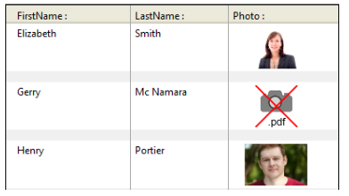

4D inclut une prise en charge spécifique des images utilisées dans vos formulaires.

## Formats natifs pris en charge

4D intègre une gestion native des images. Cela signifie que les images sont affichées et stockées dans leur format d’origine, sans interprétation dans 4D. Les spécificités des différents formats (ombrages, zones transparentes...) sont conservées en cas de copier-coller et affichées sans altération. Ce support natif est valable pour toutes les images stockées dans les formulaires 4D : [images statiques](FormObjects/staticPicture.md) collées en mode Développement, images collées dans des [objets de saisie](FormObjects/input_overview.md) à l'exécution, etc.

Les formats d'image les plus courants sont pris en charge par les deux plates-formes : jpeg, gif, png, tiff, bmp, etc. Sous macOS, le format pdf est également disponible pour l'encodage et le décodage.

> La liste complète des formats pris en charge varie en fonction du système d’exploitation et des codecs personnalisés installés sur les postes. Pour savoir quels sont codecs disponibles, vous devez utiliser la commande `PICTURE CODEC LIST` (voir aussi la description du [type de données image](Concepts/dt_picture.md)).

### Format d'image non disponible

Une icône spécifique est affichée pour les images stockées dans un format non disponible sur le poste. L'extension du format manquant est inscrite en bas de l'icône :

L'icône est automatiquement utilisée partout où l'image doit être affichée :

Cette icône indique que l'image ne peut être ni affichée ni manipulée localement -- mais elle peut être stockée sans altération pour être affichée sur une autre machine. C'est le cas, par exemple, pour les images PDF sous Windows ou les images au format PICT.

## Images de haute résolution

4D prend en charge des images haute résolution sur les plateformes macOS et Windows. Les images haute résolution peuvent être définies par le facteur d'échelle ou le dpi.

### Facteur d'échelle

Les écrans haute résolution ont une densité de pixels plus élevée que les écrans standard traditionnels. Pour que les images s'affichent correctement sur des écrans haute résolution, le nombre de pixels de l'image doit être multiplié par le *facteur d'échelle* (c'est-à-dire deux fois plus grand, trois fois plus grand, etc.).

Lorsque vous utilisez des images haute résolution, vous pouvez spécifier le facteur d'échelle en ajoutant "@nx" dans le nom de l'image (où *n* désigne le facteur d'échelle). Dans le tableau ci-dessous, vous constaterez que le facteur d'échelle est indiqué dans les noms des images haute résolution, *circle@2x.png* et *circle@3x.png*.

| Type d'affichage    | Facteur d'échelle                                  | Exemple                                                                      |
| ------------------- | -------------------------------------------------- | ---------------------------------------------------------------------------- |
| Résolution standard | densité de pixel 1:1.                              | **1x**  *circle.png* |
| Haute résolution    | Densité de pixel augmentée d'un facteur de 2 ou 3. | <table><th>2x</th><th>3x</th><tr><td>*circle@2x.png*</td><td> *circle@3x.png*</td></tr></table>                                                    |

Les images haute résolution avec la convention @nx peuvent être utilisées dans les objets suivants :

* [Images statiques](FormObjects/staticPicture.md)
* [Boutons](FormObjects/button_overview.md)/[radio](FormObjects/radio_overview.md)/[cases à cocher](FormObjects/checkbox_overview.md)
* [Boutons image](FormObjects/pictureButton_overview.md)/[Pop-up image](FormObjects/picturePopupMenu_overview.md)
* [Onglets](FormObjects/tabControl.md)
* [En-têtes de list box](FormObjects/listbox_overview.md#list-box-headers)
* [Icônes de menu](Menus/properties.md#item-icon)

4D priorise automatiquement les images avec la résolution la plus élevée. 4D priorise automatiquement les images avec la résolution la plus élevée. Même si une commande ou une propriété spécifie *circle.png*, *circle@3x.png* sera utilisé (le cas échéant).
> A noter que cette résolution se produit uniquement pour l'affichage des images à l'écran, aucune hiérarchisation automatique n'est effectuée lors de l'impression.

### DPI

Si 4D donne automatiquement la priorité à la résolution la plus élevée, il existe cependant des différences de comportement en fonction de la résolution de l'écran et de l'image *(\*)* et du format de l'image :

| Opération                                                                                                                                                       | Comportement                                                       |
| --------------------------------------------------------------------------------------------------------------------------------------------------------------- | ------------------------------------------------------------------ |
| Déposer ou Coller                                                                                                                                               | Si l'image est de :<ul><li>**72dpi ou 96dpi** - L'image est "[Center](FormObjects/properties_Picture.md#center--truncated-non-centered)" formatée et l'objet contenant l'image contient le même nombre de pixels.</li><li>**Autre dpi** - L'image est formatée "[Mise à l'échelle](FormObjects/properties_Picture.md#scaled-to-fit)" et l'objet contenant l'image est égal à (nombre de pixels de l'image * dpi de l'écran) / (depi de l'image)</li> <li>**Pas de dpi** - L'image est formatée "[Mise à l'échelle](FormObjects/properties_Picture.md#scaled-to-fit)".</li></ul>                       |
| [Taille automatique](https://doc.4d.com/4Dv19/4D/19/Setting-object-display-properties.300-5416671.en.html#148057) (menu contextuel de l'éditeur de formulaires) | Si le format d'affichage de l'image est :<ul><li>**[Scaled](FormObjects/properties_Picture.md#scaled-to-fit)** - L'objet contenant l'image est redimensionné en fonction de (nombre de pixels de l'image * dpi écran) / (dpi de l'image) </li> <li>**Non mis à l'échelle** - L'objet contenant l'image a le même nombre de pixels que l'image.</li></ul> |

*(\*) Généralement, macOS = 72 dpi, Windows = 96 dpi*

## Images en mode sombre (macOS uniquement)

Vous pouvez définir des images et des icônes spécifiques qui seront utilisées à la place des images standard lorsque [les formulaires utilisent le mode sombre](properties_FormProperties.md#color-scheme).

Une image en mode sombre est définie comme suit :

* l'image du mode sombre porte le même nom que la version standard (mode clair) avec le suffixe "`_sombre`"
* l'image en mode sombre est stockée à côté de la version standard.

Au moment de l'exécution, 4D charge automatiquement l'image en mode clair ou sombre, en fonction du [mode de couleurs du formulaire courant](https://doc.4d.com/4dv19/help/command/en/1761.html).

## Coordonnées de la souris dans une image

4D vous permet de récupérer les coordonnées locales de la souris dans un [objet de saisie](FormObjects/input_overview.md) associé à une [expression d'image](FormObjects/properties_Object.md#expression-type), en cas de clic ou de survol, même si un défilement ou un zoom a été appliqué à l'image. Ce mécanisme, proche de celui d'une image map, peut être utilisé par exemple pour gérer les barres de bouton défilables ou bien l'interface de logiciels de cartographie.

Les coordonnées sont retournées dans les [variables système](../Concepts/variables.md#variables-systeme) *MouseX* et *MouseY*. Les coordonnées sont exprimées en pixels par rapport à l'angle supérieur gauche de l'image (0,0). Lorsque la souris se trouve en dehors du système de coordonnées de l'image, la valeur -1 est retournée dans *MouseX* et *MouseY*.

Vous pouvez lire la valeur des variables des événements formulaire [`On Clicked`](Events/onClicked.md), [`On Double Clicked`](Events/onDoubleClicked.md), [`On Mouse up`](Events/onMouseUp.md), [`On Mouse Enter`](Events/onMouseEnter.md), ou [`On Mouse Move`](Events/onMouseMove.md).
