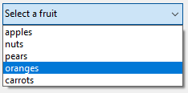
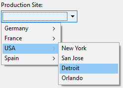

Les listes déroulantes sont des objets de formulaire qui permettent à l'utilisateur de sélectionner un élément dans une liste. Vous gérez les éléments qui apparaissent dans les listes déroulantes à l’aide d'un objet, d'un tableau, d’une énumération ou d'une action standard.

Sous macOS, les listes déroulantes sont aussi parfois appelées "pop-up menu". Les deux noms font référence aux mêmes objets. Comme le montre l'exemple suivant, l'apparence de ces objets peut différer légèrement selon la plateforme :


## Types de listes déroulantes

Vous pouvez créer différents types de listes déroulantes avec différentes fonctionnalités. Pour définir un type, sélectionnez les valeurs **Type d'expression** et **Type de données** dans la liste des Propriétés, ou utilisez leur équivalent JSON.

| Type                                          | Fonctionnalités                                                            | Type d’expression | Type de données                               | Définition JSON                                                                                                                                               |
| --------------------------------------------- | -------------------------------------------------------------------------- | ----------------- | --------------------------------------------- | ------------------------------------------------------------------------------------------------------------------------------------------------------------- |
| Objet                                         | Construit sur une collection                                               | Objet             | Numérique, texte, date ou heure               | `dataSourceTypeHint: object` + `numberFormat: <format>` ou `textFormat: <format>` ou `dateFormat: <format>` ou `timeFormat: <format>` |
| Tableau                                       | Construit sur un tableau                                                   | Tableau           | Numérique, texte, date ou heure               | `dataSourceTypeHint: arrayNumber` ou `arrayText` or `arrayDate` ou `arrayTime`                                                                                |
| Enumération enregistrée en tant que valeur    | Construit sur une liste de choix (standard)                                | Liste             | Valeur de l'élément sélectionné               | `dataSourceTypeHint: text` + `saveAs: value`                                                                                                                  |
| Enumération enregistrée en tant que référence | Construit sur une liste de choix. La position de l'élément est sauvegardée | Liste             | Référence de l'élément sélectionné            | `dataSourceTypeHint: integer` + `saveAs: reference`                                                                                                           |
| Enumération hiérarchique                      | Peut afficher un contenu hiérarchique                                      | Liste             | Référence de liste                            | `dataSourceTypeHint: integer`                                                                                                                                 |
| Action standard                               | Construit automatiquement par l'action                                     | *any*             | *tous à l'exception de la référence de liste* | toute définition + `action : <action>` (+ `focusable: false` pour les actions s'appliquant à d'autres zones)                                            |

## Gestion des listes déroulantes

### Utiliser un objet

> Cette fonctionnalité n'est disponible que dans les projets 4D.

Un [objet](Concepts/dt_object.md) encapsulant une [collection ](Concepts/dt_collection) peut être utilisé comme source de données d'une liste déroulante. Cet objet doit avoir les propriétés suivantes :

| Propriété      | Type                   | Description                                                                                                                                                                                                                                                                 |
| -------------- | ---------------------- | --------------------------------------------------------------------------------------------------------------------------------------------------------------------------------------------------------------------------------------------------------------------------- |
| `values`       | Collection             | Obligatoire - Collection de valeurs scalaires. Toutes les valeurs doivent être du même type. Types pris en charge :<li>chaînes</li><li>nombres</li><li>dates</li><li>heures</li>Si vide ou non définie, la liste déroulante est vide |
| `index`        | number                 | Indice de l'élément sélectionné (valeur comprise entre 0 et `collection.length-1`). Si vous passez -1, `currentValue` est affiché sous la forme d'un texte exemple                                                                                                          |
| `currentValue` | identique à Collection | Élément actuellement sélectionné (utilisé comme texte exemple si passé par code)                                                                                                                                                                                            |

Si l'objet contient d'autres propriétés, elles sont ignorées.

Pour initialiser l'objet associé à la liste déroulante, vous pouvez :

* Entrer une liste de valeurs par défaut dans les propriétés de l'objet en sélectionnant `\&#060; Static List&#062;` dans le thème [Source de données](properties_DataSource.md) de la liste des propriétés. Les valeurs par défaut sont chargées automatiquement dans un objet.

* Exécuter le code qui crée l'objet et ses propriétés. Par exemple, si "myList" est la [variable](properties_Object.md#variable-or-expression) associée à la liste déroulante, vous pouvez écrire dans l'événement formulaire [On Load](Events/onLoad.md):

```4d
// Form.myDrop is the datasource of the form object

Form.myDrop:=New object
Form.myDrop.values:=New collection("apples"; "nuts"; "pears"; "oranges"; "carrots")
Form.myDrop.index:=-1  //currentValue is a placeholder
Form.myDrop.currentValue:="Select a fruit" 
```

La liste déroulante est affichée avec le texte d'exemple :


Après que l'utilisateur sélectionne une valeur :



```4d
Form.myDrop.values // ["apples","nuts","pears","oranges","carrots"]
Form.myDrop.currentValue //"oranges"
Form.myDrop.index //3
```

### Utiliser un tableau

Un [tableau](Concepts/arrays.md) est une liste de valeurs gardées en mémoire qui sont référencées par le nom du tableau. Une liste déroulante peut afficher un tableau comme une liste de valeurs lorsque vous cliquez dessus.

Pour initialiser le tableau associé à la liste déroulante, vous pouvez :

* Entrer une liste de valeurs par défaut dans les propriétés de l'objet en sélectionnant `\&#060; Static List&#062;` dans le thème [Source de données](properties_DataSource.md) de la liste des propriétés. Les valeurs par défaut sont automatiquement chargées dans un tableau. Vous pouvez faire référence à ce tableau par l’intermédiaire du nom de la variable associée à l’objet.

* Avant que l’objet ne soit affiché, exécutez une méthode qui affecte des valeurs au tableau. Par exemple :

```4d
  ARRAY TEXT(aCities;6) 
  aCities{1}:="Philadelphia" 
  aCities{2}:="Pittsburg" 
  aCities{3}:="Grand Blanc" 
  aCities{4}:="Bad Axe" 
  aCities{5}:="Frostbite Falls" 
  aCities{6}:="Green Bay" 
```

Dans ce cas, le nom de la [variable](properties_Object.md#variable-or-expression) associée à l'objet dans le formulaire doit être `aCities`. Ce code peut être placé dans la méthode formulaire et être exécuté lorsque l’événement formulaire `Sur chargement` se produit.

* Avant que l’objet ne soit affiché, chargez les valeurs d’une énumération dans le tableau à l’aide de la commande [LIST TO ARRAY](https://doc.4d.com/4dv19/help/command/en/page288.html). Par exemple :

```4d
   LIST TO ARRAY("Cities";aCities)
```

Dans ce cas également, le nom de la [variable](properties_Object.md#variable-or-expression) associée à l'objet dans le formulaire doit être `aCities`. Ce code peut être exécuté à la place de celui proposé plus haut.

Si vous voulez stocker dans un champ le choix de l’utilisateur, il est nécessaire d’écrire du code pour affecter les valeurs et de l’exécuter après la validation de l’enregistrement. Ce code pourrait être le suivant :

```4d
  Case of
    :(Form event=On Load)
       LIST TO ARRAY("Cities";aCities)
       If(Record number([People])<0) /Nouvel enregistrement
          aCities:=3 /affiche une valeur par défaut
       Else /enregistrement existant, on affiche une valeur stockée
          aCities:=Find in array(aCities;City)
       End if
    :(Form event=On Clicked) /La sélection a été modifiée
       City:=aCities{aCities} /La nouvelle valeur est assignée au champ
    :(Form event=On Validate)
       City:=aCities{aCities}
    :(Form event=On Unload)
       CLEAR VARIABLE(aCities)
 End case
```

Vous devez sélectionner chaque événement que vous testez dans votre Au cas où. Les tableaux contiennent toujours un nombre fini d’éléments. La liste des éléments est dynamique et peut être modifiée par programmation. Les éléments d’un tableau peuvent être modifiés et triés.

### Utiliser une énumération

Si vous voulez utiliser une liste déroulante pour gérer les valeurs d'une zone de saisie (champ ou variable), 4D vous permet de référencer le champ ou la variable directement comme [source de données](properties_Object.md#variable-or-expression) de la liste déroulante. Cette possibilité facilite la gestion des champs/variables énuméré(e) s.

Par exemple, dans le cas d'un champ "Couleur" qui ne peut contenir que les valeurs "Blanc", "Bleu", "Vert" ou "Rouge", il est possible de créer une liste contenant ces valeurs et de l'associer à une liste déroulante qui fait référence au champ "Couleur" 4D. 4D se charge alors de gérer automatiquement la saisie et l’affichage de la valeur courante dans le formulaire.
> Si vous utilisez une énumération hiérarchique, seul le premier niveau sera affiché et sélectionnable. Si vous voulez afficher le contenu de la hiérarchie, vous devez utiliser une [liste hiérarchique](#using-a-hierarchical-choice-list).

Pour associer une liste déroulante avec un champ ou une variable, entrez le nom du champ ou de la variable directement comme champ [Variable ou Expression](properties_Object.md#variable-or-expression) de la liste déroulante de la Liste des Propriétés.
> Il n'est pas possible d'utiliser cette fonctionnalité avec un objet ou une liste déroulante de tableaux. Si vous entrez un nom de champ dans la zone "Variable ou Expression", vous devez utiliser une énumération.

Lorsque le formulaire est exécuté, 4D gère automatiquement la liste déroulante lors de la saisie ou de l'affichage : lorsque l'utilisateur choisit une valeur, celle-ci est enregistrée dans le champ ; cette valeur de champ est affichée dans la liste déroulante lors de l'affichage du formulaire :


#### Valeur de l'élément sélectionné ou Référence de l'élément sélectionné

Lorsque vous avez associé une liste déroulante avec une liste déroulante et avec un champ ou une variable, vous pouvez configurer la propriété [**Type de données**](properties_DataSource.md#data-type) sur **Valeur de l'élément sélectionné** ou **Référence de l'élément sélectionné**. Cette option permet d'optimiser la taille des données stockées.

### Utiliser une énumération hiérarchique

Une liste déroulante hiérarchique a une sous-liste associée à chaque élément de la liste. Voici un exemple de liste déroulante hiérarchique :



> Dans les formulaires, les listes déroulantes hiérarchiques sont limitées à deux niveaux.

Vous pouvez assigner l'énumération hiérarchique à l'objet liste déroulante en utilisant le champ [Enumération](properties_DataSource.md#choice-list) de la Liste des propriétés.

Vous gérez les listes déroulantes hiérarchiques en utilisant les commandes **Listes hiérarchiques** du langage 4D. Toutes les commandes qui prennent en charge la syntaxe `(*; "name")` peuvent être utilisées avec les listes déroulantes hiérarchiques, comme [`List item parent`](https://doc.4d.com/4dv19/help/command/en/page633.html).

### Utiliser une action standard

Vous pouvez créer automatiquement une liste déroulante à l'aide d'une [action standard](properties_Action.md#standard-action). Cette fonctionnalité est prise en charge dans les contextes suivants :

* Utilisation de l'action standard `gotoPage`. Dans ce cas, 4D affichera automatiquement la [page du formulaire](FormEditor/forms.md#form-pages) qui correspond au numéro de l'élément sélectionné. Par exemple, si l’utilisateur clique sur le 3e élément, 4D affichera la page 3 du formulaire courant (si elle existe). Au moment de l'exécution, la liste déroulante affiche par défaut les numéros de page (1, 2...).

* Utilisation d'une action standard qui affiche une sous-liste d'éléments, par exemple `backgroundColor`. Cette fonctionnalité nécessite que :
  * une zone de texte stylée ([zone 4D Write Pro](writeProArea_overview.md) ou [zone de saisie](input_overview.md) avec propriété [multistyle](properties_Text.md#multi-style) ) est présente dans le formulaire comme cible de l'action standard.
  * la propriété [focusable](properties_Entry.md#focusable) n'est pas définie pour la liste déroulante. Lors de l'exécution, la liste déroulante affichera une liste automatique de valeurs, par exemple les couleurs d'arrière-plan. Vous pouvez remplacer cette liste automatique par une liste personnalisée en associant à l'objet une énumération dans laquelle chaque élément a lui-même été assigné à une action standard.

> Cette fonctionnalité ne peut pas être utilisée avec une liste déroulante hiérarchique.

## Propriétés prises en charge

[Alpha Format](properties_Display.md#alpha-format) - [Bold](properties_Text.md#bold) - [Bottom](properties_CoordinatesAndSizing.md#bottom) - [Button Style](properties_TextAndPicture.md#button-style) - [Choice List](properties_DataSource.md#choice-list) - [Class](properties_Object.md#css-class) - [Data Type (expression type)](properties_DataSource.md#data-type-expression-type) - [Data Type (list)](properties_DataSource.md#data-type-list) - [Date Format](properties_Display.md#date-format) - [Expression Type](properties_Object.md#expression-type) - [Focusable](properties_Entry.md#focusable) - [Font](properties_Text.md#font) - [Font Color](properties_Text.md#font-color) - [Font Size](properties_Text.md#font-size) - [Height](properties_CoordinatesAndSizing.md#height) - [Help Tip](properties_Help.md#help-tip) - [Horizontal Sizing](properties_ResizingOptions.md#horizontal-sizing) - [Italic](properties_Text.md#italic) - [Left](properties_CoordinatesAndSizing.md#left) - [Not rendered](properties_Display.md#not-rendered) - [Object Name](properties_Object.md#object-name) - [Right](properties_CoordinatesAndSizing.md#right) - [Standard action](properties_Action.md#standard-action) - [Save value](properties_Object.md#save-value) - [Time Format](properties_Display.md#time-format) - [Top](properties_CoordinatesAndSizing.md#top) - [Type](properties_Object.md#type) - [Underline](properties_Text.md#underline) - [Variable or Expression](properties_Object.md#variable-or-expression) - [Vertical Sizing](properties_ResizingOptions.md#vertical-sizing) - [Visibility](properties_Display.md#visibility) - [Width](properties_CoordinatesAndSizing.md#width)  
