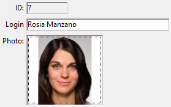

Les zones de saisie vous permettent d'ajouter des expressions saisissables ou non saisissables telles que des [champs](Concepts/identifiers.md#fields) et des [variables](Concepts/variables.md) de base de données à vos formulaires. Les zone de saisie peuvent gérer des données basées sur des caractères (texte, dates, numériques, etc.) ou des images :



Les zones de saisie peuvent contenir [des expressions assignables ou non assignables](Concepts/quick-tour.md#assignable-vs-non-assignable-expressions).

De plus, les zones de saisie peuvent être [saisissables ou non saisissables](properties_Entry.md#enterable). Une zone de saisie saisissable accepte des données. Vous pouvez définir des contrôles de saisie de données pour l'objet. Une zone de saisie non saisissable peut uniquement afficher des valeurs mais ne peut pas être modifiée par l'utilisateur.

Vous pouvez gérer les données avec des [méthodes](Concepts/methods.md) objet ou formulaire.

### Exemple JSON

```4d
 "myText": {
  "type": "input", //define the type of object
  "spellcheck": true, //enable spelling verification
  "left": 60,   //left position on the form  
  "top": 160,   //top position on the form 
  "width": 100,  //width of the object
  "height": 20  //height of the object
  }
```

## Propriétés prises en charge

[Allow font/color picker](properties_Text.md#allow-fontcolor-picker) - [Alpha Format](properties_Display.md#alpha-format) - [Auto Spellcheck](properties_Entry.md#auto-spellcheck) - [Bold](properties_Text.md#bold) - [Test when False/Text when True](properties_Display.md#text-when-falsetext-when-true) - [Border Line Style](properties_BackgroundAndBorder.md#border-line-style) - [Bottom](properties_CoordinatesAndSizing.md#bottom) - [Choice List](properties_DataSource.md#choice-list) - [Class](properties_Object.md#css-class) - [Context Menu](properties_Entry.md#context-menu) - [Date Format](properties_Display.md#date-format) - [Default value](properties_RangeOfValues.md#default-value) - [Draggable](properties_Action.md#draggable) - [Droppable](properties_Action.md#droppable) - [Enterable](properties_Entry.md#enterable) - [Entry Filter](properties_Entry.md#entry-filter) - [Excluded List](properties_RangeOfValues.md#excluded-list) - [Expression type](properties_Object.md#expression-type) - [Fill Color](properties_BackgroundAndBorder.md#background-color--fill-color) - [Font](properties_Text.md#font) - [Font Color](properties_Text.md#font-color) - [Font Size](properties_Text.md#font-size) - [Height](properties_CoordinatesAndSizing.md#height) - [Hide focus rectangle](properties_Appearance.md#hide-focus-rectangle) - [Horizontal Alignment](properties_Text.md#horizontal-alignment) - [Horizontal Scroll Bar](properties_Appearance.md#horizontal-scroll-bar) - [Horizontal Sizing](properties_ResizingOptions.md#horizontal-sizing) - [Italic](properties_Text.md#italic) - [Left](properties_CoordinatesAndSizing.md#left) - [Multiline](properties_Entry.md#multiline) - [Multi-style](properties_Text.md#multi-style) - [Number Format](properties_Display.md#number-format) - [Object Name](properties_Object.md#object-name) - [Orientation](properties_Text.md#orientation) - [Picture Format](properties_Display.md#picture-format) - [Placeholder](properties_Entry.md#placeholder) - [Print Frame](properties_Print.md#print-frame) - [Required List](properties_RangeOfValues.md#required-list) - [Right](properties_CoordinatesAndSizing.md#right) - [Selection always visible](properties_Entry.md#selection-always-visible) - [Store with default style tags](properties_Text.md#store-with-default-style-tags) - [Text when False/Text when True](properties_Display.md#text-when-falsetext-when-true) - [Time Format](properties_Display.md#time-format) - [Top](properties_CoordinatesAndSizing.md#top) - [Type](properties_Object.md#type) - [Underline](properties_Text.md#underline) - [Variable or Expression](properties_Object.md#variable-or-expression) - [Vertical Scroll Bar](properties_Appearance.md#vertical-scroll-bar) - [Vertical Sizing](properties_ResizingOptions.md#vertical-sizing) - [Visibility](properties_Display.md#visibility) - [Width](properties_CoordinatesAndSizing.md#width) - [Wordwrap](properties_Display.md#wordwrap)

---

## Alternatives

Vous pouvez également représenter des expressions de champ et de variable dans vos formulaires à l'aide d'objets alternatifs, plus particulièrement :

* Vous pouvez afficher et saisir des données à partir des champs de la base de données directement dans des colonnes [de type List box](listbox_overview.md).
* Vous pouvez représenter un champ ou une variable liste directement dans un formulaire à l'aide des objets [Pop-up Menus/Listes déroulantes](dropdownList_Overview.md) et [Combo Boxes](comboBox_overview.md).
* Vous pouvez représenter une expression booléenne sous forme de [case à cocher](checkbox_overview.md) ou de [bouton radio](radio_overview.md).
