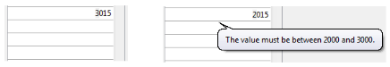
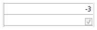
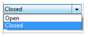
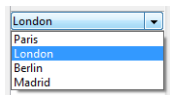
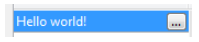

Une list box est composée d'un ou plusieurs objets colonnes qui ont des propriétés spécifiques. Vous pouvez sélectionner une colonne de list box dans l’éditeur de formulaires en cliquant dessus lorsque l’objet List box est sélectionné :


Vous pouvez définir des propriétés standard (texte, couleur de fond, etc.) pour chaque colonne de la list box ; ces propriétés sont prioritaires sur celles de l'objet list box.

> Vous pouvez définir le [Type d'expression](properties_Object.md#expression-type) pour les colonnes de list box de type tableau (Alpha, Texte, Numérique, Date, Heure, Image, Booléen ou Objet).

### Propriétés spécifiques des colonnes {#column-specific-properties}

[Alpha Format](properties_Display.md#alpha-format) - [Alternate Background Color](properties_BackgroundAndBorder.md#alternate-background-color) - [Automatic Row Height](properties_CoordinatesAndSizing.md#automatic-row-height) - [Background Color](properties_BackgroundAndBorder.md#background-color--fill-color) - [Background Color Expression](properties_BackgroundAndBorder.md#background-color-expression) - [Bold](properties_Text.md#bold) - [Choice List](properties_DataSource.md#choice-list) - [Class](properties_Object.md#css-class) - [Context Menu](properties_Entry.md#context-menu) - [Data Type (selection and collection list box column)](properties_DataSource.md#data-type-list) - [Date Format](properties_Display.md#date-format) - [Default Values](properties_DataSource.md#default-list-of-values) - [Display Type](properties_Display.md#display-type) - [Enterable](properties_Entry.md#enterable) - [Entry Filter](properties_Entry.md#entry-filter) - [Excluded List](properties_RangeOfValues.md#excluded-list) - [Expression](properties_DataSource.md#expression) - [Expression Type (array list box column)](properties_Object.md#expression-type) - [Font](properties_Text.md#font) - [Font Color](properties_Text.md#font-color) - [Horizontal Alignment](properties_Text.md#horizontal-alignment) - [Italic](properties_Text.md#italic) - [Invisible](properties_Display.md#visibility) - [Maximum Width](properties_CoordinatesAndSizing.md#maximum-width) - [Method](properties_Action.md#method) - [Minimum Width](properties_CoordinatesAndSizing.md#minimum-width) - [Multi-style](properties_Text.md#multi-style) - [Number Format](properties_Display.md#number-format) - [Object Name](properties_Object.md#object-name) - [Picture Format](properties_Display.md#picture-format) - [Resizable](properties_ResizingOptions.md#resizable) - [Required List](properties_RangeOfValues.md#required-list) - [Row Background Color Array](properties_BackgroundAndBorder.md#row-background-color-array) - [Row Font Color Array](properties_Text.md#row-font-color-array) - [Row Style Array](properties_Text.md#row-style-array) - [Save as](properties_DataSource.md#save-as) - [Style Expression](properties_Text.md#style-expression) - [Text when False/Text when True](properties_Display.md#text-when-falsetext-when-true) - [Time Format](properties_Display.md#time-format) - [Truncate with ellipsis](properties_Display.md#truncate-with-ellipsis) - [Underline](properties_Text.md#underline) - [Variable or Expression](properties_Object.md#variable-or-expression) - [Vertical Alignment](properties_Text.md#vertical-alignment) - [Width](properties_CoordinatesAndSizing.md#width) - [Wordwrap](properties_Display.md#wordwrap)

## Événements formulaire pris en charge

| Evénement formulaire | Additional Properties Returned (see [Form event](https://doc.4d.com/4Dv20/4D/20.6/FORM-Event.301-7487450.en.html) for main properties)                                                                                                                                      | Commentaires                                                                                                                                                                       |
| -------------------- | ---------------------------------------------------------------------------------------------------------------------------------------------------------------------------------------------------------------------------------------------------------------------------------------------- | ---------------------------------------------------------------------------------------------------------------------------------------------------------------------------------- |
| On After Edit        | <li>[column](./listbox-object#additional-properties)</li><li>[columnName](./listbox-object#additional-properties)</li><li>[row](./listbox-object#additional-properties)</li>                                                                                                                   |                                                                                                                                                                                    |
| On After Keystroke   | <li>[column](./listbox-object#additional-properties)</li><li>[columnName](./listbox-object#additional-properties)</li><li>[row](./listbox-object#additional-properties)</li>                                                                                                                   |                                                                                                                                                                                    |
| On After Sort        | <li>[column](./listbox-object#additional-properties)</li><li>[columnName](./listbox-object#additional-properties)</li><li>[headerName](./listbox-object#additional-properties)</li>                                                                                                            | *Les formules composées ne peuvent pas être triées. <br/>(ex : This.firstName + This.lastName)* |
| On Alternative Click | <li>[column](./listbox-object#additional-properties)</li><li>[columnName](./listbox-object#additional-properties)</li><li>[row](./listbox-object#additional-properties)</li>                                                                                                                   | *Listbox tableau uniquement*                                                                                                                                                       |
| On Before Data Entry | <li>[column](./listbox-object#additional-properties)</li><li>[columnName](./listbox-object#additional-properties)</li><li>[row](./listbox-object#additional-properties)</li>                                                                                                                   |                                                                                                                                                                                    |
| On Before Keystroke  | <li>[column](./listbox-object#additional-properties)</li><li>[columnName](./listbox-object#additional-properties)</li><li>[row](./listbox-object#additional-properties)</li>                                                                                                                   |                                                                                                                                                                                    |
| On Begin Drag Over   | <li>[column](./listbox-object#additional-properties)</li><li>[columnName](./listbox-object#additional-properties)</li><li>[row](./listbox-object#additional-properties)</li>                                                                                                                   |                                                                                                                                                                                    |
| On Clicked           | <li>[column](./listbox-object#additional-properties)</li><li>[columnName](./listbox-object#additional-properties)</li><li>[row](./listbox-object#additional-properties)</li>                                                                                                                   |                                                                                                                                                                                    |
| On Column Moved      | <li>[columnName](./listbox-object#additional-properties)</li><li>[newPosition](./listbox-object#additional-properties)</li><li>[oldPosition](./listbox-object#additional-properties)</li>                                                                                                      |                                                                                                                                                                                    |
| On Column Resize     | <li>[column](./listbox-object#additional-properties)</li><li>[columnName](./listbox-object#additional-properties)</li><li>[newSize](./listbox-object#additional-properties)</li><li>[oldSize](./listbox-object#additional-properties)</li>                                                     |                                                                                                                                                                                    |
| On Data Change       | <li>[column](./listbox-object#additional-properties)</li><li>[columnName](./listbox-object#additional-properties)</li><li>[row](./listbox-object#additional-properties)</li>                                                                                                                   |                                                                                                                                                                                    |
| On Double Clicked    | <li>[column](./listbox-object#additional-properties)</li><li>[columnName](./listbox-object#additional-properties)</li><li>[row](./listbox-object#additional-properties)</li>                                                                                                                   |                                                                                                                                                                                    |
| On Drag Over         | <li>[area](./listbox-object#additional-properties)</li><li>[areaName](./listbox-object#additional-properties)</li><li>[column](./listbox-object#additional-properties)</li><li>[columnName](./listbox-object#additional-properties)</li><li>[row](./listbox-object#additional-properties)</li> |                                                                                                                                                                                    |
| On Drop              | <li>[column](./listbox-object#additional-properties)</li><li>[columnName](./listbox-object#additional-properties)</li><li>[row](./listbox-object#additional-properties)</li>                                                                                                                   |                                                                                                                                                                                    |
| On Footer Click      | <li>[column](./listbox-object#additional-properties)</li><li>[columnName](./listbox-object#additional-properties)</li><li>[footerName](./listbox-object#additional-properties)</li>                                                                                                            | *Arrays, Current Selection & Named Selection list boxes only*                                                                                                  |
| On Getting Focus     | <li>[column](./listbox-object#additional-properties)</li><li>[columnName](./listbox-object#additional-properties)</li><li>[row](./listbox-object#additional-properties)</li>                                                                                                                   | *Propriétés supplémentaires retournées uniquement lors de la modification d'une cellule*                                                                                           |
| On Header Click      | <li>[column](./listbox-object#additional-properties)</li><li>[columnName](./listbox-object#additional-properties)</li><li>[headerName](./listbox-object#additional-properties)</li>                                                                                                            |                                                                                                                                                                                    |
| On Load              |                                                                                                                                                                                                                                                                                                |                                                                                                                                                                                    |
| On Losing Focus      | <li>[column](./listbox-object#additional-properties)</li><li>[columnName](./listbox-object#additional-properties)</li><li>[row](./listbox-object#additional-properties)</li>                                                                                                                   | *Propriétés supplémentaires retournées uniquement lorsque la modification d'une cellule est achevée*                                                                               |
| On Row Moved         | <li>[newPosition](./listbox-object#additional-properties)</li><li>[oldPosition](./listbox-object#additional-properties)</li>                                                                                                                                                                   | *Listbox tableau uniquement*                                                                                                                                                       |
| On Scroll            | <li>[horizontalScroll](./listbox-object#additional-properties)</li><li>[verticalScroll](./listbox-object#additional-properties)</li>                                                                                                                                                           |                                                                                                                                                                                    |
| On Unload            |                                                                                                                                                                                                                                                                                                |                                                                                                                                                                                    |

## Tableaux d'objets dans les colonnes

Les colonnes de list box peuvent être associées à des tableaux d'objets. Comme les tableaux d'objets peuvent contenir des données de types différents, cette puissante fonctionnalité vous permet de saisir et d'afficher divers types de valeurs dans les lignes d'une même colonne, ainsi que d'utiliser divers objets d'interface (widgets). Par exemple, vous pouvez placer une zone de saisie de texte dans la première ligne, une case à cocher dans la seconde, et une liste déroulante dans la troisième. Les tableaux d'objets vous donnent également accès à des widgets supplémentaires, tels que des boutons ou des sélecteurs de couleurs (color picker).

La list box suivante a été définie à l'aide d'un tableau d'objets :


### Configurer une colonne tableau d'objets

To assign an object array to a list box column, you just need to set the object array name in either the Property list ("Variable Name" field), or using the [LISTBOX INSERT COLUMN](https://doc.4d.com/4Dv20/4D/20.6/LISTBOX-INSERT-COLUMN.301-7487606.en.html) command, like with any array-based column. Dans la Liste des propriétés, vous pouvez sélectionner Objet comme "Type de variable" pour la colonne :


Les propriétés standard liées aux coordonnées, taille et style sont disponibles pour les colonnes de type objet. Elles peuvent être gérées à l'aide de la Liste des propriétés, ou en programmant les attributs de style, visibilité, couleur de police et de fond de chaque ligne de colonne objet de la list box. Ce type de colonne peut également être masqué.

Toutefois, le thème Source de données n'est pas disponible pour les colonnes objet des list box. En fait, le contenu de chaque cellule de la colonne est basé sur les attributs présents dans l'élément correspondant du tableau d'objets. Chaque élément du tableau peut définir :

le type de valeur (obligatoire) : texte, couleur, événement, etc.
la valeur elle-même (optionnel) : utilisé aussi bien pour la saisie que pour l'affichage.
le mode d'affichage du contenu de la cellule (optionnel) : bouton, liste, etc.
des paramètres supplémentaires (optionnel) : dépend du type de valeur
Pour définir ces propriétés, vous devez placer les attributs adéquats dans l'objet (la liste des attributs disponibles est fournie ci-dessous). Par exemple, vous pouvez écrire "Hello World!" dans une colonne objet à l'aide de ce simple code :

```4d
ARRAY OBJECT(obColumn;0) // tableau de colonnes
 C_OBJECT($ob) //premier élément
 OB SET($ob; "valueType" ; "text") //définit le type de valeur (obligatoire)
 OB SET($ob; "value" ; "Hello World !") //définit la valeur
 APPEND TO ARRAY(obColumn ;$ob)  
```


> Il n'est pas possible de choisir un format d'affichage et/ou un filtre de saisie pour les colonnes objet. Ces paramètres sont automatiquement définis en fonction du type de valeur.

#### valueType et affichage des données

Lorsqu'une colonne de list box est associée à un tableau d'objets, l'affichage, la saisie et l'édition des cellules sont basées sur l'attribut valueType présent dans chaque élément du tableau. Les valeurs valueType prises en charge sont les suivantes :

- "text" : pour une valeur texte
- "real": for a numeric value that can include separators like a `\<space>`, <.>, or <,>
- "integer" : pour une valeur entière
- "boolean" : pour une valeur True/False
- "color" : pour définir une couleur de fond
- "event" : pour afficher un bouton avec un libellé.

4D utilise des widgets par défaut selon la valeur "valueType" (c'est-à-dire qu'un "text" est affiché comme un widget de saisie de texte, un "boolean" comme une case à cocher), mais d'autres affichages sont également disponibles par le biais d'options (*e.g.*, un réel peut également être représenté comme un menu déroulant). Le tableau suivant indique l'affichage par défaut ainsi que les variations possibles pour chaque type de valeur :

| valueType | Format défaut                                                                | Widget(s) alternatif(s)                                                                          |
| --------- | ---------------------------------------------------------------------------- | -------------------------------------------------------------------------------------------------------------------------------------- |
| text      | zone de saisie de texte                                                      | menu déroulant (enumération obligatoire) ou combo box (enumération)                              |
| réel      | zone de saisie de texte contrôlée (nombre et séparateurs) | menu déroulant (enumération obligatoire) ou combo box (enumération)                              |
| integer   | zone de saisie de texte contrôlée (nombre)                | menu déroulant (enumération obligatoire) ou combo box (enumération) ou case à cocher trois états |
| boolean   | case à cocher                                                                | menu déroulant (enumération obligatoire)                                                                            |
| color     | couleur de fond                                                              | text                                                                                                                                   |
| event     | bouton avec libellé                                                          |                                                                                                                                        |
|           |                                                                              | Tous les widgets peuvent associer un unit toggle button ou ellipsis button à la cellule.                               |

Vous définissez l'affichage de la cellule et les variations à l'aide d'attributs spécifiques dans chaque objet (voir ci-dessous).

#### Formats d'affichage et filtres de saisie

Il n'est pas possible de choisir un format d'affichage et/ou un filtre de saisie pour les colonnes objet des list box. Ils sont automatiquement définis en fonction du type de valeur. Ils sont listés dans le tableau suivant :

| Value type | Format défaut                                                                               | Contrôle de saisie                                          |
| ---------- | ------------------------------------------------------------------------------------------- | ----------------------------------------------------------- |
| text       | le même que celui de l'objet                                                                | pas de contrôle (tout caractère accepté) |
| réel       | le même que celui de l'objet (utilisation du séparateur décimal système) | "0-9" et "." et "-"                         |
|            |                                                                                             | "0-9" et "." si min>=0                      |
| integer    | le même que celui de l'objet                                                                | "0-9" et "-"                                                |
|            |                                                                                             | "0-9" si min>=0                                             |
| Boolean    | case à cocher                                                                               | N/A                                                         |
| color      | N/A                                                                                         | N/A                                                         |
| event      | N/A                                                                                         | N/A                                                         |

### Attributs

Chaque élément du tableau d'objets est un objet qui peut contenir un ou plusieurs attributs qui définiront le contenu de la cellule et l'affichage des données (voir exemple ci-dessus).

L'unique attribut obligatoire est "valueType" et ses valeurs acceptées sont "text", "real", "integer", "boolean", "color" et "event". Le tableau suivant liste tous les attributs acceptés dans les tableaux d'objets des list box, suivant la valeur de "valueType" (tout autre attribut est ignoré). Les formats d'affichage et des exemples sont fournis ci-dessous.

|                       | valueType                                                     | text | réel | integer | boolean | color | event |
| --------------------- | ------------------------------------------------------------- | ---- | ---- | ------- | ------- | ----- | ----- |
| *Attributs*           | *Description*                                                 |      |      |         |         |       |       |
| value                 | valeur de la cellule (saisie ou affichage) | x    | x    | x       |         |       |       |
| min                   | valeur minimum                                                |      | x    | x       |         |       |       |
| max                   | valeur maximum                                                |      | x    | x       |         |       |       |
| behavior              | valeur "threeStates"                                          |      |      | x       |         |       |       |
| requiredList          | menu déroulant défini dans l'objet                            | x    | x    | x       |         |       |       |
| choiceList            | combo box défini dans l'objet                                 | x    | x    | x       |         |       |       |
| requiredListReference | RefList 4D, dépend de la valeur de "saveAs"                   | x    | x    | x       |         |       |       |
| requiredListName      | nom d'énumération 4D, dépend de la valeur de "saveAs"         | x    | x    | x       |         |       |       |
| saveAs                | "reference" ou "value"                                        | x    | x    | x       |         |       |       |
| choiceListReference   | RefList 4D, affiche une combo box                             | x    | x    | x       |         |       |       |
| choiceListName        | nom d'énumération 4D, affiche une combo box                   | x    | x    | x       |         |       |       |
| unitList              | tableau de X éléments                                         | x    | x    | x       |         |       |       |
| unitReference         | indice de l'élément sélectionné                               | x    | x    | x       |         |       |       |
| unitsListReference    | RefList 4D pour les unités                                    | x    | x    | x       |         |       |       |
| unitsListName         | nom d'énumération 4D pour les unités                          | x    | x    | x       |         |       |       |
| alternateButton       | ajouter un bouton alternatif                                  | x    | x    | x       | x       | x     |       |

#### value

La valeur des cellules est stockée dans l'attribut "value". Cet attribut est utilisé pour la saisie (entrée) et pour l'affichage (sortie). Il peut également être utilisé pour définir des valeurs par défaut lors de l'utilisation des listes (voir ci-dessous).

```4d
 ARRAY OBJECT(obColumn;0) //column array
 C_OBJECT($ob1)
 $entry:="Hello world!"
 OB SET($ob1;"valueType";"text")
 OB SET($ob1;"value";$entry) // if the user enters a new value, $entry will contain the edited value
 C_OBJECT($ob2)
 OB SET($ob2;"valueType";"real")
 OB SET($ob2;"value";2/3)
 C_OBJECT($ob3)
 OB SET($ob3;"valueType";"boolean")
 OB SET($ob3;"value";True)
 
 APPEND TO ARRAY(obColumn;$ob1)
 APPEND TO ARRAY(obColumn;$ob2)
 APPEND TO ARRAY(obColumn;$ob3)
```


> La valeur Null est acceptée, elle définit une cellule vide.

#### min et max

Lorsque le "valueType" est "real" ou "integer", l'objet accepte également les attributs min et max avec les valeurs appropriées (les valeurs doivent être du même type que valueType).

Ces attributs peuvent être utilisés pour contrôler la plage de valeurs d'entrée. Lorsqu'une cellule est validée (lorsqu'elle perd le focus), si la valeur de saisie est inférieure à la valeur minimale ou supérieure à la valeur maximale, elle est rejetée. Dans ce cas, la valeur précédente est conservée et une astuce affiche une explication.

```4d
 C_OBJECT($ob3)
 $entry3:=2015
 OB SET($ob3;"valueType";"integer")
 OB SET($ob3;"value";$entry3)
 OB SET($ob3;"min";2000)
 OB SET($ob3;"max";3000)
```



#### behavior

L'attribut behavior propose des variations de la représentation standard des valeurs. Une seule variation est possible :

| Attribut | Valeur(s) disponible(s) | valueType(s) | Description                                                                                                                                                                                                             |
| -------- | ------------------------------------------------------------- | ------------------------------- | ----------------------------------------------------------------------------------------------------------------------------------------------------------------------------------------------------------------------- |
| behavior | threeStates                                                   | integer                         | Représente une valeur numérique sous la forme d'une case à cocher à trois états.<br/> 2=semi-coché, 1=coché, 0=décoché, -1=invisible, -2=décoché désactivé, -3=coché désactivé, -4=semi-coché désactivé |

```4d
 C_OBJECT($ob3)
 OB SET($ob3;"valueType";"integer")

 OB SET($ob3;"value";-3)
 C_OBJECT($ob4)


 OB SET($ob4;"valueType";"integer")
 OB SET($ob4;"value";-3)
 OB SET($ob4;"behavior";"threeStates")
```



#### requiredList et choiceList

Lorsqu'un attribut "choiceList" ou "requiredList" est présent dans l'objet, la zone de saisie de texte est remplacée par une liste déroulante ou une combo box, en fonction de l'attribut :

- Si l'attribut est "choiceList", la cellule est affichée sous forme de combo box. Cela signifie que l'utilisateur peut sélectionner ou saisir une valeur.
- Si l'attribut est "requiredList", la cellule est affichée sous forme de liste déroulante. Cela signifie que l'utilisateur peut uniquement sélectionner une des valeurs de la liste.

Dans les deux cas, vous pouvez utiliser un attribut "value" pour présélectionner une valeur dans le widget.

> Les valeurs du widget sont définies via un tableau. Si vous souhaitez associer le widget à une énumération 4D existante, vous devez utiliser les attributs "requiredListReference", "requiredListName", "choiceListReference" ou "choiceListName".

Exemples :

- Vous voulez afficher une liste déroulante avec juste deux options, "Open" ou "Closed". "Closed" doit être présélectionné :

```4d
 ARRAY TEXT($RequiredList;0)
 APPEND TO ARRAY($RequiredList;"Open")
 APPEND TO ARRAY($RequiredList;"Closed")
 C_OBJECT($ob)
 OB SET($ob;"valueType";"text")
 OB SET($ob;"value";"Closed")
 OB SET ARRAY($ob;"requiredList";$RequiredList)
```



- Vous voulez accepter toute valeur entière, mais afficher une combo box contenant les valeurs les plus communes :

```4d
 ARRAY LONGINT($ChoiceList;0)
 APPEND TO ARRAY($ChoiceList;5)
 APPEND TO ARRAY($ChoiceList;10)
 APPEND TO ARRAY($ChoiceList;20)
 APPEND TO ARRAY($ChoiceList;50)
 APPEND TO ARRAY($ChoiceList;100)
 C_OBJECT($ob)
 OB SET($ob;"valueType";"integer")
 OB SET($ob;"value";10) //10 as default value
 OB SET ARRAY($ob;"choiceList";$ChoiceList)
```


#### requiredListName et requiredListReference

Les attributs "requiredListName" et "requiredListReference" vous permettent d'utiliser, dans une cellule de list box, une énumération définie dans 4D soit en mode Développement (via l'éditeur d'Enumérations de la Boîte à outils) soit par programmation (à l'aide de la commande New list). La cellule sera alors affichée sous forme de liste déroulante. Cela signifie que l'utilisateur pourra uniquement choisir une des valeurs fournies dans la liste.

Utilisez "requiredListName" ou "requiredListReference" en fonction de la provenance de la liste : si la liste provient de la Boîte à outils, utilisez son nom ; sinon, si la liste a été définie par programmation, passez sa référence. Dans les deux cas, vous pouvez utiliser un attribut "value" pour présélectionner une valeur dans le widget.

> - Si vous souhaitez définir des valeurs d'énumération via un simple tableau, vous pouvez utiliser l'attribut "requiredList".
> - Si la liste contient du texte représentant des valeurs réelles, le séparateur décimal doit être le point ("."), quels que soient les paramètres locaux, ex : "17.6" "1234.456".

Exemples :

- Vous voulez afficher une liste déroulante basée sur une énumération nommée "colors" définie dans la Boîte à outils (contenant les valeurs "bleu", "jaune" et "vert"), la stocker en tant que valeur et afficher "bleu" par défaut :


```4d
 C_OBJECT($ob)
 OB SET($ob;"valueType";"text")
 OB SET($ob;"saveAs";"value")
 OB SET($ob;"value";"blue")
 OB SET($ob;"requiredListName";"colors") 
```


- Vous voulez afficher une liste déroulante basée sur une liste créée par programmation, et la stocker en tant que référence :

```4d
 <>List:=New list
 APPEND TO LIST(<>List;"Paris";1)
 APPEND TO LIST(<>List;"London";2)
 APPEND TO LIST(<>List;"Berlin";3)
 APPEND TO LIST(<>List;"Madrid";4)
 C_OBJECT($ob)
 OB SET($ob;"valueType";"integer")
 OB SET($ob;"saveAs";"reference")
 OB SET($ob;"value";2) //displays London by default
 OB SET($ob;"requiredListReference";<>List)
```



#### choiceListName et choiceListReference

Les attributs "choiceListName" et "choiceListReference" permettent d'utiliser, dans une cellule de list box, une énumération définie dans 4D soit en mode Développement (via l'éditeur de la Boîte à outils) soit par programmation (à l'aide de la commande New list). La cellule sera alors affichée sous forme de combo box, ce qui signifie que l'utilisateur pourra choisir une des valeurs de la liste ou en saisir une.

Utilisez "choiceListName" ou "choiceListReference" en fonction de la provenance de la liste : si la liste provient de la Boîte à outils, utilisez son nom ; sinon, si la liste a été définie par programmation, passez sa référence. Dans les deux cas, vous pouvez utiliser un attribut "value" pour présélectionner une valeur dans le widget.

> - Si vous souhaitez définir des valeurs d'énumération via un simple tableau, vous pouvez utiliser l'attribut "choiceList".
> - Si la liste contient du texte représentant des valeurs réelles, le séparateur décimal doit être le point ("."), quels que soient les paramètres locaux, ex : "17.6" "1234.456".

Exemple :

Vous voulez afficher une combo box basée sur une énumération nommée "colors" définie dans la Boîte à outils (contenant les valeurs "bleu", "jaune" et "vert") et afficher "vert" par défaut :


```4d
 C_OBJECT($ob)
 OB SET($ob;"valueType";"text")
 OB SET($ob;"value";"blue")
 OB SET($ob;"choiceListName";"colors")
```


#### unitsList, unitsListName, unitsListReference et unitReference

Vous pouvez utiliser des attributs spécifiques afin d'associer des unités aux valeurs des cellules (par exemple "10 cm", "20 pixels", etc.). Pour définir une liste d'unités, vous pouvez utiliser l'un des attributs suivants :

- "unitsList" : un tableau contenant les x éléments définissant les unités disponibles (ex : "cm", "pouces", "km", "miles", etc.). Utilisez cet attribut pour définir des unités dans l'objet.
- "unitsListReference" : une référence de liste 4D contenant les unités disponibles. "unitsListReference" : une référence de liste 4D contenant les unités disponibles.
- "unitsListName" : un nom d'énumération 4D créée en mode Développement contenant les unités disponibles. Utilisez cet attribut pour définir des unités à l'aide d'une énumération 4D créée dans la Boîte à outils.

Quel que soit son mode de définition, la liste d'unités peut être associée à l'attribut suivant :

- "unitReference" : une valeur simple contenant l'indice (de 1 à x) de l'élément sélectionné dans la liste de valeurs "unitList", "unitsListReference" ou "unitsListName".

L'unité courante est affichée sous forme de bouton affichant successivement les valeurs de "unitList", "unitsListReference" ou "unitsListName" à chaque clic (par exemple "pixels" -> "lignes" -> "cm" -> "pixels" -> etc.)

Exemple :

Vous souhaitez définir une valeur de saisie numérique suivie d'une unité parmi deux possibles : "cm" ou "pixels". La valeur courante est "2" + "cm". Vous utilisez des valeurs définies directement dans l'objet (attribut "unitsList") :

```4d
ARRAY TEXT($_units;0)
APPEND TO ARRAY($_units;"cm")
APPEND TO ARRAY($_units;"pixels")
C_OBJECT($ob)
OB SET($ob;"valueType";"integer")
OB SET($ob;"value";2) // 2 "units"
OB SET($ob;"unitReference";1) //"cm"
OB SET ARRAY($ob;"unitsList";$_units)
```


#### alternateButton

Si vous souhaitez ajouter un bouton ellipse [...] à une cellule, il suffit de passer "alternateButton" avec la valeur True dans l'objet. Le bouton sera automatiquement affiché dans la cellule.

Lorsque l'utilisateur clique sur ce bouton, un événement `On Alternative Click` est généré, vous permettant de traiter cette action comme vous le souhaitez (reportez-vous ci-dessous au paragraphe "Gestion des événements" pour plus d'informations).

Exemple :

```4d
C_OBJECT($ob1)
$entry:="Hello world!"
OB SET($ob;"valueType";"text")
OB SET($ob;"alternateButton";True)
OB SET($ob;"value";$entry)
```



#### valueType color

L'attribut "valueType" de valeur "color" vous permet d'afficher soit une couleur, soit un texte.

- Si la valeur est un nombre, un rectangle de couleur est dessiné à l'intérieur de la cellule. Exemple :

 ```4d
 C_OBJECT($ob4)
 OB SET($ob4;"valueType";"color")
 OB SET($ob4;"value";0x00FF0000)
 ```


- Si la valeur est un texte, le texte est simplement affiché (par exemple : "value";"Automatic").

#### valueType event

L'attribut "valueType" de valeur "event" affiche un bouton qui génère simplement un événement `On Clicked` lorsque l'utilisateur clique dessus. Aucune donnée ou valeur ne peut être passée ou retournée.

Optionnellement, il est possible de passer un attribut "label".

Exemple :

```4d
C_OBJECT($ob)
OB SET($ob;"valueType";"event")
OB SET($ob;"label";"Edit...")
```


### Gestion des événements

Plusieurs événements peuvent être gérés lors de l'utilisation d'une listbox tableau d'objets :

- **Sur données modifiées** : L'événement `On Data Change` est généré en cas de modification d'une valeur de la colonne, quel que soit le widget :
  - zone de saisie de texte
  - listes déroulante
  - zone de combo box
  - bouton d'unité (passage valeur x à valeur x+1)
  - case à cocher (passage cochée/non cochée)
- **Sur clic** : Lorsque l'utilisateur clique sur un bouton installé à l'aide de l'attribut *valueType*, un événement `On Clicked` est généré. Cet événement doit être ensuite géré par le programmeur.
- **Sur clic alternatif** : Lorsque l'utilisateur clique sur un bouton d'ellipse (attribut "alternateButton"), un événement `On Alternative Click` est généré. Cet événement doit être ensuite géré par le programmeur.
