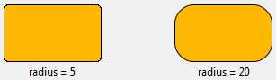

## Hauteur de ligne automatique

Cette propriété n'est disponible que pour les list box de type tableau, non hiérarchiques. Par défaut, cette option n'est pas sélectionnée.

Lorsqu'elle est utilisée, la hauteur de chaque ligne de la colonne est automatiquement calculée par 4D, et le contenu de la colonne est pris en compte. A noter que seules les colonnes avec l'option sélectionnée seront prises en compte pour calculer la hauteur de ligne.
> Lors du redimensionnement du formulaire, si la propriété de [dimensionnement horizontal](properties_ResizingOptions.md#horizontal-sizing) "Agrandir" a été affectée à la list box, la colonne la plus à droite sera agrandie, allant au-delà de sa largeur maximale, si nécessaire.

Lorsque cette propriété est activée, la hauteur de chaque ligne est automatiquement calculée afin d'ajuster entièrement le contenu de la cellule ajusté sans être tronqué (sauf si l'option [Wordwrap](properties_Display.md#wordwrap) est désactivée.

* Le calcul de la hauteur de ligne prend en compte :
  * tout type de contenu (texte, numérique, dates, heures, images (le calcul dépend du format de l'image), objets),
  * tout types de contrôle (zones de saisie, cases à cocher, listes, listes déroulantes),
  * polices, styles de polices et tailles de polices,
  * l'option [Retour à la ligne](properties_Display.md#wordwrap) : si elle est désactivée, la hauteur est basée sur le nombre de paragraphes (les lignes sont tronquées); si elle est activée, la hauteur est basée sur le nombre de lignes (non tronquées).

* Le calcul de la hauteur de ligne ne tient pas compte de :
  * du contenu de colonne masqué
  * des propriétés du tableau [Hauteur de ligne](#row-height) et [Tableau hauteur de lignes](#row-height-array) (le cas échéant) définies dans la liste de propriété ou par programmation.
> Etant donné qu'elle nécessite des calculs supplémentaires lors de l'exécution, l'option "hauteur de ligne automatique" peut avoir une incidence sur la fluidité du défilement de votre list box, en particulier lorsqu'elle contient un grand nombre de lignes.

#### Grammaire JSON

| Nom           | Type de données | Valeurs possibles |
| ------------- | --------------- | ----------------- |
| rowHeightAuto | boolean         | true, false       |

#### Objets pris en charge

[\[Colonne de list box\](listbox_overview.md#list-box-columns)](listbox_overview.md#list-box-columns)

---

## Bas

Coordonnées inférieures de l'objet dans le formulaire.

#### Grammaire JSON

| Nom    | Type de données | Valeurs possibles |
| ------ | --------------- | ----------------- |
| bottom | number          | minimum : 0       |

#### Objets pris en charge

[Zone 4D View Pro](viewProArea_overview.md) - [Zone 4D Write Pro](writeProArea_overview.md) - [Bouton](button_overview.md) - [Grille de boutons](buttonGrid_overview.md) - [Case à cocher](checkbox_overview.md) - [Combo Box](comboBox_overview.md) - [Liste déroulante](dropdownList_Overview.md) - [Group Box](groupBox.md) - [Liste hiérarchique](list_overview.md#overview) - [Zone de saisie](input_overview.md) - [List Box](listbox_overview.md#overview) - [Ligne](shapes_overview.md#line) - [Colonne List Box](listbox_overview.md#list-box-columns) - [Ovale](shapes_overview.md#oval) - [Bouton image](pictureButton_overview.md) - [Pop up menu image](picturePopupMenu_overview.md) - [Zone de plug-in](pluginArea_overview.md#overview) - [Indicateur de progression](progressIndicator.md) - [Bouton radio](radio_overview.md) - [Règle](ruler.md) - [ Rectangle](shapes_overview.md#rectangle) - [Spinner](spinner.md) - [Splitter](splitters.md) - [Image statique](staticPicture.md) [Stepper](stepper.md) - [Sous-formulaire](subform_overview.md) - [Onglet](tabControl.md) - [Zone de texte](text.md) - [Zone Web](webArea_overview.md#overview)

---

## Gauche

Coordonnées de gauche de l'objet dans le formulaire.

#### Grammaire JSON

| Nom  | Type de données | Valeurs possibles |
| ---- | --------------- | ----------------- |
| left | number          | minimum : 0       |

#### Objets pris en charge

[Zone 4D View Pro](viewProArea_overview.md) - [Zone 4D Write Pro](writeProArea_overview.md) - [Bouton](button_overview.md) - [Grille de boutons](buttonGrid_overview.md) - [Case à cocher](checkbox_overview.md) - [Combo Box](comboBox_overview.md) - [Liste déroulante](dropdownList_Overview.md) - [Group Box](groupBox.md) - [Liste hiérarchique](list_overview.md#overview) - [Zone de saisie](input_overview.md) - [List Box](listbox_overview.md#overview) - [Ligne](shapes_overview.md#line) - [Colonne List Box](listbox_overview.md#list-box-columns) - [Ovale](shapes_overview.md#oval) - [Bouton image](pictureButton_overview.md) - [Pop up menu image](picturePopupMenu_overview.md) - [Zone de plug-in](pluginArea_overview.md#overview) - [Indicateur de progression](progressIndicator.md) - [Bouton radio](radio_overview.md) - [ Rectangle](shapes_overview.md#rectangle) - [Règle](ruler.md) - [Spinner](spinner.md) - [Splitter](splitters.md) - [Image statique](staticPicture.md) [Stepper](stepper.md) - [Sous-formulaire](subform_overview.md) - [Onglet](tabControl.md) - [Zone de texte](text.md) - [Zone Web](webArea_overview.md#overview)

---

## Droite

Coordonnées de droite de l'objet dans le formulaire.

#### Grammaire JSON

| Nom   | Type de données | Valeurs possibles |
| ----- | --------------- | ----------------- |
| right | number          | minimum : 0       |

#### Objets pris en charge

[Zone 4D View Pro](viewProArea_overview.md) - [Zone 4D Write Pro](writeProArea_overview.md) - [Bouton](button_overview.md) - [Grille de boutons](buttonGrid_overview.md) - [Case à cocher](checkbox_overview.md) - [Combo Box](comboBox_overview.md) - [Liste déroulante](dropdownList_Overview.md) - [Group Box](groupBox.md) - [Liste hiérarchique](list_overview.md#overview) - [Zone de saisie](input_overview.md) - [List Box](listbox_overview.md#overview) - [Ligne](shapes_overview.md#line) - [Colonne List Box](listbox_overview.md#list-box-columns) - [Ovale](shapes_overview.md#oval) - [Bouton image](pictureButton_overview.md) - [Pop up menu image](picturePopupMenu_overview.md) - [Zone de plug-in](pluginArea_overview.md#overview) - [Indicateur de progression](progressIndicator.md) - [Bouton radio](radio_overview.md) - [ Rectangle](shapes_overview.md#rectangle) - [Règle](ruler.md) - [Spinner](spinner.md) - [Splitter](splitters.md) - [Image statique](staticPicture.md) [Stepper](stepper.md) - [Sous-formulaire](subform_overview.md) - [Onglet](tabControl.md) - [Zone de texte](text.md) - [Zone Web](webArea_overview.md#overview)

---

## Haut

Coordonnées supérieures de l'objet dans le formulaire.

#### Grammaire JSON

| Nom | Type de données | Valeurs possibles |
| --- | --------------- | ----------------- |
| top | number          | minimum : 0       |

#### Objets pris en charge

[Zone 4D View Pro](viewProArea_overview.md) - [Zone 4D Write Pro](writeProArea_overview.md) - [Bouton](button_overview.md) - [Grille de boutons](buttonGrid_overview.md) - [Case à cocher](checkbox_overview.md) - [Combo Box](comboBox_overview.md) - [Liste déroulante](dropdownList_Overview.md) - [Group Box](groupBox.md) - [Liste hiérarchique](list_overview.md#overview) - [Zone de saisie](input_overview.md) - [List Box](listbox_overview.md#overview) - [Ligne](shapes_overview.md#line) - [Colonne List Box](listbox_overview.md#list-box-columns) - [Ovale](shapes_overview.md#oval) - [Bouton image](pictureButton_overview.md) - [Pop up menu image](picturePopupMenu_overview.md) - [Zone de plug-in](pluginArea_overview.md#overview) - [Indicateur de progression](progressIndicator.md) - [Bouton radio](radio_overview.md) - [ Rectangle](shapes_overview.md#rectangle) - [Règle](ruler.md) - [Spinner](spinner.md) - [Splitter](splitters.md) - [Image statique](staticPicture.md) [Stepper](stepper.md) - [Sous-formulaire](subform_overview.md) - [Onglet](tabControl.md) - [Zone de texte](text.md) - [Zone Web](webArea_overview.md#overview)

---

## Rayon d'arrondi

Définit l'arrondi des coins (en pixels) des objets de type [rectangle](shapes_overview.md#rectangle). Par défaut, la valeur du rayon des rectangles est de 0 pixel. Vous pouvez modifier cette propriété pour dessiner des rectangles arrondis avec des formes personnalisées :



La valeur minimale est 0, dans ce cas un rectangle standard non arrondi est dessiné. La valeur maximale dépend de la taille du rectangle (elle ne peut pas dépasser la moitié de la taille du côté le plus court du rectangle) et est calculée dynamiquement.

Vous pouvez également définir cette propriété à l'aide des commandes [OBJECT Get corner radius](https://doc.4d.com/4Dv17R6/4D/17-R6/OBJECT-Get-corner-radius.301-4311357.en.html) et [OBJECT SET CORNER RADIUS](https://doc.4d.com/4Dv17R6/4D/17-R6/OBJECT-SET-CORNER-RADIUS.301-4311356.en.html).

#### Grammaire JSON

| Nom          | Type de données | Valeurs possibles |
| ------------ | --------------- | ----------------- |
| borderRadius | integer         | minimum : 0       |

#### Objets pris en charge

[Rectangle](shapes_overview.md#rectangle)

---

## Hauteur

Cette propriété désigne la taille verticale d'un objet.
> Certains objets peuvent avoir une hauteur prédéfinie qui ne peut pas être modifiée.

#### Grammaire JSON

| Nom    | Type de données | Valeurs possibles |
| ------ | --------------- | ----------------- |
| height | number          | minimum : 0       |

#### Objets pris en charge

[Zone 4D View Pro](viewProArea_overview.md) - [Zone 4D Write Pro](writeProArea_overview.md) - [Bouton](button_overview.md) - [Grille de boutons](buttonGrid_overview.md) - [Case à cocher](checkbox_overview.md) - [Combo Box](comboBox_overview.md) - [Liste déroulante](dropdownList_Overview.md) - [Group Box](groupBox.md) - [Liste hiérarchique](list_overview.md#overview) - [Zone de saisie](input_overview.md) - [List Box](listbox_overview.md#overview) - [Ligne](shapes_overview.md#line) - [Colonne List Box](listbox_overview.md#list-box-columns) - [Ovale](shapes_overview.md#oval) - [Bouton image](pictureButton_overview.md) - [Pop up menu image](picturePopupMenu_overview.md) - [Zone de plug-in](pluginArea_overview.md#overview) - [Indicateur de progression](progressIndicator.md) - [Bouton radio](radio_overview.md) - [ Rectangle](shapes_overview.md#rectangle) - [Règle](ruler.md) - [Spinner](spinner.md) - [Splitter](splitters.md) - [Image statique](staticPicture.md) [Stepper](stepper.md) - [Sous-formulaire](subform_overview.md) - [Onglet](tabControl.md) - [Zone de texte](text.md) - [Zone Web](webArea_overview.md#overview)

---

## Largeur

Cette propriété désigne la taille horizontale d'un objet.
> * Certains objets peuvent avoir une hauteur prédéfinie qui ne peut pas être modifiée.
> * Si la propriété [Resizable](properties_ResizingOptions.md#resizable) est utilisée pour une [colonne de list box](listbox_overview.md#list-box-columns), l'utilisateur peut également redimensionner manuellement la colonne.
> * Lors du redimensionnement du formulaire, si la propriété de [dimensionnement horizontal "Agrandir"](properties_ResizingOptions.md#horizontal-sizing) a été affectée à la list box, la colonne la plus à droite sera agrandie, allant au-delà de sa largeur maximale, si nécessaire.

#### Grammaire JSON

| Nom   | Type de données | Valeurs possibles |
| ----- | --------------- | ----------------- |
| width | number          | minimum : 0       |

#### Objets pris en charge

[Zone 4D View Pro](viewProArea_overview.md) - [Zone 4D Write Pro](writeProArea_overview.md) - [Bouton](button_overview.md) - [Grille de boutons](buttonGrid_overview.md) - [Case à cocher](checkbox_overview.md) - [Combo Box](comboBox_overview.md) - [Liste déroulante](dropdownList_Overview.md) - [Group Box](groupBox.md) - [Liste hiérarchique](list_overview.md#overview) - [Zone de saisie](input_overview.md) - [List Box](listbox_overview.md#overview) - [Ligne](shapes_overview.md#line) - [Colonne List Box](listbox_overview.md#list-box-columns) - [Ovale](shapes_overview.md#oval) - [Bouton image](pictureButton_overview.md) - [Pop up menu image](picturePopupMenu_overview.md) - [Zone de plug-in](pluginArea_overview.md#overview) - [Indicateur de progression](progressIndicator.md) - [Bouton radio](radio_overview.md) - [ Rectangle](shapes_overview.md#rectangle) - [Règle](ruler.md) - [Spinner](spinner.md) - [Splitter](splitters.md) - [Image statique](staticPicture.md) [Stepper](stepper.md) - [Sous-formulaire](subform_overview.md) - [Onglet](tabControl.md) - [Zone de texte](text.md) - [Zone Web](webArea_overview.md#overview)

---

## Largeur maxi

La largeur maximale de la colonne (en pixels). La largeur de la colonne ne peut pas être augmentée au-delà de cette valeur lors du redimensionnement de la colonne ou du formulaire.
> Lors du redimensionnement du formulaire, si la propriété de [dimensionnement horizontal "Agrandir"](properties_ResizingOptions.md#horizontal-sizing) a été affectée à la list box, la colonne la plus à droite sera agrandie, allant au-delà de sa largeur maximale, si nécessaire.

#### Grammaire JSON

| Nom      | Type de données | Valeurs possibles |
| -------- | --------------- | ----------------- |
| maxWidth | number          | minimum : 0       |

#### Objets pris en charge

[\[Colonne de list box\](listbox_overview.md#list-box-columns)](listbox_overview.md#list-box-columns)

---

## Largeur mini

La largeur minimale de la colonne (en pixels). La largeur de la colonne ne peut pas être réduite en dessous de cette valeur lors du redimensionnement de la colonne ou du formulaire.
> Lors du redimensionnement du formulaire, si la propriété de [dimensionnement horizontal "Agrandir"](properties_ResizingOptions.md#horizontal-sizing) a été affectée à la list box, la colonne la plus à droite sera agrandie, allant au-delà de sa largeur maximale, si nécessaire.

#### Grammaire JSON

| Nom      | Type de données | Valeurs possibles |
| -------- | --------------- | ----------------- |
| minWidth | number          | minimum : 0       |

#### Objets pris en charge

[\[Colonne de list box\](listbox_overview.md#list-box-columns)](listbox_overview.md#list-box-columns)

---

## Hauteur des lignes

Définit la hauteur des lignes de list box (hors en-têtes et pieds de page). Par défaut, la hauteur de ligne est définie en fonction de la plate-forme et de la taille de la police.

#### Grammaire JSON

| Nom       | Type de données | Valeurs possibles                                 |
| --------- | --------------- | ------------------------------------------------- |
| rowHeight | string          | valeur css dans l'unité "em" ou "px" (par défaut) |

#### Objets pris en charge

[List Box](listbox_overview.md#overview)

#### Voir également

[Tableau hauteurs des lignes](#row-height-array)

---

## Tableau hauteurs des lignes

Cette propriété est utilisée pour indiquer le nom d'un tableau de hauteur de ligne que vous souhaitez associer à la list box. Un tableau de hauteur de ligne doit être de type numérique (entier long par défaut).

Lorsqu'un tableau de hauteur de ligne est défini, chacun de ses éléments dont la valeur est différente de 0 (zéro) est pris en compte pour déterminer la hauteur de la ligne correspondante dans la list box, en fonction de l'unité hauteur de ligne courante.

Par exemple, vous pouvez écrire :

```4d
ARRAY LONGINT(RowHeights;20)
RowHeights{5}:=3
```

En supposant que l'unité des lignes soit «lignes», alors la cinquième ligne de la list box aura une hauteur de trois lignes, tandis que chaque autre ligne conservera sa hauteur par défaut.
> * La propriété Row Height Array n'est pas prise en compte pour les list box hiérarchiques.
> * Pour les list box de type tableau, cette propriété n'est disponible que si l'option [Hauteur de ligne automatique](#automatic-row-height) n'est pas sélectionnée.

#### Grammaire JSON

| Nom             | Type de données | Valeurs possibles              |
| --------------- | --------------- | ------------------------------ |
| rowHeightSource | string          | Nom d'une variable tableau 4D. |

#### Objets pris en charge

[List Box](listbox_overview.md#overview)

#### Voir également

[Hauteur des lignes](#row-height)
