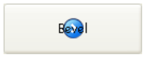

## Chemin d'accès arrière-plan

Définit le chemin d'accès de l'image qui sera dessinée en arrière-plan de l'objet. Si l'objet utilise une [icône](#picture-pathname) avec [différents états](#number-of-states), l'image de fond prendra automatiquement en charge le même nombre d'états.

Le chemin d'accès à saisir est identique à celui de [la propriété Chemin d'accès pour les images statiques](properties_Picture.md#pathname).

#### Grammaire JSON

| Nom                     | Type de données | Valeurs possibles                                                                                        |
| ----------------------- | --------------- | -------------------------------------------------------------------------------------------------------- |
| customBackgroundPicture | string          | Chemin relatif en syntaxe POSIX. Doit être utilisé avec l'option "Personnalisé" de la propriété "Style". |

#### Objets pris en charge

[Bouton personnalisé](button_overview.md#custom) - [Case à cocher personnalisée](checkbox_overview.md#custom) - [Bouton radio personnalisé](radio_overview.md#custom)

---

## Styles de bouton

Aspect général du bouton. Le style du bouton joue également un rôle dans la disponibilité de certaines options.

#### Grammaire JSON

|  Nom  | Type de données | Valeurs possibles                                                                                                                                                  |
|:-----:|:---------------:| ------------------------------------------------------------------------------------------------------------------------------------------------------------------ |
| style |      text       | "regular", "flat", "toolbar", "bevel", "roundedBevel", "gradientBevel", "texturedBevel", "office", "help", "circular", "disclosure", "roundedDisclosure", "custom" |

#### Objets pris en charge

[Bouton](button_overview.md) - [Bouton radio](radio_overview.md) - [Case à cocher](checkbox_overview.md) - [Bouton radio](radio_overview.md)

---

## Marge horizontale

Cette propriété permet de définir la taille (en pixels) des marges horizontales du bouton. Cette marge délimite la zone que l'icône et le titre du bouton ne doivent pas dépasser.

Ce paramètre est utile, par exemple, lorsque l'image de fond contient des bordures :

| Avec / Sans          | Exemple                                                      |
| -------------------- | ------------------------------------------------------------ |
| Sans marge           |  |
| Avec marge 13 pixels |  |
> Cette propriété fonctionne avec la propriété [Marge verticale](#vertical-margin).

#### Grammaire JSON

| Nom           | Type de données | Valeurs possibles                                   |
| ------------- | --------------- | --------------------------------------------------- |
| customBorderX | number          | A utiliser avec le style "personnalisé". Minimum: 0 |

#### Objets pris en charge

[Bouton personnalisé](button_overview.md#custom) - [Case à cocher personnalisée](checkbox_overview.md#custom) - [Bouton radio personnalisé](radio_overview.md#custom)

---

## Emplacement de l'icône

Désigne l'emplacement d'une icône par rapport à l'objet formulaire.

#### Grammaire JSON

| Nom           | Type de données | Valeurs possibles       |
| ------------- | --------------- | ----------------------- |
| iconPlacement | string          | "none", "left", "right" |

#### Objets pris en charge

[Entête de List Box](listbox_overview.md#list-box-headers)

---

## Décalage icône

Définit une valeur de décalage personnalisée en pixels, qui sera utilisée lorsque le bouton est cliqué

Le titre du bouton sera décalé vers la droite et vers le bas pour le nombre de pixels saisis. Cela permet d'appliquer un effet 3D personnalisé lorsque le bouton est cliqué.

#### Grammaire JSON

| Nom          | Type de données | Valeurs possibles |
| ------------ | --------------- | ----------------- |
| customOffset | number          | minimum : 0       |

#### Objets pris en charge

[Bouton personnalisé](button_overview.md#custom) - [Case à cocher personnalisée](checkbox_overview.md#custom) - [Bouton radio personnalisé](radio_overview.md#custom)

---

## Nombre d'états

Cette propriété définit le nombre exact d'états présents dans l'image utilisée comme icône pour un [bouton avec icône](button_overview.md), une [case à cocher](checkbox_overview.md) ou un [bouton radio](radio_overview.md) personnalisé. En général, une icône de bouton comprend quatre états : actif, cliqué, survolé et inactif.

Chaque état est représenté par une image différente. Dans l'image source, les états doivent être empilés verticalement :

Les états suivants sont représentés :

1. bouton non cliqué / case non cochée (valeur de la variable = 0)
2. bouton cliqué / case cochée (valeur de la variable = 1)
3. survolé
4. disabled

#### Grammaire JSON

| Nom        | Type de données | Valeurs possibles |
| ---------- | --------------- | ----------------- |
| iconFrames | number          | minimum: 1        |

#### Objets pris en charge

[Bouton](button_overview.md) (tous les styles sauf[Aide](button_overview.md#help)) - [Case à cocher](checkbox_overview.md) - [Bouton radio](radio_overview.md)

---

## Chemin d'accès de l'image

Définit le chemin d'accès de l'image qui sera utilisée comme icône de l'objet.

Le chemin d'accès à saisir est identique à celui de [la propriété Chemin d'accès pour les images statiques](properties_Picture.md#pathname).

> Lorsqu'elle est utilisée comme icône pour les objets actifs, l'image doit être conçue pour prendre en charge [un nombre d'états](#number-of-states) variable.

#### Grammaire JSON

| Nom  | Type de données | Valeurs possibles                              |
| ---- | --------------- | ---------------------------------------------- |
| icon | picture         | Chemin relatif ou filesystem en syntaxe POSIX. |

#### Objets pris en charge

[Bouton](button_overview.md) (tous les styles sauf[Aide](button_overview.md#help)) - [Case à cocher](checkbox_overview.md) - [En-tête List box](listbox_overview.md#list-box-headers)[Bouton radio](listbox_overview.md#list-box-headers)

---

## Position Titre/Image

Cette propriété permet de modifier l’emplacement relatif du titre par rapport à l’icône associée. Cette propriété n’a pas d’effet lorsque le bouton contient uniquement un titre (pas d’image associée) ou une image (pas de titre). Par défaut, lorsqu’un bouton 3D contient un titre et une image, le texte est placé en-dessous de l’image.

Voici le résultat des différentes options de cette propriété :

| Option     | Description                                                                                                                                              | Exemple                                                           |
| ---------- | -------------------------------------------------------------------------------------------------------------------------------------------------------- | ----------------------------------------------------------------- |
| **Gauche** | Le texte est placé à gauche de l’icône. Le contenu du bouton est aligné à droite.                                                                        |   |
| **Haut**   | Le texte est placé au-dessus de l’icône. Le contenu du bouton est centré.                                                                                |       |
| **Droite** | Le texte est placé à droite de l’icône. Le contenu du bouton est aligné à gauche.                                                                        |     |
| **Bas**    | Le texte est placé en-dessous de l’icône. Le contenu du bouton est centré.                                                                               |    |
| **Centre** | Le texte de l’icône est centré verticalement et horizontalement dans le bouton. Ce paramétrage convient par exemple pour du texte inclus dans une icône. |  |

#### Grammaire JSON

| Nom           | Type de données | Valeurs possibles                          |
| ------------- | --------------- | ------------------------------------------ |
| textPlacement | string          | "left", "top", "right", "bottom", "center" |

#### Objets pris en charge

[Bouton](button_overview.md) (tous les styles sauf[Aide](button_overview.md#help)) - [Case à cocher](checkbox_overview.md) - [Bouton radio](radio_overview.md)

---

## Marge verticale

Cette propriété permet de définir la taille (en pixels) des marges verticales du bouton. Cette marge délimite la zone que l'icône et le titre du bouton ne doivent pas dépasser.

Ce paramètre est utile, par exemple, lorsque l'image de fond contient des bordures.

> Cette propriété fonctionne avec la propriété [Marge horizontale](#horizontal-margin).

#### Grammaire JSON

| Nom           | Type de données | Valeurs possibles                                   |
| ------------- | --------------- | --------------------------------------------------- |
| customBorderY | number          | A utiliser avec le style "personnalisé". Minimum: 0 |

#### Objets pris en charge

[Bouton personnalisé](button_overview.md#custom) - [Case à cocher personnalisée](checkbox_overview.md#custom) - [Bouton radio personnalisé](radio_overview.md#custom)

---

## Avec pop-up menu

Cette propriété permet d’afficher un symbole en forme de triangle indiquant qu’un pop up menu lui est associé :

L’apparence et l’emplacement de ce symbole dépend du style de bouton et de la plate-forme courante.

### Séparé et Lié

Pour associer un symbole de pop up menu à un bouton, vous disposez de deux options d’affichage :

|                           Lié                           |                           Séparé                           |
|:-------------------------------------------------------:|:----------------------------------------------------------:|
|  |  |
> La disponibilité effective d’un mode “Séparé” dépend du style de bouton et de la plate-forme.

Chaque option précise la relation entre le bouton et le pop up menu associé :

<li>Lorsque le pop up menu est **séparé**, un clic sur la partie gauche du bouton exécute directement l’action courante du bouton ; cette action peut être modifiée via le pop up menu accessible dans la partie droite du bouton.</li>
<li>Lorsque le pop up menu est **lié**, un simple clic sur le bouton ne déclenche aucune autre action que l’affichage du pop up menu. Seule la sélection de l’action dans le pop up menu provoque son déclenchement.</li>

### Gestion du pop up menu

Il est important de noter que la propriété “Avec pop up menu” gère uniquement l’aspect graphique du bouton. L’affichage du pop up menu et de ses valeurs doivent être entièrement gérés par le développeur, notamment à l’aide des `événements formulaire` et des commandes **[Dynamic pop up menu](https://doc.4d.com/4Dv18/4D/18/Dynamic-pop-up-menu.301-4505524.en.html)** et **[Pop up menu](https://doc.4d.com/4Dv17R5/4D/17-R5/Pop-up-menu.301-4127438.en.html)**.

#### Grammaire JSON

| Nom            | Type de données | Valeurs possibles                                                           |
|:-------------- | --------------- | --------------------------------------------------------------------------- |
| popupPlacement | string          | <li>"none"</li><li>"linked"</li><li>"separated"</li> |

#### Objets pris en charge

[Toolbar Button](button_overview.md#toolbar) - [Bevel Button](button_overview.md#bevel) - [Rounded Bevel Button](button_overview.md#rounded-bevel) - [OS X Gradient Button](button_overview.md#os-x-gradient) - [OS X Textured Button](button_overview.md#os-x-textured) - [Office XP Button](button_overview.md#office-xp) - [Circle Button](button_overview.md#circle) - [Custom](button_overview.md#custom)
