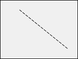

Les formes sont des [objets statiques](formObjects_overview.md#active-and-static-objects) qui peuvent être ajoutées à des formes 4D.

Les formes 4D prennent en charge les formes basiques suivantes :

- rectangles
- lignes
- ovales

## Rectangle

Un rectangle statique est un objet décoratif contenu dans les formulaires. Les rectangles sont limités à des formes carrées.

Les rectangles sont créés à l'aide de plusieurs propriétés (couleur, épaisseur de ligne, motif, etc.). L'[arrondi](properties_CoordinatesAndSizing.md#corner-radius), en particulier, des coins du rectangle peuvent être définis.


#### Exemple JSON

```4d
 "myRectangle": {
  "type": "rectangle", //define the type of object
  "left": 60,    //left position on the form  
  "top": 160,    //top position on the form 
  "width": 100,   //width of the object
  "height": 20,   //height of the object
  "borderRadius": 20  //define the roundness of the corners
                }
```

#### Propriétés prises en charge

[Bas](properties_CoordinatesAndSizing.md#bottom) - [Css Class](properties_Object.md#css-class) - [Rayon d'arrondi](properties_CoordinatesAndSizing.md#corner-radius) - [Type de pointillé](properties_BackgroundAndBorder.md#dotted-line-type) - [Couleur de fond](properties_BackgroundAndBorder.md#background-color-fill-color) - [Hauteur](properties_CoordinatesAndSizing.md#height) - [Dimensionnement horizontal](properties_ResizingOptions.md#horizontal-sizing) - [Gauche](properties_CoordinatesAndSizing.md#left) - [Couleur de ligne](properties_BackgroundAndBorder.md#line-color) - [Épaisseur du trait](properties_BackgroundAndBorder.md#line-width) - [Nom](properties_Object.md#object-name) - [Droite](properties_CoordinatesAndSizing.md#right) - [Haut](properties_CoordinatesAndSizing.md#top) - [Type](properties_Object.md#type) - [Dimensionnement vertical](properties_ResizingOptions.md#vertical-sizing) - [Visibilité](properties_Display.md#visibility) - [Largeur](properties_CoordinatesAndSizing.md#width)

## Ligne

Une ligne statique est un objet décoratif pour les formulaires, entre deux tracés. Les lignes peuvent être horizontales, verticales ou de toute forme d'angle.

Les lignes sont créées à l'aide de plusieurs propriétés (couleur, épaisseur de ligne, etc.).

### propriété startPoint

La propriété JSON `startPoint` définit à partir de quelle coordonnée la ligne peut être dessinée (voir l'exemple).

> la propriété `startPoint` n'est pas exposée dans la liste des propriétés, où la direction du dessin de ligne est visible.

#### JSON Examples

```
 "myLine": {
  "type": "line",                
  "left": 20,
  "top": 40,
  "width": 100,
  "height": 80,
  "startPoint": "topLeft", //first direction
  "strokeDashArray": "6 2" //dashed
  }
```

Result: 

```
 "myLine": {
  "type": "line",                
  "left": 20,
  "top": 40,
  "width": 100,
  "height": 80,
  "startPoint": "bottomLeft", //2nd direction
  "strokeDashArray": "6 2" //dashed
  }
```

Result: 

#### Propriétés prises en charge

[Bas](properties_CoordinatesAndSizing.md#bottom) - [Css Class](properties_Object.md#css-class) - [Type de pointillé](properties_BackgroundAndBorder.md#dotted-line-type) - [Hauteur](properties_CoordinatesAndSizing.md#height) - [Dimensionnement horizontal](properties_ResizingOptions.md#horizontal-sizing) - [Gauche](properties_CoordinatesAndSizing.md#left) - [Couleur du trait](properties_BackgroundAndBorder.md#line-color) - [Épaisseur du trait](properties_BackgroundAndBorder.md#line-width) - [Nom](properties_Object.md#object-name) - [Droite](properties_CoordinatesAndSizing.md#right) - [startPoint](#startpoint-property) - [Haut](properties_CoordinatesAndSizing.md#top) - [Type](properties_Object.md#type) - [Dimensionnement vertical](properties_ResizingOptions.md#vertical-sizing) - [Visibilité](properties_Display.md#visibility) - [Largeur](properties_CoordinatesAndSizing.md#width)

## Ovale

Un ovale statique est un objet décoratif contenu dans les formulaires. Les objets de forme ovale peuvent être utilisés pour dessiner des formes circulaires (lorsque les propriétés [largeur](properties_CoordinatesAndSizing.md#width) et [hauteur](properties_CoordinatesAndSizing.md#height) sont identiques).


#### Exemple JSON

```4d
 "myOval": {
  "type": "oval",  //define the type of object
  "left": 60,   //left position on the form  
  "top": 160,   //top position on the form 
  "width": 100,  //width of the object
  "height": 20,  //height of the object
  "fill": "blue"  //define the background color
                }
```

#### Propriétés prises en charge

[Bas](properties_CoordinatesAndSizing.md#bottom) - [Css Class](properties_Object.md#css-class) - [Type de pointillé](properties_BackgroundAndBorder.md#dotted-line-type) - [Couleur de fond](properties_BackgroundAndBorder.md#background-color-fill-color) - [Hauteur](properties_CoordinatesAndSizing.md#height) - [Dimensionnement horizontal](properties_ResizingOptions.md#horizontal-sizing) - [Gauche](properties_CoordinatesAndSizing.md#left) - [Couleur du trait](properties_BackgroundAndBorder.md#line-color) - [Épaisseur du trait](properties_BackgroundAndBorder.md#line-width) - [Nom](properties_Object.md#object-name) - [Droite](properties_CoordinatesAndSizing.md#right) - [Haut](properties_CoordinatesAndSizing.md#top) - [Type](properties_Object.md#type) - [Dimensionnement vertical](properties_ResizingOptions.md#vertical-sizing) - [Visibilité](properties_Display.md#visibility) - [Largeur](properties_CoordinatesAndSizing.md#width)
