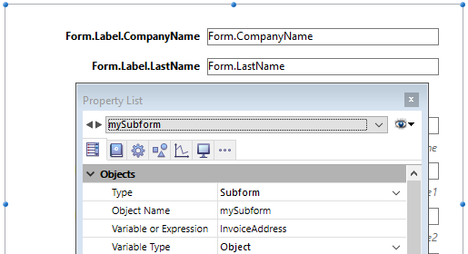

Un sous-formulaire est un formulaire inclus dans un autre formulaire.

## Terminologie

Afin de bien définir les notions mises en oeuvre avec les sous-formulaires, voici quelques définitions relatives aux termes employés :

* **Sous-formulaire** : formulaire destiné à être inclus dans un autre formulaire, lui-même nommé formulaire parent.
* **Formulaire parent** : formulaire contenant un ou plusieurs sous-formulaire(s).
* **Conteneur de sous-formulaire** : objet inclus dans le formulaire parent, contenant une instance du sous-formulaire.
* **Instance de sous-formulaire** : la représentation d’un sous-formulaire dans un formulaire parent. Cette notion est importante car il est possible d’afficher plusieurs instances d’un même sous-formulaire dans un formulaire parent.
* **Formulaire liste écran** : instance de sous-formulaire en liste.
* **Formulaire détaillé** : formulaire de saisie en page associé au sous-formulaire en liste et accessible via un double-clic dans la liste.

## Sous-formulaires en liste

Un sous-formulaire en liste vous permet de saisir, visualiser et modifier des données dans d’autres tables. Les sous-formulaires en liste sont généralement utilisés avec les bases de données utilisant des liens de type 1 vers N. Un sous-formulaire en liste affiche les enregistrements de la table N liée par un lien automatique de type 1 vers N. Vous pouvez disposer de plusieurs sous-formulaires provenant de différentes tables dans le même formulaire. En revanche, il n’est pas possible de placer deux sous-formulaires appartenant à la même table dans une même page de formulaire.

Par exemple, une base de gestion de contacts peut utiliser une instance de sous-formulaire en liste pour afficher tous les contacts d’une société. Bien que les contacts apparaissent dans l’écran général, l’information est en fait stockée dans la table liée. A l’aide d’un lien 1 vers N, la conception de cette base de données rend facile le stockage d’un nombre illimité de contacts pour chacune des sociétés. Avec des liens automatiques, vous pouvez permettre la saisie de données dans la table liée sans programmation.

Bien que les sous-formulaires en liste soient généralement associés aux tables N, une instance de sous-formulaire peut afficher des enregistrements de toute autre table de la base de données.

Vous pouvez également permettre à l’utilisateur de saisir des données dans le formulaire liste. Suivant la configuration du sous-formulaire, l’utilisateur pourra afficher le formulaire détaillé en double-cliquant sur un sous-enregistrement ou en utilisant les commandes d’ajout et de modification des sous-enregistrements.

> 4D propose trois actions standard, permettant de répondre aux besoins élémentaires de gestion des sous-enregistrements : `Modifier sous-enregistrement`, `Supprimer sous-enregistrement` et `Ajouter sous-enregistrement`. Lorsque le formulaire comporte plusieurs instances de sous-formulaires, l’action s’applique au sous-formulaire ayant le focus.

## Sous-formulaires en page

Les sous-formulaires en mode page peuvent afficher des données relatives à l'enregistrement courant ou toute valeur pertinente en fonction du contexte (variables, images, etc.). Il peuvent également, et c'est là leur intérêt majeur, comporter des fonctionnalités avancées et interagir avec le formulaire parent (widgets). Les sous-formulaires en page bénéficient de propriétés et d'événements spécifiques, et peuvent être entièrement contrôlés par programmation.

Le sous-formulaire en page utilise le formulaire entrée désigné par la propriété [Formulaire détaillé](properties_Subform.md#detail-form). A la différence d’un sous-formulaire en mode liste, le formulaire utilisé peut provenir de la même table que le formulaire parent. Il est également possible d’utiliser un formulaire projet. En exécution, un sous-formulaire en mode page dispose des caractéristiques d’affichage standard d’un formulaire entrée.

> Les widgets 4D sont des objets composés prédéfinis. Pour plus de détails sur les widgets, consultez le manuel [4D Widgets](https://doc.4d.com/4Dv17R6/4D/17-R6/4D-Widgets.100-4465257.en.html).

### Gestion de la variable liée

La [variable](properties_Object.md#variable-or-expression) liée au sous-formulaire permet de relier les deux contextes (formulaire et sous-formulaire) pour mettre au point des interfaces sophistiquées. Imaginons par exemple un sous-formulaire représentant une pendule dynamique, inséré dans un formulaire parent contenant une variable saisissable de type heure :


Les deux objets (variable heure et conteneur du sous-formulaire) *ont le même nom de variable*. Dans ce cas, à l’ouverture du formulaire parent, les deux valeurs sont automatiquement synchronisées par 4D. Si la valeur de la variable est définie à plusieurs emplacements, la valeur utilisée sera celle qui aura été chargée en dernier lieu. It applies the following loading order: 1-Object methods of subform 2-Form method of subform 3-Object methods of parent form 4-Form method of parent form

A l’exécution du formulaire parent, la synchronisation des variables doit être effectuée par le développeur à l’aide des événements formulaires adéquats. Deux types d’interactions peuvent se produire : du formulaire vers le sous-formulaire et inversement.

#### Mise à jour du contenu du sous-formulaire

Scénario 1 : La valeur de la variable du formulaire parent est modifiée et cette modification doit être répercutée dans le sous-formulaire. Dans notre exemple, l’heure de Heureparis passe à 12:15:00, soit parce que l’utilisateur l’a saisie, soit parce qu’elle est mise à jour dynamiquement (via la commande `Current time` par exemple).

Dans ce cas, vous devez utiliser l'événement formulaire Sur modif variable liée. Cet événement doit être coché dans les propriétés du sous-formulaire, il sera généré dans la méthode formulaire du sous-formulaire.


L’événement formulaire `Sur modif variable liée` est généré :

* dès qu’une valeur est affectée à la variable du formulaire parent, même si la même valeur est réaffectée,
* si le sous-formulaire appartient à la page formulaire courante ou à la page 0.

A noter que, comme dans l’exemple ci-dessus, il est préférable d’utiliser la commande `OBJECT Get pointer` qui retourne un pointeur vers le conteneur de sous-formulaire plutôt que sa variable car il est possible d’insérer plusieurs sous-formulaires dans un même formulaire parent (par exemple, une fenêtre affichant des fuseaux horaires contiendrait plusieurs pendules). Dans ce cas, seul un pointeur permet de connaître le conteneur de sous-formulaire à l’origine de l’événement.

#### Mise à jour du contenu du formulaire parent

Scénario 2 : Le contenu du sous-formulaire est modifié et cette modification doit être répercutée dans le formulaire parent. Dans notre exemple, imaginons que l’interface du sous-formulaire permette à l’utilisateur de déplacer "manuellement" les aiguilles.

Dans ce cas, vous devez affecter la valeur de l’objet à la variable du conteneur du sous-formulaire parent depuis le sous-formulaire. Comme dans l’exemple précédent, il est conseillé d’utiliser pour cela la commande `OBJECT Get pointer` avec le sélecteur `Objet conteneur sous formulaire` qui retourne un pointeur vers le conteneur du sous-formulaire.

Cette affectation génère l’événement formulaire `Sur données modifiées` dans la méthode de l’objet conteneur du sous-formulaire parent, ce qui vous permet d’effectuer tout type d’action. L’événement doit être coché dans les propriétés du conteneur de sous-formulaire.


> Si vous déplacez "manuellement" les aiguilles, cela génère également l’événement formulaire `Sur données modifiées` de l'événement formulaire dans la méthode objet de la variable *clockValue* du sous-formulaire.

### Utiliser l'objet associé au sous-formulaire

4D associe automatiquement un objet de langage (`C_OBJECT`) à chaque sous-formulaire. Le contenu de cet objet peut être lu et/ou modifié depuis le contexte du sous-formulaire, ce qui vous permet de partager des valeurs dans un contexte local.

L'objet peut être créé automatiquement ou être la variable du conteneur parent, si elle a été explicitement nommée et typée Objet (voir ci-dessus). Dans tous les cas, l'objet est retourné par la commande `Form`, qui peut être appelée directement dans le sous-formulaire (l'usage d'un pointeur est inutile). Comme les objets sont toujours passés par référence, si l'utilisateur modifie une valeur de propriété dans le sous-formulaire, elle sera automatiquement mise à jour dans l'objet lui-même.

Par exemple, dans votre sous-formulaire, les libellés des champs sont stockés dans l'objet associé afin de vous permettre d'afficher différentes langues :



Vous pouvez modifier les libellés depuis le sous-formulaire en affectant des valeurs à l'objet *InvoiceAddress* :

```4d
 C_OBJECT($lang)
 $lang:=New object
 If(<>lang="fr")
    $lang.CompanyName:="Société :"
    $lang.LastName:="Nom :"
 Else
    $lang.CompanyName:="Company:"
    $lang.LastName:="Name:"
 End if
 InvoiceAddress.Label:=$lang
```


### Programmation inter-formulaires avancée

La communication entre le formulaire parent et les instances des sous-formulaires peut nécessiter d’aller au-delà de l’échange d’une valeur via la variable associée. En effet, vous pouvez souhaiter mettre à jour des variables dans les sous-formulaires en fonction d’actions effectuées dans le formulaire parent et inversement. Si l’on reprend l’exemple du sous-formulaire de type "pendule dynamique", on peut souhaiter définir une ou plusieurs heures d’alerte par pendule.

Pour répondre à ces besoins, 4D propose les mécanismes suivants :

* Utilisation du paramètre "sous-formulaire" avec la commande `OBJECT Get name` afin de désigner l’objet sous-formulaire et commande `OBJECT Get pointer`.
* Appel de l’objet conteneur depuis le sous-formulaire via la commande `CALL SUBFORM CONTAINER`,
* Exécution d’une méthode dans le contexte du sous-formulaire via la commande `EXECUTE METHOD IN SUBFORM`.

#### Commandes Object get pointer et Object get name

Outre le sélecteur `Objet conteneur sous formulaire`, la commande `OBJECT Get pointer` admet un paramètre permettant de préciser dans quel sous-formulaire chercher l’objet dont le nom est passé en deuxième paramètre. Cette syntaxe n’est utilisable que lorsque le sélecteur Objet nommé est passé.

Par exemple, l’instruction suivante :

```4d
 $ptr:=OBJECT Get pointer(Object named;"MyButton";"MySubForm")
```

... récupère un pointeur vers la variable "MyButton" qui se trouve dans l'objet sous-forme "MySubForm". Cette syntaxe permet d’accéder depuis le formulaire parent à tout objet se trouvant dans un sous-formulaire. A noter également la commande `OBJECT Get name` qui permet de récupérer le nom de l’objet ayant le focus.

#### Commande CALL SUBFORM CONTAINER

La commande `CALL SUBFORM CONTAINER` permet à une instance de sous-formulaire d’envoyer un événement à l’objet conteneur du sous-formulaire, qui peut alors le traiter dans le contexte du formulaire parent. L’événement est reçu dans la méthode de l’objet conteneur. Il peut s’agir à l’origine de tout événement détecté par le sous-formulaire (clic, glisser-déposer, etc.).

Le code de l’événement est libre (par exemple, 20000 ou -100). Vous pouvez soit utiliser un code correspondant à un événement existant (par exemple, 3 pour `Sur validation`), soit utiliser un code personnalisé. Dans le premier cas, seuls les événements présents dans la liste des événements "cochables" des conteneurs de sous-formulaire peuvent être utilisés (cf. Liste des propriétés). Dans le second cas, le code ne doit correspondre à aucun événement formulaire existant. Il est conseillé d’utiliser une valeur négative pour avoir l’assurance que 4D n’utilisera pas ce code dans les versions futures.

Pour plus d'informations, reportez-vous à la description de la commande `CALL SUBFORM CONTAINER`.

#### Commande EXECUTE METHOD IN SUBFORM

La commande `EXECUTE METHOD IN SUBFORM` permet à un formulaire ou à l’un de ses objets de demander l’exécution d’une méthode dans le contexte de l’instance du sous-formulaire, ce qui lui donne accès aux variables, objets, etc., du sous-formulaire. Cette méthode peut en outre recevoir des paramètres.

Ce mécanisme est illustré dans le schéma suivant :


Pour plus d'informations, reportez-vous à la description de la commande `EXECUTE METHOD IN SUBFORM`.

#### Commande GOTO OBJECT

La commande `GOTO OBJECT` peut rechercher l’objet de destination dans le formulaire parent même si elle exécutée depuis un sous-formulaire.

## Propriétés prises en charge

[Border Line Style](properties_BackgroundAndBorder.md#border-line-style) - [Bottom](properties_CoordinatesAndSizing.md#bottom) - [Class](properties_Object.md#css-class) - [Detail Form](properties_Subform.md#detail-form) - [Double click on empty row](properties_Subform.md#double-click-on-empty-row) - [Double click on row](properties_Subform.md#double-click-on-row) - [Enterable in list](properties_Subform.md#enterable-in-list) - [Expression Type](properties_Object.md#expression-type) - [Focusable](properties_Entry.md#focusable) - [Height](properties_CoordinatesAndSizing.md#height) - [Hide focus rectangle](properties_Appearance.md#hide-focus-rectangle) - [Horizontal Scroll Bar](properties_Appearance.md#horizontal-scroll-bar) - [Horizontal Sizing](properties_ResizingOptions.md#horizontal-sizing) - [Left](properties_CoordinatesAndSizing.md#left) - [List Form](properties_Subform.md#list-form) - [Method](properties_Action.md#method) - [Object Name](properties_Object.md#object-name) - [Print Frame](properties_Print.md#print-frame) - [Right](properties_CoordinatesAndSizing.md#right) - [Selection mode](properties_Subform.md#selection-mode) - [Source](properties_Subform.md#source) - [Top](properties_CoordinatesAndSizing.md#top) - [Type](properties_Object.md#type) - [Variable or Expression](properties_Object.md#variable-or-expression) - [Vertical Scroll Bar](properties_Appearance.md#vertical-scroll-bar) - [Vertical Sizing](properties_ResizingOptions.md#vertical-sizing) - [Visibility](properties_Display.md#visibility) - [Width](properties_CoordinatesAndSizing.md#width)
