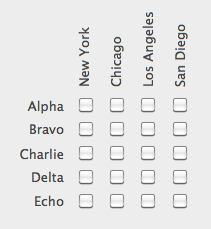

Un objet texte vous permet d'afficher du contenu écrit statique (*ex :* instructions, titres, étiquettes, etc.) dans un formulaire. Ces zones de texte statique peuvent devenir dynamiques lorsqu'elles incluent des références dynamiques. Pour plus d'informations, reportez-vous à la section [Utiliser des références dans les textes statiques](https://doc.4d.com/4Dv17R5/4D/17-R5/Using-references-in-static-text.300-4163725.en.html).

#### Exemple JSON

```4d
 "myText": {
                "type": "text",
                "text": "Hello World!",
                "textAlign": "center",
                "left": 60,   
                "top": 160, 
                "width": 100,
                "height": 20,
                "stroke": "#ff0000"  //couleur texte    
                "fontWeight": "bold"
                }
```

## Rotation

4D vous permet d’effectuer des rotations de zones de texte dans vos formulaires à l'aide de la propriété [Orientation](properties_Text.md#orientation).



> La fonctionnalité de rotation de texte est disponible via la commande `OBJECT SET TEXT ORIENTATION`.

Une fois qu’un texte a été orienté, il reste possible de modifier sa taille ou sa position ainsi que toutes ses propriétés. A noter que les propriétés de hauteur et de largeur de la zone de texte ne sont pas dépendantes de l’orientation :


- Si l’objet est redimensionné dans la direction A, sa [largeur](properties_CoordinatesAndSizing.md#width) sera modifiée ;
- Si l’objet est redimensionné dans la direction C, sa [hauteur](properties_CoordinatesAndSizing.md#height) sera modifiée ;
- Si l’objet est redimensionné dans la direction B, sa [largeur](properties_CoordinatesAndSizing.md#width) et sa [hauteur](properties_CoordinatesAndSizing.md#height) seront modifiées.

## Propriétés prises en charge

[Bold](properties_Text.md#bold) - [Border Line Style](properties_BackgroundAndBorder.md#border-line-style) - [Bottom](properties_CoordinatesAndSizing.md#bottom) - [Class](properties_Object.md#css-class) - [Fill Color](properties_BackgroundAndBorder.md#background-color--fill-color) - [Font](properties_Text.md#font) - [Font Color](properties_Text.md#font-color) - [Font Size](properties_Text.md#font-size) - [Height](properties_CoordinatesAndSizing.md#height) - [Horizontal Alignment](properties_Text.md#horizontal-alignment) - [Horizontal Sizing](properties_ResizingOptions.md#horizontal-sizing) - [Italic](properties_Text.md#italic) - [Left](properties_CoordinatesAndSizing.md#left) - [Object Name](properties_Object.md#object-name) - [Orientation](properties_Text.md#orientation) - [Right](properties_CoordinatesAndSizing.md#right) - [Title](properties_Object.md#title) - [Top](properties_CoordinatesAndSizing.md#top) - [Type](properties_Object.md#type) - [Underline](properties_Text.md#underline) - [Vertical Sizing](properties_ResizingOptions.md#vertical-sizing) - [Visibility](properties_Display.md#visibility) - [Width](properties_CoordinatesAndSizing.md#width)
