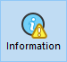

La page “Informations” fournit diverses informations relatives à l’environnement 4D et l’environnement système, la base de données et les fichiers de l’application. Chaque page d’information est accessible via des onglets situés dans la partie supérieure de la fenêtre.

## Programme

Cette page affiche le nom, la version et l’emplacement de l’application ainsi que du dossier 4D actif (pour plus d’informations sur le dossier 4D actif, reportez-vous à la description de la commande `Get 4D folder` du manuel *Langage 4D*).

La partie centrale de la fenêtre affiche le nom et l’emplacement du projet et des fichiers de données ainsi que, le cas échéant, du fichier d'historique. La partie inférieure de la fenêtre indique le nom du propriétaire de la licence 4D, le type de licence et le nom de l'utilisateur 4D courant.

- **Affichage et sélection des chemins d’accès** : dans la page **Programme**, les chemins d’accès sont affichés sous forme de pop up menus contenant l’enchaînement des dossiers à partir du disque :   
   Si vous sélectionnez un élément du menu (disque ou dossier), il s’affiche dans une nouvelle fenêtre système. La commande **Copier le chemin** copie le chemin d’accès complet dans le Presse-papiers sous forme de texte, et en utilisant les séparateurs de la plate-forme courante.

- **Dossier “Licenses”** Le bouton **Dossier “Licenses”** permet d’afficher le contenu du dossier Licenses actif dans une nouvelle fenêtre système. Tous les fichiers de licence installés dans votre environnement 4D sont regroupés dans ce dossier, placé sur votre disque dur. Lorsqu’ils sont ouverts avec un navigateur Web, ces fichiers affichent des informations relatives aux licences qu’ils contiennent et à leurs caractéristiques. L’emplacement du dossier "Licenses" peut varier en fonction de la version ou de la langue de votre système d’exploitation. Pour plus d'informations sur l'emplacement de ce dossier, reportez-vous à la commande `Get 4D folder`. ***Note :** Vous pouvez également accéder à ce dossier depuis la boîte de dialogue “Mise à jour des licences” (accessible depuis le menu Aide).*

## Tables

Cette page propose une vue d'ensemble de la base :

> Les informations présentes dans cette page sont disponibles en mode standard et en mode maintenance.

La page liste toutes les tables de la base (y compris les tables invisibles) ainsi que leurs caractéristiques :

- **No.** : Numéros internes des tables.
- **Tables** : Noms des tables. Les noms des tables supprimées sont affichés entre parenthèses (lorsqu'elles sont dans la corbeille).
- **Enregistrements** : Nombre total d'enregistrements de chaque table. Si un enregistrement est endommagé ou ne peut pas être lu, le mot *Erreur* est affiché à la place du total. Dans ce cas, vous devez envisager d'utiliser les outils de vérification et de réparation.
- **Champs** : Nombre de champs dans la table. Les champs invisibles sont comptés, en revanche les champs supprimés ne le sont pas.
- **Index** : Nombre d'index de tout type associés à la table
- **Chiffrable** : Si l'attribut **Chiffrable** est coché, il est sélectionné pour la table au niveau de la structure (voir le paragraphe "Chiffrable" dans le manuel Développement).
- **Chiffrée** : Si cet attribut est coché, les enregistrements de la table sont chiffrés dans le fichier de données. ***Note** : Toute incohérence entre les options Chiffrable et Chiffrée nécessite une vérification de l'état de chiffrement du fichier de données dans la **Page Chiffrement** du MSC.*
- **Taille table adresses** : Taille de la table d'adresses pour chaque table. La table d'adresses est une table interne qui stocke un élément par enregistrement créé dans la table. Elle établit le lien entre les enregistrements et leur adresse physique. Pour des raisons de performance, elle n'est pas redimensionnée lorsque des enregistrements sont supprimés. Sa taille peut donc être différente du nombre d'enregistrements actuel de la table. À noter que si cette différence est significative, il peut être intéressant de compacter les données avec l'option "Compacter la table d'adresses" afin d'optimiser la taille de la table d'adresses (voir [Page Compactage](compact.md)). ***Note :** Des différences entre la taille de la table d'adresses et le nombre d'enregistrements peuvent également résulter d'un incident durant l'écriture du cache sur le disque.

## Data

La page **Données** fournit des informations sur l'espace de stockage libre et occupé dans les fichiers de données et la structure de la base.
> Cette page n'est pas accessible en mode maintenance

Ces informations sont fournies sous forme de valeurs en octets et sont également représentées sous forme graphique :

> La page Données ne tient pas compte de la taille des données éventuellement stockées à l’extérieur du fichier de données (cf. section Stockage externe des données).

Des fichiers trop fragmentés réduisent les performances du disque dur et donc de la base. Si le taux d’occupation est trop faible, 4D vous le signale par une icône d’avertissement (qui apparaît dans le bouton Informations et dans l’onglet du type de fichier correspondant) et indique qu’un compactage est requis :

Une icône d’avertissement est également affichée sur le bouton de la Page [Compactage](compact.md) : 
