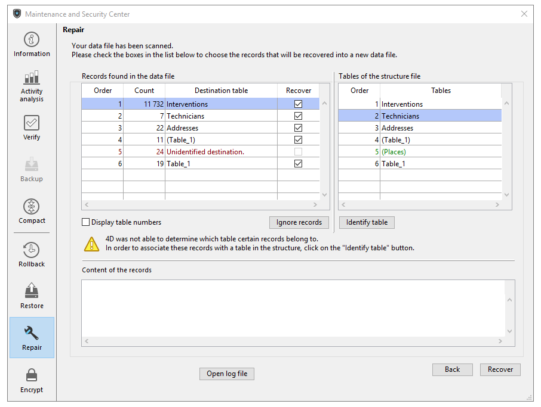

Cette page permet de réparer le fichier de données ou le fichier de structure lorsqu’il a été endommagé. En général, vous n'utiliserez ces fonctions que sous la supervision des équipes techniques de 4D, lorsque des anomalies ont été détectées à l'ouverture de l'application ou à la suite d'une [vérification.](verify.md).

**Attention :** Chaque réparation entraîne la duplication du fichier d’origine et donc l’augmentation de la taille du dossier de l’application. Il est important de prendre cela en considération (notamment sous macOS, où les applications 4D apparaissent sous forme de paquet) afin de ne pas augmenter excessivement la taille de l'application. Une intervention manuelle à l’intérieur du package peut être utile afin de supprimer les copies des fichiers d’origine.
> La réparation n’est disponible qu’en mode maintenance. Si vous tentez d’effectuer cette opération en mode standard, une boîte de dialogue d’alerte vous prévient que l'application va être fermée puis relancée en mode maintenance.
> Lorsque la base est chiffrée, la réparation des données comprend le déchiffrage et le chiffrage et nécessite ainsi la clé de chiffrement de données courante. Si aucune clé de chiffrement valide n'a déjà été fournie, une boite de dialogue s'affiche pour demander pour demander le mot de passe ou la clé de chiffrement (voir Page Chiffrement).

## Fichiers

### Fichier de données à réparer

Chemin d’accès du fichier de données courant. Le bouton **[...]** permet de désigner un autre fichier de données. Lorsque vous cliquez sur ce bouton, une boîte de dialogue standard d’ouverture de documents s’affiche, vous permettant de désigner le fichier de données à réparer. Une fois cette boîte de dialogue validée, le chemin d’accès du fichier à réparer est indiqué dans la fenêtre. Si vous effectuez une réparation par [réparation par en-têtes d'enregistrements](#réparation-par-en-têtes-denregistrements), vous pouvez sélectionner tout fichier de données. Une fois cette boîte de dialogue validée, le chemin d’accès du fichier à réparer est indiqué dans la fenêtre.

### Dossier de sauvegarde

Par défaut, le fichier de données original sera dupliqué avant réparation. Par défaut, le fichier de données original sera dupliqué avant réparation. Le second bouton **[...]** permet de désigner un autre emplacement pour les sauvegardes des fichiers originaux effectuées avant réparation. Cette option permet notamment de réparer des fichiers volumineux en utilisant différents disques.

### Fichiers réparés

4D crée un nouveau fichier de données vide à l’emplacement du fichier d’origine. 4D crée un nouveau fichier de données vide à l’emplacement du fichier d’origine. Le fichier vide est rempli avec les données récupérées.

## Réparation standard

La réparation standard permet de réparer des données dans lesquelles seuls quelques enregistrements ou index sont endommagés (les tables d'adresses sont intactes). Les données sont compactées et réparées. A noter que ce type de réparation ne peut être effectué que si le fichier de données et le fichier de structure correspondent.

A l’issue de la procédure, la page "Réparation" du CSM est affichée. Un message indique si la réparation a été effectuée avec succès. Dans ce cas, vous pouvez immédiatement ouvrir l'application. 

## Réparation par en-têtes d'enregistrements

Cette option de réparation de bas niveau est à utiliser uniquement dans le cas où le fichier de données a été fortement endommagé et une fois que toutes les autres solutions (restitution de sauvegarde, réparation standard) se sont avérées inefficaces.

Les enregistrements de 4D sont de taille variable : il est donc nécessaire, pour les retrouver, de conserver dans une table spéciale l’endroit où ils sont stockés sur votre disque. Le programme accède donc à l’adresse de l’enregistrement par l’intermédiaire d’un index et d’une table d’adresses. Si seuls des enregistrements ou des index sont endommagés, l’option de réparation standard suffira généralement pour résoudre le problème. C’est lorsque la table d’adresses est touchée qu’il faudra en venir à une récupération plus sophistiquée, puisqu’il faut la reconstituer. Pour réaliser cette opération, le CSM utilise le marqueur qui se trouve en en-tête de chaque enregistrement. Les marqueurs peuvent être comparés à des résumés des enregistrements, comportant l’essentiel de leurs informations, et à partir desquels une reconstitution de la table d’adresses est possible.

> Si tous les enregistrements et toutes les tables ont été attribués, seule la zone principale est affichée.
> 
> La récupération par en-têtes ne tient pas compte des éventuelles contraintes d’intégrité. En particulier, à l’issue de cette opération, vous pouvez obtenir des valeurs dupliquées avec des champs uniques ou des valeurs NULL avec des champs déclarés **non NULL**.

Lorsque vous cliquez sur le bouton **Réparer**, 4D effectue une analyse complète du fichier de données. A l’issue de cette analyse, le résultat est affiché dans la fenêtre suivante :

> Si tous les enregistrements et toutes les tables ont été attribués, seule la zone principale est affichée.

La zone "Enregistrements trouvés dans le fichier de données" comporte deux tableaux synthétisant les informations issues de l’analyse du fichier de données.

- Le premier tableau liste les informations issues de l’analyse du fichier de données. Chaque ligne représente un groupe d’enregistrements récupérables dans le fichier de données :
  - La colonne **Ordre** indique l’ordre de récupération des groupes d’enregistrements.
  - La colonne **Nombre** indique le nombre d'enregistrements contenus dans la table.
  - La colonne **Table de destination** indique le nom des tables ayant pu être automatiquement associées aux groupes d’enregistrements identifiés. Les noms des tables attribuées automatiquement sont affichés en caractères verts. Les groupes qui n'ont pas encore été attribués, c'est-à-dire, les tables qui n'ont pas pu être associées à des enregistrements sont affichées en caractères rouges.
  - La colonne **Récupérer** permet vous permet d’indiquer pour chaque groupe si vous souhaitez récupérer les enregistrements. Par défaut, l’option est cochée pour tous les groupes avec les enregistrements qui peuvent être associés à une table.

- Le deuxième tableau liste les tables du fichier de structure.

### Attribution manuelle

Si, du fait de l’endommagement de la table d’adresses, un ou plusieurs groupes d’enregistrements n’ont pas pu être attribués à des tables, vous pouvez les attribuer manuellement. Pour attribuer une table à un groupe non identifié, sélectionnez le groupe dans le premier tableau. Lorsque vous sélectionnez des enregistrements non identifiés, la zone "Contenu des enregistrements" affiche une prévisualisation du contenu des premiers enregistrements du groupe afin de vous permettre de les attribuer plus facilement :

Sélectionnez ensuite la table à attribuer dans le tableau des "Tables non attribuées" puis cliquez sur le bouton **Identifier table**. Vous pouvez également attribuer une table par glisser-déposer. Le groupe d’enregistrements est alors associé à la table, il sera récupéré dans cette table. Les noms des tables attribuées manuellement sont affichés en caractères noirs. Le bouton **Ignorer enregistrements** permet de supprimer l’association effectuée manuellement entre une table et un groupe d’enregistrements.

## Voir le compte rendu

Une fois la réparation terminée, 4D génère un fichier de compte-rendu dans le dossier Logs du projet. Ce fichier liste l’ensemble des opérations qui ont été menées. Il est créé au format xml et est nommé : *ApplicationName**_Repair_Log_yyyy-mm-dd hh-mm-ss.xml*" où :

- *ApplicationName* est le nom du fichier de structure sans extension, par exemple "Factures",
- *aaaa-mm-jj hh-mm-ss* est l'horodatage du fichier, basé sur la date et l'heure système locales au moment du lancement de l'opération de vérification, par exemple "2019-02-11 15-20-45".

Lorsque vous cliquez sur le bouton **Voir le compte rendu**, 4D affiche le fichier de compte-rendu le plus récent dans le navigateur par défaut de l’ordinateur.
