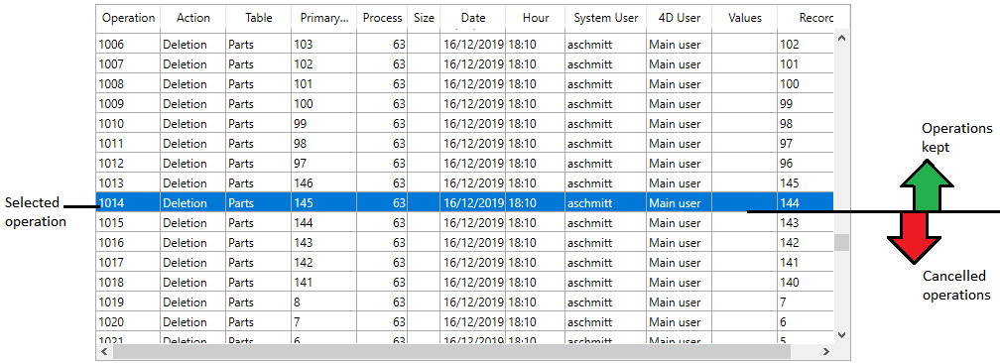

La page Retour arrière du CSM permet d’accéder à la fonction de retour en arrière parmi les opérations effectuées dans le fichier de données. Elle s’apparente à une fonction d’annulation multi-niveaux. Elle est utile notamment lorsqu’un enregistrement a été supprimé par erreur dans la base de données.

Pour que cette fonction soit accessible, il est impératif que l'application travaille avec un fichier d’historique.

> Si la base de données est chiffrée et si aucune clé de données valide correspondant au fichier d'historique ouvert n'a été fournie, les valeurs chiffrées ne s'affichent pas dans la colonne **Valeurs** et un dialogue s'affiche, demandant la saisie d'une phrase secrète ou de la clé de données, si vous cliquez sur le bouton **Revenir en arrière**.

Le contenu et le fonctionnement de la liste des opérations sont identiques à ceux de la fenêtre [d’analyse d’activités](analysis.md).

Pour effectuer un retour en arrière parmi les opérations, vous devez sélectionner la ligne située après laquelle toutes les opérations doivent être annulées. L’opération de la ligne sélectionnée sera la dernière conservée. Si par exemple vous souhaitez annuler une suppression, sélectionnez l’opération située juste avant la suppression. L'opération de suppression et les opérations suivantes seront annulées.

Cliquez ensuite sur le bouton **Revenir en arrière**. 4D vous demande de confirmer l’opération. Si vous cliquez sur **OK**, les données sont alors restituées dans l’état exact où elles se trouvaient au moment de l’action sélectionnée.

Le menu situé en bas de la fenêtre vous permet de sélectionner le fichier d’historique à utiliser lorsque vous appliquez la fonction de retour en arrière à une base restituée. Dans ce cas, vous devez désigner le fichier d’historique correspondant à l’archive.

Le principe mis en oeuvre pour la fonction de retour arrière est le suivant : lorsque l’utilisateur clique sur le bouton **Revenir en arrière**, 4D referme la base de données courante et restitue la dernière sauvegarde des données de la base. La base restituée est ensuite ouverte et 4D intègre les opérations de l’historique jusqu’à l’opération sélectionnée. Si la base n’avait pas encore été sauvegardée, 4D repart d’un fichier de données vierge.
