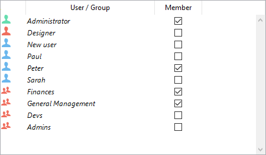

Étant donné qu'ORDA est basé sur des objets, l'utilisation d'ORDA nécessite des connaissances de base en programmation d'objets.

## Explorer le datastore

Le datastore ORDA est automatiquement basé sur une structure de base de données 4D, à condition qu'elle soit conforme aux [prérequis d'ORDA](overview.md#orda-prerequisites).

Cet exemple utilisera la structure de base de données 4D simple suivante :


Pour savoir ce qui est exposé en tant que datastore, créez une nouvelle méthode projet, écrivez la ligne suivante :

```code4d
TRACE
```

Exécutez la méthode - elle appelle simplement la fenêtre du débogueur. Dans la zone d'Expression, double-cliquez pour insérer une expression et entrez `ds`. Elle retourne l'objet du datastore. Déployez l'objet, vous pouvez voir que les tables et les champs sont automatiquement exposés par ORDA en tant que propriétés de l'objet `ds` :


Cela signifie par exemple que, chaque fois que vous avez besoin de vous référer au champ city de la table [Company], dans ORDA il vous suffit d'écrire :

```code4d
ds.Company.city // retourne le nom de la ville
```

> Dans le monde d'ORDA, ds.Company est une **dataclass**. ds.Company.city est un **attribut**.

> ORDA est sensible à la casse. `ds.company.city` ne fera pas référence à l'attribut ds.Company.city.

Vous avez également remarqué la propriété extra `hires` dans la dataclass ds.Company. Cela ne correspond pas à un champ. `hire`est en fait le nom de la relation *1 vers N* entre Company et Employee :

 *Nom de la relation tel que défini dans l'inspecteur*

Cela signifie que, chaque fois que vous avez besoin d'accéder à la liste des employés travaillant pour une entreprise, il vous suffit d'écrire, dans ORDA :

```code4d
ds.Company.hires // retourne la liste des employés
```

Mais n'allez pas trop vite. Voyons maintenant comment enregistrer des données dans des dataclass ORDA.

## Ajouter des données

Avec ORDA, vous pouvez ajouter un enregistrement à une dataclass à l'aide de la commande `new()`.
> Dans le monde d'ORDA, un enregistrement est une **entité** (entity) - une entité est elle-même un objet. Une commande attachée à un objet spécifique est appelée une **méthode membre**.

```code4d
$entity:=ds.Company.new() //créer une nouvelle référence d'entité
//dans la dataclass Company  
//et l'assigner à la variable $entity
```

Un nouvel objet entité contient une "copie" de tous les attributs de sa dataclass parente, vous pouvez donc leur assigner des valeurs :

```code4d
$entity.name:="ACME, inc."  
$entity.city:="London"  
//$entity.ID est automatiquement rempli
```

Pour le moment, l'entité n'existe qu'en mémoire. Pour la stocker dans le fichier de données, vous devez l'enregistrer à l'aide de la méthode membre `save()` :

```code4d
$status:=$entity.save()
```

L'éditeur des utilisateurs se trouve dans la boîte à outils de 4D.


### Ajouter et modifier des utilisateurs

Vous utilisez l’éditeur d’utilisateurs pour créer des comptes utilisateurs, définir leurs propriétés et leur appartenance aux différents groupes.

Pour ajouter un utilisateur depuis la boite à outils :

1. Sélectionnez **Boîte à outils > Utilisateurs** dans le menu **Développement** ou cliquez sur le bouton **Boîte outils** de la barre d’outils de 4D. 4D affiche la fenêtre d’édition des utilisateurs.

La liste des utilisateurs affiche tous les utilisateurs, y compris [le Super_Utilisateur et l'l’Administrateur](#designer-and-administrator).

2. Cliquez sur le bouton d’ajout  situé au-dessous de la Liste des utilisateurs. OR Right-click in the list of users and choose **Add** or **Duplicate** in the context menu.

> La commande **Dupliquer** permet de créer rapidement plusieurs utilisateurs ayant des caractéristiques communes.

4D ajoute un nouvel utilisateur à la liste, nommé par défaut "Nouvel utilisateurN".

3. Saisissez le nom du nouvel utilisateur. Enter the user name. Vous pouvez renommer un utilisateur à tout moment en utilisant la commande **Renommer** du menu contextuel, ou en utilisant la combinaison Alt+clic (Windows) ou Option+clic (macOS) ou en cliquant deux fois sur un nom.

4. Pour saisir le mot de passe de l’utilisateur, cliquez sur le bouton **Modifier...** dans la zone des propriétés de l’utilisateur et saisissez deux fois le mot de passe dans la boite de dialogue. Vous pouvez saisir jusqu’à 15 caractères alphanumériques. L’éditeur de mots de passe tient compte de la casse des caractères (majuscules ou minuscules).

> Les utilisateurs peuvent modifier leur mot de passe à tout moment en fonction des options de la page Sécurité des propriétés de la base, ou à l'aide de la commande `CHANGE PASSWORD`.

5. Définissez le ou les groupe(s) d’appartenance de l’utilisateur à l’aide du tableau “Membre des groupes”. Vous pouvez ajouter l’utilisateur sélectionné à un groupe en cochant l’option correspondante dans la colonne Membre.

L’appartenance des utilisateurs aux groupes peut également être définie par groupe dans la [page Groupes](#configuring-access-groups).

### Supprimer un utilisateur

Pour supprimer un utilisateur, sélectionnez-le puis cliquez sur le bouton de suppression ou utilisez la commande **Supprimer** du menu contextuel. 

Les utilisateurs supprimés n'apparaissent plus dans la liste de l'éditeur d'utilisateurs. A noter que les numéros des utilisateurs supprimés peuvent être réattribués lors de la création de nouveaux comptes.

### Propriétés des utilisateurs

- Le champ **Type d’utilisateur** : le champ Type d’utilisateur contient "Super_Utilisateur", "Administrateur", ou (pour tous les autres utilisateurs) "Utilisateur".

- **Méthodes de démarrage** : Nom d'une méthode associée qui sera automatiquement associée lorsque l'utilisateur ouvre la base (facultatif). Cette méthode peut être utilisée par exemple pour charger les préférences utilisateur.

## Éditeur de groupes

L'éditeur de groupes se trouve dans la boîte à outils de 4D.

### Configurer des groupes

Vous utilisez l’éditeur de groupes pour définir les éléments qu’ils contiennent (utilisateurs et/ou autres groupes) et pour répartir les accès aux plug-ins.

Attention, une fois créé, un groupe ne peut pas être supprimé. Si vous souhaitez désactiver un groupe, il vous suffit de retirer tous les utilisateurs qu’il contient.

Pour créer un groupe :

1. Sélectionnez **Boîte à outils > Groupes** dans le menu **Développement** ou cliquez sur le bouton **Boîte outils** de la barre d’outils de 4D puis cliquez sur le bouton **Groupes**. 4D affiche la fenêtre d’édition des groupes. La liste des groupes affiche tous les groupes de la base.

2. Cliquez sur le bouton  situé en-dessous de la liste des groupes.  
   OU  
   Faites un clic droit sur la liste de groupes et sélectionnez la commande **Ajouter** ou **Dupliquer** dans le menu contextuel.

> La commande Dupliquer permet de créer rapidement plusieurs groupes ayant des caractéristiques communes.

4D ajoute un nouveau groupe à la liste, nommé par défaut "Nouveau groupe1".

3. Saisissez le nom du nouveau groupe. Le nom du groupe peut avoir une longueur maximale de 15 caractères. Vous pouvez renommer un groupe à tout moment en utilisant la commande **Renommer** du menu contextuel, ou en utilisant la combinaison Alt+clic (Windows) ou Option+clic (macOS) ou en cliquant deux fois sur un nom.

### Placer des utilisateurs ou des groupes dans des groupes

Vous pouvez placer tout utilisateur ou tout groupe dans un groupe et vous pouvez aussi le placer dans plusieurs groupes. Il n’est pas obligatoire de placer un utilisateur dans un groupe.

Pour placer un utilisateur ou un groupe dans un groupe, il suffit de sélectionner le groupe dans la liste puis de cocher l’option "Membre" pour chaque utilisateur ou groupe dans la zone d’attribution des membres :



Si vous cochez le nom d’un utilisateur, l’utilisateur est ajouté au groupe. Si vous cochez un nom de groupe, tous les utilisateurs du groupe sont ajoutés au nouveau groupe. L’utilisateur ou le groupe affilié dispose alors des privilèges d’accès affectés au nouveau groupe.

Placer des groupes dans d’autres groupes permet de créer une hiérarchie d’utilisateurs. Les utilisateurs d’un groupe placé dans un autre groupe disposent des autorisations d’accès des deux groupes. Reportez-vous au paragraphe [Un schéma d’accès hiérarchique](#an-access-hierarchy-scheme) ci-dessous.

Pour supprimer un utilisateur ou un groupe d’un autre groupe, il suffit de désélectionner l’option correspondante dans la liste des membres.

### Affecter un groupe à un plug-in ou à un serveur

Vous pouvez affecter un groupe d’accès à tout plug-in 4D installé dans votre base de données. Les plug-ins comprennent tous les plug-ins de 4D ainsi que tout plug-in développés par une société tierce.

Répartir les accès aux plug-ins vous permet de contrôler l’utilisation des licences dont vous disposez pour ces plug-ins. Tout utilisateur n’appartenant pas au groupe d’accès à un plug-in ne pourra pas charger ce plug-in.

Vous pouvez également contrôler l’utilisation du serveur Web et du serveur SOAP de 4D en mode distant via la zone d’accès aux plug-ins.

La zone “Plug-ins” de la page Groupes de la boîte à outils liste tous les plug-ins chargés par l’application 4D. Pour affecter un groupe à un plug-in, il suffit de cocher l’option correspondante.


Les lignes **4D Client Web Server** et **4D Client SOAP Server** permettent contrôler la possibilité de publication Web et SOAP (Web Services) de chaque 4D en mode distant. En effet, ces licences sont considérées par 4D Server comme des licences de plug-ins. Ainsi, comme pour un plug-in, vous pouvez restreindre le droit d’utiliser ces licences à un groupe d’utilisateurs spécifique.

### Un schéma d’accès hiérarchique

Le meilleur moyen d’assurer la sécurité de votre base de données et de proposer différents niveaux d’accès aux utilisateurs est d’utiliser un schéma hiérarchique des accès. Les utilisateurs peuvent être affectés à différents groupes et les groupes peuvent être hiérarchisés pour créer des niveaux de droits d’accès. Cette section décrit différentes approches de ce thème.

Dans cet exemple, un utilisateur appartient à l’un des trois groupes définis suivant son niveau de responsabilité. Les utilisateurs du groupe Comptabilité sont responsables de la saisie de données. Les utilisateurs du groupe Dir. finance sont responsables de la mise à jour des données, comme la mise à jour d’enregistrements ou la suppression d’enregistrements obsolètes. Les utilisateurs du groupe Direction générale sont responsables de l’analyse de données, ce qui inclut la réalisation de recherches et l’impression d’états.

Les groupes sont hiérarchisés afin que les privilèges soient correctement affectés aux utilisateurs de chacun des groupes.

- The General Management group contains only “high-level” users. 

- The Finances group contains data maintenance users as well as General Management users, thus the users in General Management have the privileges of the Finances group as well. 

- The Accounting group contains data entry users as well as Finances group users, so the users who belong to the Finances group and the General Management group enjoy the privileges of the Accounting group as well. 

Vous pouvez ensuite décider des privilèges affectés à chaque groupe suivant le niveau de responsabilité des utilisateurs qu’il contient.

Un tel système hiérarchique rend aisée l’affectation d’un utilisateur à un groupe. Il suffit de placer chaque utilisateur dans un groupe et d’utiliser la hiérarchie des groupes pour déterminer les accès.
