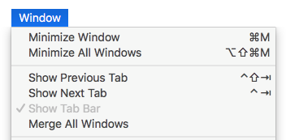

Cette page regroupe diverses options permettant de paramétrer le fonctionnement général de votre application 4D.

## Options

### Au démarrage

Cette option permet de configurer l’affichage proposé par défaut par 4D au démarrage, lorsque l’utilisateur lance uniquement l’application.

* **Ne rien faire** : seule la fenêtre de l’application apparaît, vide.
* **Dialogue d’ouverture de base de données locale** : 4D affiche une boîte de dialogue standard d’ouverture de documents, permettant de désigner un projet local.
* **Ouvrir le dernier projet utilisé** : 4D ouvre directement le dernier projet utilisé, aucune boîte de dialogue d’ouverture n’apparaît.
> Pour forcer l’affichage de la boîte de dialogue d’ouverture lorsque cette option est sélectionnée, maintenez enfoncée la touche **Alt** (Windows) ou **Option** (macOS) pendant le lancement du projet.

* **Dialogue d’ouverture du projet distant** : 4D affiche la boîte de dialogue standard de connexion avec 4D Server, permettant de désigner une base de données publiée sur le réseau.
* **Dialogue Assistant de bienvenue** (réglage d'usine) : 4D affiche la boîte de dialogue de l'Assistant de bienvenue.
> > **4D Server**: The 4D Server application ignores this option. Dans cet environnement, le mode **Ne rien faire** est toujours utilisé.

### Création de formulaire automatique

> Cette option n'est utilisée que dans les bases de données binaires ; elle est ignorée dans l'architecture projets. Voir doc.4d.com.

#### Fenêtre à onglets (macOS seulement)

Depuis macOS Sierra, les applications Mac bénéficient d'onglets automatiques facilitant l'organisation de l'écran lors de l'ouverture de fenêtres multiples : les fenêtres documents sont regroupées dans une seule fenêtre parente et sont accessibles via des onglets. Cette fonctionnalité est particulièrement utile avec les écrans de taille réduite ou lorsqu'un trackpad est utilisé.

Vous pouvez bénéficier de cette fonctionnalité dans les environnements de 4D suivants (versions 64 bits uniquement) :

* Fenêtres de l'éditeur de méthodes
* Fenêtres de l'éditeur de formulaires

Toutes les fenêtres de ces éditeurs peuvent être ouvertes sous forme d'onglets :

Un ensemble de commandes du menu **Fenêtre** permet de gérer les onglets :

Dans la boîte de dialogue des Préférences de 4D, l'option **Fenêtre à onglets** vous permet de contrôler ce fonctionnement :

Trois options sont disponibles :

* **Selon les préférences système** (défaut) : les fenêtres de 4D se comporteront comme elles ont été définies dans les Préférences Système de macOS (En plein écran uniquement, Toujours ou Manuellement).
* **Jamais** : L'ouverture d'un nouveau document dans l'éditeur de formulaires ou l'éditeur de méthodes de 4D provoquera toujours la création d'une nouvelle fenêtre (les onglets ne sont jamais créés).
* **Toujours** : L'ouverture d'un nouveau document dans l'éditeur de formulaires ou l'éditeur de méthodes de 4D provoquera l'ajout d'un onglet.

### Quitter le mode Développement lors du passage en mode Application

Si cette option est cochée, lorsque l’utilisateur passe en mode Application via la commande de menu **Tester l'application**, toutes les fenêtres du mode Développement sont fermées. Si cette option n’est pas cochée (valeur par défaut), les fenêtres du mode Développement restent affichées à l’arrière-plan du mode Application.

### Activer la création de bases de données en binaire

Si vous sélectionnez cette option, deux éléments s'ajoutent au menu **Fichier > Nouveau** et au bouton **Nouveau** de la barre d'outils :

* **Base de données...**
* **Base de données à partir d'une définition de structure...**

Ces éléments vous permettent de créer des bases binaires (voir la section [Créer une nouvelle base](https://doc.4d.com/4Dv19R4/4D/19-R4/Creer-une-nouvelle-base.300-5736754.fe.html)). Ils ne sont plus proposés par défaut car 4D recommande, pour les nouveaux développements, l'utilisation d'une architecture de bases projets.

## Lors de la création d'un nouveau projet

### Utiliser le fichier d'historique

Lorsque cette option est cochée, un fichier d'historique est automatiquement démarré et utilisé dans chaque nouvelle base. Pour plus d’informations, reportez-vous à la section [Fichier d'historique (.journal)](Backup/log.md).

### Créer un paquet

Lorsque cette option est cochée, les bases de données 4D sont automatiquement créées dans un dossier suffixé .4dbase.

Grâce à ce principe, sous macOS les dossiers des bases apparaissent sous forme de paquets (packages) disposant de propriétés spécifiques. Sous Windows, ce fonctionnement n’a pas d’incidence particulière.

### Langue de comparaison de texte

Ce paramètre permet de définir la langue utilisée par défaut pour le traitement et la comparaison des chaînes de caractères dans les nouvelles bases. Le choix d’une langue de comparaison influe sur le tri et la recherche des textes ainsi que le passage en minuscules/majuscules mais n’a pas d’incidence sur la traduction des libellés ou sur les formats de dates, d’heure ou monétaires qui restent, eux, dans la langue du système. Par défaut (réglage d'usine), 4D utilise la langue courante de l'utilisateur définie dans le système.

Une base 4D peut donc fonctionner dans une langue différente de celle du système. A l’ouverture d’une base, le moteur de 4D détecte la langue utilisée par le fichier de données et la fournit au langage (interpréteur ou mode compilé). Les comparaisons de texte, qu’elles soient effectuées par le moteur de base de données ou par le langage, sont donc toujours effectuées dans la même langue.

Lors de la création d’un nouveau fichier de données, 4D utilise la langue définie dans ce menu. En cas d’ouverture d’un fichier de données qui n’est pas dans la même langue que la structure, la langue du fichier de données est utilisée et le code de langue est recopié dans la structure.
> Il est possible de modifier ce paramètre pour la base ouverte via les Propriétés de la base (voir [Comparaison de texte](https://doc.4d.com/4Dv18R6/4D/18-R6/DatabaseData-storage-page.300-5217842.en.html#460252)).

## Emplacement de la documentation

Cette zone permet de configurer l'accès à la documentation HTML de 4D qui s'affiche dans le navigateur courant :

* Lorsque l'utilisateur double-clique sur une commande dans la **page des commandes** de l'Explorateur ;
* Lorsque l'utilisateur clique sur un nom de commande dans l'éditeur de méthodes et appuie sur la touche **F1**.

Vous pouvez choisir d'accéder directement au site de documentation en ligne de 4D ou d'accéder à une version statique stockée localement.

### Dossier local

Indique l'emplacement de la version statique de la documentation HTML. Par défaut, cet emplacement correspond au sous-dossier \Help\Command\langue. Vous pouvez le visualiser en affichant le menu associé à la zone (clic sur la zone). Si le sous-dossier n'est pas présent, l'emplacement est affiché en rouge.

Vous pouvez modifier cet emplacement si vous le souhaitez, par exemple pour afficher la documentation dans une langue différente de celle de l'application. La documentation HTML statique peut être située sur un autre volume, un serveur web, etc. Pour désigner un autre emplacement, cliquez sur le bouton [...] à côté de la zone de saisie et choisissez un dossier racine de documentation (dossier correspondant à la langue : fr, en, es, de ou ja).

### Site Web

Accès URL à la documentation en ligne de la version sur 4D Doc Center. 4D crée des appels vers les pages de la documentation en fonction de cette URL. Vous pouvez le modifier, par exemple si vous souhaitez afficher la documentation dans une langue différente de la langue de l'application. Le bouton de test à droite de la zone lance le navigateur par défaut pour accéder à l'URL spécifiée.

### Commencer par consulter le dossier local

Cette option (cochée par défaut) définit là où 4D recherchera la page de documentation qui a été appelée via l'Explorateur ou la touche F1.

* Lorsqu'elle est cochée, 4D recherche d'abord la page dans le dossier local. Si la page est trouvée à l'emplacement défini, elle est affichée dans le navigateur courant. If it is found, 4D displays the page in the current browser. Ce principe permet par exemple de travailler en mode déconnecté, en accédant à une version locale de la documentation.
* Lorsqu'elle n'est pas cochée, 4D recherche la page souhaitée directement dans la documentation en ligne du site Web et l'affiche dans le navigateur en cours. Si elle n'est pas trouvée, 4D affiche un message d'erreur dans le navigateur.
