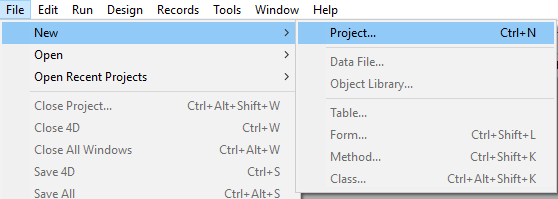

Les projets 4D sont créés et développés à l'aide de l'application **4D**, qui constitue un environnement de développement intégré (IDE) complet. **4D Server** peut également créer des projets vides.

Le développement multi-utilisateur est géré via des outils de **source control** standard (Perforce, Git, SVN, etc.), permettant aux développeurs de travailler sur différentes branches et de comparer, fusionner ou annuler des modifications.

## Créer un projet

Les nouveaux projets d'application 4D peuvent être créés à partir de **4D** ou de **4D Server**. Dans les deux cas, les fichiers de projet sont stockés sur la machine locale.

Pour créer un nouveau projet :

1. Lancez 4D ou 4D Server.
2. Sélectionnez **Nouveau > Projet...** dans le menu **Fichier**: OU (4D uniquement) Sélectionnez **Projet...** dans le bouton **Nouveau** de la barre d'outils :Une boîte de dialogue standard **Save** apparaît pour vous permettre de choisir le nom et l'emplacement du dossier principal du projet 4D.

3. Saisissez le nom du dossier de projet et cliquez sur **Sauvegarder**. Ce nom sera utilisé :

- comme nom du dossier du projet,
- comme nom du fichier .4DProject au premier niveau du dossier "Project".

 Vous pouvez choisir n'importe quel nom autorisé par votre système d'exploitation. Toutefois, si votre projet est destiné à fonctionner sur d'autres systèmes ou à être enregistré via un outil de source control, vous devez tenir compte de leurs recommandations de dénomination spécifiques.

Lorsque vous validez la boîte de dialogue **Nouveau projet**, 4D ferme le projet en cours (le cas échéant), crée un dossier de projet à l'emplacement indiqué et y place tous les fichiers nécessaires au projet. Pour plus d'informations, voir [Architecture d'un projet 4D](Project/architecture.md).

Vous pouvez alors commencer à développer votre projet.

## Ouvrir un projet

Pour ouvrir un projet existant depuis 4D :

1. Sélectionnez **Ouvrir un projet d'application local** dans la boîte de dialogue de l'Assistant de bienvenue, OU Sélectionnez **Ouvrir/Projet local...** dans le menu **Fichier** ou le bouton **Ouvrir** de la barre d'outils. La boîte de dialogue standard Ouvrir apparaît.

2. Sélectionnez le fichier `.4dproject` du projet et cliquez sur **Ouvrir**. Par défaut, le projet est ouvert avec son fichier de données courant. D'autres types de fichiers sont suggérés :

- *Fichiers Packed project* : extension `.4dz` - projets de déploiement
- *Fichiers de raccourcis* : extension `.4DLink` - stocke des paramètres supplémentaires nécessaires à l'ouverture de projets ou d'applications (adresses, identifiants, etc.)
- *Fichiers binaires* : extension `.4db` ou `.4dc` - anciens formats de base de données 4D

### Options

Outre les options standard du système, la boîte de dialogue *Ouvrir* de 4D propose deux menus avec des options spécifiques disponibles via le bouton **Ouvrir** et le menu **Data file**.

- **Ouvrir** - mode d'ouverture du projet :
  - **Interprété** ou **Compilé** : Ces options sont disponibles lorsque le projet sélectionné contient à la fois [du code interprété et du code compilé](Concepts/interpreted.md).
  - **[Maintenance Security Center](MSC/overview.md)**: Ouverture en mode sécurisé permettant d'accéder aux projets endommagés afin d'effectuer les réparations nécessaires.

- **Fichier de données** - spécifie le fichier de données à utiliser avec le projet. Par défaut, l'option **Fichier de données courant** est sélectionnée.

## Raccourcis d’ouverture des projets

4D offre plusieurs façons d'ouvrir des projets directement sans devoir utiliser la boîte de dialogue Ouvrir :

- via des options de menu :
  - *Barre de menus* - **Fichier** > **Ouvrir les projets récents / {project name}**
  - *Barre d'outils 4D* - Sélectionner le projet dans le menu associé au bouton **Ouvrir**

- via les préférences :
  - Placez la préférence générale **Au démarrage** sur **Ouvrir le dernier projet utilisé**.

- en utilisant un fichier `.4DLink` .

### Ouvrir un projet avec un fichier 4DLink

Vous pouvez utiliser un fichier [`.4DLink`](#about-4DLink-files) pour lancer l'application 4D et ouvrir le projet 4D cible. Il existe deux façons de procéder :

- double-cliquer ou glisser-déposer le fichier `.4DLink` sur l'application 4D
- aller sur **Fichier** > **Ouvrir projets récents** et sélectionner un projet

Un fichier .4DLink de type "projet distant" peut être copié et utilisé sur plusieurs machines.
> Il est également possible de sélectionner un fichier 4DLink dans la boîte de dialogue d'ouverture de 4D et 4D Server (ouverture de projet local uniquement).

## À propos des fichiers 4DLink

Les fichiers portant l'extension `.4DLink` sont des fichiers XML contenant des paramètres destinés à automatiser et à simplifier l'ouverture de projets 4D locaux ou distants.

Les fichiers `.4DLink` peuvent enregistrer l'adresse d'un projet 4D ainsi que ses identifiants de connexion et son mode d'ouverture, ce qui permet de gagner du temps lors de l'ouverture des projets.

4D génère automatiquement un fichier `.4DLink` lors de la première ouverture d'un projet local ou lors de la première connexion à un serveur. Le fichier est stocké dans le dossier des préférences locales à l'emplacement suivant :

- Windows 7 et ultérieur : C:\Users\UserName\AppData\Roaming\4D\Favorites vXX\
- macOS : Users/UserName/Library/Application Support/4D/Favorites vXX/

XX représente le numéro de version de l'application. Par exemple, "Favoris v19" pour 4D v19.

Ce dossier est divisé en deux sous-dossiers :

- le dossier **Local** contient les fichiers `.4DLink` qui peuvent être utilisés pour ouvrir des projets locaux
- le dossier **Remote** contient les fichiers `.4DLink` des projets distants récents

Les fichiers `.4DLink` peuvent également être créés à l'aide d'un éditeur XML.

4D fournit une DTD décrivant les clés XML qui peuvent être utilisées pour construire un fichier `.4DLink` . Cette DTD s'appelle database_link.dtd et se trouve dans le sous-dossier \Resources\DTD de l'application 4D.

## Enregistrement des fichiers

Lorsque vous travaillez sur un projet dans 4D, vous pouvez utiliser les éditeurs 4D intégrés pour créer, modifier ou enregistrer des éléments de structure, des méthodes, des formulaires, etc. Les modifications sont enregistrées sur le disque lorsque vous sélectionnez une commande **Enregistrer**, ou lorsque la fenêtre de l'éditeur perd ou récupère le focus.

Étant donné que les éditeurs utilisent des fichiers sur le disque, des conflits potentiels peuvent se produire si le même fichier est modifié ou même supprimé à différents endroits. Par exemple, si la même méthode est modifiée dans une fenêtre d'éditeur de méthode *et* dans un éditeur de texte, la sauvegarde des deux modifications entraînera un conflit.

Le framework de développement 4D comprend un gestionnaire d'accès aux fichiers pour contrôler l'accès simultané :

- si un fichier ouvert est en lecture seule au niveau du système d'exploitation, une icône de verrouillage est affichée dans l'éditeur : 
- si un fichier ouvert est modifié simultanément à partir de différents emplacements, 4D affiche une boîte de dialogue d'alerte lorsqu'on tente d'enregistrer les modifications :

- **Oui**: annuler les modifications de l'éditeur et recharger la version modifiée
- **Non** : enregistre les modifications et écrase l'autre version
- **Annuler** : ne pas enregistrer

Cette fonction est activée pour tous les éditeurs 4D intégrés (Structure, Formulaires, Méthodes, Paramètres et Toolbox).
