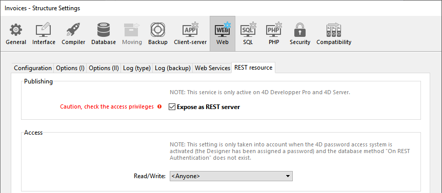
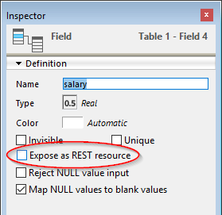

À l'aide de requêtes HTTP standard, le serveur 4D REST permet aux applications externes d'accéder directement aux données de votre application, c'est-à-dire de récupérer des informations sur les dataclass de votre projet, de manipuler des données, de vous connecter à votre application Web et bien plus encore.

Pour commencer à utiliser les fonctionnalités REST, vous devez démarrer et configurer le serveur 4D REST.

> - Sur 4D Server, l'ouverture d'une session REST nécessite une licence client 4D disponible.<br/>
> - Sur 4D mono-utilisateur, vous pouvez ouvrir jusqu'à trois sessions REST à des fins de test.
> - Vous devez gérer la [session](authUsers.md) pour votre application requérante.

## Démarrage du serveur REST

Pour des raisons de sécurité, par défaut, 4D ne répond pas aux requêtes REST. Si vous souhaitez démarrer le serveur REST, vous devez cocher l'option **Exposer en tant que serveur REST** dans la page "Web/REST" des paramètres de la structure pour que les demandes REST soient traitées.



> Les services REST utilisent le serveur HTTP 4D; vous devez donc vous assurer que le serveur Web 4D est lancé.

Le message d'avertissement "Attention, vérifiez les privilèges d'accès" s'affiche lorsque vous cochez cette option, pour attirer votre attention sur le fait que lorsque les services REST sont activés, l'accès par défaut aux objets de base de données est gratuit tant que les accès REST n'ont pas été configurés.

> Vous devez redémarrer l'application 4D pour que vos modifications soient prises en compte.

## Configuration de l'accès REST

Par défaut, les accès REST sont ouverts à tous les utilisateurs, ce qui n'est évidemment pas recommandé pour des raisons de sécurité et de contrôle de l'utilisation des licences clientes.

Vous pouvez configurer les accès REST de l'une des manières suivantes :

- assigner un groupe d'utilisateurs en **lecture/écriture** aux services REST dans la page "Web/REST" des paramètres de la structure;
- saisir d'une méthode base `On REST Authentication`pour intercepter et gérer chaque demande REST initiale.

> Vous ne pouvez pas utiliser les deux fonctionnalités simultanément. Une fois qu'une méthode base `On REST Authentication` a été définie, 4D lui donne entièrement le contrôle des requêtes REST : tout paramètre effectué à l'aide du menu "Lecture/Ecriture" de la page de ressources Web/REST des paramètres de structure est ignoré.

### Utilisation des Paramètres de la Structure

Le menu **Lecture/Écriture** de la page "Web/REST" des paramètres de la structure indique un groupe d'utilisateurs 4D autorisé à établir le lien vers l'application 4D à l'aide des requêtes REST.

Par défaut, le menu affiche `&#060;Anyone&#062`; ce qui signifie que les accès REST sont ouverts à tous les utilisateurs. Une fois que vous avez spécifié un groupe, seul un compte utilisateur 4D appartenant à ce groupe peut être utilisé pour [accéder à 4D via une requête REST](authUsers.md). Si un compte utilisé n'appartient pas à ce groupe, 4D renvoie une erreur d'authentification à l'expéditeur de la requête.

> Pour que ce paramètre prenne effet, la méthode base `On REST Authentication` ne doit pas être définie. Si elle existe, 4D ignore les paramètres d'accès définis dans les propriétés de la structure.

### Méthode base On REST Authentication

La méthode base `On REST Authentication` vous permet de contrôler de manière personnalisée l’ouverture des sessions REST sur 4D. Cette méthode base est automatiquement appelée lorsqu'une nouvelle session est ouverte à l'aide d'une requête REST. Lorsqu'une [requête d’ouverture de session REST](authUsers.md) est reçue, les identifiants de connexion sont fournis dans l’en-tête de la requête. La méthode base `On REST Authentication` est appelée afin de vous permettre d’évaluer ces identifiants. Vous pouvez utiliser la liste des utilisateurs de la base 4D ou votre propre table d’identifiants. Pour plus d'informations, consultez la [documentation de la méthode base `On REST Authentication`](https://doc.4d.com/4Dv18/4D/18/On-REST-Authentication-database-method.301-4505004.en.html).

## Exposer les tables et les champs

Une fois les services REST sont activés dans l'application 4D, une session REST peut par défaut accéder à toutes les tables et à tous les champs de la base de données 4D via l'[interface du datastore](ORDA/dsMapping.md#datastore). Ainsi, elle peut utiliser leurs données. Par exemple, si votre base de données contient une table [Employee], il est possible d'écrire :

```
http://127.0.0.1:8044/rest/Employee/?$filter="salary>10000"

```

Cette requête retournera tous les employés dont le champ "salary" est supérieur à 10 000.

> Les tables et/ou champs 4D dont l'attribut est "invisible" sont également exposés par défaut dans REST.

Si vous souhaitez personnaliser les objets du datastore accessibles via REST, vous devez désactiver l'exposition de chaque table et/ou champ que vous souhaitez masquer. Lorsqu'une requête REST tente d'accéder à une ressource non autorisée, 4D retourne une erreur.

### Exposer des tables

Par défaut, toutes les tables sont exposées dans REST.

Pour des raisons de sécurité, vous pouvez choisir d'exposer uniquement certaines tables du datastore aux appels REST. Par exemple, si vous avez créé une table [Users] stockant les noms d'utilisateur et les mots de passe, il serait préférable de ne pas l'exposer.

Pour supprimer l'exposition REST d'une table :

1. Affichez l'Inspecteur de table dans l'Editeur de structure et sélectionnez la table à modifier.

2. Décochez l'option **Expose as REST resource**  : Effectuez cette opération pour chaque table dont l'exposition doit être modifiée.

### Exposer des champs

Par défaut, tous les champs d'une base 4D sont exposés dans REST.

Vous pouvez choisir d'exposer certains champs de vos tables en REST. Par exemple, vous pouvez ne pas souhaiter exposer le champ [Employees]Salary.

Pour supprimer l'exposition REST d'un champ :

1. Affichez l'Inspecteur de champ dans l'Editeur de structure et sélectionnez le champ à modifier.

2. Décochez la case **Exposer en tant que ressource REST** pour le champ.  Répétez cette opération pour chaque champ dont l'exposition doit être modifiée.

> Pour qu'un champ soit accessible via REST, la table parente doit l'être également. Si la table parente n'est pas exposée, aucun de ses champs ne le sera, quel que soit leur statut.
