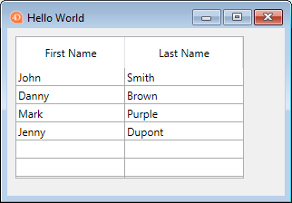

Cette section d'initiation est destinée aux nouveaux utilisateurs qui souhaitent avoir une vue d'ensemble sur la façon de créer à partir de rien un site Web 4D qui gère des données provenant de la base. C'est parti !

## Hello World Example

Commençons par faire en sorte que le serveur web envoie "Hello World" au navigateur. The most simple way to do this is to create a project, start the web server and write a small code that returns a text in the `On Web Connection` database method.

### Démarrer le serveur web

Pour démarrer le Serveur Web 4D:

1. Lancez votre application 4D et créez un nouveau projet 4D vide.
2. In the **Run** menu, select **Start Web Server**.

C'est tout ! Le serveur web est démarré (vous pouvez voir que l'élément de menu est devenu **Arrêter le serveur web**). Il est maintenant prêt à traiter les requêtes. Pour le vérifier, nous allons afficher la page d'accueil par défaut.

### Affichage de la page home par défaut

The 4D web server creates automatically a default `index.html` page in the default `WebFolder` root folder, created at the same level as the Project folder.

1. Lancez un navigateur web et connectez-vous à l'adresse IP du serveur web (le port http par défaut pour le serveur web 4D est 80). If the web server and the browser are on the same machine, you can select **Test Web Server** in the **Run** menu.

La page d'accueil par défaut est affichée :


### Affichage de Hello World

1. Open the Explorer, display the Database Methods list and double-click on `On Web Connection`.

2. Saisissez le code suivant :

```4d
Case of 
 : ($1="/hello")
  WEB SEND TEXT("Hello World!")
 Else 
  // Error 404 for example
End case
 Else 
  // Error 404 for example
End case 
```

The [`On Web Connection`](httpRequests.md#on-web-connection) database method is called for incoming requests and receives the target URL in the `$1` parameter. Ce code très simple envoie simplement le texte au navigateur.

3. Dans votre navigateur, saisissez l'URL suivante :

```
http://localhost/hello
```

Le serveur web traite la demande et renvoie :


## Obtenir des données à partir de la base

Maintenant, nous allons voir à quel point il est simple de récupérer des données de la base. Tout d'abord, nous allons créer une table et la remplir avec quelques données.

Créez une base de données basique avec, par exemple, une seule table contenant quelques enregistrements :

 

### Affichage des données dans une page

The most simple solution to display data is to call a [template page](templates.md) containing tags.

1. À l'aide de n'importe quel éditeur de texte, créez un fichier contenant les lignes suivantes :

```html
<html>
<body>
<!--#4DCODE ALL RECORDS([Friends])-->
<!--#4DLOOP [Friends]-->
<!--#4DTEXT [Friends]lastName--> <!--#4DTEXT [Friends]firstName--><br/>
<!--#4DENDLOOP-->
</body>
</html>
```

2. Name the file "friends.shtml" and save it in the **WebFolder** of your project.
3. Dans votre navigateur, saisissez l'URL suivante :

```
http://localhost/friends.shtml
```

`.shtml` pages are automatically processed by the web server. Votre page remplie avec les données est renvoyée :


### Requête REST

If we not only want to *display* data, but to *use* it, we can use ORDA and the REST server. Thanks to the [ORDA concept](ORDA/overview.md), the `Friends` table is automatically mapped to a dataclass and is available through [REST](REST/gettingStarted.md).

1. We will use the REST server to access data: go the "Settings" dialog box, select the "Web/Rest resource" page, and check the **Expose as REST server** option.


2. Dans votre navigateur, saisissez l'URL suivante :

```
http://localhost/rest/$catalog
```

Le serveur web renvoie les résultats en JSON :

```json
{
 "__UNIQID": "3F1B6ACFFE12B64493629AD76011922D",
 "dataClasses": [
  {
   "name": "Friends",
   "uri": "/rest/$catalog/Friends",
   "dataURI": "/rest/Friends"
  }
 ]
}
```

Vous obtenez le catalogue, c'est-à-dire la liste des dataclass et des attributs exposés dans le datastore.

Vous pouvez également obtenir diverses données.

3. Entrez l'URL suivante :

```
http://localhost/rest/Friends
```

Le serveur renvoie les entités, c'est-à-dire les données, de la dataclass Friends :

```json
{
 "__DATACLASS": "Friends",
 "__entityModel": "Friends",
 "__GlobalStamp": 0,
 "__COUNT": 4,
 "__FIRST": 0,
 "__ENTITIES": [
  {
   "__KEY": "1",
   "__TIMESTAMP": "2020-10-27T14:29:01.914Z",
   "__STAMP": 1,
   "ID": 1,
   "lastName": "Smith",
   "firstName": "John"
  },
  {
   "__KEY": "2",
   "__TIMESTAMP": "2020-10-27T14:29:16.035Z",
   "__STAMP": 1,
   "ID": 2,
   "lastName": "Brown",
   "firstName": "Danny"
  },
  {
   "__KEY": "3",
   "__TIMESTAMP": "2020-10-27T14:29:43.945Z",
   "__STAMP": 1,
   "ID": 3,
   "lastName": "Purple",
   "firstName": "Mark"
  },
  {
   "__KEY": "4",
   "__TIMESTAMP": "2020-10-27T14:34:58.457Z",
   "__STAMP": 1,
   "ID": 4,
   "lastName": "Dupont",
   "firstName": "Jenny"
  }
 ],
 "__SENT": 4
}
```

This very simple example shows how the web server interacts transparently with the [REST server](REST/gettingStarted.md) to return any requested data, provided it is exposed. Dans vos interfaces web, vous pouvez facilement lier le code javascript ou html avec les données retournées. See the built-in [Web Data Explorer](Admin/dataExplorer.md) to have an example of sophisticated web interface bound to dataclasses.

## Connexion et session

Dans les sections ci-dessus, nous obtenons un accès libre à l'application à partir de requêtes Web. Cependant, dans le monde des applications web, la sécurité d'accès aux données est la première priorité. Lors de la connexion au serveur Web 4D, les utilisateurs doivent être authentifiés et leur navigation contrôlée.

### Création d'une table d'utilisateurs

La façon la plus simple et sécurisée de connecter un utilisateur sur le serveur web 4D est basée sur le scénario suivant :

- Users are stored in a dedicated, unexposed table (named *WebUsers* for example)
- The *WebUsers* table could be [encrypted](MSC/encrypt.md) and stores the user login and a hash of their password.

1. Créez une table avec certains champs, par exemple :


2. Écrivez et exécutez le code suivant pour créer un utilisateur :

```4d
var $webUser : cs.WebUsersEntity

$webUser:=ds.WebUsers.new()
$webUser.firstName:="John"
$webUser.lastName:="Doe"
// le mot de passe devrait en principe être saisi par l'utilisateur
$webUser.password:=Generate password hash("123")
$webUser.userId:="john@4d.com"
$webUser.save()
```

### Authentification des utilisateurs

> To be secure from end to end, it is necessary that the whole connection is established via [https](webServerConfig.md#enable-https).

1. Ouvrez l'Explorateur et créez une méthode projet nommée "login".

3. Écrivez le code suivant :

```4d
var $indexUserId; $indexPassword : Integer
var $userId; $password : Text
var $user; $info : Object
ARRAY TEXT($anames; 0)
ARRAY TEXT($avalues; 0)

// get values sent in the header of the request
WEB GET VARIABLES($anames; $avalues)

// look for header login fields
$indexUserId:=Find in array($anames; "userId")
$userId:=$avalues{$indexUserId}
$indexPassword:=Find in array($anames; "password")
$password:=$avalues{$indexPassword}

//look for a user with the entered name in the users table
$user:=ds.WebUsers.query("userId = :1"; $userId).first()

If ($user#Null) //a user was found
  //check the password
    If (Verify password hash($password; $user.password))
      //password ok, fill the session
        $info:=New object()
        $info.userName:=$user.firstName+" "+$user.lastName
        Session.setPrivileges($info)
         //You can use the user session to store any information
        WEB SEND TEXT("Welcome "+Session.userName)
    Else 
        WEB SEND TEXT("Wrong user name or password.")
    End if 
Else 
    WEB SEND TEXT("Wrong user name or password.")
End if
    End if 
Else 
    WEB SEND TEXT("Wrong user name or password.")
End if 
```

3. Display the method properties by clicking on the **[i]** button in the code editor, check the `4D tags and URLs (4DACTION...)` option and click **OK**.


4. Dans votre navigateur, saisissez l'URL suivante :

```
http://localhost/4DACTION/login/?userID=john@4d.com&password=123
```

> L'utilisation de telles URLs n'est pas recommandée, elle est présentée ici uniquement pour simplifier l'exemple. Une requête de connexion plus réaliste doit être traitée via un formulaire web et une requête POST. See [this page](sessions.md#example) for an example of form POST.

Vous serez alors connecté pour la session :


Les informations d'identification erronées seraient rejetées :


Once a user is logged, you can handle the associated session using the `WEB Get Current Session ID` method. See the [User sessions](sessions.md) page.
