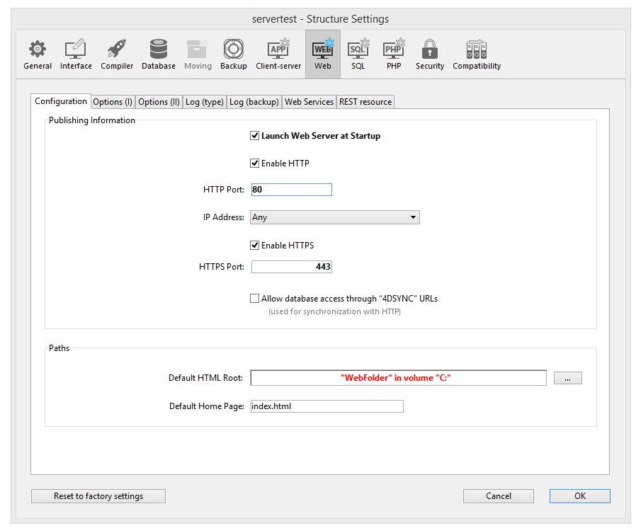
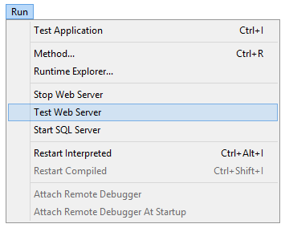

4D offre plusieurs outils intégrés permettant de démarrer, arrêter ou administrer le serveur web intégré.

## Démarrer le Serveur Web 4D

> Une licence 4D Web Application est requise pour pouvoir lancer le serveur web de 4D ou 4D Server. Pour plus d'informations, consultez le [site web de 4D](https://www.4d.com).

Un projet 4D peut démarrer et surveiller un serveur Web pour l'application principale (hôte) ainsi que chaque composant hébergé.

Il y a plusieurs manières de démarrer le serveur Web principal :

* via un bouton/une commande de menu :
  * 4D: **Exécution > démarrer le serveur Web** 
  * 4D Server : depuis la page du serveur HTTP, cliquez sur **Démarrer le serveur HTTP** 

* automatiquement à l'ouverture de l'application 4D. en cochant l'option **Lancer le serveur Web au démarrage** dans **Propriétés** &#062 **Web** &#062 **Configuration** 

* Par programmation, en appelant la fonction [`webServer.start()`](API/WebServerClass.md#start) ou la commande `WEB START SERVER`.

Le serveur Web de n'importe quel composant peut être lancé en appelant la fonction [`webServer.start()`](API/WebServerClass.md#start) sur l'objet serveur Web du composant.
> Il n'est pas nécessaire de relancer l'application 4D pour démarrer ou arrêter le serveur Web.

## Arrêter le Serveur Web 4D

Il y a plusieurs manières d'arrêter le serveur Web principal :

* Via le menu 4D, **Exécution > Arrêter le serveur Web**, ou via le bouton **Arrêter le serveur HTTP** de 4D Server (les deux items affichent **Démarrer...** quand le serveur n'est pas encore démarré).

* Par programmation, en appelant la fonction [`webServer.stop()`](API/WebServerClass.md#stop) ou la commande `WEB STOP SERVER`.

Le serveur Web de n'importe quel composant peut être arrêté en appelant la fonction ``webServer.stop() sur l'objet serveur Web du composant.

## Tester le Serveur Web 4D

La commande **Tester le serveur Web** peut être utilisé pour s'assurer que le serveur web intégré fonctionne correctement (4D uniquement). Cette commande est accessible depuis le menu **Run** lorsque le serveur web est lancé :

Lorsque vous sélectionnez cette commande, la page d'accueil du site Web publié par l'application 4D s'affiche dans une fenêtre de votre navigateur par défaut :

Cette commande vous permet de vérifier que le serveur web, l'affichage de la page d'accueil, etc. fonctionnent correctement. La page est appelée en utilisant l'URL *localhost*, qui est le raccourci standard désignant l'adresse IP de la machine sur laquelle le navigateur web est exécuté. Cette commande prend en compte le numéro du [port de publication TCP](#http-port) spécifié dans les paramètres.

## Vider le cache

À tout moment, vous pouvez vider le cache des pages et des images qu'il contient (si, par exemple, vous avez modifié une page statique et que vous souhaitez la recharger dans le cache).

4D : cliquez sur le bouton **Vider le cache** dans la page Web/Options (I) de la boîte de dialogue des Paramètres. Le cache est alors immédiatement effacé.
> Vous pouvez aussi utiliser l'url [/4DCACHECLEAR](#cacheclear).

## Explorateur d'exécution

La page **Watch** (rubrique **Web**) de l'Explorateur d'exécution affiche les informations du serveur Web, notamment :

* **Occupation du cache Web** : indique le nombre de pages présentes dans le cache web ainsi que le pourcentage d'utilisation. Cette information n'est disponible que si le serveur web est actif et que la taille du cache est supérieure à 0.

* **Temps d’activité du serveur Web** : indique la durée d'utilisation (au format heures:minutes:secondes) du serveur Web. Ces informations ne sont disponibles que si le serveur web est actif.

* **Nombre de requêtes http** : indique le nombre total de requêtes HTTP reçues depuis le démarrage du serveur web, ainsi qu'un nombre instantané de requêtes par seconde (mesure prise entre deux mises à jour de l'Explorateur d'exécution). Ces informations ne sont disponibles que si le serveur web est actif.

## URLs d'administration

Les URL d'administration Web vous permettent de contrôler le site web publié sur votre serveur. 4D Web Server accepte quatre URLs spécifiques : */4DSTATS*, */4DHTMLSTATS*, /*4DCACHECLEAR* et */4DWEBTEST*.

> */4DSTATS*, */4DHTMLSTATS* et */4DCACHECLEAR* ne sont disponibles que pour le concepteur et l'administrateur de la base de données. Si le système de mot de passe 4D n'a pas été activé, ces URL sont disponibles pour tous les utilisateurs. /4DWEBTEST est toujours disponible.

### /4DSTATS

L'URL **/4DSTATS** renvoie plusieurs éléments d'information dans un tableau HTML (affichable dans un navigateur) :

| Élément                | Description                                                 |
| ---------------------- | ----------------------------------------------------------- |
| Cache Current Size     | Taille actuelle du cache du serveur web (en octets)         |
| Cache Max Size         | Taille maximale du cache (en octets)                        |
| Cached Object Max Size | Taille maximale de chaque objet dans le cache (en octets)   |
| Cache Use              | Pourcentage de cache utilisé                                |
| Cached Objects         | Nombre d'objects trouvés dans le cache, **images incluses** |

Ces informations peuvent vous permettre de vérifier le fonctionnement de votre serveur et éventuellement d'adapter les paramètres correspondants.
> La commande `WEB LIRE STATISTIQUES` permet également d'obtenir des informations sur la façon dont le cache est utilisé pour les pages statiques.

### /4DHTMLSTATS

L'URL */4DHTMLSTATS* retourne les mêmes informations que l'URL */4DSTATS*, également sous forme de tableau. La différence est que le champ **Cached objects** ne compte que les pages HTML (les fichiers d'images ne sont pas pris en compte). De plus, cette URL retourne le champ **Filtered Objects**.

| Élément                | Description                                                                      |
| ---------------------- | -------------------------------------------------------------------------------- |
| Cache Current Size     | Taille actuelle du cache du serveur web (en octets)                              |
| Cache Max Size         | Taille maximale du cache (en octets)                                             |
| Cached Object Max Size | Taille maximale de chaque objet dans le cache (en octets)                        |
| Cache Use              | Pourcentage de cache utilisé                                                     |
| Cached Objects         | Nombre d'objects trouvés dans le cache, **sans les images**                      |
| Filtered Objects       | Nombre d'objets dans le cache non pris en compte par l'URL, notamment les images |

### /4DCACHECLEAR

L'URL */4DCACHECLEAR* retire immédiatement les pages statiques et les images du cache. Il vous permet donc de "forcer" la mise à jour des pages qui ont été modifiées.

### /4DWEBTEST

L'URL */4DWEBTEST* permet de vérifier l'état du serveur web. Lorsque cette URL est appelée, 4D renvoie un fichier texte avec les champs HTTP suivants remplis :

| Champ HTTP | Description                            | Exemple                                                                                                                         |
| ---------- | -------------------------------------- | ------------------------------------------------------------------------------------------------------------------------------- |
| Date       | date courante au format RFC 822 format | Mon, 7 Dec 2020 13:12:50 GMT                                                                                                    |
| Server     | 4D/numéro de version                   | 4D/18.5.0 (Build 18R5.257368)                                                                                                   |
| User-Agent | nom et version @ adresse IP du client  | Mozilla/5.0 (Windows NT 10.0; Win64; x64) AppleWebKit/537.36 (KHTML, like Gecko) Chrome/86.0.4240.183 Safari/537.36 @ 127.0.0.1 |

## Logs

4D vous permet de générer deux historiques de requêtes Web :

* un historique de débogage, utile dans la phase de développement du serveur web (*HTTPDebugLog.txt*),
* un journal standardisé des requêtes web, plutôt utilisé à des fins statistiques (*logweb.txt*).

Les deux fichiers journaux sont automatiquement créés dans le dossier **Logs** du projet d'application.

### HTTPDebugLog.txt

Le [fichier de débogage](webServerConfig.md#debug-log) peut être activé via l'objet [`web server`](webServerObject.md) ou la commande `WEB FIXER OPTION`

Ce fichier journal enregistre chaque requête HTTP et chaque réponse en mode brut (raw). Les requêtes sont enregistrées dans leur totalité (en-têtes compris). Les parties body peuvent également être enregistrées.

Les champs suivants sont enregistrés pour Requête et Réponse :

| Noms des champs | Description                                                       |
| --------------- | ----------------------------------------------------------------- |
| SocketID        | ID du socket utilisé pour la communication                        |
| PeerIP          | Adresse IPv4 de l'hôte (client)                                   |
| PeerPort        | Port utilisé par l'hôte (client)                                  |
| TimeStamp       | Horodatage en millisecondes (depuis le démarrage du système)      |
| ConnectionID    | Connexion UUID (UUID du VTCPSocket utilisé pour la communication) |
| SequenceNumber  | Numéro d'opération séquentiel et unique dans la session de log    |

### logweb.txt

Le [fichier d'enregistrements d'historique Web](webServerConfig.md#log-recording) peut être activé via l'objet [`web server`](webServerObject.md), la commande `WEB FIXER OPTION` ou la page **Web > Log** des **Propriétés**. Vous devez sélectionner un format d'historique.

#### CLF/DLF

Chaque ligne du fichier représente une requête, comme : *host rfc931 user \[DD/MMM/YYYY:HH:MM:SS] "request" state length* Chaque champ est séparé par un espace et chaque ligne se termine par la séquence CR/LF (caractère 13, caractère 10).

Le format DLF (Distilled Log Format) est similaire au format CLF (Common Log format) et utilise exactement la même structure. Il ajoute simplement deux champs HTTP supplémentaires à la fin de chaque requête : Referer et User-agent. Voici la description des formats CLF/DLF (non personnalisables) :

| Noms des champs      | Description                                                                                                                                                                    |
| -------------------- | ------------------------------------------------------------------------------------------------------------------------------------------------------------------------------ |
| host                 | Adresse IP du client (ex. 192.100.100.10)                                                                                                                                      |
| rfc931               | information non générée par 4D, c'est toujours - (le signe moins)                                                                                                              |
| user                 | le nom d'utilisateur tel qu'il est authentifié, ou bien - (le signe moins). Si le nom de l’utilisateur contient des espaces, ils sont remplacés par des _ (tiret bas).         |
| DD/MMM/YYYY:HH:MM:SS | DD : jour, MMM : abréviation de 3 lettres pour le nom du mois (Jan, Feb,...), YYYY : année, HH : heure, MM : minutes, SS : secondes. La date et heure sont locales au serveur. |
| request              | requête envoyée par le client (ex. GET /index.htm HTTP/1.0)                                                                                                                    |
| state                | réponse donnée par le serveur                                                                                                                                                  |
| length               | taille des données retournées (HTTP header exclu) ou 0                                                                                                                         |
| Referer              | DLF uniquement. Contient l'URL de la page qui pointe vers le document de la requête.                                                                                           |
| User-agent           | DLF uniquement - Contient le nom et la version du navigateur ou du logiciel du client à l'origine de la demande                                                                |

#### ELW/WLF

Le format ELF (Extended Log Format) est très répandu dans le monde des navigateurs HTTP. Il peut être utilisé pour construire des historiques sophistiqués qui répondent à des besoins spécifiques. Pour cette raison, le format ELF peut être personnalisé : il est possible de choisir les champs à enregistrer ainsi que leur ordre d'insertion dans le fichier.

Le format WLF (WebStar Log format) a été développé spécifiquement pour le serveur 4D WebSTAR.

##### Configurer les champs

Lorsque vous choisissez le format ELF ou WLF, la zone "Web Log Token Selection" affiche les champs disponibles pour le format choisi. Vous devrez sélectionner chaque champ à inclure dans le journal. Pour ce faire, cochez les champs souhaités.
> Le même champ ne peut pas être sélectionné deux fois.

Le tableau suivant répertorie les champs disponibles pour chaque format (par ordre alphabétique) et décrit leur contenu :

| Champ          | ELF | WLF | Valeur                                                                                                                                                               |
| -------------- | --- | --- | -------------------------------------------------------------------------------------------------------------------------------------------------------------------- |
| BYTES_RECEIVED |     | X   | Nombre d'octets reçus par le serveur                                                                                                                                 |
| BYTES_SENT     | X   | X   | Nombre d’octets envoyés par le serveur au client                                                                                                                     |
| C_DNS          | X   | X   | Adresse IP du DNS (ELF : champ identique au champ C_IP)                                                                                                              |
| C_IP           | X   | X   | Adresse IP du client (par exemple 192.100.100.10)                                                                                                                    |
| CONNECTION_ID  |     | X   | Numéro unique de la connexion                                                                                                                                        |
| CS(COOKIE)     | X   | X   | Informations sur les cookies contenus dans la requête HTTP                                                                                                           |
| CS(HOST)       | X   | X   | Champ Host de la requête HTTP                                                                                                                                        |
| CS(REFERER)    | X   | X   | URL de la page pointant vers le document demandé                                                                                                                     |
| CS(USER_AGENT) | X   | X   | Informations sur le logiciel et le système d’exploitation du client                                                                                                  |
| CS_SIP         | X   | X   | Adresse IP du serveur                                                                                                                                                |
| CS_URI         | X   | X   | URI sur lequel la requête est effectuée                                                                                                                              |
| CS_URI_QUERY | X   | X   | Paramètres d’interrogation de la requête                                                                                                                             |
| CS_URI_STEM  | X   | X   | Partie de la requête sans les paramètres d’interrogation                                                                                                             |
| DATE           | X   | X   | DD: jour, MMM: abréviation de 3 lettres pour le mois (Jan, Feb,...), YYYY: année                                                                                     |
| METHOD         | X   | X   | Méthode HTTP utilisée pour la requête adressée au serveur                                                                                                            |
| PATH_ARGS      |     | X   | Paramètres de la CGI : chaîne située après le caractère “$”                                                                                                          |
| STATUS         | X   | X   | Réponse fournie par le serveur                                                                                                                                       |
| TIME           | X   | X   | HH: heure, MM: minutes, SS: secondes                                                                                                                                 |
| TRANSFER_TIME  | X   | X   | Délai ayant été nécessaire au serveur pour générer la réponse                                                                                                        |
| USER           | X   | X   | Nom d’utilisateur s’il s’est authentifié, sinon - (signe moins). Si le nom d’utilisateur contient des espaces, ils sont remplacés par des _ (traits de soulignement) |
| Variable URL   |     | X   | URL demandé par le client                                                                                                                                            |

> Les dates et heures sont données au format GMT

#### Fréquence de sauvegarde

Comme la taille d'un *logweb.txt* fichier évoluer considérablement, il est possible de mettre en place un mécanisme d'archivage automatique. Le déclenchement d'une backup peut être basé sur une certaine période de temps (exprimée en heures, jours, semaine ou mois), ou sur la taille du fichier ; lorsque le délai fixé (ou la taille du fichier) est atteinte, 4D ferme et archive automatiquement le fichier d'historique en cours et en crée un nouveau.

Lorsque la sauvegarde du fichier d'historique web est déclenchée, le fichier d'historique est archivé dans un dossier nommé "Archives Logweb", qui est créé au même niveau que le fichier *logweb.txt*.

Le fichier archivé est renommé sur le modèle suivant : "DYYYY_MM_DD_Thh_mm_ss.txt". Par exemple, pour un fichier archivé le 4 septembre 2020 à 15h50  et 7 secondes : “D2020_09_04_T15_50_07.txt.”

#### Paramètres de sauvegarde

Les paramètres de sauvegarde automatique du logweb.txt sont définis sur la page **Web > Journal (périodicité)** des Paramètres :

Vous devez d'abord choisir la fréquence (jours, semaines, etc.) ou le critère de la taille limite du fichier en cliquant sur le bouton radio correspondant. Vous devez ensuite spécifier le moment précis de la sauvegarde si nécessaire.

* **Pas de sauvegarde du journal** : La fonction de sauvegarde programmée est désactivée.

* **Toutes les X heure(s)** : Cette option est utilisée pour programmer des sauvegardes sur une base horaire. Vous pouvez entrer une valeur entre 1 et 24.
  * **à partir de**: Permet de définir l'heure du déclenchement du premier backup.

* **Tous les N jour(s) à N** : permet de programmer des backups sur une base journalière. Saisissez 1 si vous souhaitez une sauvegarde hebdomadaire. Lorsque vous cochez cette option, vous devez indiquer l’heure à laquelle la sauvegarde doit être déclenchée.

* **Tous les N jour(s) à N** : permet de programmer des backups sur une base hebdomadaire. Saisissez 1 si vous souhaitez une sauvegarde hebdomadaire. Lorsque vous cochez cette option, vous devez indiquer le ou les jours de la semaine et l’heure à laquelle chaque sauvegarde doit être déclenchée. Vous pouvez cocher un ou plusieurs jour(s) de la semaine. Par exemple, vous pouvez utiliser cette option pour définir deux sauvegardes hebdomadaires : une le mercredi et une le vendredi.

* **Tous les N mois, Ne jour à N** : permet de programmer des sauvegardes sur une base mensuelle. Saisissez 1 si vous souhaitez une sauvegarde mensuelle. Lorsque vous cochez cette option, vous devez indiquer le jour de chaque mois auquel la sauvegarde doit être déclenchée, ainsi que l’heure de déclenchement.

* **Tous les N Mo** : Cette option est utilisée pour programmer les sauvegardes en fonction de la taille du fichier journal courant. Une sauvegarde se déclenche automatiquement quand le fichier atteint la taille spécifiée. La taille limite du fichier peut être fixée à 1, 10, 100 ou 1000 Mo.
