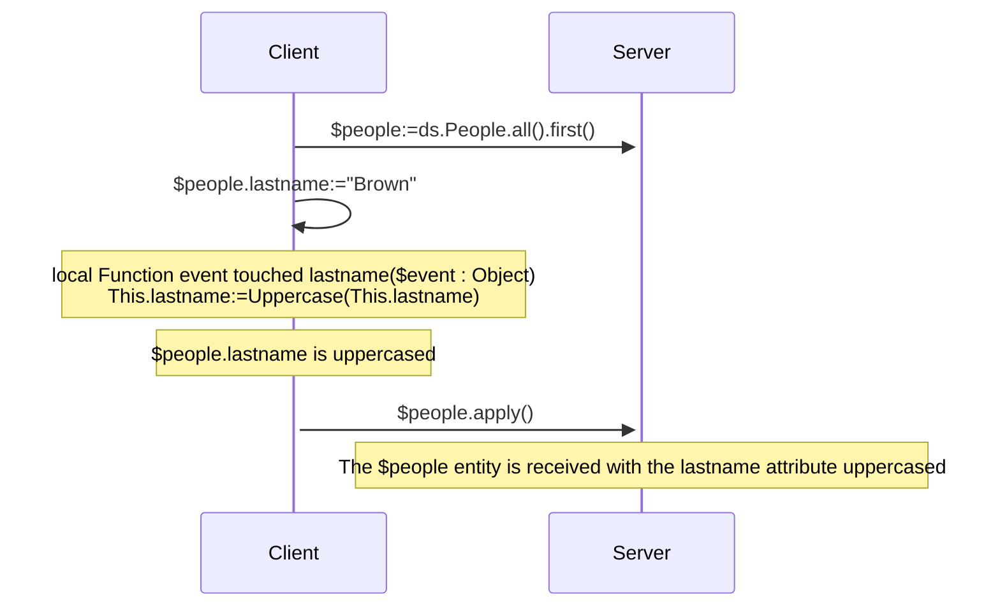
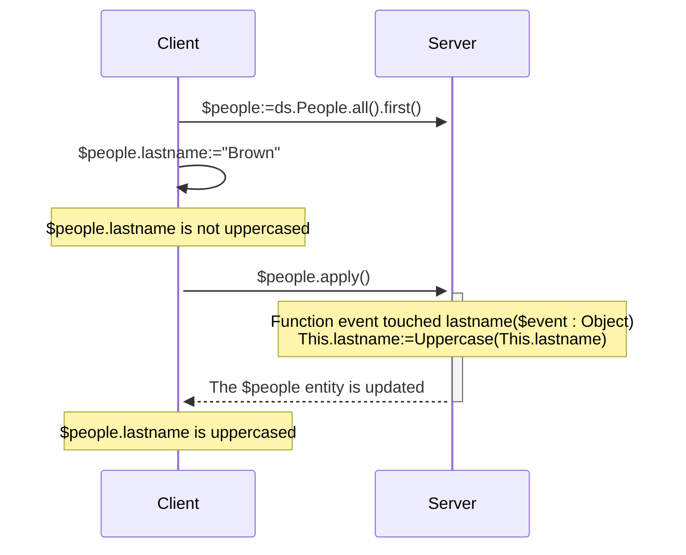
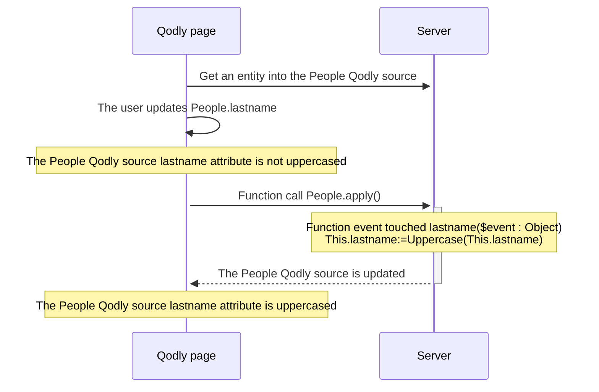

<details><summary>Historique</summary>

| Release | Modifications           |
| ------- | ----------------------- |
| 20 R10  | ajout événement touched |

</details>

Entity events are functions that are automatically invoked by ORDA each time entities and entity attributes are manipulated (added, deleted, or modified). Vous pouvez écrire des événements très simples, puis les rendre plus sophistiqués.

Vous ne pouvez pas déclencher directement l'exécution d'une fonction d'événement. Les événements sont appelés automatiquement par ORDA en fonction des actions de l'utilisateur ou des opérations effectuées par le code sur les entités et leurs attributs.

:::info Note de compatibilité

ORDA entity events in the datastore are equivalent to triggers in the 4D database. Cependant, les actions déclenchées au niveau de la base de données 4D à l'aide des commandes du langage classique 4D ou des actions standard ne déclenchent pas les événements ORDA.

:::

## Vue d’ensemble

### Niveau de l'événement

A entity event function is always defined in the [Entity class](../ORDA/ordaClasses.md#entity-class).

Un événement peut être défini au niveau de l'**entité** et/ou de l'**attribut** (y compris les [**attributs calculés**](../ORDA/ordaClasses.md#computed-attributes)). Dans le premier cas, il sera déclenché pour tous les attributs de l'entité ; dans l'autre cas, il ne sera déclenché que pour l'attribut ciblé.

Pour un même événement, vous pouvez définir différentes fonctions pour différents attributs.

Vous pouvez également définir le même événement au niveau de l'attribut et de l'entité. L'événement attribut est appelé en premier, puis l'événement entité.

### Exécution en configuration distante

En général, les événements ORDA sont exécutés sur le serveur.

Cependant, dans une configuration client/serveur, la fonction d'événement `touched()` peut être exécutée sur **le serveur ou le client**, en fonction de l'utilisation du mot-clé [`local`](./ordaClasses.md#local-functions). Une implémentation spécifique côté client permet de déclencher l'événement sur le client.

:::note

Les fonctions ORDA [`constructor()`](./ordaClasses.md#class-constructor) sont toujours exécutées sur le client.

:::

Avec d'autres configurations distantes (i.e. applications Qodly, [requêtes via l'API REST](../REST/REST_requests.md), ou requêtes via [`Open datastore`](../commands/open-datastore.md)), la fonction d'événement `touched()` est toujours exécutée **côté serveur**. Cela signifie que vous devez vous assurer que le serveur peut "voir" qu'un attribut a été touché pour déclencher l'événement (voir ci-dessous).

### Tableau de synthèse

The following table lists ORDA entity events along with their rules.

| Evénement              | Niveau   | Nom de la fonction                                      |                 (C/S) Exécuté sur                |
| :--------------------- | :------- | :------------------------------------------------------ | :-----------------------------------------------------------------: |
| Instanciation d'entité | Entity   | [`constructor()`](./ordaClasses.md#class-constructor-1) |                                client                               |
| Attribut touched       | Attribut | `event touched <attrName>()`                            | Dépend du mot-clé [`local`](../ORDA/ordaClasses.md#local-functions) |
|                        | Entity   | `event touched()`                                       | Dépend du mot-clé [`local`](../ORDA/ordaClasses.md#local-functions) |

:::note

La fonction [`constructor()`](./ordaClasses.md#class-constructor-1) n'est pas en soi une fonction d'événement, mais elle est toujours appelée lorsqu'une nouvelle entité est instanciée.

:::

## Paramètre *event*

Les fonctions d'événement acceptent un seul objet *event* comme paramètre. Lorsque la fonction est appelée, le paramètre est rempli avec diverses propriétés :

| Nom de propriété | Disponibilité                          | Type   | Description                                                                  |
| :--------------- | :------------------------------------- | :----- | :--------------------------------------------------------------------------- |
| `kind`           | Toujours                               | String | Nom de l'événement ("touched")                            |
| *attributeName*  | Only for events involving an attribute | String | Nom de l'attribut (*ex.* "firstname")     |
| *dataClassName*  | Toujours                               | String | Nom du verre de données (*ex.* "Company") |

## Description des fonctions

### `Function event touched`

#### Syntaxe

```4d
{local} Function event touched($event : Object)
{local} Function event touched <attributeName>($event : Object)
// code
```

Cet événement est déclenché chaque fois qu'une valeur est modifiée dans l'entité.

- if you defined the function at the entity level (first syntax), it is triggered for modifications on any attribute of the entity.
- if you defined the function at the attribute level (second syntax), it is triggered only for modifications on this attribute.

Cet événement est déclenché dès que le moteur de 4D Server / 4D détecte une modification de la valeur de l'attribut qui peut être due aux actions suivantes :

- en **client/serveur avec le [mot-clé `local`](../ORDA/ordaClasses.md#local-functions)** ou en **4D mono-utilisateur** :
  - l'utilisateur saisit une valeur dans un formulaire 4D,
  - le code 4D effectue une assignation avec l'opérateur `:=`. L'événement est également déclenché en cas d'auto-assignation (`$entity.attribute:=$entity.attribute`).
- en **client/serveur sans le mot-clé `local`** : du code 4D effectue une assignation avec l'opérateur `:=` est [exécuté sur le serveur](../commands-legacy/execute-on-server.md).
- en **client/serveur sans le mot-clé `local`**, une **[application Qodly](https://developer.qodly.com/docs)** ou **[datastore distant](../commands/open-datastore.md)** : l'entité est reçue sur le serveur 4D lors de l'appel d'une fonction ORDA (sur l'entité ou avec l'entité en tant que paramètre). Cela signifie que vous devrez peut-être mettre en place une fonction *refresh* ou *preview* sur l'application distante qui envoie une requête ORDA au serveur et déclenche l'événement.
- avec le serveur REST : la valeur est reçue sur le serveur REST avec une [requête REST](../REST/$method.md#methodupdate) (`$method=update`)

The function receives an [*event* object](#event-parameter) as parameter.

If this event [throws](../commands-legacy/throw.md) an error, it will not stop the undergoing action.

:::note

This event is also triggered:

- when attributes are assigned by the [`constructor()`](./ordaClasses.md#class-constructor-1) event,
- when attributes are edited through the [Data Explorer](../Admin/dataExplorer.md).

:::

#### Exemple 1

You want to uppercase all text attributes of an entity when it is updated.

```4d
    //ProductsEntity class
Function event touched($event : Object)
	
	If (Value type(This[$event.attributeName])=Is text)
		This[$event.attributeName]:=Uppercase(This[$event.attributeName])
	End if 
```

#### Exemple 2

The "touched" event is useful when it is not possible to write indexed query code in [`Function query()`](./ordaClasses.md#function-query-attributename) for a [computed attribute](./ordaClasses.md#computed-attributes).

This is the case for example, when your [`query`](./ordaClasses.md#function-query-attributename) function has to compare the value of different attributes from the same entity with each other. You must use formulas in the returned ORDA query -- which triggers sequential queries.

To fully understand this case, let's examine the following two calculated attributes:

```4d
Function get onGoing() : Boolean
        return ((This.departureDate<=Current date) & (This.arrivalDate>=Current date))

Function get sameDay() : Boolean
        return (This.departureDate=This.arrivalDate)
```

Even though they are very similar, these functions cannot be associated with identical queries because they do not compare the same types of values. The first compares attributes to a given value, while the second compares attributes to each other.

- For the *onGoing* attribute, the [`query`](./ordaClasses.md#function-query-attributename) function is simple to write and uses indexed attributes:

```4d
Function query onGoing($event : Object) : Object
    var $operator : Text
    var $myQuery : Text
    var $onGoingValue : Boolean
    var $parameters : Collection
    $parameters:=New collection()

    $operator:=$event.operator
    Case of 
            : (($operator="=") | ($operator="==") | ($operator="==="))
                $onGoingValue:=Bool($event.value)
            : (($operator="!=") | ($operator="!=="))
                $onGoingValue:=Not(Bool($event.value))
            Else 
                return {query: ""; parameters: $parameters}
    End case 

    $myQuery:=($onGoingValue) ? "departureDate <= :1 AND arrivalDate >= :1" : "departureDate > :1 OR arrivalDate < :1"
        // the ORDA query string uses indexed attributes, it will be indexed
    $parameters.push(Current date)
    return {query: $myQuery; parameters: $parameters}
```

- For the *sameDay* attribute, the [`query`](./ordaClasses.md#function-query-attributename) function requires an ORDA query based on formulas and will be sequential:

```4d
Function query sameDay($event : Object) : Text
    var $operator : Text
    var $sameDayValue : Boolean

    $operator:=$event.operator
    Case of 
        : (($operator="=") | ($operator="==") | ($operator="==="))
            $sameDayValue:=Bool($event.value)
        : (($operator="!=") | ($operator="!=="))
            $sameDayValue:=Not(Bool($event.value))
        Else 
            return ""
        End case 

    return ($sameDayValue) ? "eval(This.departureDate = This.arrivalDate)" : "eval(This.departureDate != This.arrivalDate)"
        // the ORDA query string uses a formula, it will not be indexed

```

- Using a **scalar** *sameDay* attribute updated when other attributes are "touched" will save time:

```4d
    //BookingEntity class

Function event touched departureDate($event : Object) 

    This.sameDay:=(This.departureDate = This.arrivalDate) 
//
//
Function event touched arrivalDate($event : Object) 

    This.sameDay:=(This.departureDate = This.arrivalDate)

```

#### Example 3 (diagram): Client/server with the `local` keyword:



#### Example 4 (diagram): Client/server without the `local` keyword



#### Example 5 (diagram): Qodly application




