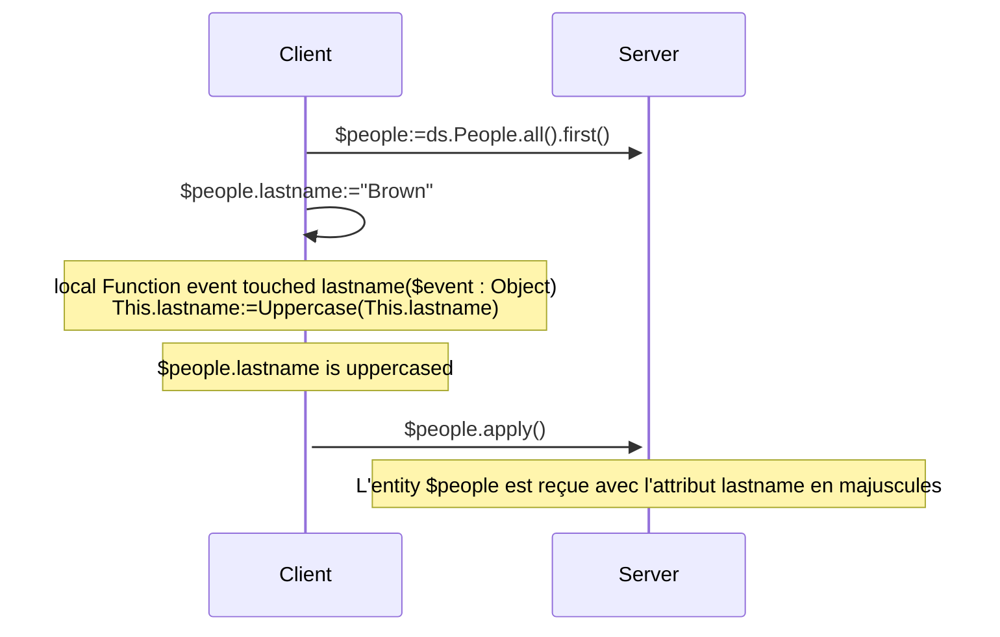
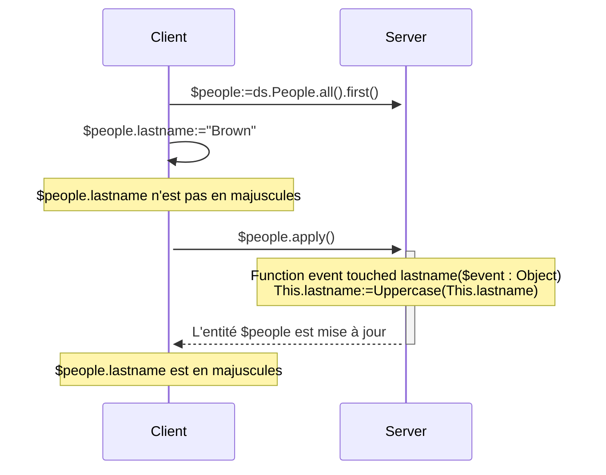
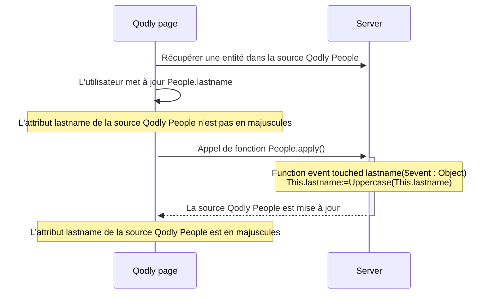

<details><summary>Historique</summary>

| Release | Modifications           |
| ------- | ----------------------- |
| 20 R10  | ajout événement touched |

</details>

Les événements d'entité sont des fonctions qui sont automatiquement invoquées par ORDA chaque fois que des entités et des attributs d'entité sont touchés (ajoutés, supprimés ou modifiés). Vous pouvez écrire des événements très simples, puis les rendre plus sophistiqués.

Vous ne pouvez pas déclencher directement l'exécution d'une fonction d'événement. Les événements sont appelés automatiquement par ORDA en fonction des actions de l'utilisateur ou des opérations effectuées par le code sur les entités et leurs attributs.

:::info Note de compatibilité

Les événements d'entité ORDA dans le datastore sont équivalents aux triggers dans la base de données 4D. Cependant, les actions déclenchées au niveau de la base de données 4D à l'aide des commandes du langage classique 4D ou des actions standard ne déclenchent pas les événements ORDA. Notez également que, contrairement aux triggers, les événements d'entité ORDA ne verrouillent pas l'ensemble de la table sous-jacente d'une dataclass lors de l'enregistrement ou de la suppression d'entités. Plusieurs événements peuvent se dérouler en parallèle tant qu'ils concernent des entités distinctes (c'est-à-dire des enregistrements distincts).

:::

## Vue d’ensemble

### Niveau de l'événement

Une fonction d'événement d'entité est toujours définie dans la [classe Entity](../ORDA/ordaClasses.md#entity-class).

Un événement peut être défini au niveau de l'**entité** et/ou de l'**attribut** (y compris les [**attributs calculés**](../ORDA/ordaClasses.md#computed-attributes)). Dans le premier cas, il sera déclenché pour tous les attributs de l'entité ; dans l'autre cas, il ne sera déclenché que pour l'attribut ciblé.

Pour un même événement, vous pouvez définir différentes fonctions pour différents attributs.

Vous pouvez également définir le même événement au niveau de l'attribut et de l'entité. L'événement attribut est appelé en premier, puis l'événement entité.

### Exécution en configuration distante

En général, les événements ORDA sont exécutés sur le serveur.

Cependant, dans une configuration client/serveur, la fonction d'événement `touched()` peut être exécutée sur **le serveur ou le client**, en fonction de l'utilisation du mot-clé [`local`](./ordaClasses.md#local-functions). Une implémentation spécifique côté client permet de déclencher l'événement sur le client.

:::note

Les fonctions ORDA [`constructor()`](./ordaClasses.md#class-constructor) sont toujours exécutées sur le client.

:::

Avec d'autres configurations distantes (i.e. applications Qodly, [requêtes via l'API REST](../REST/REST_requests.md), ou requêtes via [`Open datastore`](../commands/open-datastore.md)), la fonction d'événement `touched()` est toujours exécutée **côté serveur**. Cela signifie que vous devez vous assurer que le serveur peut "voir" qu'un attribut a été touché pour déclencher l'événement (voir ci-dessous).

### Tableau de synthèse

Le tableau suivant liste les événements d'entité ORDA ainsi que leurs principes.

| Evénement              | Niveau   | Nom de la fonction                                      |                 (C/S) Exécuté sur                |
| :--------------------- | :------- | :------------------------------------------------------ | :-----------------------------------------------------------------: |
| Instanciation d'entité | Entity   | [`constructor()`](./ordaClasses.md#class-constructor-1) |                                client                               |
| Attribut touched       | Attribut | `event touched <attrName>()`                            | Dépend du mot-clé [`local`](../ORDA/ordaClasses.md#local-functions) |
|                        | Entity   | `event touched()`                                       | Dépend du mot-clé [`local`](../ORDA/ordaClasses.md#local-functions) |

:::note

La fonction [`constructor()`](./ordaClasses.md#class-constructor-1) n'est pas en soi une fonction d'événement, mais elle est toujours appelée lorsqu'une nouvelle entité est instanciée.

:::

## Paramètre *event*

Les fonctions d'événement acceptent un seul objet *event* comme paramètre. Lorsque la fonction est appelée, le paramètre est rempli avec diverses propriétés :

| Nom de propriété | Disponibilité                                         | Type   | Description                                                                  |
| :--------------- | :---------------------------------------------------- | :----- | :--------------------------------------------------------------------------- |
| `kind`           | Toujours                                              | String | Nom de l'événement ("touched")                            |
| *attributeName*  | Uniquement pour les événements impliquant un attribut | String | Nom de l'attribut (*ex.* "firstname")     |
| *dataClassName*  | Toujours                                              | String | Nom du verre de données (*ex.* "Company") |

## Description des fonctions

### `Function event touched`

#### Syntaxe

```4d
{local} Function event touched($event : Object)
{local} Function event touched <attributeName>($event : Object)
// code
```

Cet événement est déclenché chaque fois qu'une valeur est modifiée dans l'entité.

- si vous avez défini la fonction au niveau de l'entité (première syntaxe), elle est déclenchée pour des modifications sur n'importe quel attribut de l'entité.
- si vous avez défini la fonction au niveau de l'attribut (deuxième syntaxe), elle n'est déclenchée que pour les modifications sur cet attribut.

Cet événement est déclenché dès que le moteur de 4D Server / 4D détecte une modification de la valeur de l'attribut qui peut être due aux actions suivantes :

- en **client/serveur avec le [mot-clé `local`](../ORDA/ordaClasses.md#local-functions)** ou en **4D mono-utilisateur** :
  - l'utilisateur saisit une valeur dans un formulaire 4D,
  - le code 4D effectue une assignation avec l'opérateur `:=`. L'événement est également déclenché en cas d'auto-assignation (`$entity.attribute:=$entity.attribute`).
- en **client/serveur sans le mot-clé `local`** : du code 4D effectue une assignation avec l'opérateur `:=` est [exécuté sur le serveur](../commands-legacy/execute-on-server.md).
- en **client/serveur sans le mot-clé `local`**, une **[application Qodly](https://developer.qodly.com/docs)** ou **[datastore distant](../commands/open-datastore.md)** : l'entité est reçue sur le serveur 4D lors de l'appel d'une fonction ORDA (sur l'entité ou avec l'entité en tant que paramètre). Cela signifie que vous devrez peut-être mettre en place une fonction *refresh* ou *preview* sur l'application distante qui envoie une requête ORDA au serveur et déclenche l'événement.
- avec le serveur REST : la valeur est reçue sur le serveur REST avec une [requête REST](../REST/$method.md#methodupdate) (`$method=update`)

La fonction reçoit un objet [*event*](#event-parameter) en paramètre.

Si cet événement [génère une erreur](../commands-legacy/throw.md), il n'arrêtera pas l'action en cours.

:::note

Cet événement est également déclenché :

- lorsque les attributs sont assignés par l'événement [`constructor()`](./ordaClasses.md#class-constructor-1),
- lorsque les attributs sont modifiés via l'[Explorateur de données](../Admin/dataExplorer.md).

:::

#### Exemple 1

Vous souhaitez mettre en majuscules tous les attributs de texte d'une entité lorsqu'elle est mise à jour.

```4d
    //ProductsEntity class
Function event touched($event : Object)
	
	If (Value type(This[$event.attributeName])=Is text)
		This[$event.attributeName]:=Uppercase(This[$event.attributeName])
	End if 
```

#### Exemple 2

L'événement "touched" est utile quand il n'est pas possible d'écrire un code de requête indexée dans [`Function query()`](./ordaClasses.md#function-query-attributename) pour un [attribut calculé](./ordaClasses.md#computed-attributes).

C'est le cas, par exemple, lorsque votre fonction [`query`](./ordaClasses.md#function-query-attributename) doit comparer la valeur de différents attributs de la même entité. Vous devez utiliser des formules dans la requête ORDA renvoyée, ce qui déclenche des requêtes séquentielles.

Pour bien comprendre ce cas, examinons les deux attributs calculés suivants :

```4d
Function get onGoing() : Boolean
        return ((This.departureDate<=Current date) & (This.arrivalDate>=Current date))

Function get sameDay() : Boolean
        return (This.departureDate=This.arrivalDate)
```

Même si elles sont très similaires, ces fonctions ne peuvent pas être associées à des requêtes identiques car elles ne comparent pas les mêmes types de valeurs. Le premier compare les attributs à une valeur donnée, tandis que le second compare les attributs entre eux.

- Pour l'attribut *onGoing*, la fonction [`query`](./ordaClasses.md#function-query-attributename) est simple à écrire et utilise des attributs indexés :

```4d
Function query onGoing($event : Object) : Object
    var $operator : Text
    var $myQuery : Text
    var $onGoingValue : Boolean
    var $parameters : Collection
    $parameters:=New collection()

    $operator:=$event.operator
    Case of 
            : (($operator="=") | ($operator="==") | ($operator="==="))
                $onGoingValue:=Bool($event.value)
            : (($operator="!=") | ($operator="!=="))
                $onGoingValue:=Not(Bool($event.value))
            Else 
                return {query: ""; parameters: $parameters}
    End case 

    $myQuery:=($onGoingValue) ? "departureDate <= :1 AND arrivalDate >= :1" : "departureDate > :1 OR arrivalDate < :1"
        // la chaîne de requête ORDA utilise des attributs indexés, elle sera indexée
    $parameters.push(Current date)
    return {query: $myQuery; parameters: $parameters}
```

- Pour l'attribut *sameDay*, la fonction [`query`](./ordaClasses.md#function-query-attributename) requiert une requête ORDA basée sur des formules et sera séquentielle :

```4d
Function query sameDay($event : Object) : Text
    var $operator : Text
    var $sameDayValue : Boolean

    $operator:=$event.operator
    Case of 
        : (($operator="=") | ($operator="==") | ($operator="==="))
            $sameDayValue:=Bool($event.value)
        : (($operator="!=") | ($operator="!=="))
            $sameDayValue:=Not(Bool($event.value))
        Else 
            return ""
        End case 

    return ($sameDayValue) ? "eval(This.departureDate = This.arrivalDate)" : "eval(This.departureDate != This.arrivalDate)"
        // la requête ORDA utilise une formule, elle ne sera pas indexée

```

- L'utilisation d'un attribut **scalaire** *sameDay* mis à jour lorsque d'autres attributs sont "touched" permet de gagner du temps :

```4d
    //BookingEntity class

Function event touched departureDate($event : Object) 

    This.sameDay:=(This.departureDate = This.arrivalDate) 
//
//
Function event touched arrivalDate($event : Object) 

    This.sameDay:=(This.departureDate = This.arrivalDate)

```

#### Exemple 3 (diagramme) : Client/serveur avec le mot-clé `local` :



#### Exemple 4 (diagramme) : Client/serveur avec le mot-clé `local`



#### Exemple 5 (diagramme) : Application Qodly




