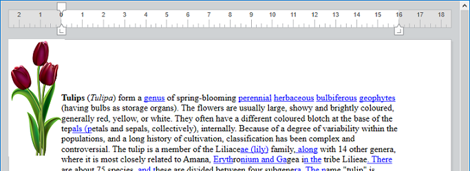

<!--REF #_command_.WP Add picture.Syntax-->**WP Add picture** ( *wpDoc* {; *picture*} ) : Object<br/>**WP Add picture** ( *wpDoc* {; *picturePath*} ) : Object<br/>**WP Add picture** ( *wpDoc* {; *pictureFileObj*} ) : Object<!-- END REF-->

<!--REF #_command_.WP Add picture.Params-->

| Paramètres     | Type                    |                             | Description                                                 |
| -------------- | ----------------------- | --------------------------- | ----------------------------------------------------------- |
| wpDoc          | Object                  | &#8594; | Document 4D Write Pro                                       |
| picture        | Picture                 | &#8594; | Image 4D                                                    |
| picturePath    | Text                    | &#8594; | Chemin de l'image                                           |
| pictureFileObj | 4D.File | &#8594; | Objet 4D.File représentant un fichier image |
| Résultat       | Object                  | &#8592; | Objet référençant l'image                                   |

<!-- END REF-->

## Description

La commande **WP Add picture**<!--REF #_command_.WP Add picture.Summary--> ancre l'image passée en paramètre à un emplacement fixe dans le *wpDoc* spécifié et retourne sa référence.<!-- END REF--> La référence retournée peut alors être passée à la commande [WP SET ATTRIBUTES](wp-set-attributes.md) pour déplacer l'image à n'importe quel emplacement dans le *wpDoc* (page, section, en-tête, pied de page, etc.) avec une couche définie, taille, etc.

Dans *wpDoc*, passez le nom d'un objet document 4D Write Pro.

Pour le deuxième paramètre facultatif, vous pouvez passer soit :

- En *picture* :  Une image 4D
- Dans *picturePath* : une chaîne contenant un chemin vers un fichier image stocké sur le disque (syntaxe système). Vous pouvez passer un chemin complet ou un chemin relatif au fichier de structure de la base de données. Vous pouvez également transmettre un nom de fichier, auquel cas le fichier doit être situé à côté du fichier de structure de la base de données. Si vous passez un nom de fichier, vous devez indiquer l'extension du fichier.
- Dans *PictureFileObj* : un objet `4D.File` représentant un fichier image.

:::note

N'importe quel format d'image [supporté par 4D](../../FormEditor/pictures.md#native-formats-supported) peut être utilisé. Vous pouvez obtenir la liste des formats d'image disponibles en utilisant la commande [PICTURE CODEC LIST](../../commands-legacy/picture-codec-list.md). Si l'image encapsule plusieurs formats (codecs), 4D Write Pro ne conserve qu'un format pour l'affichage et un format pour l'impression (si différent) dans le document ; les "meilleurs" formats sont automatiquement sélectionnés.

:::

- Si *image* est omise, une référence d'image valide est retournée et une image vide est ajoutée. Cela vous permet d'appeler [WP SET ATTRIBUTES](wp-set-attributes.md) avec le sélecteur d'image wk pour remplir l'image avec une expression 4D. Si l'expression ne peut pas être évaluée ou si elle ne retourne pas une image valide, une image vide (image à cadre noir par défaut) s'affiche.

Par défaut, l'image ajoutée est :

- Incorporée derrière le texte
- Affichée en haut à gauche de la boîte à papier
- Affichée sur toutes les pages

L'emplacement, la couche (en ligne, devant/derrière le texte), la visibilité et toutes les propriétés de l'image peuvent être modifiées en utilisant la commande [WP SET ATTRIBUTES](wp-set-attributes.md), ou via des actions standards (voir *Utiliser des actions standard 4D Write Pro*).

**Note :** La commande [WP Selection range](../commands-legacy/wp-selection-range.md) retourne un objet *picture reference* si une image ancrée est sélectionnée et un *range object* si une image en ligne est sélectionnée. Vous pouvez déterminer si un objet sélectionné est un objet image en vérifiant l'attribut `wk type` :

- **Value = 2** : l'objet sélectionné est un objet image.
- **Value = 0** : l'objet sélectionné est un objet plage.

## Exemple 1

Vous souhaitez ajouter une image avec les paramètres par défaut en utilisant un chemin d'accès.

```4d
 var $obPict : Object
 $obPict:=WP Add picture(myDoc;"/PACKAGE/Pictures/Saved Pictures/Sunrise.jpg")
```

Le résultat est:


## Exemple 2

Vous voulez ajouter une image redimensionnée, centrée et ancrée dans l'entête :

```4d
 var $obImage : Object
 var $myPictureFile : 4D.File

 $myPictureFile:=File("/PACKAGE/Pictures/Saved Pictures/Sunrise.jpg")
 $obImage:=WP Add picture(myDoc;$myPictureFile)
 WP SET ATTRIBUTES($obImage;wk anchor origin;wk header box)
 WP SET ATTRIBUTES($obImage;wk anchor horizontal align;wk center)
 WP SET ATTRIBUTES($obImage;wk anchor vertical align;wk center)
 WP SET ATTRIBUTES($obImage;wk width;"650px";wk height;"120px")
```

Le résultat est:


## Exemple 3

Vous voulez utiliser une expression de champ pour ajouter une image ancrée à un document affichant du texte provenant de la base de données :

```4d
 QUERY([Flowers];[Flowers]Common_Name="tulip")
 WP SET TEXT(myDoc;[Flowers]Description;wk append) //insertion du texte
 var $obImage : Object
 $obImage:=WP Add picture(myDoc)
 WP SET ATTRIBUTES($obImage;wk image formula;Formula([Flowers]Image))
```



## Voir également

[WP DELETE PICTURE](../commands-legacy/wp-delete-picture.md)</br>
[WP Picture range](../commands-legacy/wp-picture-range.md)