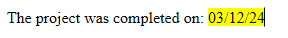

<!--REF #_command_.WP Insert formula.Syntax-->**WP Insert formula** ( *targetObj* ; *formula* ; *mode* {; *rangeUpdate*} ) : Object<!-- END REF-->

<!--REF #_command_.WP Insert formula.Params-->

| Paramètres  | Type   |                             | Description                                                        |
| ----------- | ------ | --------------------------- | ------------------------------------------------------------------ |
| targetObj   | Object | &#8594; | Plage ou élément ou document 4D Write Pro                          |
| formula     | Object | &#8594; | Objet de formule OU Objet avec des propriétés de formule et de nom |
| mode        | Number | &#8594; | Mode d'insertion                                                   |
| rangeUpdate | Number | &#8594; | Inclut ou exclut le contenu inséré dans la plage                   |
| Résultat    | Object | &#8592; | Objet de plage de texte représentant le résultat de la formule     |

<!-- END REF-->

## Description

La commande **WP Insert formula**<!--REF #_command_.WP Insert formula.Summary--> insère une *formule* dans *targetObj* selon le *mode d'insertion* spécifié et retourne la plage de texte résultante.<!-- END REF-->

Dans le paramètre *targetObj*, vous pouvez passer :

- une plage, ou
- un élément (tableau / ligne / cellule(s) / paragraphe / corps / en-tête / pied de page / section / / sous-section / image en ligne), ou
- a 4D Write Pro document.

Dans le paramètre *formule*, passez la formule 4D à évaluer. Vous pouvez passer :

- soit un [objet formule](../../commands/formula.md-objects) créé par la commande [**Formula**](../../commands/formula.md) ou [**Formula from string**](../../commands/formula.md-from-string) command,
- ou un objet contenant deux propriétés :

| **Propriété** | **Type** | **Description**                                                                                                                                                                                |
| ------------- | -------- | ---------------------------------------------------------------------------------------------------------------------------------------------------------------------------------------------- |
| name          | Text     | Nom à afficher pour la formule dans le document                                                                                                                                                |
| formula       | Object   | L'[objet formule](../../commandes/formula.md-objets) créé par la commande [**Formula**](../../commands/formula.md) ou [**Formula from string**](../../commands/formula.md-from-string) command |

Lorsque vous utilisez un objet avec une formule *name*, ce nom est affiché dans le document au lieu de la référence de formule lorsque les formules sont affichées comme référence, et dans l'info-bulle de la formule lorsqu'elle est affichée en tant que valeur ou symboles. Si la propriété *name* contient une chaîne vide ou est omise, elle est supprimée de l'objet et la formule est affichée par défaut. Pour plus d'informations, voir la page [Gérer les formules](../managing-formulas.md) .

Dans le paramètre *mode*, passez une des constantes suivantes pour indiquer le mode d'insertion à utiliser :

| Constante  | Type    | Valeur | Commentaire                             |
| ---------- | ------- | ------ | --------------------------------------- |
| wk append  | Integer | 2      | Insérer le contenu à la fin de la cible |
| wk prepend | Integer | 1      | Insérer le contenu au début de la cible |
| wk replace | Integer | 0      | Remplacer le contenu de la cible        |

- Si *targetObj* est une distance, vous pouvez utiliser le paramètre optionnel *rangeUpdate* pour passer une des constantes suivantes pour spécifier si ou non la *formula* insérée est incluse dans la plage résultante :

| Constante             | Type    | Valeur | Commentaire                                                                     |
| --------------------- | ------- | ------ | ------------------------------------------------------------------------------- |
| wk exclude from range | Integer | 1      | Les contenus insérés ne sont pas inclus dans la plage mise à jour               |
| wk include in range   | Integer | 0      | Contenu inséré inclus dans la plage mise à jour (par défaut) |

Si vous ne passez pas un paramètre *rangeUpdate*, par défaut, la *formula* insérée est incluse dans la plage résultante.

- Si *targetObj* n'est pas une plage, *rangeUpdate* est ignoré.

:::note

N'oubliez pas que, lorsqu'il est appelé, l'objet formula est évalué dans le contexte de la base de données ou du composant qui l'a créé.

:::

## Exemple 1

Pour remplacer toutes les formules de date actuelles par des chaînes formatées :

```4d
 var $_formulas : Collection
 var $find;$newFormula : Object
 
  // définir la formule à rechercher
 $find:=Formula(Current date)
 
  // définir la formule de remplacement
 $newFormula:=Formula(String(Current date;System date long))
 
  // trouver toutes les formules dans le document
 $_formulas:=WP Get formulas(WriteProArea)
 
  // requérir la collection à partir de WP Get formulas
 $_formulas:=$_formulas.query("formula.source =:1";$find.source)
 
  // puis remplacer chaque formule
 For each($formula;$_formulas)
    WP Insert formula($formula.range;$newFormula;wk replace)
 End for each
```

## Exemple 2

Vous souhaitez utiliser un nom de formule pour le nom du client :

```4d
  //ajouter des données
 $data:=New object("customer";New object("lastname";"Smith";"firstname";"John"))
 WP SET DATA CONTEXT(WPArea;$data)
 
  //créer un objet formule avec un nom
 $o:=New object
 $o.formula:=Formula(This.data.customer.firstname+" "+This.data.customer.lastname)
 $o.name:="Customer name"
 
  //s'insère comme un texte
 $range:=WP Text range(WPArea;wk start text;wk end text)
 WP SET TEXT($range;"Dear ";wk append)
 WP Insert formula($range;$o;wk append)
```

Résultat:


## Exemple 3

Vous souhaitez surligner une formule en jaune :

```4d
WParea:=WP New
WP SET TEXT(WParea; "The project was completed on: "; wk append)
$range1:=WP Insert formula(WParea; Formula(Current date); wk append)

WP SET ATTRIBUTES($range1; wk background color; "yellow")

```

Résultat:



## Voir également

*Managing formulas*\
[WP COMPUTE FORMULAS](../commands-legacy/wp-compute-formulas.md)</br>
[WP FREEZE FORMULAS](../commands-legacy/wp-freeze-formulas.md)</br>
[WP Get formulas](../commands-legacy/wp-get-formulas.md)