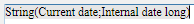

## Vue d’ensemble

4D Write Pro documents can contain references to 4D formulas such as variables, fields, expressions, project methods, or 4D commands. Specific information such as the page number can also be referenced through formulas (see [Inserting document and page expressions](#inserting-date-and-time-formulas) below).

Inserting formulas in 4D Write Pro areas is done with the [**WP INSERT FORMULA**](commands/wp-insert-formula.md) command and can be read using the [**WP Get formulas**](commands-legacy/wp-get-formulas.md) command. Ils sont également retournés par la commande [**WP Get text**](commands-legacy/wp-get-text.md).

Les formules sont évaluées :

- lorsqu'ils sont insérés dans un objet de formulaire qui affiche des valeurs calculées
- lorsque l'objet 4D Write Pro est chargé dans un objet de formulaire qui affiche les valeurs calculées
- lorsque la commande [**WP COMPUTE FORMULAS**](commands-legacy/wp-compute-formulas.md) est appelée
- quand ils sont "gelés" en utilisant la commande [**WP FREEZE FORMULAS**](commands-legacy/wp-freeze-formulas.md) (si ce n'est pas déjà calculé)
- avant impression (si pas déjà calculé)
- avant d'exporter vers .docx (si la formule ne peut pas être mappée avec les formules MS Word)
- lorsque les actions standards pour geler, imprimer, exporter ou calculer des formules sont appelées. Voir *Actions standard*

Les formules ne sont pas évaluées lorsqu'un document est chargé (en utilisant [**WP New**](commands-legacy/wp-new.md), [**WP Insert document body**](commands/wp-insert-document-body.md), ou `wpArea:=[table]field`) :

- si le document est uniquement hors écran,
- si le document est affiché à l'écran, mais l'objet de formulaire n'affiche que les références.

Formulas become static values if you call the [**WP FREEZE FORMULAS**](commands-legacy/wp-freeze-formulas.md) command (except for page number and page count, see below).

**Compatibility Note**: *Handling expressions using the [**ST INSERT EXPRESSION**](../commands-legacy/st-insert-expression.md), [**ST Get expression**](../commands-legacy/st-get-expression.md), [**ST COMPUTE EXPRESSIONS**](../commands-legacy/st-compute-expressions.md), and [**ST FREEZE EXPRESSIONS**](../commands-legacy/st-freeze-expressions.md) commands is deprecated, however, it is still supported in 4D Write Pro for compatibility*.

:::note

For security reasons, when formulas are pasted from a different 4D application or an external environment, only the *computed values* (text or images) available at the time of copying are pasted. If no value was available (e.g., the formula was never computed), 4D pastes the formula source as plain text.

:::

### Exemple

Vous souhaitez remplacer la sélection d'une zone de 4D Write Pro par le contenu d'une variable :

```4d
 var fullName: Text
 var $sel: Object
 fullName:="John Smith"
 $sel:=WP Selection range(4DWPArea)
 Case of
    :(Form event code=On Clicked)
       WP INSERT FORMULA($sel;Formula(fullName);wk replace)
 End case
```

## Formula context object

You can insert special expressions related to document attributes in any document area (body, header, footer) using the [WP Insert formula](commands/wp-insert-formula.md) command. Within a formula, a formula context object is automatically exposed. You can use the properties of this object through [**This**](../commands/this.md):

| Propriétés                                                                     | Type   | Description                                                                                                                                                                                                                                                                                                                                                                                                          |
| ------------------------------------------------------------------------------ | ------ | -------------------------------------------------------------------------------------------------------------------------------------------------------------------------------------------------------------------------------------------------------------------------------------------------------------------------------------------------------------------------------------------------------------------- |
| [This](../commands/this.md).title                              | Text   | Titre défini dans l'attribut wk title                                                                                                                                                                                                                                                                                                                                                                                |
| [This](../commands/this.md).author                             | Text   | Auteur défini dans l'attribut wk author                                                                                                                                                                                                                                                                                                                                                                              |
| [This](../commands/this.md).subject                            | Text   | Subject defined in wk subject attribute                                                                                                                                                                                                                                                                                                                                                                              |
| [This](../commands/this.md).company                            | Text   | Company defined in wk company attribute                                                                                                                                                                                                                                                                                                                                                                              |
| [This](../commands/this.md).notes                              | Text   | Notes defined in wk notes attribute                                                                                                                                                                                                                                                                                                                                                                                  |
| [This](../commands/this.md).dateCreation                       | Date   | Date creation defined in wk date creation attribute                                                                                                                                                                                                                                                                                                                                                                  |
| [This](../commands/this.md).dateModified                       | Date   | Date modified defined in wk date modified attribute                                                                                                                                                                                                                                                                                                                                                                  |
| [This](../commands/this.md).pageNumber (\*) | Number | Numéro de page tel qu'il est défini<li>: - à partir du début du document (par défaut) ou </li><li>- à partir du début de la page de la section s'il est défini par début de page de section.</li> Cette formule est toujours dynamique ; elle n'est pas affectée par la commande [**WP FREEZE FORMULAS**](commands-legacy/wp-freeze-formulas.md). |
| [This](../commands/this.md).pageCount (\*)  | Number | Nombre de pages : nombre total de pages.<br/> Cette formule est toujours dynamique ; elle n'est pas affectée par la commande [**WP FREEZE FORMULAS**](commands-legacy/wp-freeze-formulas.md).                                                                                                                                                                        |
| [This](../commands/this.md).document                           | Object | Document 4D Write Pro                                                                                                                                                                                                                                                                                                                                                                                                |
| [This](../commands/this.md).data                               | Object | Data context of the 4D Write Pro document set by [**WP SET DATA CONTEXT**](commands-legacy/wp-set-data-context.md)                                                                                                                                                                                                                                                                                                   |
| [This](../commands/this.md).sectionIndex                       | Number | The Index of the section in the 4D Write Pro document starting from 1                                                                                                                                                                                                                                                                                                                                                |
| [This](../commands/this.md).pageIndex                          | Number | The actual page number in the 4D Write Pro document starting from 1 (regardless of the section page numbers)                                                                                                                                                                                                                                                                                      |
| [This](../commands/this.md).sectionName                        | String | The name that the user gives to the section                                                                                                                                                                                                                                                                                                                                                                          |

:::note

Additional context properties are available when you work with tables. See *Handling tables* for more information.

:::

(\*) **Important**: **This.pageNumber**, **This.pageIndex** and **This.pageCount** must be used only directly in a 4D Write Pro formula (they must be present in the *formula.source* string). They will return incorrect values if they are used by the 4D language within a method called by the formula. However, they can be passed as parameters to a method called directly by the formula:

- Cela fonctionnera : « *formatNumber(This.pageNumber)* »
- This will NOT work: « *formatNumber* » with *formatNumber* method processing *This.pageNumber*.

Par exemple, pour insérer le numéro de page dans la zone de pied de page :

```4d
 $footer:=WP Get footer(4DWP;1)
 WP INSERT FORMULA($footer;Formula(This.pageNumber);wk append)
  //Using Formula(myMethod) with myMethod processing This.pageNumber
  //would not work correctly
```

## Inserting date and time formulas

**Date**

When the [**Current date**](../commands-legacy/current-date.md) command, a date variable, or a method returning a date is inserted in a formula, it will automatically be transformed into text using the system date short format.

**Time**

Lorsque la commande [**Current time**](../commands-legacy/current-time.md), une variable temporelle ou une méthode retournant une heure est insérée dans une formule, elle doit être incluse dans une commande [**String**](../commands-legacy/string.md) car le type heure n'est pas pris en charge dans JSON. Consider the following examples of formulas:

```4d
  // This code is the best practice
 $formula1:=Formula(String(Current time)) //OK 
 
  // This code will work but is usually not recommended, except after "Edit formula"
 $formula2:=Formula from string("String(Current time)") //OK
 
  // Wrong code because time values would be displayed as a longint for seconds (or milliseconds), not as a time
 $formula3:=Formula from string("Current time") //NOT valid
 $formula4:=Formula(Current time) //NOT valid
 
```

## Support of virtual structure

Table and field expressions inserted in 4D Write Pro documents support the virtual structure definition of the database. The virtual structure exposed to formulas is defined through [**SET FIELD TITLES**](../commands-legacy/set-field-titles.md)(...;\*) and [**SET TABLE TITLES**](../commands-legacy/set-table-titles.md)(...;\*) commands.

Quand une structure virtuelle est définie :

- les références aux expressions contenant des champs affichent des noms virtuels alors que le document 4D Write Pro affiche des références et non des valeurs.
- [**WP Get text**](commands-legacy/wp-get-text.md) retourne des noms de structures virtuelles si l'option `wk expressions as source` est définie dans le paramètre d'expression.
- [WP Insert formula](commands/wp-insert-formula.md) ignore la structure virtuelle et attend toujours de vrais noms de table/champs

:::note

When a document is displayed in "display expressions" mode, references to tables or fields that do not belong to the virtual structure are displayed with "`?`" characters, for example `[VirtualTableName]?` when the field is not defined in the virtual structure.

:::

## Displaying formulas

You can control how formulas are displayed in your documents:

- as *values* or as *references*
- when shown as references, display source text, symbol, or name.

### References or Values

By default, 4D formulas are displayed as values. When you insert a 4D formula, 4D Write Pro computes and displays its current value.  If you wish to know which formula is used or what is its name, you need to display it as a reference.

Pour afficher les formules en tant que références, vous pouvez:

- check the **Show references** option in the Property list (see *Configuring View properties*), or
- use the visibleReferences standard action (see *Dynamic expressions*), or
- use the [**WP SET VIEW PROPERTIES**](commands-legacy/wp-set-view-properties.md) command with the `wk visible references` selector to **True**.

Les références de formule peuvent être affichées en tant que :

- textes sources (par défaut)
- symbols
- names

### References as source texts (default)

When formulas are displayed as references, by default the source text of the formula appear in your document, with a default gray background (can be customized using the `wk formula highlight` selector).

Par exemple, vous avez inséré la date courante avec un format, la date s'affiche :


Lorsque vous affichez les formules comme références, la **source** de la formule est affichée :



### Les références comme symboles

When formula source texts are displayed in a document, the design could be confusing if you work on sophisticated templates using tables for example, and when formulas are complex:


In this case, you can display formula references as  symbols, so that the document is more compact:


To display formula references as symbols, you can:

- check the **Display formula source as symbol option** in the Property list (see *Configuring View properties*), or
- use the displayFormulaAsSymbol standard action (see *Using 4D Write Pro standard actions*), or
- use the [**WP SET VIEW PROPERTIES**](commands-legacy/wp-set-view-properties.md) command with the `wk display formula as symbol` selector to **True**.

### References as names

You can assign names to formulas, making 4D Write Pro template documents easier to read and understand for end-users. When formulas are displayed as references (and not displayed as symbols) and you have defined a name for a formula, the formula name is displayed.

For example, the following formula references are displayed as source text by default:


Si vous attribuez des noms de formule, ils sont affichés à la place des textes :


To assign a name to a formula, you need to use the [WP Insert formula](commands/wp-insert-formula.md) command with an object parameter. Par exemple :

```4d
  //inserts the previous day in the document
 $o:=New object("formula";Formula(Current date-1);"name";"Yesterday")
 $range:=WP Text range(WPArea;wk start text;wk end text)
 WP INSERT FORMULA($range;$o;wk append)
 
```


:::note

Only inline formulas can have a name (formulas for anchored images, break rows, and table datasource formulas cannot have names).

:::

### Formula tips

Whatever the formula display mode, you can get additional information on formulas through **tips** that are displayed when you hover on formulas.

- When formulas do not have names, tips provide the source text of formulas:

  

- When formulas have names but are displayed as values or as symbols, the tip provides the name of formulas:

  

In this context, you can display the source text of the formula by pressing **Ctrl** (Windows) or **Cmd** (macOS) while hovering on the formula.

- When formulas have names and are displayed as names, no tip is displayed by default.
  You can display the source text of the formula by pressing **Ctrl** (Windows) or **Cmd** (macOS) while hovering on the formula:
  [
  

#### Voir également

[Download HDI database](http://download.4d.com/Demos/4D_v16/HDI_4DWP_Filter4DExpressions.zip)</br>
*Using commands from the Styled Text theme*
