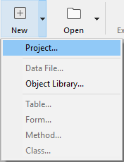

Les projets 4D sont créés et développés à l'aide de l'application **4D**, qui constitue un environnement de développement intégré (IDE) complet. **4D Server** peut également créer des projets vides.

Le développement multi-utilisateur est géré via des outils de **source control** standard (Perforce, Git, SVN, etc.), permettant aux développeurs de travailler sur différentes branches et de comparer, fusionner ou annuler des modifications.

## Créer un projet

Les nouveaux projets d'application 4D peuvent être créés à partir de **4D** ou de **4D Server**. Dans les deux cas, les fichiers de projet sont stockés sur la machine locale.

Pour créer un nouveau projet :

1. Lancez 4D ou 4D Server.
2. Do one of the following:
    * Sélectionnez **Nouveau> Projet...** depuis le menu **Fichier** : 
    * (4D uniquement) Sélectionnez **Projet...** depuis le bouton de la barre d'outils **Nouveau** :

Un dialogue standard **Sauvegarde** apparaît, de façon à ce que vous choisissiez le nom et l'emplacement du dossier principal du projet 4D.

3. Saisissez le nom du dossier de projet et cliquez sur **Sauvegarder**. Ce nom sera utilisé :

    * comme nom du dossier du projet,
    * as the name of the .4DProject file at the first level of the ["Project" folder](../Project/architecture.md#project-folder).

 Vous pouvez choisir n'importe quel nom autorisé par votre système d'exploitation. Toutefois, si votre projet est destiné à fonctionner sur d'autres systèmes ou à être enregistré via un outil de source control, vous devez tenir compte de leurs recommandations de dénomination spécifiques.

Lorsque vous validez la boîte de dialogue **Nouveau projet**, 4D ferme le projet en cours (le cas échéant), crée un dossier de projet à l'emplacement indiqué et y place tous les fichiers nécessaires au projet. Pour plus d'informations, voir [Architecture d'un projet 4D](Project/architecture.md).

Vous pouvez alors commencer à développer votre projet.

## Ouvrir un projet

Pour ouvrir un projet existant depuis 4D :

1. Do one of the following:

    * Sélectionnez **Ouvrir > Projet local...** à partir du menu **Fichier** ou du bouton **Ouvrir** de la barre d'outils.
    * Select **Open a local application project** in the Welcome Wizard dialog

The standard Open dialog appears.

2. Select the project's `.4dproject` file (located inside the ["Project" folder of the project](../Project/architecture.md#project-folder)) and click **Open**.

    By default, the project is opened with its current data file. Other file types are suggested:

    * *Packed project files*: `.4dz` extension  - deployment projects
    * *Shortcut files*: `.4DLink` extension - store additional parameters needed for opening projects or applications (addresses, identifiers, etc.)
    * *Binary files*: `.4db` or `.4dc` extension - legacy 4D database formats

### Options

In addition to standard system options, the *Open* dialog in 4D provides two menus with specific options that are available using the **Open** button and the **Data file** menu.

* **Open** - opening mode of the project:
  * **Interpreted** or **Compiled**: These options are available when the selected project contains both [interpreted and compiled code](Concepts/interpreted.md).
  * **[Maintenance Security Center](MSC/overview.md)**: Opening in secure mode allowing access to damaged projects in order to perform any necessary repairs.

* **Data file** - specifies the data file to be used with the project. By default, the **Current data file** option is selected.

## Raccourcis d’ouverture des projets

4D offers several ways to open projects directly and bypass the Open dialog:

* via menu options:
  * *Menu bar* - **File** > **Open Recent Projects / {project name}**
  * *4D Tool bar* -  Select the project from the menu associated with the **Open** button

* via preferences:
  * Set the **At startup** general preference to **Open last used project**.

* using a `.4DLink` file.

### Ouvrir un projet avec un fichier 4DLink

You can use a [`.4DLink` file](#about-4DLink-files) to launch the 4D application and open the target 4D project. Il existe deux façons de procéder :

* double-click or drag and drop the `.4DLink` file onto the 4D application
* go to **File** > **Open Recent Projects** and select a project

A .4DLink file of "remote project" type can be copied and used on several machines.
> Il est également possible de sélectionner un fichier 4DLink dans la boîte de dialogue d'ouverture de 4D et 4D Server (ouverture de projet local uniquement).

## À propos des fichiers 4DLink

Files with the `.4DLink` extension are XML files that contain parameters intended to automate and simplify opening local or remote 4D projects.

`.4DLink` files can save the address of a 4D project as well as its connection identifiers and opening mode, saving you time when opening projects.

4D automatically generates a `.4DLink` file when a local project is opened for the first time or when connecting to a server for the first time. The file is stored in the local preferences folder at the following location:

* Windows 7 and higher: C:\Users\UserName\AppData\Roaming\4D\Favorites vXX\
* OS X: Users/UserName/Library/Application Support/4D/Favorites vXX/

XX represents the version number of the application. For example, "Favorites v19" for 4D v19.

That folder is divided into two subfolders:

* the **Local** folder contains the `.4DLink` files that can be used to open local projects
* the **Remote** folder contains the `.4DLink` files of recent remote projects

`.4DLink` files can also be created with an XML editor.

4D provides a DTD describing the XML keys that can be used to build a `.4DLink` file. This DTD is named database_link.dtd and is found in the \Resources\DTD\ subfolder of the 4D application.

## Enregistrement des fichiers

When working on a project in 4D, you can use built-in 4D editors to create, modify, or save structure items, methods, forms, etc. Modifications are saved to disk when you select a **Save** menu item, or when the editor's window loses or gets the focus.

Since the editors use files on the disk, potential conflicts could happen if the same file is modified or even deleted from different locations. For example, if the same method is edited in a Code Editor window *and* in a text editor, saving both modifications will result in a conflict.

The 4D development framework includes a file access manager to control concurrent access:

* if an open file is read-only at the OS level, a locked icon is displayed in the editor: 
* if an open file is edited concurrently from different locations, 4D displays an alert dialog when trying to save the changes:

* **Yes**: discard editor changes and reload the modified version
* **No**: save changes and overwrite the other version
* **Cancel**: do not save

This feature is enabled for all built-in 4D editors (Structure, Form, Method, Settings, and Toolbox).
