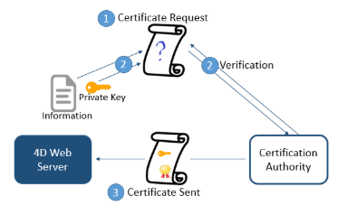

Tous les serveurs 4D peuvent communiquer en mode sécurisé via le protocole TLS (Transport Layer Security) :

- le serveur HTTP
- le serveur d'application (application de bureau client-serveur)
- le serveur SQL

De plus, le client HTTP 4D (commande `HTTP get` par exemple) prend également en charge le protocole TLS.

## Vue d’ensemble

Le protocole TLS (successeur du SSL) a pour but de sécuriser les informations de données entre deux applications—principalement entre un serveur web et un navigateur. Ce protocole est largement répandu et compatible avec la plupart des navigateurs web.

Au niveau de l'architecture réseau, le protocole de sécurité s'insère entre la couche TCP/IP (bas niveau) et le protocole de haut niveau HTTP, pour lequel il est principalement destiné.

Configuration du réseau avec TLS :

Le protocole TLS a pour but d'authentifier l'émetteur et le récepteur et de garantir la confidentialité et l'intégrité des informations échangées :

- **Authentification** : l'identité de l'émetteur et du récepteur sont confirmées.
- **Confidentialité**: les données envoyées sont cryptées afin de les rendre inintelligibles pour les tiers non autorisés.
- **Intégrité**: les données reçues n'ont pas été altérées, frauduleusement ou accidentellement.

Les principes de sécurisation utilisés par TLS sont basés sur l’emploi d’un algorithme de cryptage utilisant une paire de clés : une clé privée et une clé publique. La clé privée est utilisée pour crypter les données. Elle est conservée par l’émetteur (le site Web).

La clé publique est utilisée pour décrypter les informations et est envoyée aux récepteurs (navigateurs web) via un **certificat**. The certificate is delivered through a Certification Authority. The website pays the certificate provider to deliver a certificate which guaranties the server authentication and contains the public key allowing to exchange data in a secured mode.

:::note

Web browsers authorize only the certificates issued by a Certification Authority referenced in their properties.

:::

## Version minimale

By default, the minimum version of the secured protocol accepted by the 4D servers is TLS 1.3. Vous pouvez modifier cette valeur via le sélecteur `Min TLS version` de la commande `SET DATABASE PARAMETER`.

:::note

You can control separately the [minimum TLS version](WebServer/webServerConfig.md#minimum-tls-version) for **webServer objects**.

:::

## Enabling TLS with the HTTP server

To be able to use the TLS protocol with the 4D HTTP server, you have to:

1. Get your certificate files.
2. Install your certificate files at the appropriate location(s)
3. Enable TLS.

### Certificats

#### Format

TLS certificates managed by 4D must be in the **PEM format**. If your certificate provider sends you a certificate that is in a binary format such as .crt, .pfx or .p12, you have to convert it to PEM format in order to be able to use it. There are web sites where you can do this conversion on-line.

#### Encryption

4D supports certificates in the following standard encryption formats:

- [**RSA**](https://en.wikipedia.org/wiki/RSA_(cryptosystem))
- [**ECDSA**](https://en.wikipedia.org/wiki/Elliptic_Curve_Digital_Signature_Algorithm)

:::info Compatibilité

The ECDSA encryption format is not supported by the 4D [legacy network layer](../settings/client-server.md#network-layer).

:::

:::note

4D proposes two commands to help you requesting a RSA certificate, [see the tutorial below](#how-to-get-a-rsa-certificate-tutorial).

:::

### Installing certificate files

Certificate files include:

- **key.pem**: a document containing the private encryption key,
- **cert.pem**: a document containing the certificate.

Both **key.pem** and **cert.pem** files must be located:

- with 4D Server or 4D in local mode, next to the [project folder](Project/architecture.md#project-folder)
- with 4D in remote mode, in the client database folder on the remote machine (for more information about the location of this folder, see the [`Get 4D folder`](https://doc.4d.com/4dv20/help/command/en/page485.html) command). You must copy these files manually on the remote machine.

### Activation du TLS

For TLS connections to be accepted by the HTTP server, you must enable HTTPS. Refer to the [**Enable HTTPS**](WebServer/webServerConfig.md#enable-https) paragraph to know the different ways to enable TLS for the HTTP server.

:::note

Le serveur web 4D prend également en charge l'[option HSTS](WebServer/webServerConfig.md#enable-hsts) pour déclarer que les navigateurs doivent interagir avec lui uniquement via des connexions HTTPS. sécurisées.

:::

### Perfect Forward Secrecy (PFS)

Le [PFS](https://en.wikipedia.org/wiki/Forward_secrecy) ajoute une couche de sécurité supplémentaire à vos communications. Plutôt que d'utiliser des clés d'échanges préétablies, la PFS crée des clés de session de manière coopérative entre les parties en communication en utilisant des algorithmes Diffie-Hellman (DH). Le mode conjoint de production des clés crée un "secret partagé" qui empêche des éléments externes de les compromettre.

Lorsque TLS est activé sur le serveur Web de 4D Web, PFS est automatiquement activé. Si le fichier *dhparams.pem* (document contenant la clé DH privée du serveur) n'existe pas déjà, 4D le génère automatiquement avec une taille de clé de 2048. La génération initiale de ce fichier peut prendre plusieurs minutes. The file is placed with the [*key.pem* and *cert.pem* files](#installing-certificate-files).

Si vous utilisez une [liste de chiffrement personnalisée](WebServer/webServerConfig.md##cipher-list) et souhaitez activer PFS, vérifiez que votre liste contient des entrées avec des algorithmes DH ou ECDH (courbes elliptiques de Diffie–Hellman).

## Enabling TLS with the other servers

To use TLS with the 4D application server (client-server desktop applications) or the SQL server, you only have to enable TLS communications and the server automatically configures the connections at startup.

- With the application server, select the **Encrypt Client-Server Communications** option in the ["Client-server/Network options" page of the Settings dialog box](../settings/client-server#encrypt-client-server-communications).
- With the SQL server, select the **Enable TLS** option in the ["SQL" page of the Settings dialog box](../settings/sql#sql-server-publishing).

## How to get a RSA certificate? (tutorial)

La mise en place d’un serveur fonctionnant en TLS nécessite un certificat numérique délivré par un opérateur de certification. Ce certificat renferme diverses informations dont la carte d’identité du site ainsi que la clé publique utilisée pour communiquer avec lui. Il est transmis aux clients (navigateurs Web) se connectant au site. Une fois qu’il est accepté, la communication en mode sécurisé s’établit.
> Les navigateurs Web autorisent uniquement les certificats émis par une autorité de certification référencée dans leurs propriétés.

Le choix de l’autorité de certification dépend de plusieurs facteurs. Plus l’autorité est “connue”, plus le nombre de navigateurs acceptant les certificats qu’elle délivre sera important, mais plus le prix à payer sera élevé.

Pour obtenir un certificat numérique :

1. Générez une “clé privée” à l’aide de la commande `GENERER CLES CRYPTAGE`.
> **Attention** : Pour des raisons de sécurité, la clé privée ne doit jamais être diffusée sur un réseau. En fait, elle ne doit pas quitter le poste serveur. Pour le serveur Web, le fichier Key.pem doit être placé dans le dossier de la structure du projet.

2. Etablissez une demande de certificat à l’aide de la commande `GENERER DEMANDE CERTIFICAT.`

3. Envoyez la demande de certificat à l’autorité de certification que vous avez choisie. Pour remplir la demande de certificat, il vous sera peut-être nécessaire de contacter l’autorité de certification. Les autorités de certification vérifient la réalité des informations qui leur ont été transmises. La demande de certificat est générée dans un BLOB au format PKCS encodé en base64 (format PEM). Ce principe autorise le copier-coller des clés sous forme de texte et leur envoi par E-mail en toute sécurité, sans risque d’altération de leur contenu. Vous pouvez donc par exemple sauvegarder le BLOB contenant la demande de certificat dans un document texte (à l’aide de `BLOB VERS DOCUMENT`), puis l’ouvrir et copier-coller son contenu dans un E-mail ou un formulaire Web destiné à l’autorité de certification.

4. Une fois que vous avez reçu votre certificat, créez un fichier texte que vous nommerez “cert.pem” et copiez dans ce fichier le contenu du certificat. Vous pouvez recevoir votre certificat sous plusieurs formes (généralement via un E-mail ou un formulaire HTML). 4D accepte la plupart des formats de texte (macOS, PC, Linux...) pour les certificats. However, the certificate must be in [PEM format](#format), *i.e.*, PKCS encoded in base64.
> Les caractères de fins de ligne CR ne sont pas pris en charge. Vous devez utiliser CRLF ou LF.

5. Place the “cert.pem” file in the [appropriate location](#installing-certificate-files).

Le serveur Web peut dès lors fonctionner en mode sécurisé. A certificate is usually valid between 3 months to a year.
